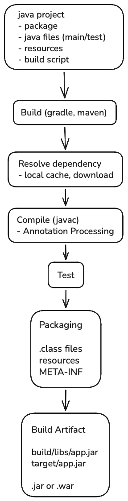
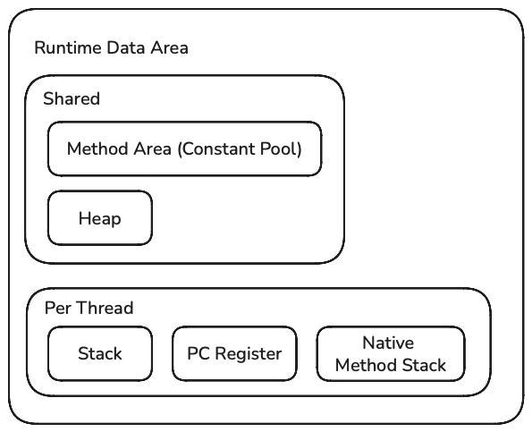
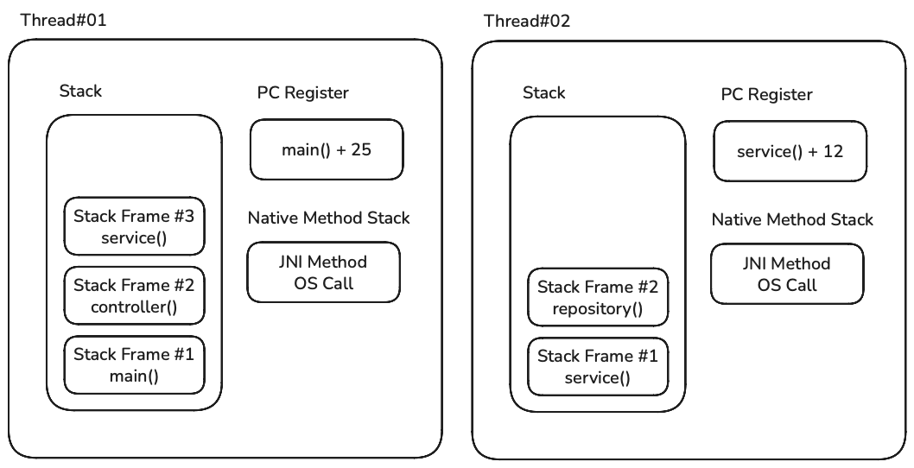
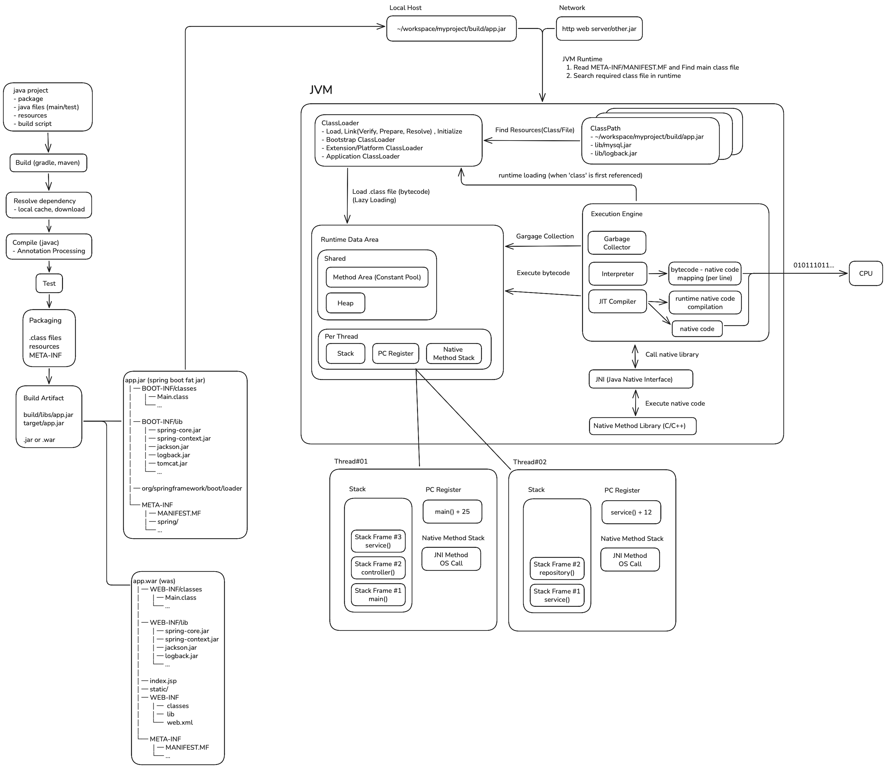

- [JVM Execution Process](#jvm-execution-process)
- [Java Build](#java-build)
  - [META-INF and MANIFEST.MF](#meta-inf-and-manifestmf)
  - [Fat JAR (JAR Inside JAR)](#fat-jar-jar-inside-jar)
- [JVM Startup — Class Loaders and the Classpath](#jvm-startup--class-loaders-and-the-classpath)
    - [Class Loader Loading Process](#class-loader-loading-process)
- [JVM Memory — Runtime Data Areas](#jvm-memory--runtime-data-areas)
- [JVM Execution Engine — JIT Compiler and Interpreter](#jvm-execution-engine--jit-compiler-and-interpreter)
- [Overall Flow](#overall-flow)


## JVM Execution Process

JVM (Java Virtual Machine) is a virtual machine that executes Java bytecode and is included in the JRE.

JRE (Java Runtime Environment) is the Java runtime environment that includes the JVM and Java standard libraries.

C/C++ compilers translate source code directly into machine code and build executable binary files targeting a **specific operating system and CPU architecture**.

This approach allows programs to execute quickly at runtime, but it has the drawback of requiring a separate build for each platform or requiring platform-dependent code.

Java is **platform-independent** because it introduces an intermediate layer between source code and machine code. This allows the same code to be built once and executed on multiple platforms. That intermediate layer is the JVM.

When Java and other JVM languages such as Kotlin and Scala are compiled, they generate bytecode that can be read and interpreted by the JVM instead of machine code.

The JVM translates bytecode into machine code at runtime and executes it.

`.java`, `kt`, `.scala`... <-> `JVM(.class)` <-> `machine code`

This article takes a look at how Java source code is compiled and eventually executed as machine code.

Let's start with the process of converting source code written by a developer into bytecode.

## Java Build



A Java application contains not only source code (`.java`), but also build configuration files, resource files, test code, and more.

When a developer runs an IDE or CLI command such as `./gradlew build` or `mvn package`, the build tool executes the build script.

The build script analyzes the dependency information, checks the local cache, and downloads any missing libraries from a remote repository such as Maven Repository, storing the artifacts in the cache. (Gradle local cache: `~/.gradle/caches/modules-2/files-2.1/`)

The Java compiler, `javac`, then converts the source code (`.java`) into bytecode (`.class`).

If the source code contains annotations such as `@Getter` (Lombok) or `@Mapper` (MapStruct) that need to be processed at compile time, the annotation processors provided by the corresponding libraries generate additional code or supplement the code being compiled before compilation continues. (The `.java` files themselves are not modified.)

Once the source code has been compiled, the test code is also compiled separately and the tests are executed. Normally, if the tests fail, the build fails as well.

If all tests pass, the compiled class files (`.class`), resource files, metadata (`META-INF`), and other files are packaged into a single artifact (`app.jar`).

A typical Java application produces a JAR file.

Depending on the deployment environment, a web application may produce a WAR, while a Spring Boot application produces an executable Fat JAR that also includes its dependencies.

### META-INF and MANIFEST.MF

**`META-INF` (META Information)** is a directory that stores metadata about an artifact (JAR/WAR).

It contains information such as descriptions of the artifact, how to run it, and the locations of resources required for execution.

```text
app.jar
├── META-INF
│   ├── MANIFEST.MF
│   ├── NOTICE.txt
│   ├── LICENSE.txt
│   └── ...
│
├── com/example/Main.class
├── com/example/UserService.class
└── ...
```

**MANIFEST.MF** is used to provide the JVM with important information it needs when the program is executed.

`Main-Class`: Specifies the name of the class containing the `main` method that serves as the program's entry point.

`Implementation-Title`, `Implementation-Version`: Specify the program's name and version.

`Class-Path`: Specifies the locations of other external JAR files required by the program at runtime.

Normally, when a Java application depends on other artifacts, you have to explicitly specify the dependencies when running the program, such as `java -cp app.jar:lib/*`.

If the dependency information is written into the MANIFEST in advance, you can run the program without specifying the dependency paths every time.

```text
Manifest-Version: 1.0
Main-Class: com.example.MyApp
Class-Path: lib/dependency1.jar lib/dependency2.jar
```

When a Spring Boot application is built, a MANIFEST.MF file like the following is automatically generated.

```text
Manifest-Version: 1.0
Main-Class: org.springframework.boot.loader.launch.JarLauncher
Start-Class: com.example.SpringBootExampleApplication
Spring-Boot-Version: 4.0.6
Spring-Boot-Classes: BOOT-INF/classes/
Spring-Boot-Lib: BOOT-INF/lib/
Spring-Boot-Classpath-Index: BOOT-INF/classpath.idx
Spring-Boot-Layers-Index: BOOT-INF/layers.idx
Build-Jdk-Spec: 25
Implementation-Title: demo
Implementation-Version: 0.0.1-SNAPSHOT
```

The Spring Boot launcher is specified as the `Main-Class`, which serves as the program's entry point.

The Spring Boot launcher adds the JAR files and classes included in the Fat JAR to the classpath and runs the class specified by `Start-Class`.

The class specified by `Start-Class` is annotated with `@SpringBootApplication` and contains a `main` method that calls `SpringApplication.run()`.

### Fat JAR (JAR Inside JAR)

A Fat JAR is a JAR file that contains other JAR files. (Nested JARs)

A regular JAR file does not contain other JAR files.

Suppose we have a Spring project that depends on various libraries.

```text
My Application
├── Spring Framework
├── Jackson
├── Logback
└── MySQL Driver
```

When this project is built, an `app.jar` is created. To run the application, however, the dependency libraries must be registered on the classpath by specifying their paths.

```text
app.jar
mysql.jar
spring-core.jar
spring-context.jar
jackson.jar
logback.jar
...
```

```shell
# Specify dependency paths
java -cp "app.jar:lib/*" com.example.Main
```

A Spring Boot Fat JAR includes both the application and its dependencies in a single JAR file, allowing it to be executed as a standalone application.

Let's take a look inside the JAR file to see how everything is packaged.

```shell
# Install Spring Boot CLI
# You can also download the file by visiting [https://start.spring.io](https://start.spring.io)
$ mise use -g spring-boot@4.0.6
```

```shell
# Create a Spring Boot application
$ spring init --build=gradle --type=gradle-project-kotlin --dependencies=web,data-jpa,h2,mysql --java-version=25 --package-name=com.example spring-boot-example

Using service at [https://start.spring.io](https://start.spring.io)
Project extracted to '/Users/hansanhha/Workspace/Playground/spring-boot-example'
```

```shell
# Build and extract the Spring Boot Fat JAR
$ cd spring-boot-example && ./gradlew build
$ mkdir fat_jar && jar xvf ./build/libs/spring-boot-example-0.0.1-SNAPSHOT.jar && cd fat_jar
```

The contents of the extracted Fat JAR look like this:

```text
fat_jar
├── BOOT-INF
│   ├── classes
│   │   ├── application.properties
│   │   ├── com
│   │   │   └── example
│   │   │       └── SpringBootExampleApplication.class
│   │   ├── static
│   │   └── templates
│   ├── classpath.idx
│   ├── layers.idx
│   └── lib
│       ├── jackson-core-3.1.2.jar
│       ├── h2-2.4.240.jar
│       ├── hibernate-core-7.2.12.Final.jar
│       ├── HikariCP-7.0.2.jar
│       ├── spring-boot-4.0.6.jar
│       └── ...
├── META-INF
│   ├── MANIFEST.MF
│   └── services
│       └── java.nio.file.spi.FileSystemProvider
└── org
   └── springframework
       └── boot
           └── loader
               └── launch
                   └── JarLauncher.class
```

There are three main directories: `BOOT-INF`, `META-INF`, and `org/springframework/boot/loader`.

`BOOT-INF/classes`: Stores the compiled application code and resource files.

`BOOT-INF/lib`: Stores the JAR files that the Spring Boot application depends on.

`BOOT-INF/clsspath.idx`: An index file that defines in advance the order in which the JARs in `BOOT-INF/lib` should be added to the classpath to optimize Spring Boot application startup.

`BOOT-INF/layers.idx`: Used to split the contents of the Fat JAR into Docker/OCI layers.

`META-INF`: Contains the automatically generated `MANIFEST.MF` file used to run the Spring Boot application and the `FileSystemProvider` used to load nested JAR files.

`org/springframework/loader/`: Contains the Spring Boot launcher/loader used to start Spring Boot and add nested JAR files to the JVM classpath.

The contents of the automatically generated `MANIFEST.MF` file are shown below.

When the JVM runs a Spring Boot application, it executes the `JarLauncher` specified by `Main-Class`.

`JarLauncher` searches `BOOT-INF/classes` and `BOOT-INF/lib`, creates a class loader, and then executes the `Start-Class` to start the Spring Boot application.

```text
Manifest-Version: 1.0
Main-Class: org.springframework.boot.loader.launch.JarLauncher
Start-Class: com.example.SpringBootExampleApplication
Spring-Boot-Version: 4.0.6
Spring-Boot-Classes: BOOT-INF/classes/
Spring-Boot-Lib: BOOT-INF/lib/
Spring-Boot-Classpath-Index: BOOT-INF/classpath.idx
Spring-Boot-Layers-Index: BOOT-INF/layers.idx
Build-Jdk-Spec: 25
Implementation-Title: spring-boot-example
Implementation-Version: 0.0.1-SNAPSHOT
```


## JVM Startup — Class Loaders and the Classpath

If we have successfully built the Java application into a JAR through the [Java Build](#자바-빌드) process, it is time to run it.

When the JVM process starts, the JVM sets up the class loaders and classpath, then reads the `META-INF/MANIFEST.MF` file inside the provided JAR file and loads and executes the class specified by `Main-Class`, which serves as the program's entry point.

The JVM does not load all classes and dependency libraries in the application into memory at once. Instead, it uses class loaders and the classpath to load only the classes needed for execution into the JVM's runtime data areas.

In a Spring Boot application, the `Main-Class`, `JarLauncher`, builds a separate class loader and then calls the `main()` method of the `@SpringBootApplication` class.

Let's run the Spring Boot application we built earlier.

```shell
# Method 1. Using the java CLI
# Execution flow: OS -> java -> JVM -> Load Spring Boot application JAR
$ java -jar ./build/libs/spring-boot-example-0.0.1-SNAPSHOT.jar

# Method 2. Using the build tool
# Execution flow: OS -> java -> gradle wrapper -> JVM -> Load Spring Boot application JAR
$ ./gradlew bootRun

# Method 3. Running from an IDE
# Execution flow: IDE launcher -> Gradle daemon -> JVM -> Load Spring Boot application JAR
```

You can check the JVM processes currently running on the system with the following commands.

```shell
# Method 1
$ jps -lv
94897 ./build/libs/spring-boot-example-0.0.1-SNAPSHOT.jar
78626 org.gradle.launcher.daemon.bootstrap.GradleDaemon
98340 jdk.jcmd/sun.tools.jps.Jps
...

# Method 2
$ jcmd
94897 ./build/libs/spring-boot-example-0.0.1-SNAPSHOT.jar
78626 org.gradle.launcher.daemon.bootstrap.GradleDaemon 9.5.1
...

# Method 3
$ ps -ef | grep 'spring-boot-example-0.0.1-SNAPSHOT.jar'
501 94897 80458   0  3:03PM ttys000    0:09.23 java -jar ./build/libs/spring-boot-example-0.0.1-SNAPSHOT.jar
```


The JVM finds classes based on their package structure (directory structure), and the **classpath** tells the JVM where the root of the package directory structure is.

Based on the classpath, the **class loader** dynamically loads `.class` bytecode into the JVM's runtime data areas.

Each class loader maintains its own independent list of classpath entries. It searches through the paths on the classpath, and once it finds a class, it verifies and initializes it before loading it into the runtime data area.

The JDK provides three class loaders.

Bootstrap ClassLoader  
- The top-level loader. It loads core JDK classes such as `java.lang` and `java.util`.  
- Classpath: `$JAVA_HOME/lib/modules/`

Platform ClassLoader  
- Loads JDK platform modules such as `java.sql` and `java.xml`.  
- Classpath: `$JAVA_HOME/lib/jmod/`

Application ClassLoader  
- Loads developer-written classes, applications (`app.jar`), and external libraries (`mysql.jar`, etc.).  
- `-cp`, the application's `java.class.path` system property, and `MANIFEST.MF`'s `Class-Path`

Class loading is attempted from the parent class loader to the child class loader.

If the class is not found in the Bootstrap ClassLoader's cache and classpath, the search moves down to the next class loader.

If the class cannot be found by any class loader, a `ClassNotFoundException` is thrown.

```text
Bootstrap ClassLoader (JDK core module)
       ↓
Platform ClassLoader (JDK platform module)
       ↓
Application ClassLoader (Java application classpath)
       ↓
LaunchedClassLoader (Spring Boot application classpath)
```

Java's standard specification does not support nesting JAR files inside other JAR files.

A Spring Boot application implements a custom class loader so that the JVM can recognize nested JARs.

LaunchedClassLoader: Builds a new classpath based on the `BOOT-INF/classes` and `BOOT-INF/lib/` directories of a Spring Boot Fat JAR and loads the required resources.

#### Class Loader Loading Process

A class loader goes through three stages—loading, linking, and initialization—to load a `.class` file into JVM memory.

Loading  
- The class loader finds the file on the specified classpath and reads the bytecode.  
- It analyzes the binary data and stores information such as the class's methods, variables, and superclass in the Method Area of the runtime data area.  
- Once loading is complete, it creates a `java.lang.Class` object for that class type and registers it in the heap. (This object is used for reflection.)

Linking  
- Checks whether the loaded class file is safe and prepares it for execution by the JVM.  
- Linking is further divided into three stages.  
 - Verification  
   - Checks whether the loaded bytecode conforms to the Java Language Specification and JVM Specification.  
   - Checks whether the file is corrupted or tampered with. (`VerifyError` is thrown if verification fails.)  
 - Preparation  
   - Allocates memory for static variables of the class or interface.  
   - Initializes static variables with their default values. (`int` -> `0`, `boolean` -> `false`, reference types -> `null`)  
 - Resolution (optional)  
   - Converts symbolic references in the class file into direct references that point to actual memory locations.  
   - This connects the names of other classes written in the code to their actual locations in memory. (This can also happen dynamically at runtime.)

Initialization  
- Assigns the values written in the source code to the static variables that were initialized with default values during the Preparation stage of linking.  
- Executes `static` initialization blocks.  
- The JVM performs initialization only when the class actually needs to be initialized. (Simply reading class information, such as with `User.class`, does not trigger class initialization because the class is not being actively used.)

The JVM loads only the classes needed to execute the code into its memory areas.

Since it does not load every JAR and `.class` file that the application depends on or contains, memory can be used more efficiently.

You can run the following command to see which classes are loaded when a Spring Boot application starts.

```shell
# The log exceeds 10,000 lines, so it is better to inspect it in a text editor rather than the terminal.
$ java -verbose:class -jar build/libs/spring-boot-example-0.0.1-SNAPSHOT.jar > c
lass_load_log.txt
```

You can see that classes are loaded sequentially, starting with `JarLauncher` and eventually reaching `SpringApplication`.

```text
// Loading JarLauncher.class
[0.041s][info][class,load] org.springframework.boot.loader.launch.Launcher source: file:/Users/hansanhha/Workspace/Playground/spring-boot-example/build/libs/spring-boot-example-0.0.1-SNAPSHOT.jar
[0.041s][info][class,load] org.springframework.boot.loader.launch.ExecutableArchiveLauncher source: file:/Users/hansanhha/Workspace/Playground/spring-boot-example/build/libs/spring-boot-example-0.0.1-SNAPSHOT.jar
[0.041s][info][class,load] org.springframework.boot.loader.launch.JarLauncher source: file:/Users/hansanhha/Workspace/Playground/spring-boot-example/build/libs/spring-boot-example-0.0.1-SNAPSHOT.jar

// Loading LaunchedClassLoader.class
[0.042s][info][class,load] org.springframework.boot.loader.net.protocol.jar.JarUrlClassLoader source: file:/Users/hansanhha/Workspace/Playground/spring-boot-example/build/libs/spring-boot-example-0.0.1-SNAPSHOT.jar
[0.042s][info][class,load] org.springframework.boot.loader.launch.LaunchedClassLoader source: file:/Users/hansanhha/Workspace/Playground/spring-boot-example/build/libs/spring-boot-example-0.0.1-SNAPSHOT.jar

// Loading SpringBootExampleApplication.class
[0.095s][info][class,load] com.example.SpringBootExampleApplication source: jar:nested:/Users/hansanhha/Workspace/Playground/spring-boot-example/build/libs/spring-boot-example-0.0.1-SNAPSHOT.jar/!BOOT-INF/classes/!/

// Loading SpringApplication.class
[0.120s][info][class,load] org.springframework.boot.SpringApplication source: jar:nested:/Users/hansanhha/Workspace/Playground/spring-boot-example/build/libs/spring-boot-example-0.0.1-SNAPSHOT.jar/!BOOT-INF/lib/spring-boot-4.0.6.jar!/
```

Let's take a look at Java's `URLClassLoader`, the ancestor of Spring Boot's `LaunchedClassLoader`.

`URLClassLoader` is a class loader that loads classes and resources into JVM memory from a list of URLs (URL Search Path).

It manages the classpath through `URLClassPath`, and can extend the classpath at runtime by calling `addURL()`.

```java
// Classes can be loaded not only from the local host but also over a network.
URL[] urls = {
   new URL("file:/app/lib/mysql.jar"),
   new URL("jar:file:/app/app.jar!/BOOT-INF/classes/"),
   new URL("[http://example.com/plugin.jar](http://example.com/plugin.jar)")
};

URLClassLoader loader = new URLClassLoader(urls);
```

The classpath registered with the class loader (`URLClassPath`) is used to call `getResource()` and retrieve a resource file. The class loader then finds the class inside the file and reads it as `byte[]`.

It then calls the native implementation of `defineClass()` in `ClassLoader`, the parent class of `URLClassLoader`, which analyzes the bytecode and loads the class data into the JVM.

Spring Boot's `LaunchedClassLoader` flattens nested JAR files (`BOOT-INF/lib/*.jar`) so that `URLClassLoader` can load files by following the resource paths.


## JVM Memory — Runtime Data Areas



The Runtime Data Areas are the memory areas of the JVM.

The JVM's internal class metadata generated when the class loader interprets the bytecode from `.class` files is loaded into these areas.

Note that the `.class` file itself is not loaded into the Runtime Data Areas.

Suppose a developer writes the following code and compiles it into a `UserService.class` file.

```java
public class UserService {
   private String name;
}

// javac UserService.java -> UserService.class
```

The `UserService.class` file contains bytecode.

```text
CA FE BA BE
...
```

This bytecode consists of a stream of various elements containing information such as the following:

- `Magic Number`: An identifier that allows the JVM to recognize the file as a Java class file. (The magic number of every class file is `0xCAFEBABE`.)
- `Version`: The major and minor version information of the class file.
- `ConstantPool`: A table containing constants and symbolic references such as method names, variable names, and class names used in the class.
- `Access Flags`: Information describing the attributes of the class (`public`, `abstract`, etc.).
- `This Class/Super Class`: Information identifying the current class and its superclass.
- `Interfaces`: Information about the interfaces implemented by the class.
- `Fields`: Information about the fields declared in the class.
- `Methods`: Information including method names, signatures, access modifiers, and the actual executable bytecode.
- `Attributes`: Additional information about the class, such as the source file name and debugging information.

As described earlier, `URLClassLoader` reads the resource file as `byte[]` and calls the native implementation. The byte stream is then analyzed and converted into metadata, which is loaded into the Runtime Data Areas.

More specifically, the data is stored in the **Method Area** within the Runtime Data Areas.

The Method Area stores metadata and shared data required to execute Java programs and remains available until the program terminates.

All threads share this area.

The Method Area is mainly used in three situations.

- When a class is first used: When a class is first mentioned or used in the source code, the class loader reads and analyzes the `.class` file and stores the resulting data in the Method Area. When the same class is used again, the data in the Method Area is reused.
- When creating an object (`new` keyword): When a new object is created, an instance is created in the Heap. That instance references the class stored in the Method Area.
- When executing a method: When a method such as `user.sayHello()` is called, the JVM's execution engine accesses the Method Area and performs and executes operations using the bytecode instructions and the thread's stack area.

When the class loader loads a class's metadata into the Method Area, it creates a `Class` object in the Heap that can be used to reference it.

This is the object returned when Java code calls `String.class` or `obj.getClass()`, and it points to the class metadata loaded into the Method Area.

**Heap** is the JVM's dynamic memory area where objects and arrays are stored.

When the `new` operator is used in Java code, an instance of the class is created in the Heap by referring to the Method Area.

```java
// The name, user, and arr instances are all created in the Heap.
String name = new String("hansanhha");
User user = new User();
int[] arr = new int[100];
```

Objects created in this area are referenced from stack frames belonging to specific threads.

The `name`, `user`, and `arr` variables above point to the `String`, `User`, and `int[]` instances created in the Heap.

Why are objects stored in the Heap instead of on the stack?

If objects were stored on the stack without a Heap, as shown below, the object would be removed as soon as the method ended.

```java
public User createUser() {
   User user = new User();
   return user;
}
```

Since an object's lifetime can be much longer than the lifetime of a method call, the object is stored in the Heap and referenced from a stack frame.

Even after the method ends and its stack frame is removed, the object remains available and can be reused.

The Heap is a dynamic memory area, but it does not grow indefinitely.

The JVM can expand or shrink the Heap as needed, but its maximum size is fixed.

A certain amount of memory is allocated when the JVM starts, and the Heap size can be configured with options.

```shell
# -Xms: Initial heap size (512MB)
# -Xmx: Maximum heap size (2GB)
java -Xms512m -Xmx2g app.jar
```

Let's take a look at the actual memory state.

```shell
# Run the Spring Boot application
$ ./gradlew bootRun

# Check the PID of the running Spring Boot application
$ jps
60611 Jps
60597 SpringBootExampleApplication
...

# Check the heap memory state
$ jcmd 60597 GC.heap_info
60597:
garbage-first heap   total reserved 4194304K, committed 69632K, used 50229K [0x00000003c0000000, 0x00000004c0000000)
region size 2048K, 13 young (26624K), 1 survivors (2048K)
```

Like the Method Area, the Heap is shared by all threads.

If the JVM tries to use more memory than the maximum Heap size, an `OutOfMemoryError` occurs.

To prevent this, the JVM uses a **Garbage Collector** to clean up unused instances.



The stack, PC register, and native method stack are used independently by each thread and are created when the thread starts.

Whenever a thread calls a method, a stack frame is created to store information about the state of that method, such as parameters, local variables, and the return value, and the frame is pushed onto the stack.

```java
User user = new User();
```

When an object is created as shown above, the `User` instance is created in the Heap, while the `user` variable is stored in the current thread's stack frame and references the created instance.

When the method call ends, the stack frame is removed from the stack.

Unlike the Heap, whose size can be adjusted, the stack has a fixed size.

If the thread exceeds its stack size, a `StackOverFlowError` occurs.

**PC Register** points to the bytecode stored in the Method Area.

The JVM execution engine executes code by referring to the bytecode pointed to by the thread's PC register and the state information stored in the stack frame.

**Native Method Stack** is the stack used when executing native code.

Native code refers to code that is executed directly by the OS and CPU without going through the JVM's execution engine. (Code written in C/C++, Rust, assembly language, etc.)

```text
// Java code
.java
↓
.class (Bytecode)
↓
JVM
↓
Machine Code (JIT)

// Native code (C)
.c
↓
Machine Code
↓
CPU directly executes
```

Although the JVM is platform-independent, it needs to call OS APIs to use operating system functionality.

Java alone cannot directly perform operations such as reading the current CPU time, opening files, or creating sockets, so it uses native code.

```java
public class System {

   // Native code is called using the native keyword.
   // Methods like this are called native methods.
   @IntrinsicCandidate
   public static native long currentTimeMillis();
}
```

Just as a stack is needed to execute the bytecode of Java methods, native code also needs a function call stack.

This is where the Native Method Stack is used.

Java uses a layer called **JNI (Java Native Interface)** so that bytecode can call or interact with native code.


## JVM Execution Engine — JIT Compiler and Interpreter


Once the class loader loads class metadata into the Runtime Data Areas, the execution engine reads and executes the bytecode.

Java can be platform-independent because it does not translate source code directly into machine code. Instead, it uses an intermediate language and a layer that converts that language at runtime to match the OS and CPU architecture on which the code is being executed.

This layer is the JVM's execution engine. It uses a JIT compiler and an interpreter to convert bytecode into machine code and execute it.

The JVM has native code snippets prepared in advance for each bytecode opcode.

The **Interpreter** reads bytecode one instruction at a time, finds the corresponding native code prepared inside the JVM, and executes it.

Instead of compiling the entire program into machine code at once, it maps each instruction one by one and has the CPU execute the resulting machine code.

The **JIT Compiler** detects frequently executed chunks of bytecode, such as methods and loops, and compiles them into native machine code all at once.

The compiled machine code is stored in memory, and subsequent executions bypass the interpreter and are executed directly by the CPU.

The JIT compiler does more than simply convert bytecode into machine code. It also identifies optimization opportunities that can make the code execute faster and applies them.

**Inlining Optimization**

When a simple method call is repeated frequently, the JIT compiler can eliminate the method call and directly insert the called method's code.

This completely removes the overhead of the method call.

```java
long sum = 0;
for (int i = 0; i < 10_000; i++) {  // Same method called repeatedly
   sum += calculate(i);
}

// A small method that is likely to be inlined
private static int calculate(int x) {
   return x * 2;
}
```

## Overall Flow

The diagram below shows the entire process, from building Java source code to executing it.

