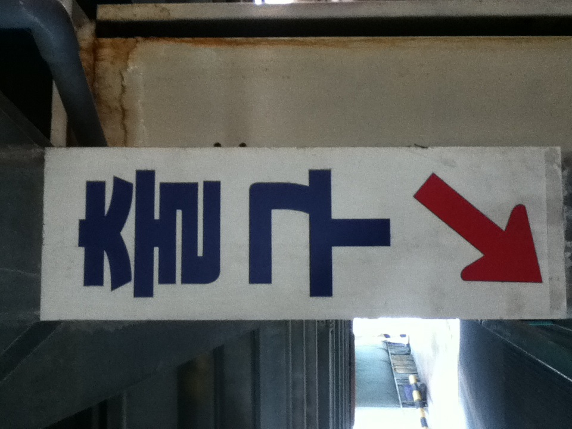

2025년...

상반기, 하반기 초중반은 2024년과 별반 다르지 않았다

막연한 생각, 소극적인 취업 활동, 그러다가...

여자친구와 헤어졌다

사람이 바뀔 때는 큰 충격이 필요하다던데 그 말이 맞는 거 같기도 하고

평소에나 잘하지 꼭 데여봐야 안다니께

익숙함에 속아 소중함을 잃지 말자라는 말을 잊어먹어서 그런가

아마도 내가 너무 오만했었던 거 같다

가끔 생각날 때 좋기도 하면서 후회도 되고 미안하거나 하는 복잡 미묘한 감정이 든다

별 것 아닌 순간들이, 돌이켜보면 그 때 행복했었구나 싶기도 하고

동시에 상대방을 대했던 태도나 마음가짐 중 고쳐야 될 것들이 보이기도 했다

아무래도 그냥도 아니고 다양한 감정으로 여러 번 곱씹어보게 되니까 아쉬운 것들이 보이는거지

오히려 헤어짐으로써 더 많은 것들을 배우게 되고 존재의 소중함을 알게 됐다

다행히도 그 전보다 더 나은 사람이 되려는 신호이지 않을까 싶네

올해가 작년과 비슷하게 흘러가기도 했지만 이별이 워낙 임팩트가 커서 사실 이거 말고는 다른 일이 기억나지 않는다

아 스타벅스에서 일하기 시작했지

직원 할인 하나는 좋다

올해 1월에 2025년에는 취업하고 이사할거라고 목표를 세웠지만 이룬 건 하나도 없구만

오히려 계획에 없던 이별을 해버렸고..

아쉬운 건 아쉬운거지만 죄책감까지 가질 필요는 없지

정신 똑띠 차리고 살아가보자. 뒤돌아봤을 때 후회하지 않고 싶다 더이상

내년 회고가 벌써 기대된다 달라진게 있을까?

