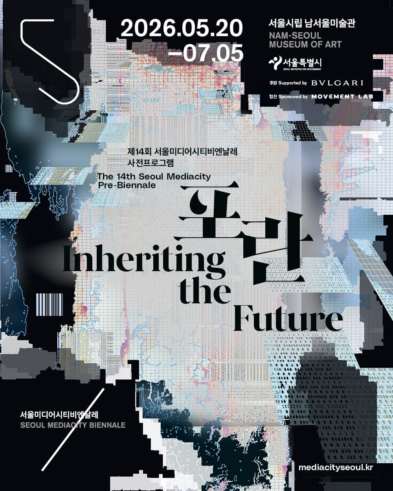
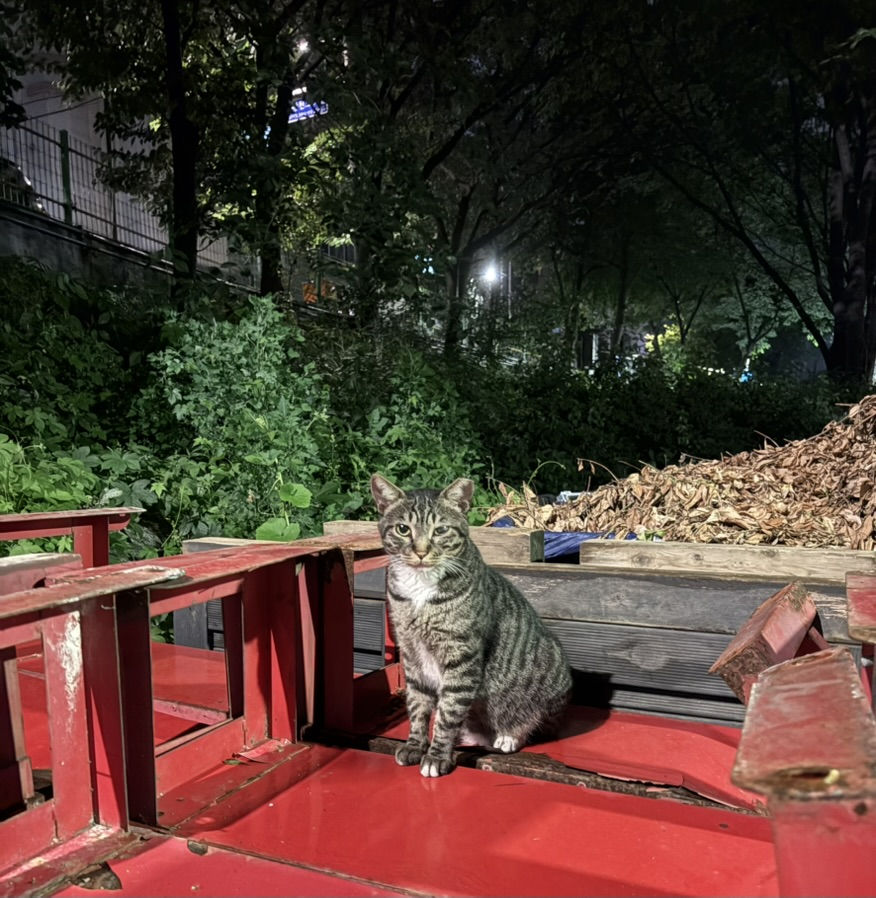
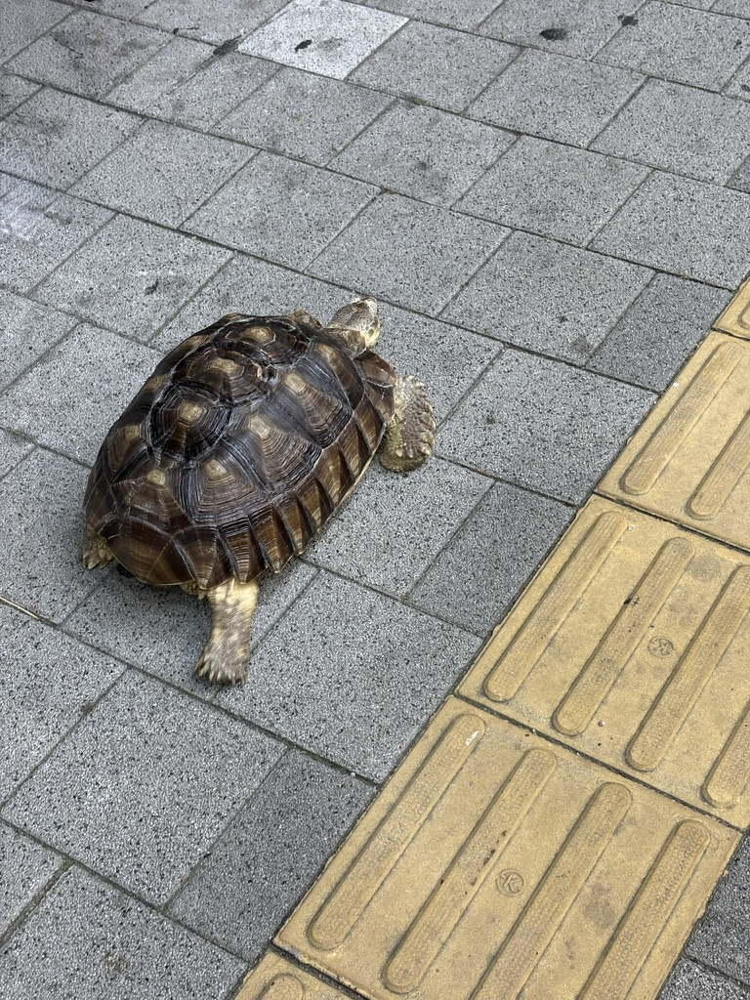
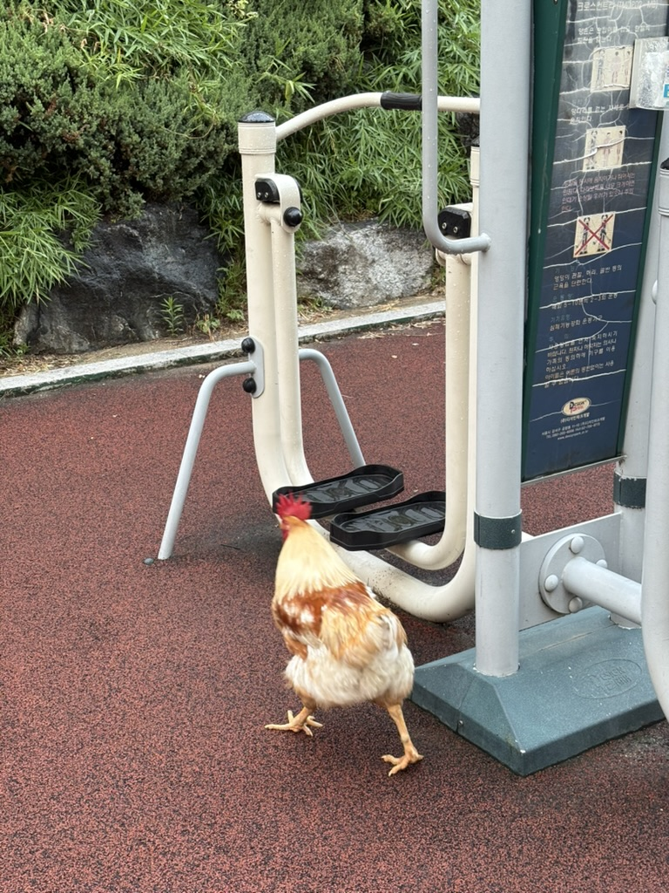
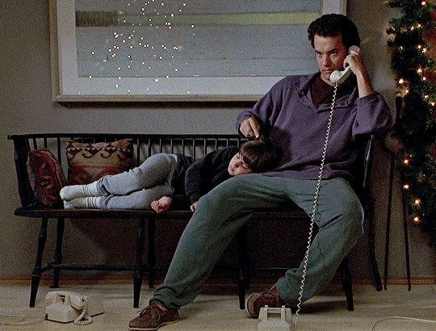

월초에 사당역 근처에 있는 서울시립 남서울미술관에 방문했다.

이 건물은 맨 처음 회현동에서 벨기에 영사관으로 사용되다가 1980년대에 현재의 관악구 위치로 이전되며 서울시의 미술관이 되었다.

1층에는 권진규 작가의 상설전시를, 2층에는 서울미디어시티 프리비엔날레 '포란'을 전시하고 있었다.



비엔날레는 2년마다 열리는 대규모 국제 미술 전시회를 말한다. 이탈리아의 베네치아 비엔날레 행사가 최초이며 이후 전세계 여러 도시로 확산되었다고 한다. 

고정된 형식이 있다기보다는 각 국가/도시가 가진 특징을 살려서 예술을 소개하거나 예술을 통해 다양한 질문과 메시지를 던지는 플랫폼으로서 기능한다.

국내에는 서울, 부산, 광주 비엔날레가 있다. 원래는 모두 짝수년도에 진행했는데 코로나 때 서울과 광주는 한 번 미루는 바람에 부산만 짝수년도, 서울과 광주는 홀수년도에 개최한다고 한다.

그래서 다가오는 내년 전시에 앞서 지난 비엔날레 활동을 돌아보고 다가올 비엔날레를 준비하는 프리비엔날레 프로그램(포란)을 진행하는 것이다.

서울미디어시티비엔날레는 국내에서 유일하게 미술관(서울시립미술관)이 주최한다고 하며 (부산과 광주는 지자체와 법인·조직위원회가 운영한다) 서울과 미디어에 관련한 사유와 경험을 공유하는 장으로써 진행되어왔다.

프로그램의 제목인 포란은 알을 품는 행위를 의미한다.

리플렛의 내용에 따르면 '알'은 무엇이 태어날지 예측할 수 없는, 불확실한 새로운 가능성을 의미한다.

알의 불확실성이 미래에 대한 질문으로 작용하고, 알을 품는 행위인 포란이 그러한 질문을 담는 비엔날레를 비유한다.

이 전시를 보고 기억으로 남겨놓고 싶었던 것은 리플렛에 소개된 질문들로 지금까지 서울미디어시티비엔날레가 진행해온 것들을 몇 가지 개념으로 압축해놓은 것이다.

질문들은 명확한 답을 원하기보다 이 비엔날레에서 진행된 전시들의 중심 주제가 무엇인지 보여주며 동시에 도시, 미디어, 기술의 관계를 주로 탐색하는 곳에서 작품으로 하여금 예술로써 어떻게 승화했을지 기대감을 갖게 해주었다.

그리고 각 질문들을 직·간접적으로 이용하여 우리의 일상을 생각하는데 도움이 되지 않을까 싶었다.

* 기술과 미디어는 인간의 감각과 경험을 어떻게 재구성하는가?
* 연결된 세계 속에서 형성되는 관계의 조건은 무엇인가?
* 언어는 어떻게 세계를 구성하는 동시에 소통의 불가능성을 드러내는가?
* 보이지 않는 구조와 권력은 어떤 방식으로 작동하며, 그 속에서 저항은 어떻게 조직될 수 있는가?
* 경계는 어떻게 재구성되며, 우리는 어떤 방식으로 세계를 다시 사유할 수 있는가?


## 산책

동네를 걷다 보면 재밌는 친구들을 만날 수 있다.

그 중 내가 가장 좋아하는 친구인 춘장이. 이 녀석은 무던하고 애교많은 성격을 가지고 있어서 여러 사람들에게 인기가 많다.

사료를 주는 분들이 몇몇 있는 거 같던데 자기가 알아서 식단을 관리하는건지 건강한 체형을 유지하고 있다.



두 번째는 거북이. 카공족 당곡사거리점 입구 반대편에 엉금책방이라고 하는 독립서점이 있는데 이 곳에 거북이가 산다.

덩치가 꽤나 크다. 예전에 한 번 들어봤는데 조금 무거웠던 것 같았다. 아마도 춘장이가 이 거북이를 보면 잠깐은 관심을 가져주지 않을까 싶다.

주인분이 가끔 길가에 내놓아 산책을 시키는 것 같은데 엉금엉금 기어가는게 귀엽다.



마지막은 닭이다. 낮이나 저녁쯤 도림천에 가면 가끔 누군가가 키우는 닭을 볼 수 있다.

엉금책방의 거북이처럼 이 닭도 크다. 사실 이렇게 큰 닭은 처음 본다.

빨간 닭 벼슬, 황금빛 털, 곧고 단단한 발을 가지고 있어서 이 친구한테서는 치킨보다 공룡이 떠오른다. 

춘장이가 은근 겁이 있는 편인데 아마 이 닭을 보면 놀래서 부리나케 도망갈 것 같다.



산책을 하면 이렇게 재밌는 친구들을 만날 수 있다. 사람을 관찰할 수도 있고 동네를 구경할 수도 있다.

여름이 지나 날이 선선해지면 각 자치구의 대표 동네를 걸어보려고 한다. 서울에는 25곳의 자치구가 있는데 하나씩 알아가는 재미가 있지 않을까 싶다.

## 애니메이션과 영화

체인소맨이라는 애니메이션을 봤다.

귀멸의 칼날에 실망하고 나서 간간히 지브리 애니만 보다가 진격의 거인 이후로 오랜만에 몰입하면서 본 작품이다.

소년만화이긴 하지만 주인공이 다사다난한 경험을 하며 점점 강해지는 일반적인 애니와는 조금 다르게, 웬만한 클리셰는 부숴버리고 빠른 속도로 이야기를 전개한다.

작중 가장 임팩트 있던 여우의 악마 등장씬. 멋있어서 나도 괜히 똑같이 손동작을 하고 콩이라고 불러봤다.

안타깝게도 이 장면 이후로 여우의 악마는 다른 악마에게 밀리는 모습만 보여줘서 실망하게 되었다.


그 다음은 극장판 체인소맨 레제편. 레제는 덴지와 마찬가지로 무기 인간으로 덴지의 심장(체인소맨의 심장)을 탈취하기 위해 소련에서 파견된 자객이다.

둘은 공중전화 부스에서 처음 맞닥뜨리는데 이 때 레제는 덴지를 곧바로 죽이지 않고 오히려 호감을 갖게 된다.

덴지는 레제가 일하는 카페를 매일같이 찾아가며 같이 놀다가, 어느 낭만적인 불꽃놀이 축제날 레제가 덴지에게 좋아한다고 고백하고 둘이 멀리 떠나자고 제안하지만 덴지가 거절하면서 비극적인 연출이 시작된다.

덴지는 체인소맨으로 변하고 동료들의 도움을 받아 버티고 버텨 끝내 레제는 덴지를 죽이지 못한다.

영화 거의 끝부분에서 덴지는 떠나는 레제에게 같이 떠나자고 하고, 그 카페에서 기다리겠다고 한다. 

레제는 거절하는 듯 했지만 기차를 타고 떠나는 대신 덴지를 만나기 위해 카페로 향했다.

카페에 거의 다 와갈 즘에 골목길에서 마키마를 맞닥뜨리고 천사의 악마에 의해 죽게 되며 끝이 난다.

사실 레제도 덴지처럼 학교를 가본 적이 없는, 덴지처럼 이용당하며 살아온 아이로서 둘의 순수하고 풋풋한 사랑이 이어지지 못하여 여운이 더 남았다.


8편의 영화를 봤다. 

프렌치 셰프, 시애틀의 잠 못 이루는 밤, 미드나잇 인 파리, 중경상림, 아메리칸 셰프, 헤어질 결심, 누구의 딸도 아닌 해원, 모노노케 히메

누군가가 영화 한 편 추천해달라고 하면 모두 거론할 수 있을 정도인데, 딱 하나만 고르자면 시애틀의 잠 못 이루는 밤이다.

이 영화는 로맨틱 코미디 장르인데, 다른 로맨스 영화와 다르게 남녀 주인공들이 만나는 시간은 러닝 타임 중 10분도 채 안될거다. 

그런데 어떻게 로맨스가 될 수 있냐고? 직접 보면 알게 된다. 보다 보면 어느새 둘의 만남을 응원하고 있을거다.

맥 라이언, 톰 행크스의 연기와 스타일링, 90년대 아늑한 분위기를 느끼기에도 좋은 영화다.



## Deadbeat

Deadbeat는 The Slow Rush 앨범 발매 이후 5년만에 발매되는 테임 임팔라의 앨범으로 작년 7월인가 10월 경에 공개된 걸로 알고 있다.

이 앨범의 No Reply 곡 마지막 피아노 아웃트로가 그리움, 아련한 감정을 불러일으키면서도 약간의 날 것의 느낌이 있어 마음에 들었다.

그래서 가장 맨 마지막 부분만 잘라내어 블로그에 업로드 해두어 놓았다. [No Reply](../archives/videos/piano)

Deadbeat는 Dead beat - 망하거나 아마추어적인 비트 - 또는 일을 하려 하지 않고 책임감 없이 사회에 적응하지 못하는 사람. 게으름뱅이, 즉 백수를 의미한다고 한다.

첫 번째 트랙인 My Old Ways에서 아마도 케빈 파커 자신 또는 어떤 가상의 인물이 반복되는 유혹에 빠져 같은 실수를 반복하여 한탄하고 체념하는 내용을 다룬다.

일정한 직업없이 놀고먹는 사람을 말하는 한량. 그러면서도 나름대로 살아보겠다고 이것저것 해보려고 하지만 원래의 제자리로 돌아오는 내 일상을 말해주는 것 같았다.

가끔 전시를 보거나, 영화를 보거나, 책을 읽거나, 궁금한 것을 알아보는 등 문화생활, 사유하는 행동이 모두 부질없고 무가치하게 느껴질 때가 있다.

지금 내가 해야 할 일은 외면한 채 도피하기 위해 이런 것들을 하는 게 아닐까하는 의문이 들기 때문이다.

그러면서 난 왜 매번 반복되는 실수를 할까, 달라질 수 있을까, 어떻게 변화하고 싶은가 하는 고민이 끝없이 들다가도 이번에는 잘 될 것 같다, 그 전보다 좀 나아졌네, 이런 것도 알게 됐다 하는 긍정적인 생각들로 가득 찰 때도 있다.

이 앨범과 관련하여 다른 사람들의 의견이 궁금해서 레딧을 찾아보다가 나름 위안이 되는 댓글이 있었다.

```text
Which is quite relatable, bc sometimes you’re the dickhead and sometimes you’re getting shit on.

And somewhere inside this rat race of a deadbeat fest are a few moments where there is some real connection. And those moments wouldn’t have come if you hadn’t been what you were.

So what even is bad, if it brings you to something good. Like a new perspective on regret, those things you spend time regretting actually brought you where you are today and made you who you are.
```
 
좋은 결과를 가져다준다면 그 과정에서 있었던 일들은 나쁜 게 아니라 그 결과를 내게끔 만들어준 것들이라니.

호사다마인건가

사실 결과가 좋든 안좋든 나는 결국 도돌이표 쳇바퀴를 반복하면서도 앞으로 나아갈려고 하는 사람이란 걸 안다.

이러한 고민들은 포란의 질문들처럼 정답보다 다음을 향한 메시지로써 동작하기에 주기적으로 나를 찾아올거란 것도 안다.

내일은 또 해를 맞이하러 간다.
