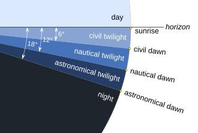
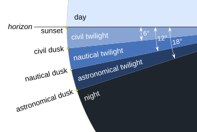
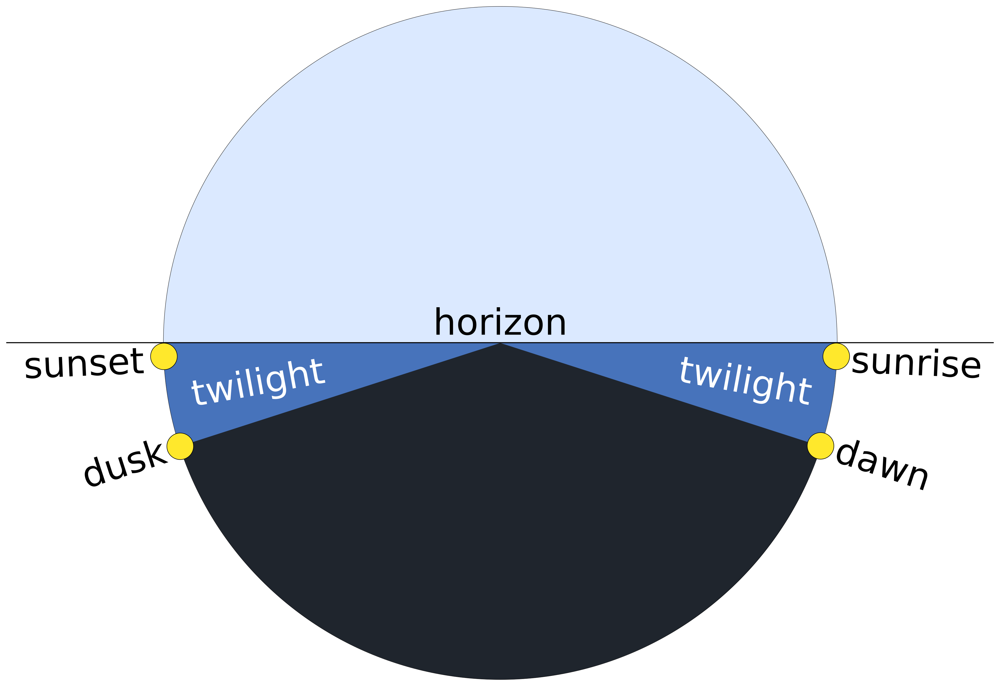
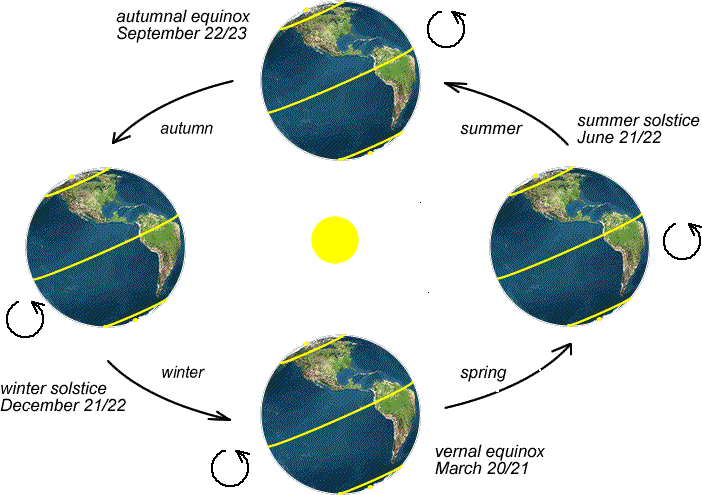
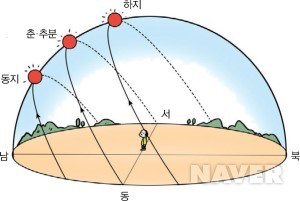

Table of Contents
- [Twilight](#twilight)
- [Phenomena Related to Twilight](#phenomena-related-to-twilight)
- [Factors Affecting Twilight](#factors-affecting-twilight)


## Twilight

Twilight refers to the period before sunrise or after sunset when the sky is not completely dark and some faint light remains. The Korean word 박명 is written with the characters 薄 (thin) and 明 (bright).

The sky does not become dark immediately after the Sun sets below the horizon.

Light from the Sun, which is below the horizon, enters the upper atmosphere and is scattered by the atmosphere, making the sky appear brighter.

It becomes Pitch-black night when the Sun is about 18° below the horizon.

Evening twilight after sunset is called dusk, while morning twilight before sunrise is called dawn.

Twilight is further divided into three stages: civil twilight, nautical twilight, and astronomical twilight.

Civil twilight is the period when there is still enough light to distinguish objects with the naked eye.

It lasts for about 30 minutes before sunrise and 30 minutes after sunset.

Nautical twilight is darker, but major stars such as Polaris and Sirius can still be observed, and the horizon can still be distinguished with the naked eye. From this time, normal outdoor activities are no longer possible.

It occurs from about one hour before sunrise to one hour after sunset.

Astronomical twilight looks almost like night, but a very small amount of sunlight still remains in the atmosphere, and most stars are visible.

It occurs from about one and a half hours before sunrise to one and a half hours after sunset.

Twilight Stages Before Sunrise

<a target="_blank" rel="noopener noreferrer" herf="https://en.wikipedia.org/wiki/Twilight" data-link-desc="Image source Wikipedia twilight">Image Source</a>



```text
~40 minutes before sunrise: End of nautical twilight, beginning of civil twilight
~30 minutes before sunrise: Blue hour (civil twilight)
~15 minutes before sunrise: Belt of Venus (opposite the Sun, western sky)
Sunrise: Solar altitude 0°
30 minutes after sunrise: Golden hour
```

Twilight Stages After Sunset



```text
Before sunset: Golden hour (sunset glow)
Sunset: Solar altitude 0°
Immediately after sunset: Belt of Venus (opposite the Sun, eastern sky)
~30 minutes after sunset: Blue hour (civil twilight)
30 minutes after sunset ~: Beginning of nautical twilight
```

## Phenomena Related to Twilight

**Golden Hour**: The period of about one hour around sunrise or sunset when sunlight appears soft and warm with a reddish glow.

The evening golden hour is often described as sunset, evening glow, or twilight light.

The morning golden hour is described as morning sunlight, morning glow, or sunrise.

**Blue Hour**: The period around sunrise or sunset when civil twilight is ending or beginning. The sky is neither completely dark nor bright, but has a bluish tint.

**Magic Hour** is a term that encompasses both the golden hour and blue hour.

Around dusk (evening twilight): about 30 minutes before sunset (golden hour) ~ about 30 minutes after sunset (blue hour)

Around dawn (morning twilight): about 30 minutes before sunrise (blue hour) ~ about 30 minutes after sunrise (golden hour)

**Belt of Venus**: A pale pink band that appears in the sky opposite the Sun shortly before sunrise or shortly after sunset.

When the Sun is rising or setting, a dark layer of deep blue or bluish-gray appears along the lower part of the sky opposite the Sun. This is Earth's own shadow cast into the atmosphere.

Just above Earth's shadow, sunlight that has not yet disappeared interacts with particles in the atmosphere. The longer-wavelength red light remains and passes through the atmosphere, appearing to our eyes as a soft pink band.

Around dusk: It appears in the eastern sky, directly opposite the western sky where the Sun has just set, about 10–20 minutes after sunset.

Around dawn: It appears in the western sky, directly opposite the eastern sky where the Sun is about to rise.

**White Nights (Midnight Sun)** refers to the phenomenon in which it does not become dark at night during summer.

In Norway's Svalbard archipelago, the Sun reportedly does not set at all for about four months, from mid-April to late August.

**Polar Night** refers to the phenomenon in which the Sun does not rise during winter.

In Tromsø, Norway, the Sun reportedly does not rise for nearly two months, from late November to mid-January.

During this period, a phenomenon called polar twilight occurs, and it is said to be a good time to observe the aurora.

**Polar Twilight** refers to the phenomenon during polar night when the sky around noon is not completely dark but becomes faintly illuminated, resembling dawn or dusk.

## Factors Affecting Twilight

Factors that affect twilight include Earth's rotation and axial tilt, latitude, and season.

The length of twilight depends on how long it takes for the Sun to descend to a certain angle below the horizon.

First, the length of twilight varies depending on the location from which it is observed.

Latitude indicates how far north or south a location is from the equator.

As latitude increases, the Sun moves across the horizon at a shallower angle, whereas at the equator it moves across it more steeply.



<a target="_blank" rel="noopener noreferrer" herf="https://www.weather.gov/lmk/twilight-types">Image Source</a>

In general, twilight tends to last longer at higher latitudes.

In the Arctic Circle, the Sun can remain near the horizon for a very long time.

The second factor is Earth's axis of rotation. Earth's axis is tilted about 23.4° relative to its orbital plane as it revolves around the Sun.

As Earth moves along its orbit, the Northern Hemisphere tilts toward or away from the Sun. The seasons in the Northern and Southern Hemispheres are always opposite.



<a target="_blank" rel="noopener noreferrer" herf="http://astronomy.nmsu.edu/geas/lectures/lecture06/slide05.html">Image Source</a>

The period when a hemisphere tilts toward the Sun is summer.

When it is summer in the Northern Hemisphere, the Northern Hemisphere is tilted toward the Sun, so the Sun rises higher in the northern sky.

The Sun's daily path travels higher above the horizon for longer, and because the Sun's path below the horizon becomes relatively shallower, twilight lasts longer as well.



<a target="_blank" rel="noopener noreferrer" herf="https://blog.naver.com/sunrise891/220298869337">Image Source</a>

In winter, on the other hand, the hemisphere tilts away from the Sun, lowering the Sun's daily path.

As a result, the days become shorter, and the Sun crosses the horizon much more quickly, making twilight shorter than in summer.

We can see that seasonal changes and the length of twilight vary depending on the season and latitude.

At the equator, seasonal changes in the Sun's path are relatively small, and the Sun crosses the horizon steeply. Twilight is short, and seasonal variation is also small.

In mid-latitude regions such as Seoul, the Sun's path changes depending on the season, making twilight longer in summer and shorter in winter.

High-latitude regions experience much greater seasonal changes. In summer, the Sun appears to move very slowly near the horizon.

In polar regions, the Sun does not descend below the horizon at all during summer, resulting in the phenomenon known as the midnight sun.

The seasonal variation in the Sun's altitude is described by **solar declination**.

It is the angle that indicates how far north or south of the equator the Sun appears to move.

Spring Equinox → 0°, Summer Solstice → +23.4°, Autumnal Equinox → 0°, Winter Solstice → −23.4° (based on the Northern Hemisphere mid-latitudes)

In summary, Earth's rotation causes the Sun to move across the sky.

Earth's axial tilt causes the Sun's position in the sky to change with the seasons as Earth revolves around the Sun.

Finally, depending on the observer's location (latitude), the angle at which the Sun crosses the horizon changes, causing twilight to be either shorter or longer.