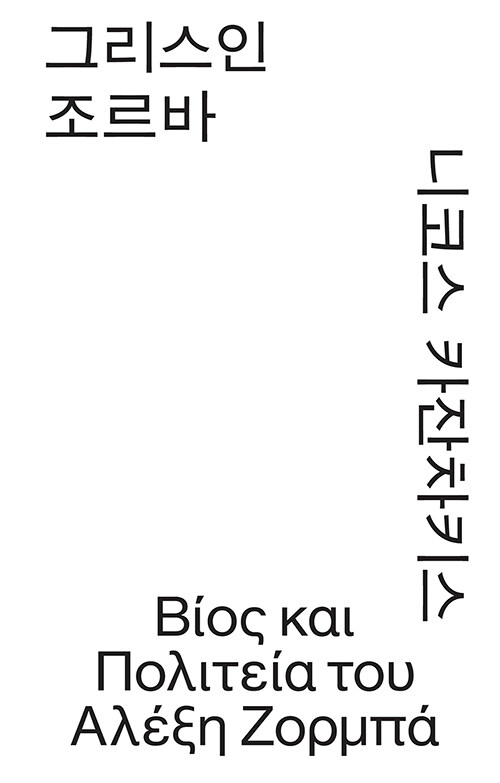

I once bought a mini edition of *Zorba the Greek*. It must have been at least two years ago. I thought I would carry it around with me and read it whenever I had the chance.

I read about ten pages and then left it sitting on my bookshelf. Every now and then, I would think about when I would finally read it, but I kept putting it off.

Then one day, I stopped by a bookstore and happened to find this book among the Mono Editions published by Open Books.



I liked the clean, uncluttered cover.

I was drawn to its simple yet clear design, with black lettering standing out against a white background, and it made me want to buy the book.

So I decided that this time, I would finally read the book I had been telling myself I would get around to someday.

The book tells the story of the events experienced by the narrator, "I," and Zorba as they travel together to the island of Crete.

The narrator's name is never mentioned in the novel. He is referred to only by titles depending on who is speaking to him. Zorba calls him "Boss," while the people on the island seem to call him "the boss."

The two of them were not originally traveling together. The narrator is someone who loves books and contemplation. The problem is that he enjoys thinking about things in his head but doesn't know how to act on them.

Early in the novel, one of his friends even calls him a bookworm.

So, in order to live a life of action, the narrator decides to lease a lignite mine on Crete and work there alongside the laborers.

```text
I have decided to start a new life with simple people like workers and farmers, far removed from the tribe of bookworms!

I prepared to leave with an excited feeling, as if this journey held some kind of mysterious significance. I had decided to change the way I lived.

I said to myself: Until now, you've been satisfied with looking only at shadows, haven't you? Well, now I'll take you before the real thing.
```

Zorba is completely different from the narrator in both temperament and experience.

Just before boarding the ship, Zorba suddenly approaches him and asks to come along.

Perhaps the narrator liked Zorba's willingness to approach him out of nowhere and invite himself along, especially since he had only just made his decision to change his life. He agrees, and the two of them travel to Crete together.

After arriving on Crete, they stay at the inn run by a woman named Madame Hortense and live in a hut. There, the narrator begins to learn how to live a life of action from Zorba.

Zorba was a real person. The novel is based on real experiences as well.

Nikos Kazantzakis once hired a laborer named Giorgos Zorba in the Peloponnese to mine lignite. That experience became the starting point for the novel.

Zorba lives according to his instincts. As I read, I couldn't help but feel that he was an incredibly pure person.

Simple, childlike, vulgar, fond of women, honest about his emotions, free, and wise.

He experiences his thoughts and emotions with his whole body and expresses them with his whole body.

I wondered if freedom itself were to take human form, perhaps it would look something like Zorba.

There were moments when I laughed or felt as though I had learned some kind of lesson when he spoke honestly about what he thought to the narrator without worrying about what others might think.

```text
Boss, I'm going to tell you what I think, so please don't get angry. Stack up all your books and set fire to the whole lot.

Then who knows? You're not a fool, and you're a good man, so maybe you might become something pretty worthwhile!
```

```text
Life has its steep climbs and descents. A sensible man uses the brakes.

I've thrown away my brakes long ago. I'm not afraid of crashing.

When a machine jumps the tracks, we technicians call it a crash. Well, you can forget about me worrying over whether I might crash.

Day and night, I go full speed ahead, doing whatever the hell I feel like.

If I end up overturned and smashed to pieces, so be it. What is there to lose? Nothing.

You think you won't end up in the grave just because you go slowly? Of course you will.

If we're going there anyway, we might as well go in style!
```

```text
A woman is like a vase. If you don't handle her very carefully, she'll break.
```

```text
Once you've made up your mind, see it through. No regrets, no hesitation.

Give the reins to youth, to youth that will never come again.

Courage! Damn it! Adventure! Bring it on!

It's all or nothing!
```

Zorba had this to say about the pleasure women take in giving pleasure.

```text
Let me teach you something, you educated gentleman. There is no greater pleasure for a woman.

A real woman... listen carefully, this will do you some good...

A real woman finds greater pleasure in giving a man pleasure than in receiving pleasure from him.
```

It reminded me of a scene from *As Good as It Gets*, a movie I recently watched on YouTube, in which the male protagonist tells the female protagonist, "You make me want to be a better man."

<**a** **class**="webpage-link" **href**="[https://www.youtube.com/watch?v=A75AgrH5eqc](https://www.youtube.com/watch?v=A75AgrH5eqc)" **data-display-ko**="유튜브 링크" **target**="\_blank" **rel**="noopener noreferrer">Youtube Link\</**a**>

Throughout the novel, God and the devil are frequently mentioned by the characters. Zorba thinks that the devil and God are basically the same thing.

While talking about a monk, Zorba says that there is a devil inside him.

```text
Once, on Mount Athos—I went up there once. Ah, I would rather have cut off my right hand!—I met Father Lavrentios, a monk.

He was from Chios. This poor fool believed that there was a devil living inside him, and he had even given it a name.

The devil's name was the Turkish Hoja. "Hoja wants to eat meat on Good Friday!" This poor Lavrentios would shout, banging his head against the church wall.

"Hoja wants to sleep with a woman. Hoja wants to kill the abbot. Yes, Hoja, Hoja wants to do these things! Not me!"

And then he would bang his head against a stone.

Boss, there's something like a devil inside me, too. I call that devil Zorba.

The Zorba inside me hates growing old. He has never grown old, never experienced growing old, and never will. The Zorba inside me is a man-eating goblin.

His hair is black as pitch, he has thirty-two teeth, and he wears a red carnation behind his ear.

The Zorba on the outside—poor thing—has a belly like a drum and a few white hairs. He has withered and become wrinkled, his teeth have fallen out, and the large ears are covered with the white hairs that come with age, making them look just like long donkey ears.

Boss? What can this Zorba do? Must these two Zorbas keep fighting forever? Which one will win?

... [excerpt omitted]

The only thing that brings me any comfort when I'm troubled is being with you and talking.

Why? Because you're like me. You just don't know it. There's a devil inside you, too, but you don't know its name yet, and because you don't know it, you can't breathe properly.

Boss, baptize the fellow and give him a name. You'll probably feel better afterward.
```

This devil seemed to me to represent unrestrained human desire. It is not an evil being in the moral sense.

Rather, it is the hidden instinct that each person conceals in order to follow social norms and maintain appearances.

Zorba shows two different ways of dealing with this devil.

The first comes when he and the narrator visit a monastery to get permission from the abbot to cut down trees on a mountain owned by the monastery.

The monastery presents itself as a place of restraint, holiness, and piety, but when they actually visit, the monks are nothing like that.

Instead, they seem to be consumed by worldly desires.

Zorba mocks and despises them, believing that those who refuse to acknowledge and instead suppress their own desires are the ones who are truly controlled and ultimately destroyed by the devil.

The second comes from Zorba's youth, when he was obsessed with cherries.

Because he had no money, he could only afford to buy one or two at a time, and he spent every night thinking about cherries.

So he stole money from his father, bought a huge amount of cherries, and stuffed himself until he vomited. After that, he says, he never once felt like eating cherries again.

Instead, he had freed himself from them. Zorba's way of becoming free from desire is to give the devil exactly what it wants until it has had so much that it becomes sick of it.

Zorba says there is no need to be ashamed of having a devil inside you. In fact, he says the more devils you have, the better.

That devil represents the energy and passion for life that drives people to act.

After reading Zorba's thoughts about the devil, I looked inward and wondered what kind of devil I might have. I wondered if there were desires I was hiding or suppressing for one reason or another.

Both the narrator and Zorba love nature, but the way they experience and respond to it is completely different, just like their personalities.

The narrator sits on the beach watching the waves or looks out over the island from the hut, describing the scenery in poetic language. He also becomes absorbed in Buddhist philosophy and contemplation.

```text
I could hear every whisper of the earth, every movement of its lips, every tremor, and I could even hear the sound of seeds swelling and bursting as the rain fell.

I could hear the sea roaring like a beast as it rushed upon the shore and licked it, soothing its thirst.
```

```text
In the evening, the sea sighed and turned rose-colored, then purple, then the color of grapes, and finally deep blue.
```

```text
In the afternoon, I enjoyed the warm, soft sensation of taking a handful of fine, light-colored sand and letting it slip through my fingers.

My hand was an hourglass through which our lives slowly leaked away and eventually disappeared. The hand itself was disappearing, too.
```

Zorba tries to understand things with his whole body, touching them with his hands and smelling them.

And every day, he is amazed by everything in front of him as if he were seeing it for the first time. The narrator marvels at Zorba's way of seeing the world.

```text
Boss, how wonderful it would be if we could hear what the stones, the rain, and the flowers are saying. Maybe they're calling out to us, and we simply can't hear them.

Boss, when will our ears finally open? When will we open our eyes and truly see? When will we be able to open our arms and embrace everything—the stones, the rain, the flowers, and the people?
```

The following passage is the narrator's reaction after listening to Zorba tell him about his experiences in Russia.

The narrator genuinely admires Zorba. I felt the same way. I couldn't help but like him through the stories the narrator tells on his behalf, as well as through the things Zorba himself says and does.

```text
I couldn't easily fall asleep. I felt that I had wasted my life.

If only I could find a rag and wipe away everything I had learned, everything I had seen and heard, and enter the school of Zorba to learn that great, true alphabet...!

The path I chose would be entirely different. By perfectly training all my senses, and my whole body as well, I would let my body enjoy and understand.

I would learn to run, to wrestle, to swim, to ride, to row, to drive, and to shoot. I would fill my soul with flesh. I would fill my flesh with soul.

And at last I would make those two eternal enemies reconcile within me.

Sitting motionless on my bed, I thought about my life, completely wasted.

Through the open door, I could barely make out Zorba's figure in the starlight.

He was crouched on the rock like a night bird. I envied him. Zorba is the one who has discovered the truth, I thought. His is the right path.
```

Watching Zorba experience joy, the narrator realizes that he filters his emotions through reason before allowing himself to experience them.

I have some of the same tendencies as the narrator. Even when I'm experiencing something, rather than simply feeling the moment as it is, I often find myself trying to figure out what it means or analyzing and calculating things in my head.

Sometimes, after experiencing something, I find myself meeting a different version of me than the person I was before.

After reading this book, I wanted to accept my emotions and feelings honestly and experience them fully, like Zorba.

Rather than putting a layer between myself and the world when I look at or experience something, I want to approach it as it is.

I also wanted to express what I feel as fully as possible. But I still struggle with this. I lack the ability to put something indescribable into words. (Perhaps this is actually the opposite tendency.)

At the end of the book, the translator's commentary explains how the novel incorporates a worldview in which seemingly opposing ideas or substances—such as soul and body, mind and matter, and God and humanity—ultimately merge into one.

It introduces the concept of Metoisono, or "becoming sacred," which describes the transformation of matter into spirit.

The translator explains Metoisono like this:

```text
When grapes become grape juice, it is a physical change.

When grape juice finally becomes wine, it is a chemical change.

When wine becomes love and the Eucharist, that is Metoisono.
```

Looking into this concept a little further, I found that Metoisono refers to a transformation of one's sacred essence that goes beyond a mere chemical change.

Zorba's acts of eating meat until he is full, drinking wine, and making love to women—things associated with matter and the body—do not end with mere pleasure.

He transforms that physical energy into passionate dancing (in the novel, Zorba uses dance to explain his feelings to the narrator), singing, and a longing for freedom—the realms of mind and soul.

The author's philosophy of Metoisono can be seen particularly powerfully toward the end of the novel.

The logging business that Zorba had obtained permission from the monastery to undertake collapses, leaving the narrator to lose everything he owns and become completely bankrupt.

The narrator does not blame Zorba. He neither grieves nor despairs. Instead, he experiences a sense of liberation and freedom that he had never felt before in his life.

```text
I experienced an unexpected sense of liberation at the very moment when everything was finally over.

It was as if, after being lost in a difficult and dark labyrinth of necessity, I had discovered freedom happily playing in a corner.

I played with the goddess of freedom.

Even when we have suffered a complete defeat outwardly, when we are victorious within, we human beings feel an indescribable pride and joy.

External disaster is transformed into supreme happiness.
```

With nothing left to lose, he feels that all the worries and attachments that had been holding him back have finally been severed.

After the cableway project collapses completely, Zorba and the narrator feast on wine and lamb and enjoy themselves.

Then the narrator, who has never danced before, asks Zorba to teach him how to dance. The two of them laugh and dance wildly together.

In that moment, as they dance together and become one, Metoisono takes place.

The author is said to have been deeply influenced by Eastern philosophy, particularly Buddhism. Through the novel, he tries to create harmony out of the opposing and contradictory concepts of life, such as body and soul.

Zorba symbolizes the body, while the narrator symbolizes the soul. The two begin as polar opposites, but by dancing together at the end, they transcend their opposition and arrive at freedom.

I wonder if the author himself, like these two characters, had reached a state of complete liberation and freedom.

During his lifetime, he wrote the following epitaph for himself:

```text
Δεν ελπίζω τίποτα.
I hope for nothing.

Δε φοβούμαι τίποτα.
I fear nothing.

Είμαι λέφτερος
I am free.
```

I could partly sense what Kazantzakis meant by true freedom. The book made me think about the feelings and attitude toward life that emerge when we let go of everything.

I, too, had the feeling that I was carrying some nameless burden—the feeling that I had to accomplish something. But by letting go of my attachments, I was able to experience a sense of freedom.

It was partly thanks to this that I was able to start my walking project. Through Zorba, I became more honest with myself about why I made that choice and how I felt about it.

But I am still not the kind of free person Nikos Kazantzakis describes. I still have many attachments and fears.

I don't think completely letting go is something I need to do right now.

Perhaps it is a state that cannot be reached until the very end of one's life.
