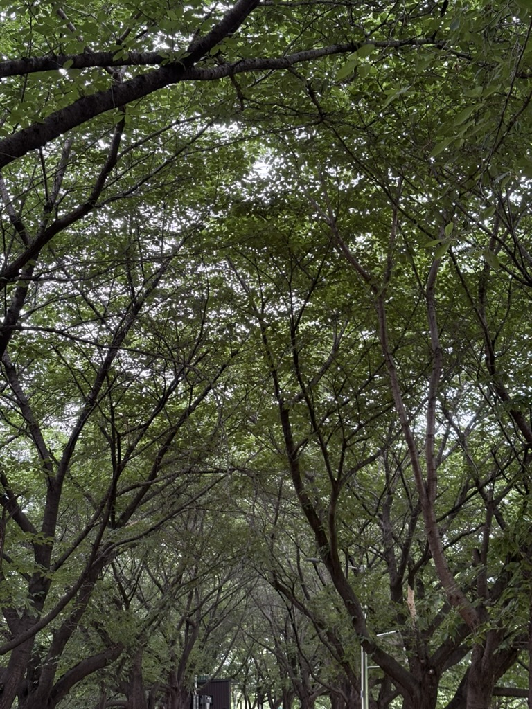

Reboot is a computer term that means turning a computer off and back on to reset the system and start it again.

It can also be used to mean wiping away all previous context and starting completely fresh from the beginning.

I quit my job.

The work itself and the overall development environment were so different from what I had expected that I decided it wasn't something I could simply endure for a few more years and hope things would get better.

So I chose to reboot.

To start over.

I want to embrace the uncertainty and anxiety that come with not knowing what lies ahead.

Maybe it's because I don't know where things will take me, but that makes life feel more exciting.

I guess I feel a little like a wanderer.

It feels like I could become or do anything, yet at the same time, I sometimes find myself shrinking back for no particular reason.

Still, I think I need to try the things I want to do now, so I won't regret not doing them later.

After all, the regret of not doing something usually leaves a deeper lingering feeling than the regret of having done it.

For the time being, I'm going to wander around here and there until I find a good place to settle.

On my last walk along the nearby Anyangcheon, all the cherry blossoms had already turned into bright green leaves.

**## Places**

I visited the National Museum of Modern and Contemporary Art, Seoul, to see the Damien Hirst exhibition.

The last time I came here for the *Poetics of Extinction* exhibition, I saw that they were preparing for this exhibition, so I had planned to come back and see it.

After saying my final goodbyes to my coworkers and CEO on my last day at the company, I took Line 5 from Yangpyeong Station to Gwanghwamun Station and walked to the museum.

Luckily, it happened to be Culture Day, so admission was free.

Back in 2018, when I was a freshman in college, I took a liberal arts class on culture and the arts. We were given an assignment to research an artist and give a presentation.

I didn't have any friends in the class, and I knew practically nothing about art (I still don't, honestly), so I had no idea what I was supposed to do.

Somehow, I came across an artist named Damien Hirst and ended up presenting some of his most famous works.

About eight years later, seeing the works I had researched back then in person gave me a strange feeling that I can't really put into words.

The work that stuck with me the most was *A Thousand Years*, which depicts the cycle of life and death.

There is a severed cow's head surrounded by countless flies, with an electric fly killer hanging above it.

Newly hatched flies feed on the dead cow's head and grow and reproduce. Then, as they fly around, they eventually get electrocuted and die.

The whole process continues to repeat itself, in a brutally direct way.

The blood-soaked cow's head and swarms of disgusting flies make the work uncomfortable to look at, but what it depicts doesn't feel all that different from our own lives. That's probably why it has stayed with me all this time.

After the exhibition, I walked around Gahoe-dong.

It's famous for Bukchon, so there were plenty of tourists on the streets, and there were quite a few hills to climb, but I got to see some beautiful houses along the way.

Someday, I want to live in a house like this, tend to my own garden, and spend my days at a leisurely pace.

The next day, I went to Seoul Forest.

I heard that the Seoul International Expo, which was held at Boramae Park last year, was being held at Seoul Forest this year, so I stopped by because I was curious to see what it would be like here.

There was a pretty butterfly.

The park was honestly so huge that I got tired just walking around.

I think I ordered tonkatsu at a nearby restaurant, then spent the rest of the day coding at Kakongjok.

And that's it for May.