장마가 끝난 9월은 해가 쨍쨍하게 뜨는 날이 대부분이었던 것 같다.

요즘은 꽃과 나무를 이따끔씩 구경하는 것에 재미를 붙였다. 

시작은 [여의도 공원](../projects/walk/yeouido#샛강생태공원과-여의도공원)을 산책하면서 상록무늬 쥐똥나무라는 식물을 알아둔 것이었다.

가끔씩 길을 지나다니다 보면 공원이나 작은 공간에 이 나무가 심어져 있는 걸 볼 수 있는데, 이게 어떤 나무인지 아니까 반갑게 느껴진다.

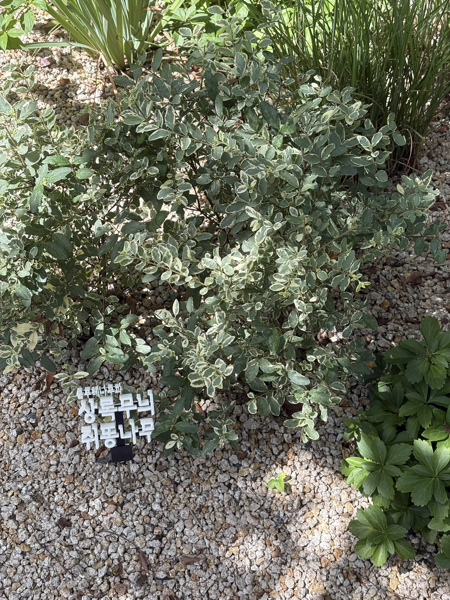

몇 개의 다른 식물들도 종종 카메라에 담곤 했다.

이번 달에 찍은 것들을 소개한다.

청계천에 있는 꽃, 나팔꽃인줄 알았는데 페튜니아라는 꽃이라고 한다.

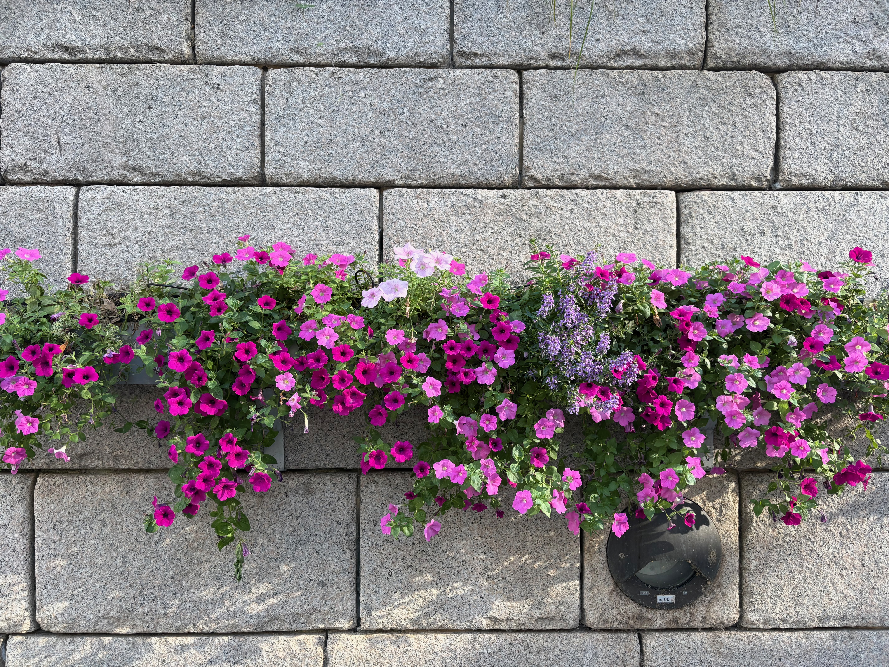

을지로에 활짝 피어있는 배롱나무의 꽃

이제 슬슬 꽃이 지면서 내년쯤에 다시 볼 수 있을 것이다.

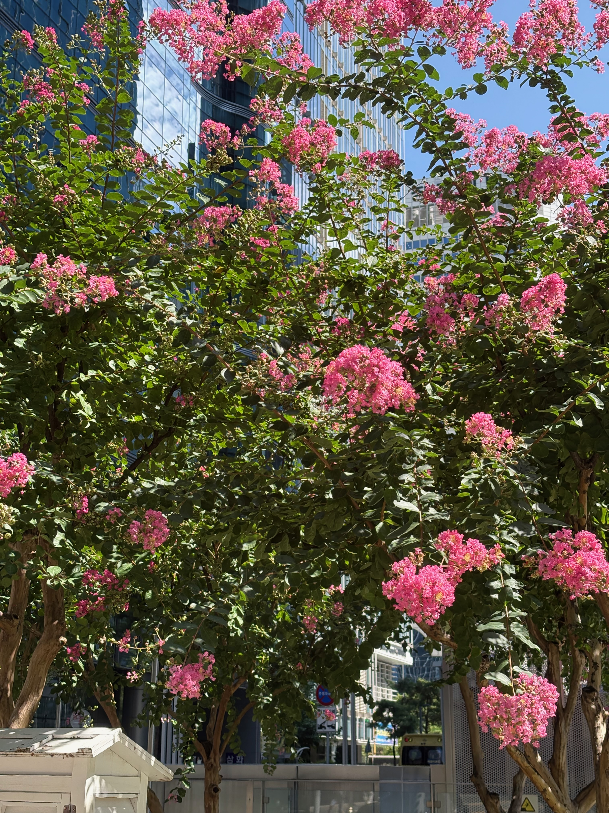

여의도공원에서 근처에서 본 꽃댕강나무

가까이서 보면 흰색 꽃이 별모양으로 피어 있다.

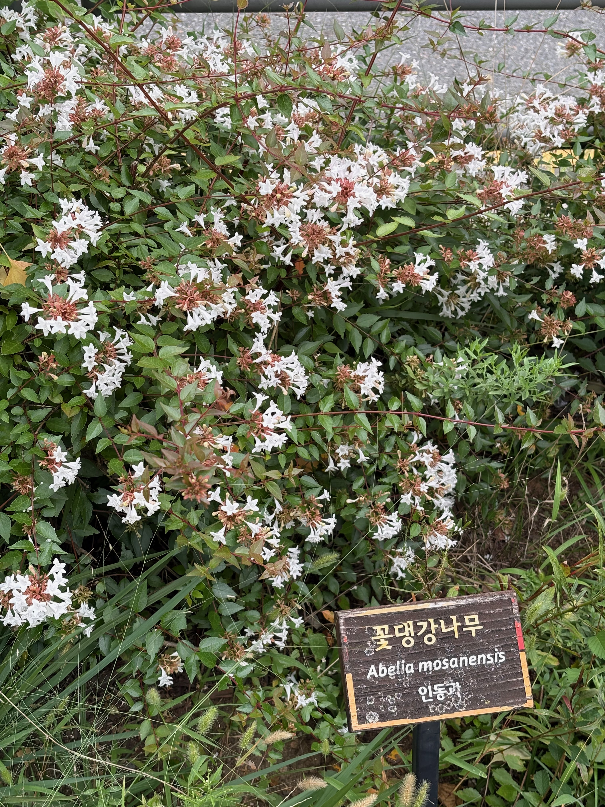

연한 분홍 장미와 민들레. 보라매공원에 있다.

보라매공원 호수 근처에는 장미만 따로 심어져 있는 공간이 있다.

이 곳에는 연분홍 장미 말고도 새빨간 장미, 주황색 장미도 있다.

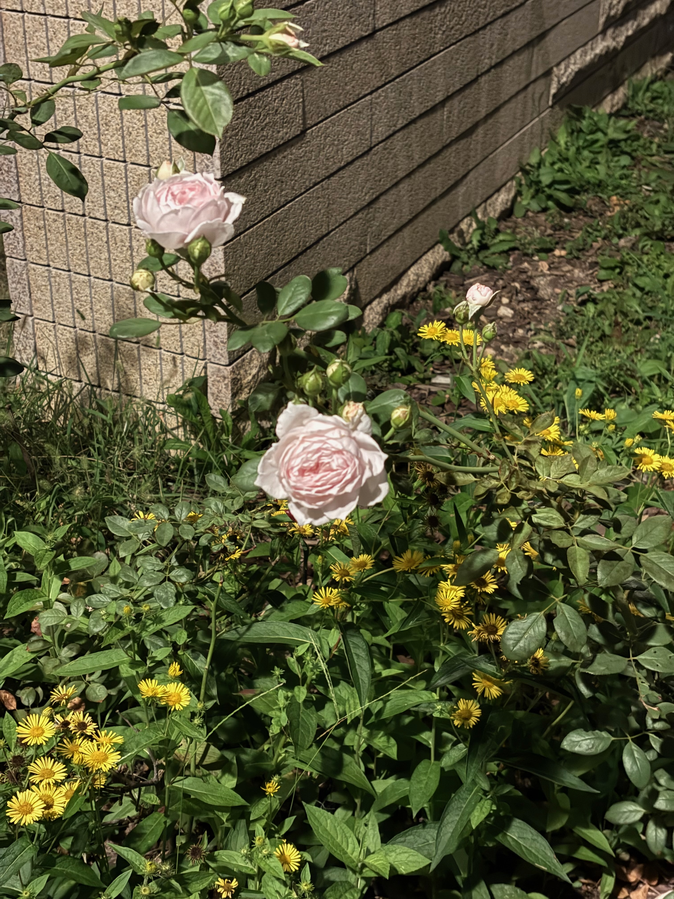

바닥을 보면 빨간 장미 꽃 잎이 떨어져 있다.

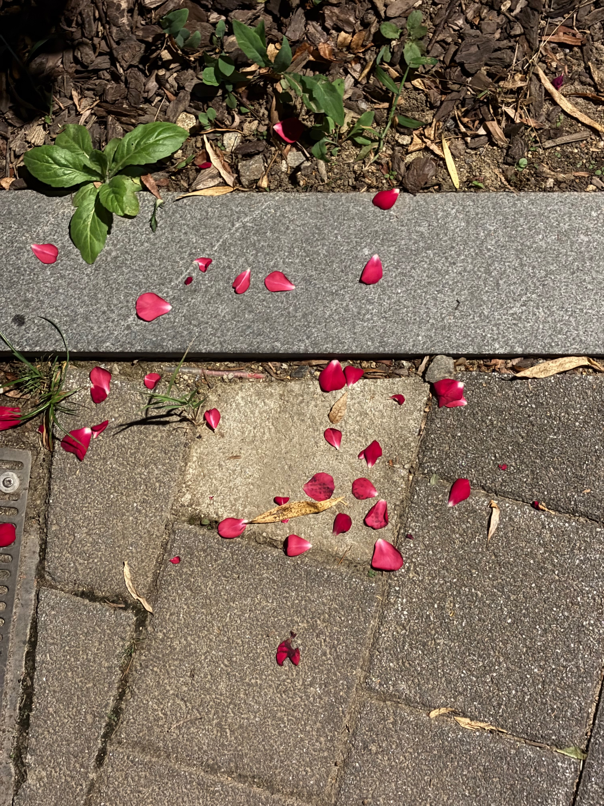

하얀 민들레도 있다.

할아버지들이 장기를 두는 곳을 지나면 있는 길게 놓여진 벤치를 따라서 하얀 민들레가 쭉 이어지는데 낮이나 밤이나 언제보든 예쁘다.

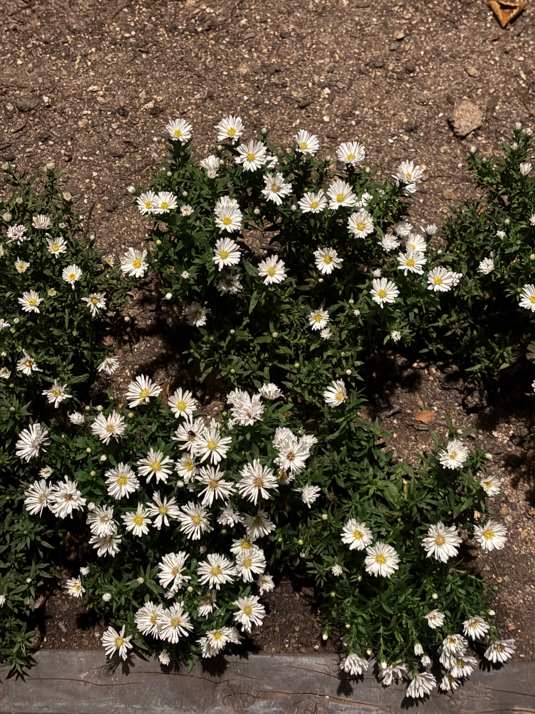

서리풀공원에 있는 꽃무릇이다. 

꽃무릇을 보고 석산이라고도 한다.

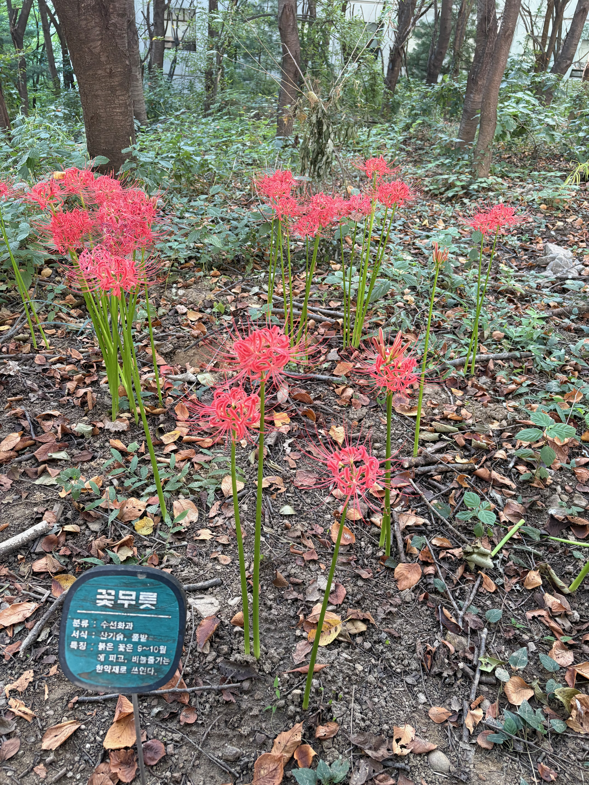

## 본 것들

지브리의 붉은 돼지를 봤다.

미야자키 하야오 감독의 작품 중 모노노케 히메와 더불어서 가장 좋아하는 작품이다.

이 영화의 분위기나 색감, 풍경이 마음에 들어 가끔씩 생각난다. 저 시절에 살아있지도 않았는데 이상하게도 노스텔지아가 느껴진다고 해야 하나

영화 초반 포르코가 자신의 아지트에서 쉬고 있다가 라디오를 통해서 공적(하늘의 해적)이 나타났다는 소식을 전해 듣는다.

공적을 소탕하기 위해 비행기를 이끌고 지도를 펼치는 장면이다.

이 지도를 보고서 나만의 지도를 만들어야겠다는 생각을 하기도 했었는데... 언젠가는 만들 것이다. 언젠가는

공적들이 포르코에 못당해내자 미국인 용병 커티스를 고용하게 되는데, 포르코와 커티스가 대결하기 전 피오와 공적들이 단체 기념 사진을 찍는 장면이다.

영화 내에서 공적들은 마냥 악당으로 비춰지지 않는다. 허술하면서 낭만있는 모습을 보여주기도 해서 나름대로 호감이 갔다.

호텔 아드리아노, 투박한 비행기, 지중해, 포르코 로쏘의 아지트, 커티스의 할리우드 데뷔 등 여러모로 낭만이 넘치는 애니메이션이다.

그 다음으로는 그리스인 조르바라는 책을 봤다.

포르코 로쏘와는 다르지만 그에 못지 않게 매력이 철철 흘러 넘치는 조르바. 

책을 보면서, 모두 읽고 나서도 한 번쯤은 조르바처럼 살고 싶다는 생각을 했다.

이 책에 영향을 받아 꽃에 관심을 갖게 되기도 했다.

[그리스인 조르바](./카렐%20차페크의%20평범한%20인생)

## 추석

추석을 맞이해서 집안일도 도울 겸 본가로 갔다.

예산시장 근처에 어떤 할아버지가 그동안 모으셨던 LP나 각종 CD, DVD를 판매하고 있는 가게에 들렸다.

일전에도 한 번 왔었는데 빈 손으로 돌아갔다가 이번에는 장식용으로 LP판 하나를 샀다.

사라사테의 찌고이네르바이젠이라는 곡라고 한다. 나중에 턴테이블을 구매하게 되면 틀어볼 예정

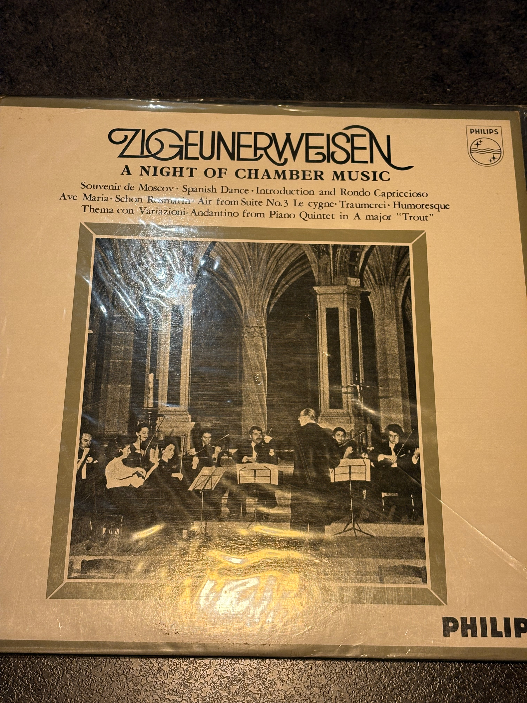

시골집에도 갔다. 

할머니댁에 길고양이 두 마리가 사는데 처음에는 가까이 다가가지 못했다.

특히 철제로 된 테이블 밑에 있는 검정색 고양이가 낯을 많이 가리는 바람에 먹이를 줘도 그 자리에서 먹지 않고, 먹이를 물고 조용한 곳으로 가서 먹었다.

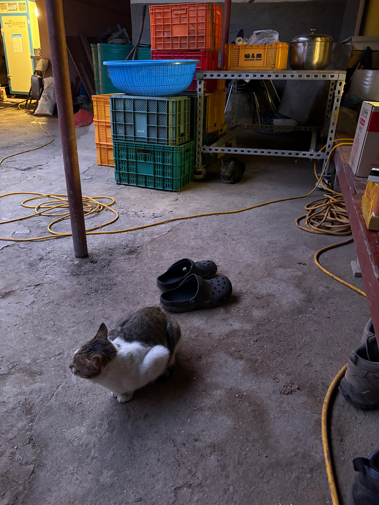

시간이 널널한 덕분에 며칠동안이나 같이 있다보니 조금 친해졌다.

나중에는 가까이 다가와서는 페로몬을 묻히거나 헤드 번팅을 했다.

어릴 때 야생에서 자라서 그런건지 사람 손을 무서워한다. 

밥을 먹는 동안 방심한 틈을 노려 쓰다듬어주면 막상 또 좋아서 골골송을 부르고 배를 보여준다.

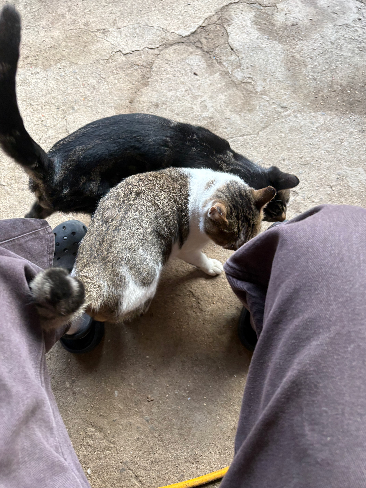

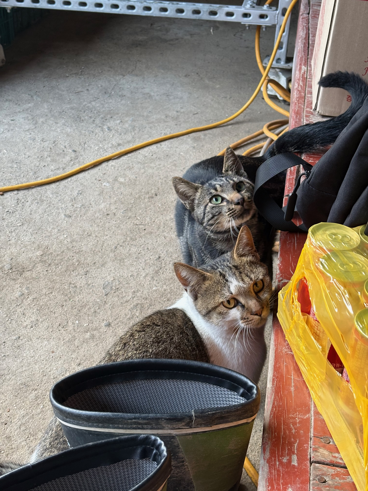

이 두 녀석 모두 수컷인데, 서로 같이 자기도 하고 그루밍도 해준다.

검은색 고양이가 하얀색 고양이를 더 좋아하는지 매번 머리를 갖다가 박는다. 

하얀색 고양이는 이제는 질린 건지 자리를 피하기도 한다.

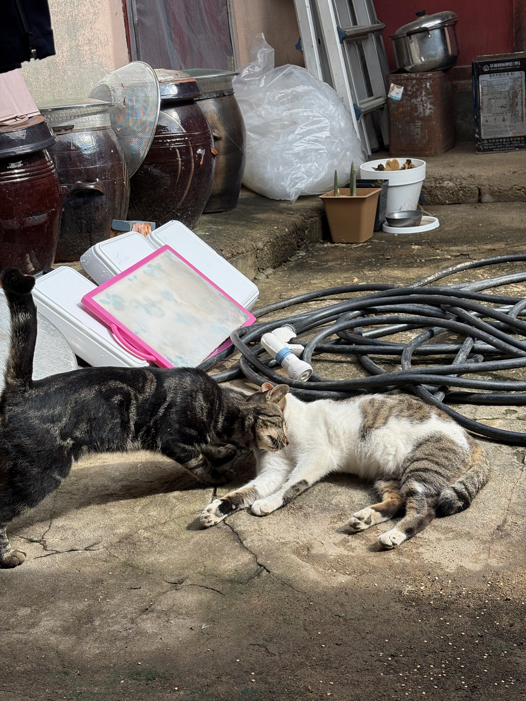

싸우는 건지 장난을 치는건지...

어쨌든 심심한 일은 없어보인다.

<video controls>
    <source src="./videos/시골집고양이들.mov">
</video>

오랜만에 버스도 탔다.

푸근하고 정겨운 논밭을 신나게 달렸다.

<video controls>
    <source src="./videos/시골길버스.mov">
</video>

벼가 강한 햇빛을 받으며 자라고 있다.

슬슬 고개를 숙일 시기가 다가오는 것 같다.

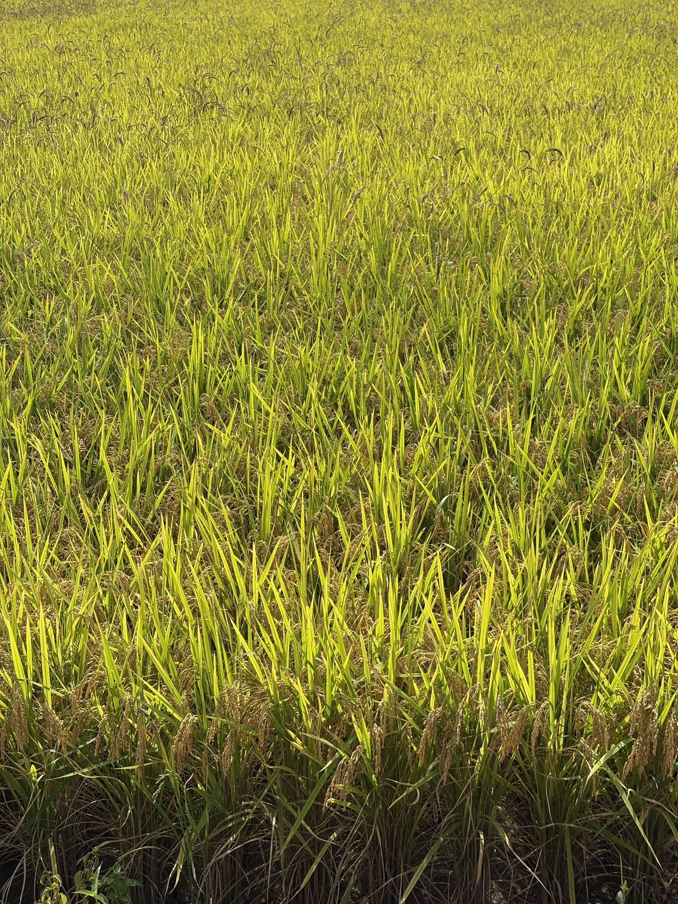
