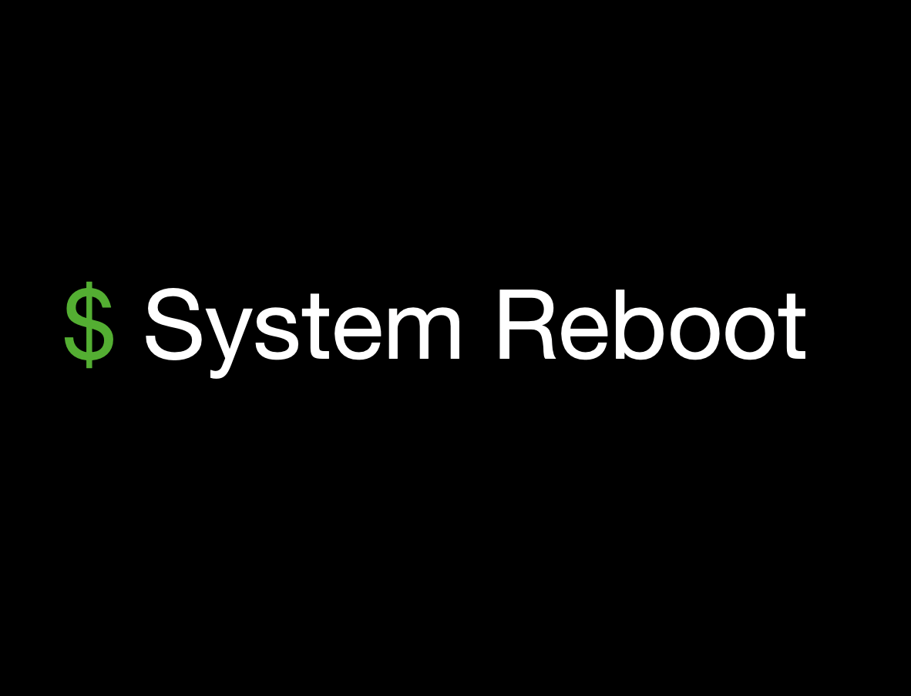
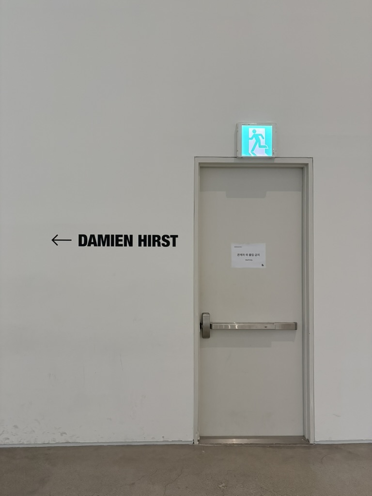
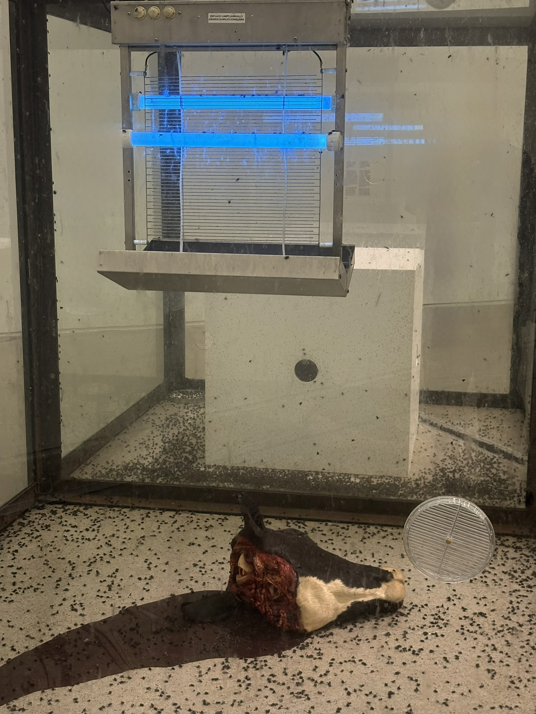
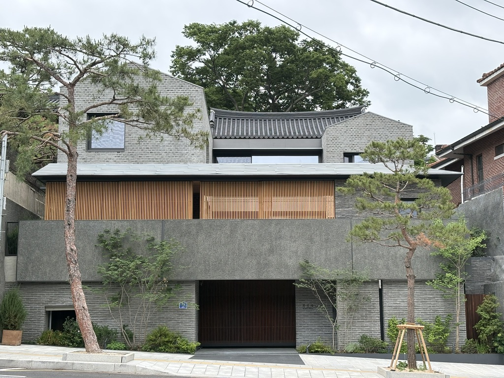

리부트(Reboot)는 컴퓨터를 껐다 켜서 시스템을 초기화하고 다시 시작한다는 컴퓨터 용어다.

이전의 맥락이나 상태를 모두 지우고 처음부터 완전히 새롭게 시작한다는 의미로 사용되기도 한다.

퇴사했다.

전체적인 업무와 개발 환경이 생각했던 바와 너무 다르다보니 앞으로 몇 년 버티고 참으면 될 게 아니라고 판단했다.

그래서 리부트를 선택했다.

새롭게 시작하려고.

불확실하고 불안한 마음을 즐길려고 한다.

어떻게 흘러갈지 알 수 없으니까 살아가는 게 더 재밌게 느껴진다.

마치 방랑자같다랄까.

무엇이든 될 수 있고 할 수 있을 느낌이 들면서도 괜스레 주눅들기도 한다.

그래도 하고 싶은 것들을 지금 해봐야 나중에 후회하지 않을 거 같다.

보통 하고 나서 후회하는 것보다 하지 않아서 후회하는 게 더 큰 미련을 남기는 법이니까.

당분간 좋은 자리를 찾을 때까지 이리 저리 떠돌아다닐 예정이다.

## 장소

국립현대미술관 서울에 방문하여 데미안 허스트 전시회를 관람했다.

이전에 소멸의 시학 전시회를 관람하러 왔었을 때 전시 준비 중인 걸 보고 보러 올 생각이었다.

퇴사하는 날 회사 동료분들과 대표님에게 마지막 인사를 드리고 나온 뒤 양평역에서 5호선을 타고 광화문역에 내려서 국립현대미술관까지 걸어갔다.

운이 좋게도 방문한 날이 수요일 문화의 날이어서 무료로 관람할 수 있었다.

2018년 대학교 1학년 때 문화/예술과 관련된 교양 수업을 들었는데 그 수업에서 한 명의 작가를 조사하여 발표해야 하는 과제를 받았다.

같이 수업을 듣는 친구도 없었고 예술을 알지도 못하는데 (사실 지금도 잘 모른다) 예술 작가를 발표하라니 난감했었다. 

그 때 어떤 경로로 알게 됐는지는 모르겠지만 데미안 허스트라는 작가를 알게 되었고 그의 대표적인 작품들을 발표했었다.

약 8년이 지나 당시에 조사해본 작품을 실제로 보니 말로 설명할 수 없는 오묘한 기분이 들었다.

그 중 가장 기억에 남는 작품은 삶과 죽음의 순환을 보여주는 '천년'이다

목이 잘린 소머리와 수많은 파리가 놓여있고 그 위에는 전기 살충기가 있다.

새로 태어난 파리는 죽은 소머리를 먹으며 자라고 번식한다. 그리고 날아가다가 살충기에 맞아 죽음을 맞이한다.

이 과정은 적나라하게 계속해서 반복한다.

피가 흥건한 소머리와 징그러운 파리들이 잔뜩 있어서 불쾌하게 느껴지지만 작품이 보여주는 사실은 우리의 삶과 크게 다를 바가 없다고 느껴져서 아직도 기억에 남아있다.

전시를 보고 난 뒤 가회동 동네를 걸어다녔다.

북촌으로 유명해서 길거리에 관광객이 많고 언덕도 있지만 멋있는 주택들을 볼 수 있었다.

나도 언젠가 이런 주택에서 정원을 꾸미고 여유롭게 하루를 보내면서 살아야지

그 다음 날에는 서울숲에 찾아갔다.

작년에 보라매공원에서 진행한 서울국제박람회를 서울숲에서 한다는 소식을 듣고 이 곳은 어떻게 했을지 궁금해서 들렸다.

예쁜 나비가 있더라

사실 부지가 너무 넓어서 돌아다니다가 지쳤다.

아마 근처 식당에서 돈까스 시켜먹고 카공족에 가서 코딩하며 하루를 보냈던 것 같다.

5월달은 이걸로 끝