새벽에 보라매공원을 걷다가 우연히 시든 꽃을 발견했다.

보라매에 있는 꽃과 나무들 중 유독 이 꽃에 눈길이 갔다.

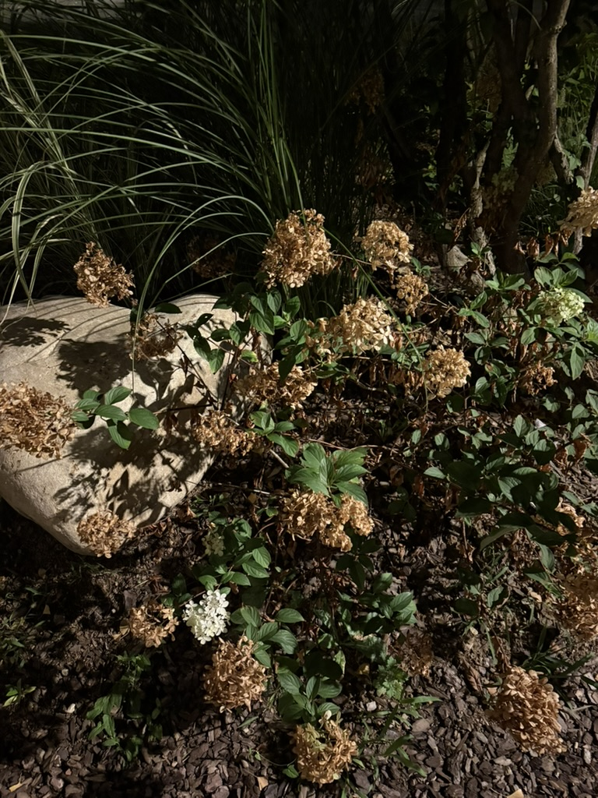

사진을 찍고 '아름답다'라고 느끼면서 집으로 돌아가던 중 갑자기 한 가지 질문이 떠올랐다.

시든 꽃이 아름다운가?

시들어가는 꽃을 보고 아름다움을 느끼는 사람이 있을지 모르겠다. 시든 꽃은 죽어가는 꽃이다.

곧 질문은 '죽음은 아름다운가?'라는 질문으로 이어졌다.

명예로운 죽음, 아름다운 죽음이라는 말은 있어도 죽음은 아름답다라는 말은 들어본 적이 없다.

나는 죽음 자체를 아름답다고 생각하지 않는다. 그런데 시들어가는 꽃을 바라보며 아름답다고 느꼈다.

내가 아름답다고 느꼈던 것은 무엇일까?

보라매공원은 내가 가장 좋아하는 장소 중 하나이다. 대충 계산해봐도 적게는 400번, 많게는 500번도 족히 온 곳이다.

보라매의 사계절을 모두 겪어봤다. 그 중 사람들이 가장 붐비고 예쁘다는 말을 빈번하게 말하며 사진을 찍는 계절은 봄이다.

봄 이전에는 겨울이 있다. 겨울은 한 해가 끝나는 시점의 계절이기도 하다.

봄은 나무의 가지만 앙상하게 남기고 땅에는 아무것도 남겨놓지 않은 차가운 겨울로부터 따뜻한 온기를 불어넣고 푸르른 잎들과 새싹을 채워넣는다.

자연은 소멸과 탄생을 반복한다. 자연에서 끝은, 끝으로만 존재하지 않고 또 다른 시작으로 이어진다.

겨울에서 봄으로 계절이 바뀌는 것은 마치 소멸에서 탄생으로 이어지는 흐름과 같다. 

겨울이 지나면 봄이 오는 것을 알기에 겨울이 온다고 해서 울면서 슬퍼하지 않는다.

가을의 단풍나무에서 떨어진 낙엽은 흙으로 돌아가고 이듬해 봄이면 다시 새로운 잎으로 돋아난다. 작년 여름에 들었던 맹꽁이의 울음소리도 이듬해 여름이면 맹꽁하는 소리가 다시 들려온다.

어쩌면 나는 이러한 자연의 순환에서 아름다움을 느꼈던 건지도 모르겠다. 

소멸 뒤에 탄생이 있다는 것을 알기에 다시 새롭게 피어날 꽃을 기대하는 것이다.

그 기대는 희망이며, 아름다움은 이미 피어난 꽃에만 있는 게 아닌 다시 피어날 꽃이 가진 희망에도 있지 않을까 싶었다.

이 생각은 사람의 삶에 대해서도 다시 한 번 생각하게끔 만들어줬다.

삶을 아름답게 해주는 것은 무엇일까?

살아가면서 죽어가고 있는 인생.

죽음만 바라보며 살아가면 모든 게 허무하게만 느껴진다. 어차피 죽을텐데라는 생각은 의욕을 떨어뜨리고 삶을 덧없게만 만든다.

한가지 안타까운 것은 우리는 다시 태어날 수가 없다는 것이다.

사실 자연의 모든 요소는 다시 태어나지 않는다. 늘 그 자리에 있는 꽃이 같은 꽃처럼 보이지만 계절이 지나고 태어난 새로운 생명이다. 동일한 형상을 했을 뿐.

자연은 매번 봄을 맞이하지만, 인생에는 봄이 두 번 다시 오지 않는다.

언젠가 끝날, 돌아오지 않을 한 사람의 시간 안에서 삶을 아름답게 만들어주는 건 희망이라는 것을 시든 꽃으로부터 알게 됐다.

무언가를 고대하고, 아직 오지 않은 것을 기다리며 살아가는 것은 일상에 활기를 불어넣어준다. 살아있다는 것을 느끼게 해준다.

다시 피어날 꽃을 기대하는 것에서 자연의 아름다움을 느끼는 것처럼 우리의 삶을 아름답게 해주는 것은 끝이 아닌 그 다음을 바라보게 해주는 것일지도 모른다.

자연이 소멸과 탄생을 반복하는 것처럼 희망 역시 사라졌다 나타났다를 반복하기에, 단풍나무가 매년 새로운 잎을 틔우듯이 아마도 우린 매번 새로운 희망을 찾아야 할 것이다.

그리고 희망을 잃은 삶은 죽음만 바라보며 살아가는 것과 별반 다름이 없다는 것도 알게 되었다.  

## 8월의 보라매

해가 뜨기 전 여름 새벽의 보라매에서는 벌써부터 하루를 맞이하는 사람들을 흔치 않게 볼 수 있다.

가볍게 조깅을 뛰는 사람, 출근하는 사람, 다같이 모여 스트레칭을 하는 사람들

아마도 나처럼 쪼리신고 이른 새벽에 산책을 하는 젊은 사람은 드물 것이다.

하늘을 올려다 보니 해가 뜨고 있는지 구름이 분홍 빛깔을 띄었다.

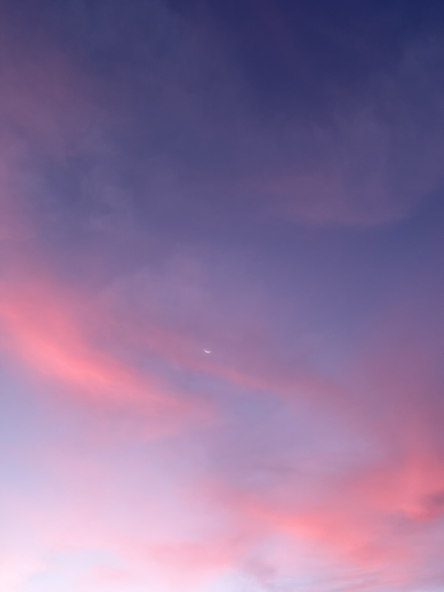

넓은 하늘에 나타난 오묘하며 몽환적인 분위기를 한참 동안이나 쳐다봤다.

태양이 떠오르면서 점차 구름의 색은 주황색으로 변해가고 그 분위기는 사라져간다.

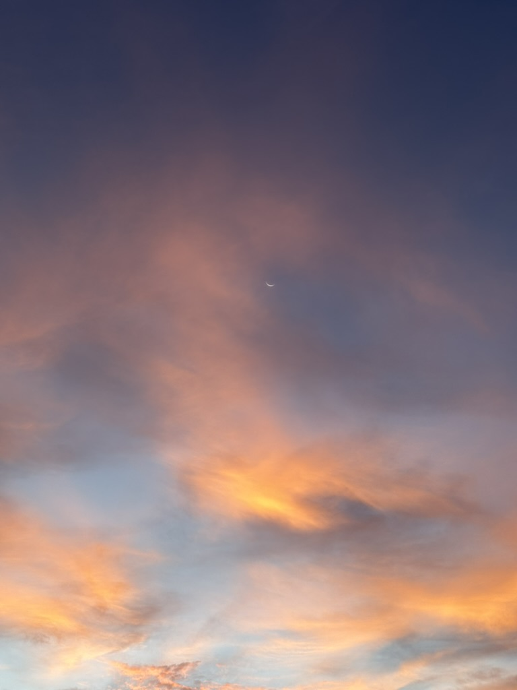

날이 점차 밝아오르고 있는 중앙트랙 광장의 모습이다.

잠깐 앉아서 지나가는 사람들을 구경한다.

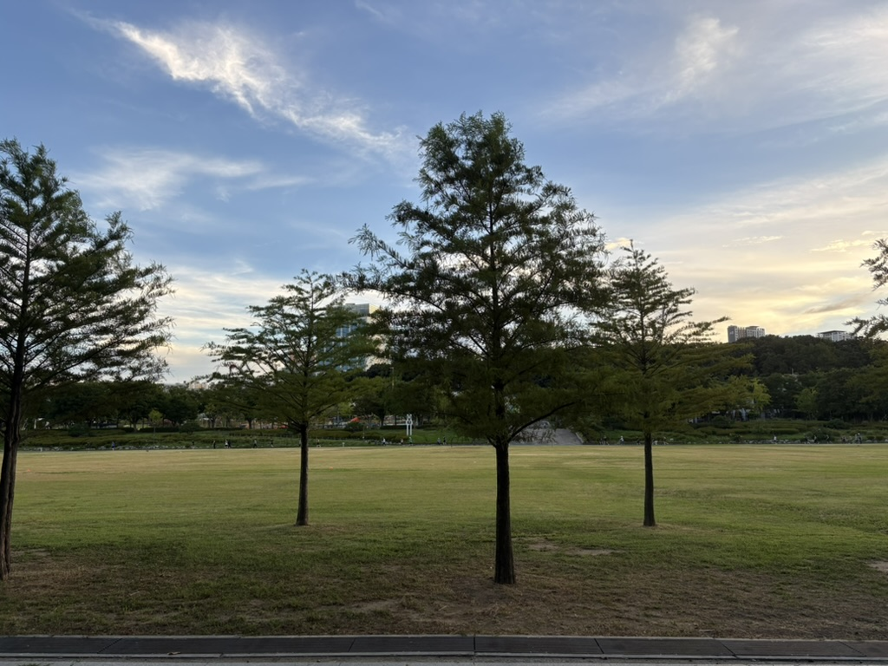

작년에 이 곳에서 서울국제정원박람회를 했었는데 그 때 만들어진 벌집이 있다.

설명에 따르면 벌을 위한 호텔이라고 한다.

가끔 기다리다 보면 벌들이 호텔에서 묵고 있는 모습을 볼 수 있다.

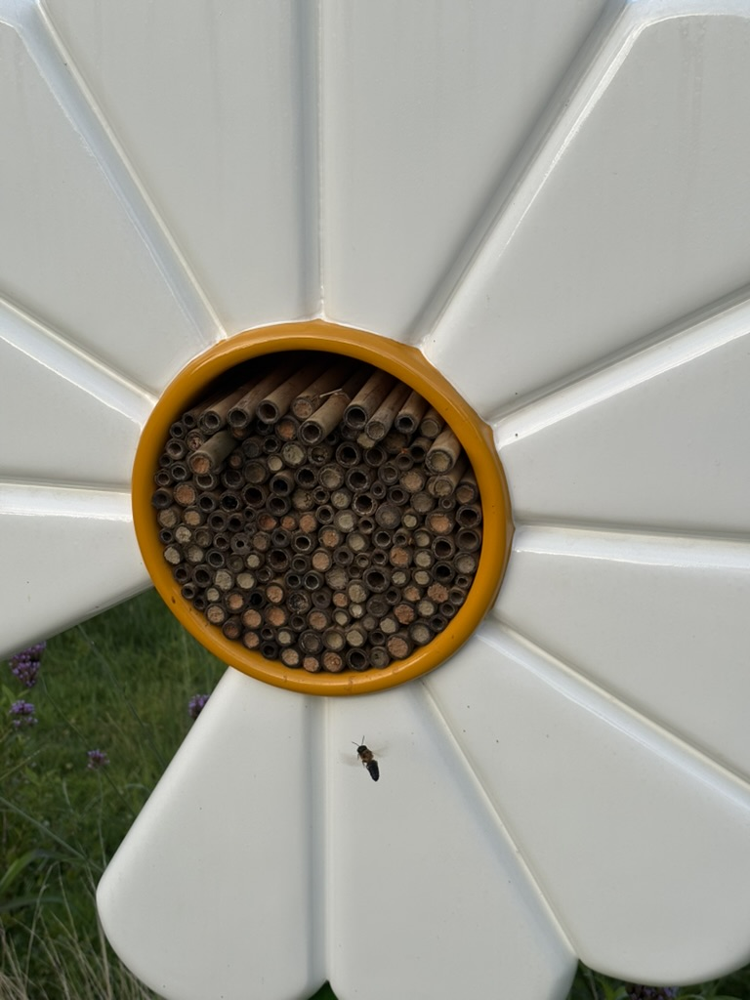

시간이 지난 뒤 다시 하늘을 올려다 봤는데 큰 낙엽 두 장이 하늘에 떠있었다.

저 낙엽은 어디서 떨어진걸까? 아니 올라간걸까?

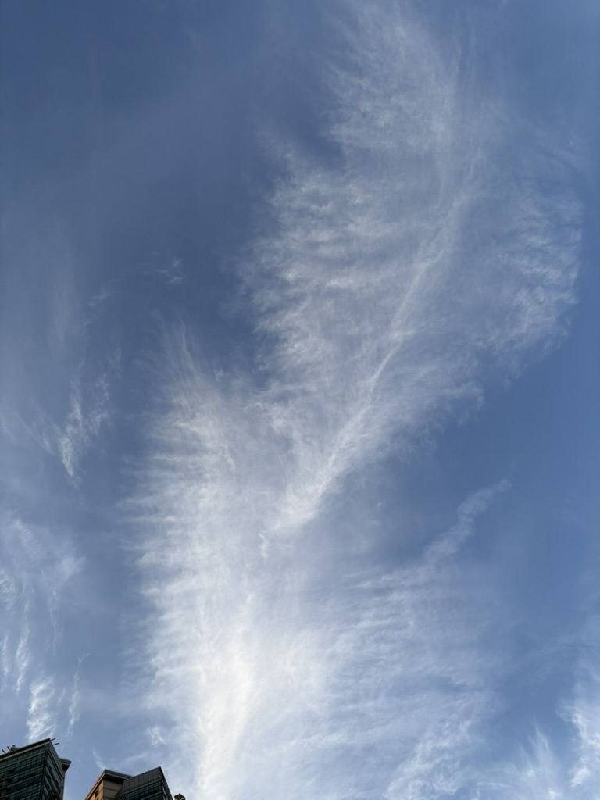

## 8월에 찍은 몇 장의 사진

#### 사진 1

문화역서울284에서 준공 100년이 지난 서울역을 기념하며 열린 전시를 보러 가는 길에 찍은 지하철역 안 가게.

평소라면 그냥 지나쳤을텐데 이 날은 열차를 기다리면서 구경했다.

#### 사진 2

서울역7017에서 누군가 히사이시 조의 Summer를 피아노로 연주하고 있다.

이 분이 여름을 맞이하는 방식인건가.

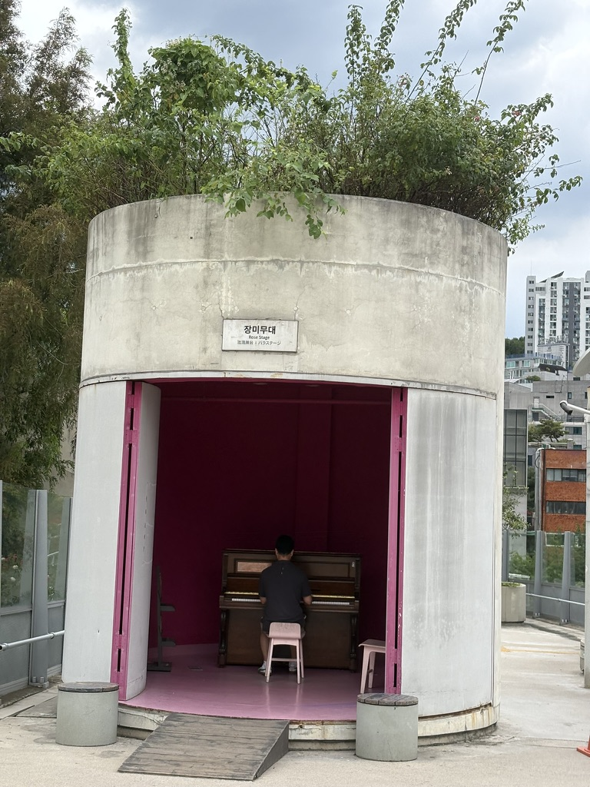

#### 사진 3

중림동의 어느 한 건물에 들어서는 입구.

너무 예쁘게 정원을 꾸미셔서 사진으로 남겨놓았다.

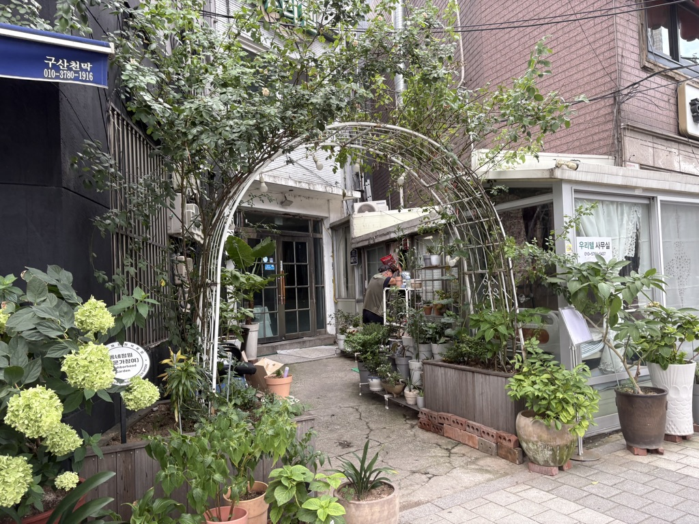

#### 사진 4

디뮤지엄에서 하는 취향가옥2 라는 전시를 보러 갔었다.

그 곳에서 묵직한 돌맹이로 머리를 세게 내리치는 듯한 질문을 담은 문장을 만났다.

나는 무엇을 모으며 살아가고 있을까? 내가 지금 어떤 걸 가지고 있고, 앞으로 어떤 걸 모을지에 대해 생각하게 해주었다.

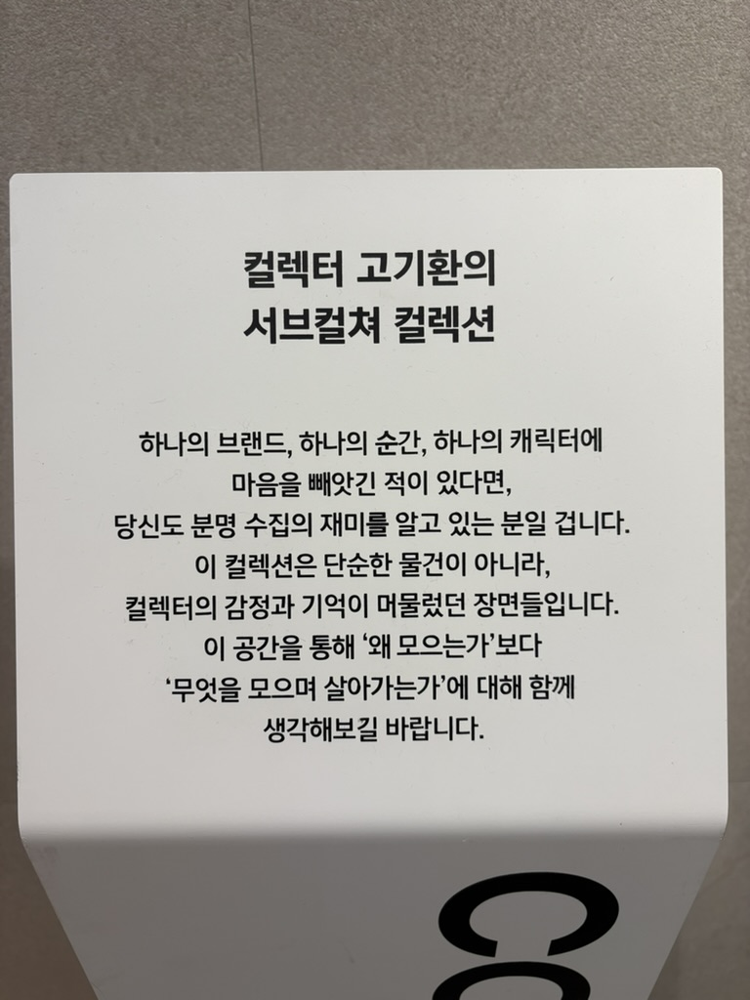

#### 사진 5

서서울미술관의 2층 옥상에서 만나볼 수 있는 문장이다.

어느 날씨이던 이 곳에 올라서면 좋은 날씨로 느껴질 수 있을 것 같다.

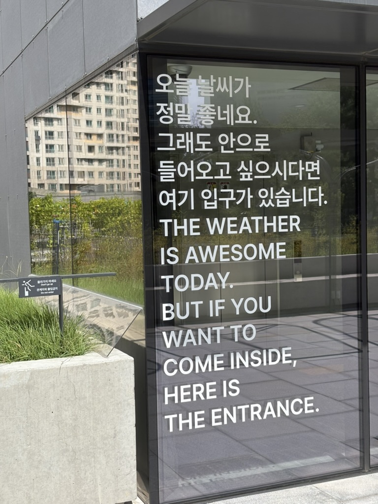

#### 사진 6

비가 쏟아지는 날, 비를 피해 버스에 탄 인형들.

버스기사 아저씨의 인형에는 낭만이 있다.

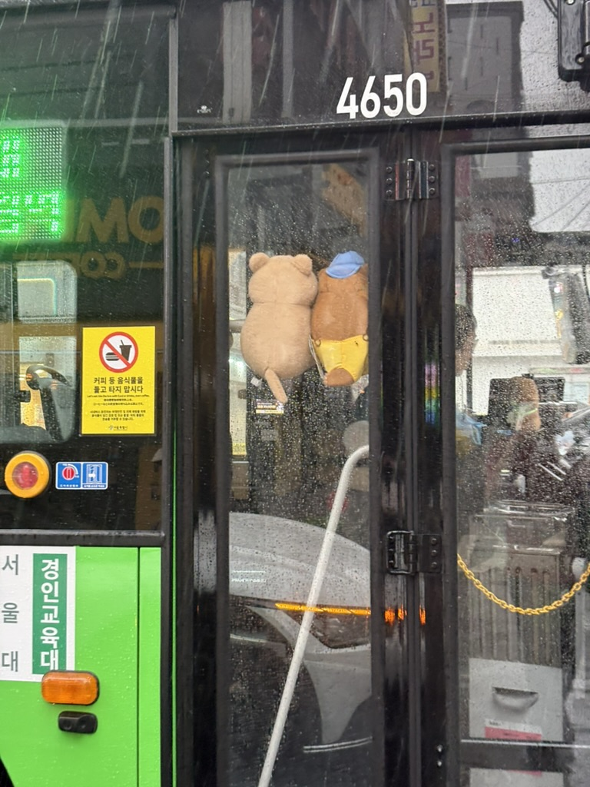

## 춘장이의 여름밤

8월 8일은 세계 고양이의 날이다.

이 날을 기념하여 춘장이에게 츄르를 사다주었다.

츄르를 꺼내는 동안 네 발로 펜스 위에 우뚝 서있는 모습이다. 똘망똘망한 눈을 가진 춘장이.

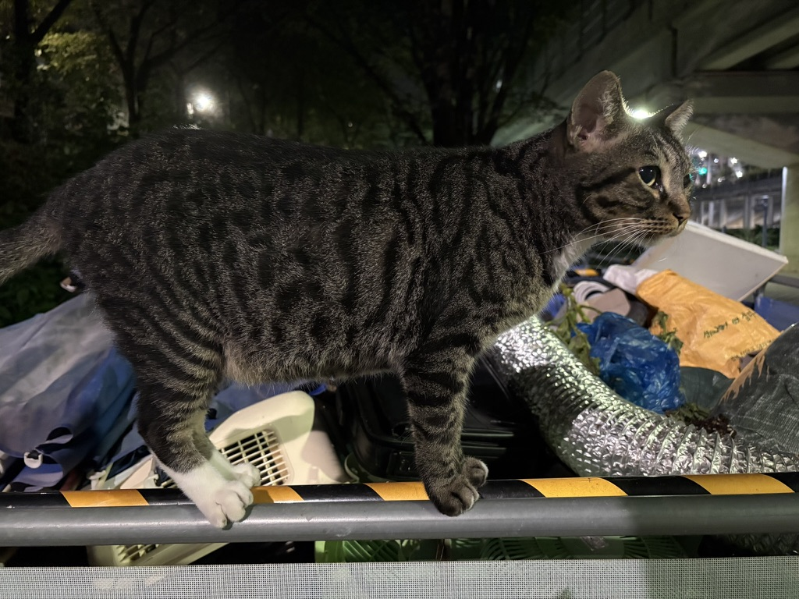

춘장이는 츄르를 먹을 때 마냥 핥아먹지만 않는다. 나름대로 자기만의 먹는 방식이 있다.

이빨로 포장지를 물어뜯은 다음에 삐져 나온 걸 야무지게 핥아먹는다.

과격한 식사 방식에 비해 두 발은 다소곳하다.

<video controls>
    <source src="./images/츄르를씹어먹는춘장이.mov">
</video>

츄르를 말끔히 먹어치우고는 요염하게 원래 있던 자리로 돌아간다.

<video controls>
    <source src="./images/츄르먹고자리로돌아가는춘장이.mov">
</video>

혈당 스파이크가 왔는지 식빵굽는 자세를 취하고는 잠에 드는 춘장이.

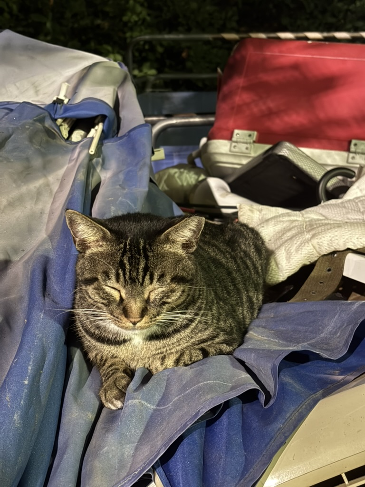

보라매공원 한바퀴 돌고 나서 춘장이가 뭐하고 있는지 살펴봤다.

아예 드러누워서 곤히 잠에 들었다.

<video controls>
    <source src="./images/잠에푹빠져든춘장이.mov">
</video>