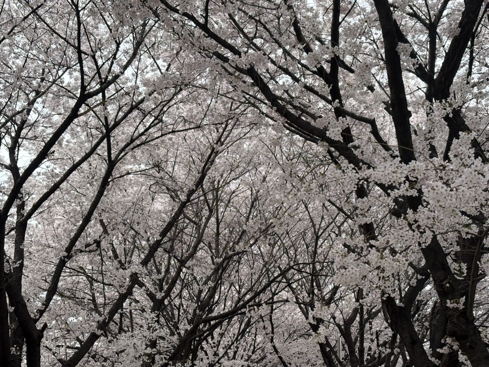
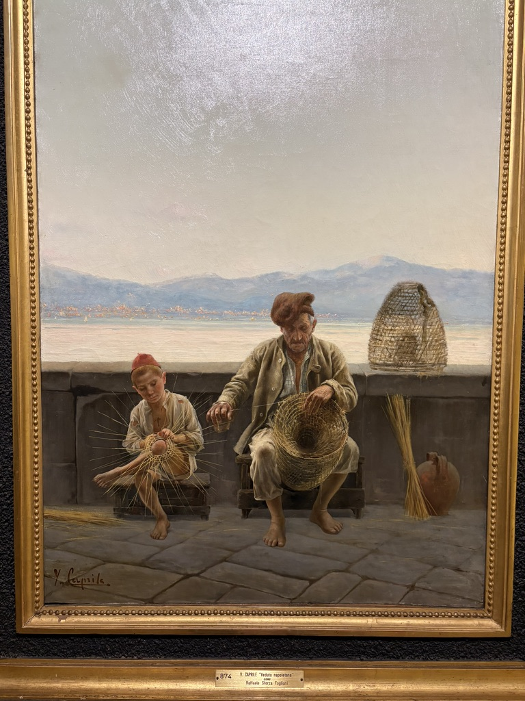
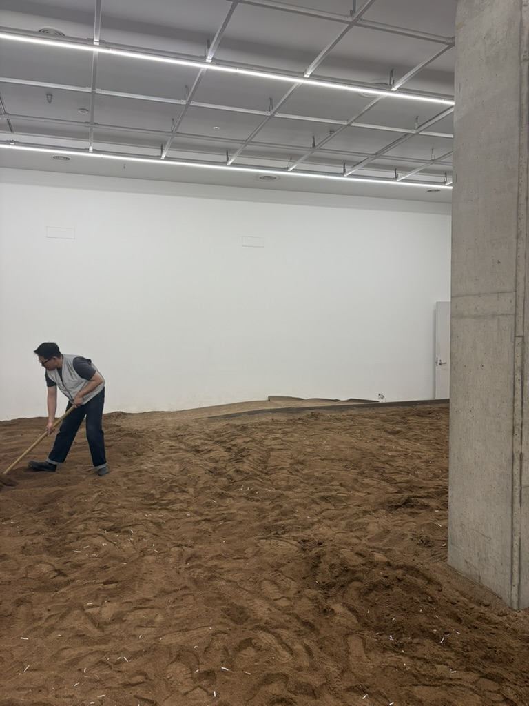
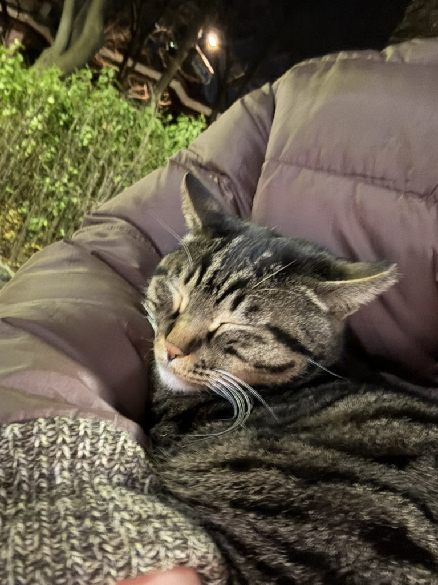

회사 점심 시간마다 가끔 들리는 산책 길이 있는데 이번 주에 가보니까 벚꽃이 활짝 폈다

뭉개뭉개 구름 속에 들어가서 걷는듯한 기분이 든다

산책은 뭐랄까

머리를 맑게 해주고 마음을 평온하게 해준다

날씨가 맑으면 맑은대로, 비오면 비오는대로 그 분위기를 느낄 수 있다

그래서 돌아다닌 걸 좋아한다

새로운 동네를 가거나, 아는 동네라도 조금 변한 모습을 지켜볼 수 있으니까

관찰하는 맛

그래서 그림을 보는 것도 좋아한다

작가가 만든 작품을 주관적인 시선으로 해석하는 게 나름 재미있다

3월달에 클림트와 리치오디의 기적이라는 전시회를 갔엇는데 이런 그림이 있었다

언뜻 보기엔 어린 아이와 아빠나 할아버지가 같이 있는 것 같지만

한 남자의 어린 모습과 늙은 모습을 동시에 보여주는 듯 했다

어린 아이는 이제 바구니를 만들기 시작하고 있고, 옷을 얇게 입고 있으며 새빨간 짧은 모자를 쓰고 있다

반면 오른쪽 남자는 많은 바구니를 만들어왔고 옷도 조금 더 두툼하게, 모자의 색깔은 탁해졌으며 길게 늘어졌다

그래서 어떤 소년이 일평생 바구니를 만들며 늙어간 모습을 보여준 것 같은 느낌이 들었다

물론 아마도 작가는 소년과 할아버지가 바구니를 짜는 모습을 그린 것이겠지만

국립현대미술관에서 하는 소멸의 시학이라는 전시회에도 갔었다

들어가자마자 흙 밭이 있고 땅을 일구는 분이 있었다

이 전시회는 이름 그대로 소멸에 대해 주제를 삼고 있었다

"언젠가 썩어갈 운명을 시인하는 작품, 차라리 무엇도 남기지 않기로 마음먹은 작품, 자신의 분해를 공연히 상연하는 작품을 '삭는 미술'이라는 이름으로 묶어 소개한다"

시간의 흐름에 따라 사라지고, 또 새롭게 나타날 자연과 생명의 원리를 예술적으로 표현한 듯 했다

보라매공원 산책을 자주 하다보니 계절의 오고감을 잘 느낄 수 있다

새싹이 올라오고, 푸르른 잎들이 바람을 따라 흔들리다가

점점 낙엽이 떨어지고 겨울이 되면 황량해진다

그리고 다시 봄이 찾아오면 생기를 되찾는다

우리의 삶도 이 흐름과 유사하다

시작과 끝이 정해져 있다는 것

조금 다른 건 봄은 다시 찾아오지만 인생의 봄은 두 번 다시 돌아오지 않는다는 점이 아닐까

그리고 언제가 봄이었는지 그 때 자기 자신은 모른다는 점도 말이다

3월 초에 춘장이 보러 갔었는데 당연한듯이 자리를 트고 자는 춘장이

요새는 찾아가도 도통 보이질 않는다

얘도 봄이 오니까 데이트하러 갔나보다

