오랜만에 보는 춘장이

아는 채를 해주는 것만으로도 고마울 따름이다.

내가 혼잣말로 뭐라고 하면 무슨 말이라도 대답해야 될 거 같은지 냐옹이라고 말해준다.

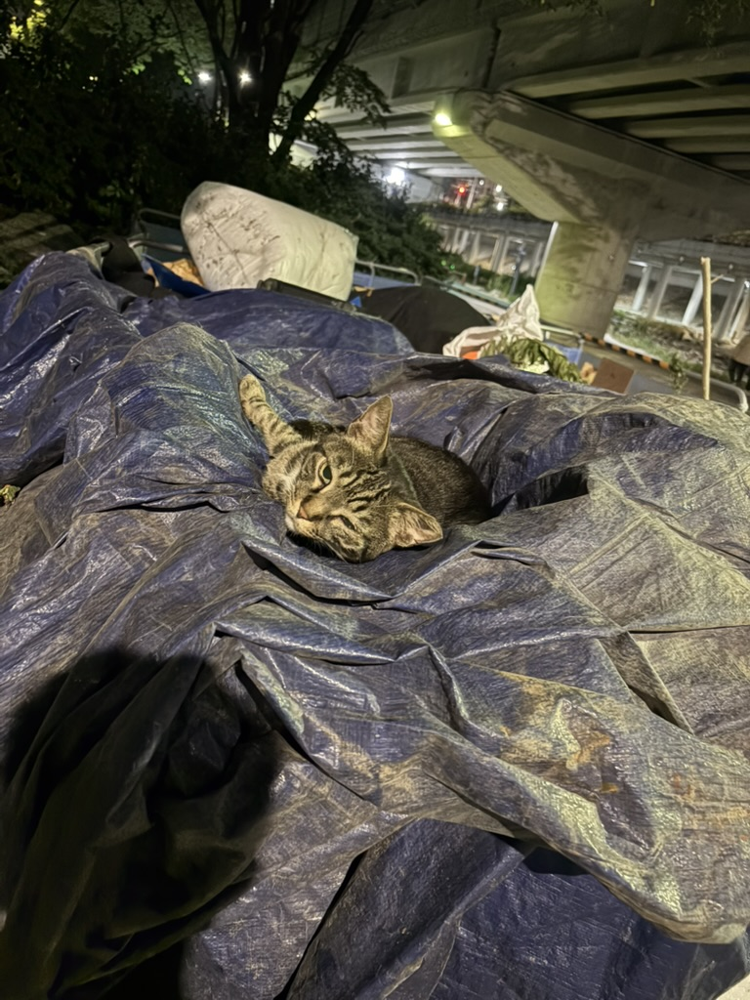

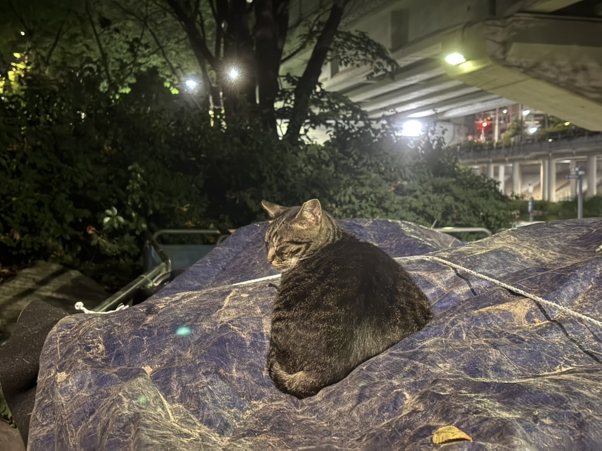

최근에 춘장이에게 친구가 생긴 거 같다.

둘이 같이 하천에 가서 물도 마신다.

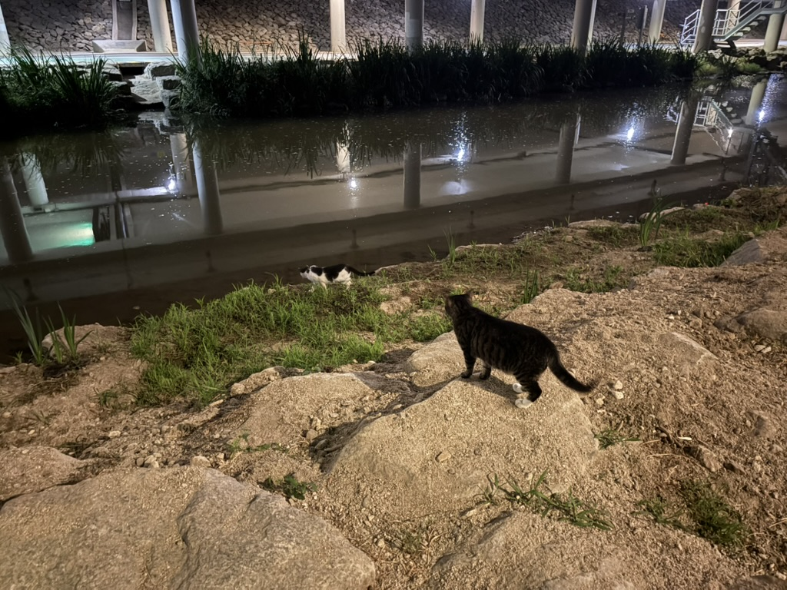

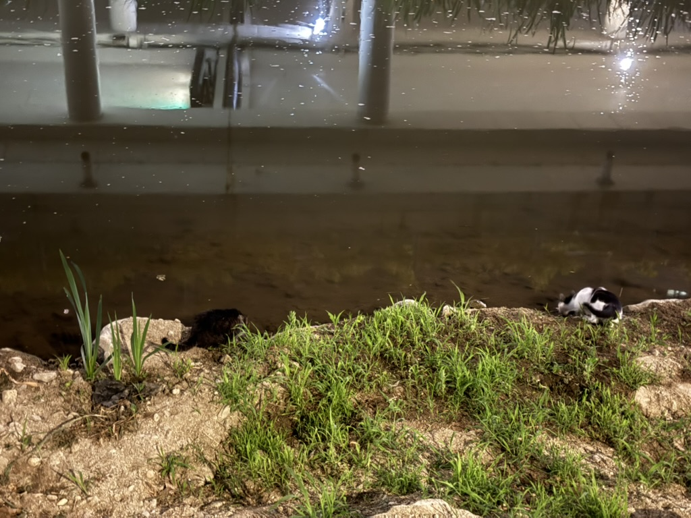

목을 축인 다음 춘장이랑 마주보고 앉아있는데 묘한 신경전이 오가는 거 같더니

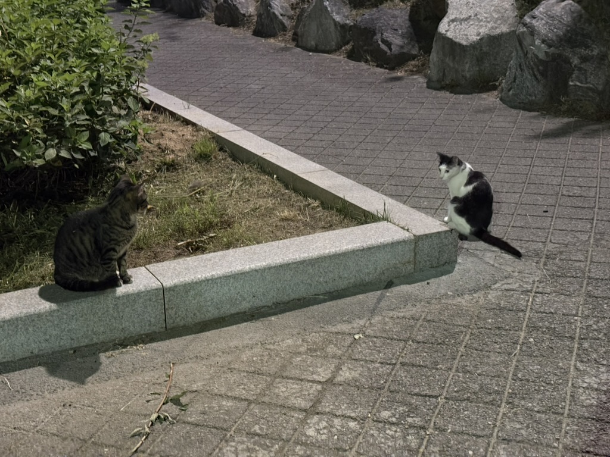

이 녀석들끼리 장난친다.

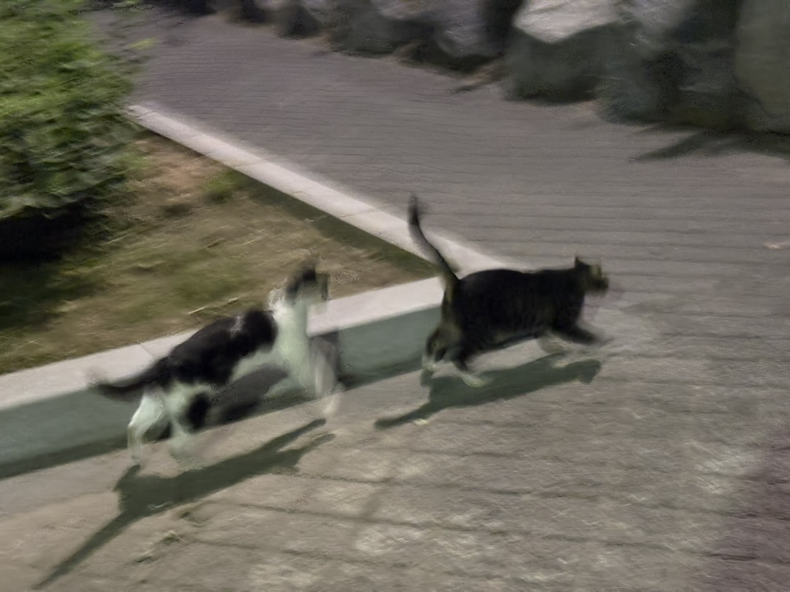

춘장이가 늘 얌전히 있어서 몰랐는데, 녀석 생각보다 움직임이 날렵하다;;

<video controls>
    <source src="./images/친구와_뛰어노는_춘장이.mov">
</video>

이번 달은 다양한 곳에 방문했다.

친구가 서울역 근처에서 면접을 보게 되어서 하룻밤 우리 집에서 묵었는데, 면접 끝나고 안국역에 가서 간단하게 빵을 먹었다.

한 때 인기가 정말 많았던 런던 베이글 뮤지엄

가격이 사악한 만큼 이런저런 재밌는 요소들이 많았다.

설탕을 원하는 만큼 커피에 넣어 먹을 수 있는 점이 가장 마음에 든다.

난 달달한 음식은 별로 안좋아하지만 설탕 자체는 꽤 좋아한다.

어렸을 때 원숭이마냥 싱크대에 올라가서 찬장에 놓인 설탕을 손가락으로 찍어먹었던 기억도 있다.

설탕이 듬뿍들어간 아메리카노를 사진으로 담지 못해 아쉽다.

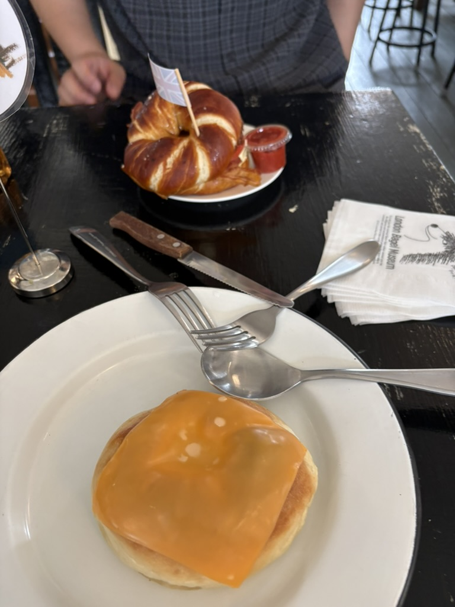

그리고 데미안 허스트 전시회를 다시 한 번 관람했다.

작품 하나하나 직관적이고 독특하다보니 강렬한 인상을 남겨서 또 봐도 보는 즐거움이 있었다.

전시회를 관람한 뒤 근처를 지나가다가 오늘의 집 북촌점 가게가 있길래 들렸는데 너무 마음에 드는 테이블과 의자가 놓여 있었다.

HAY라는 덴마크 라이프스타일 브랜드의 팔리사드라는 제품인데 '죽기 전 언젠가 사지 않을까 싶은 위시리스트'에 추가했다.

'죽기 전 언젠가 사지 않을까 싶은 또 다른 위시리스트'인 전원 주택의 마당에 놓고 아침을 여유롭게 만끽하고 싶다. 둘 중 하나라도 사들이면 좋으련만

이 날은 아마 창덕궁까지 보고 나서 친구와 헤어졌던 거 같다.

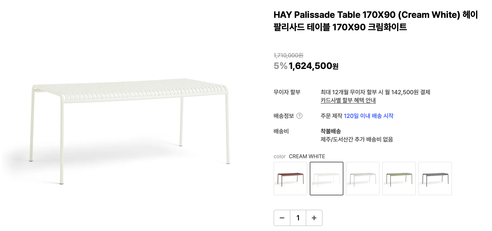

오랜만에 서소문의 서울시립미술관에도 갔었다.

유영국 화가의 '산은 내 안에 있다' 라는 전시를 하고 있었다.

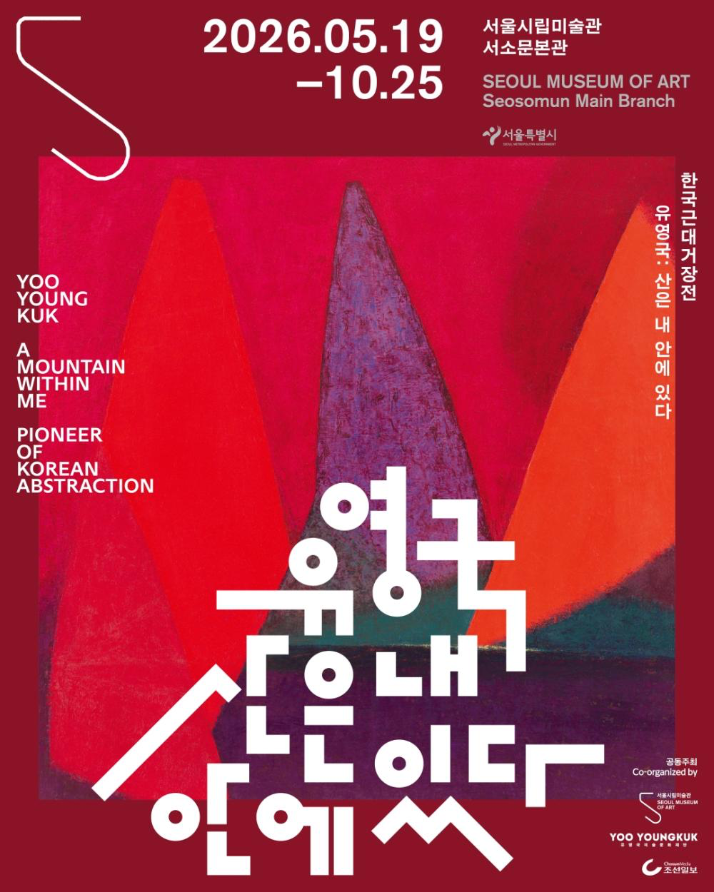

우리나라의 산을 주제로 그린 추상화들을 빛과 그림자, 배경을 활용한 공간에 적절히 배치해놓았다.

'추상'이라는 것은 어떤 사물의 공통된 특성만을 나타내는 개념이다. 복잡성을 줄이는 점에서 일반화와 비슷하다.

프로그래밍에서의 추상화는 현실 세계의 객체에 대한 공통점, 본질적인 성질을 추리는 과정을 말한다.

자동차를 예로 들면, 자동차는 이동 수단에 속한다. 

자동차가 가지는 전진, 후진, 좌회전, 우회전, 시동을 켜고 끄는 특징은 기차, 지하철, 자전거, 보트 등 대부분의 이동 수단에 일반적으로 적용된다.

따라서 이러한 공통점을 한데 묶어 이동 수단이라는 객체로 추상화시킬 수 있다.

예술에서의 추상화도 이와 유사하다. 작가가 바라보았을 때 산들의 공통된 점이나 산이 가지는 아이코닉한 특징을 그림으로써 표현한다.

조금 다른 점은 사실적이기보다 주관적인 표현을 할 수 있다는 것이다.

자연 세계에 대한 표현, 개인적인 심상에 대한 추상적인 표현을 작품에 녹이기 때문에 심오하거나 한 번 보고는 이해하기 어려워질 수 밖에 없다.

그래서 추상이라는 카테고리가 재미있기도 하면서 이해하기 쉽지 않아 몇 개의 작품을 보다 보면 피로해지기도 한다.

작품을 모두 관람하고 나오면서 재미있는 장면을 촬영했다.

<video controls>
    <source src="./images/서울시립미술관.mov">
</video>

우연히 대한제국의 길이라는 테마 코스를 알게 되어 다른 날에 이 코스를 걸었다.

시청역에 내려서 정동길, 덕수궁 근처, 성공회 성당, 고종의 길, 광화문을 차례대로 들렸다.

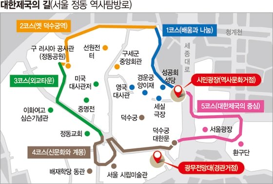

간만에 보는 덕수궁의 석조전과 정원

바로 옆에 있는 국립현대미술관 덕수궁은 공사중이어서 방문하지 못했다.

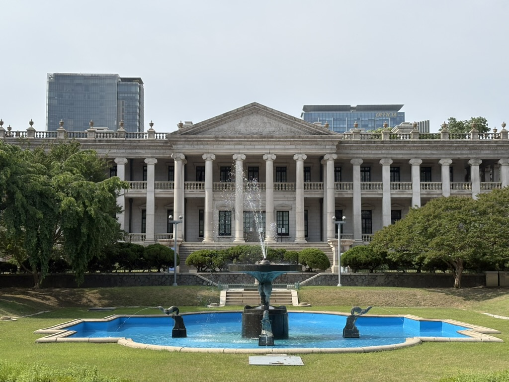

덕수궁을 나와 근처에 있는 국립정동극장 세실에 가면 엘레베이터가 있다.

그 엘레베이터를 타고 옥상을 가면 세실극장 옥상전망대를 갈 수 있다.

전망대 앞에 대한성공회 성당이 있어서 서울 한복판에서 꽤나 이국적인 모습을 볼 수 있다.

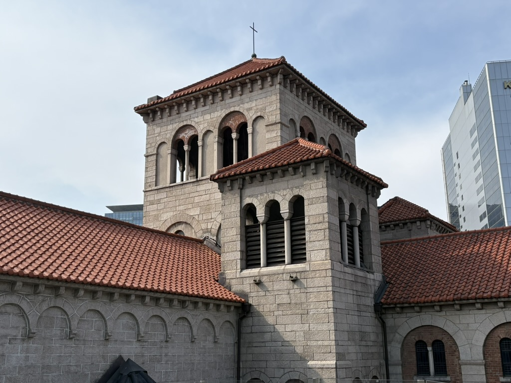

코스를 따라서 이곳저곳 거닐다가 광화문으로 나왔다.

예전에 한 번 갔던 카페

이후에 다시 갈려했다가 어디에 있는지 기억이 안나서 못갔었는데 이제야 찾았네.

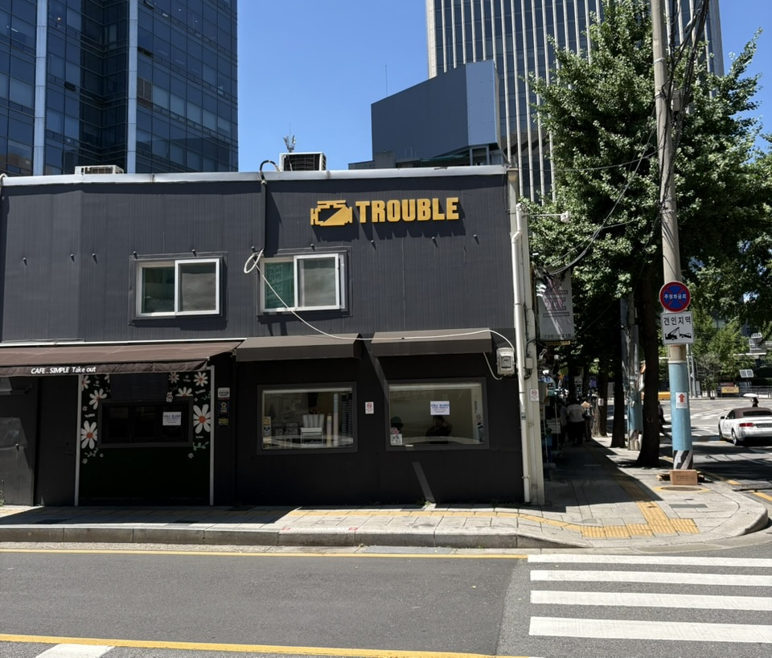

광화문 국밥도 오랜만에 본다.

저녁 준비 중이어서 아무도 없었지만 여전히 장사가 잘 되고 있지 않을까 싶다.

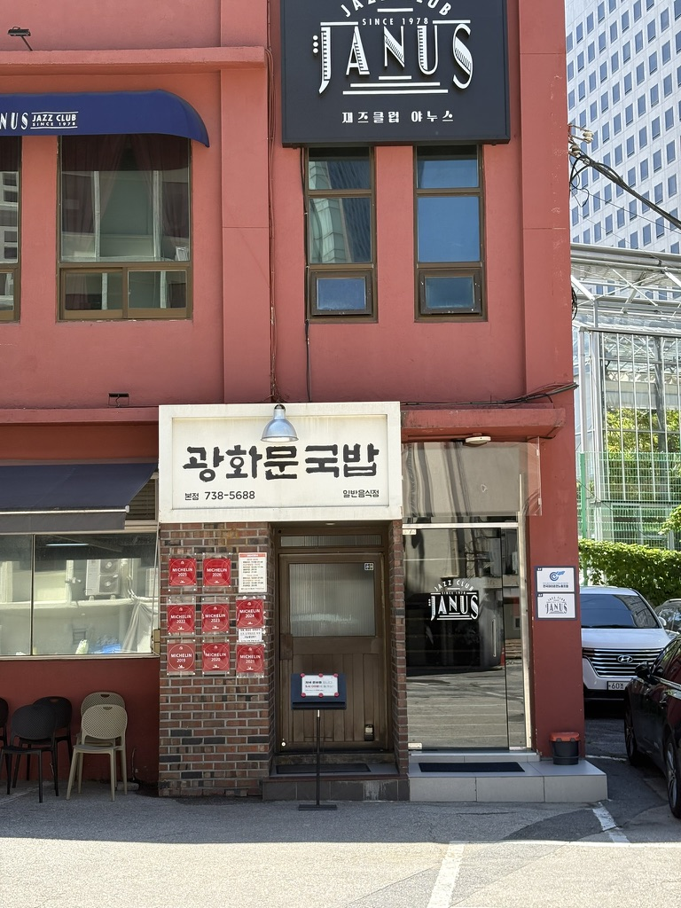

월말에는 외할머니와 함께 본가에 내려갔다.

부산에서 살고 계신데 서울에 볼 일이 있으시다고 올라오셨다.

부산 가시기 전에 우리 집에 들리신다고 하셔서 같이 가기로 했다.

두 모녀가 예산시장에서 함께 잔치국수를 먹고 있는 모습

너무 도둑같이 찍었나

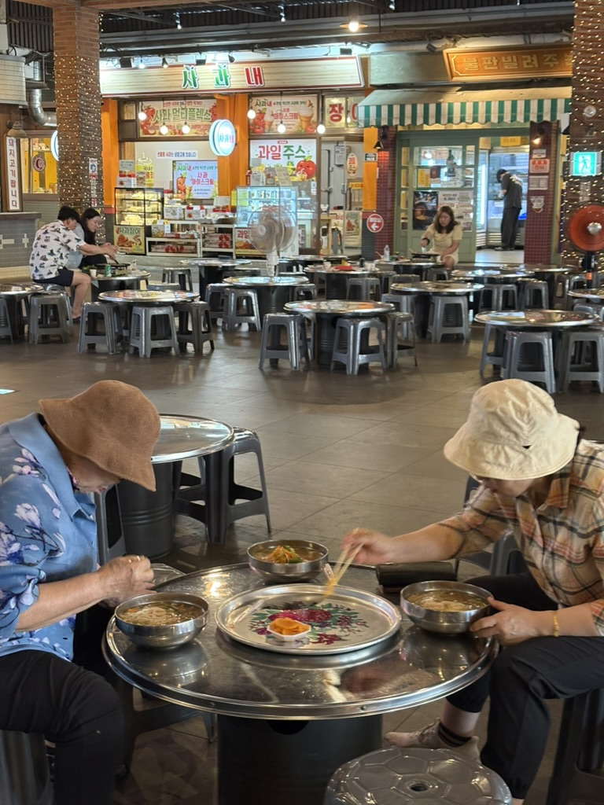

어린이대공원, 아르코미술관, 낙산공원, 카공족 본점, 서울시청 내친구 서울에도 갔었는데 글이 너무 길어지면 재미없으니까 여기까지만 해야겠다.

도림천에 능소화가 폈다. 능소화의 꽃말이 마음에 든다.

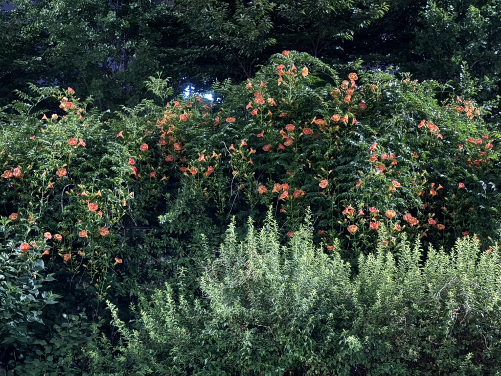

