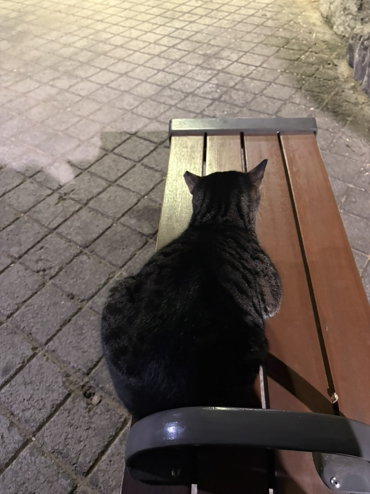
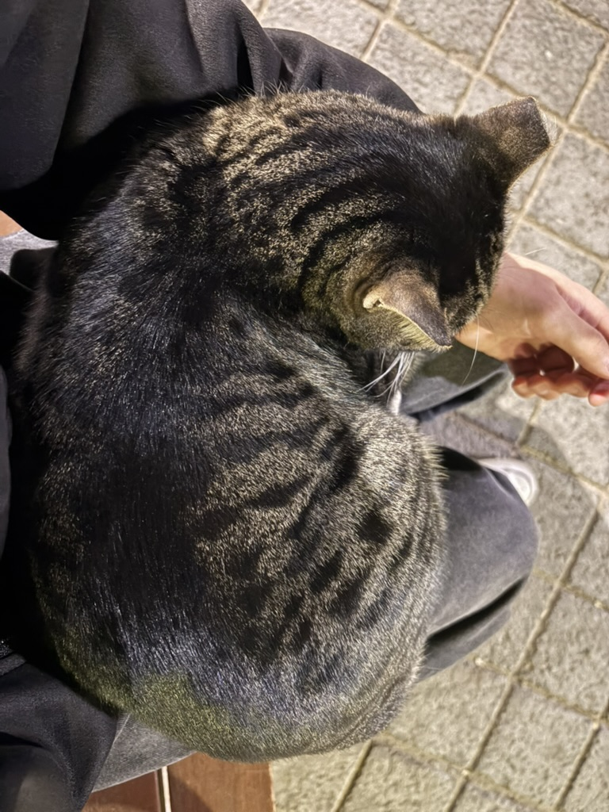
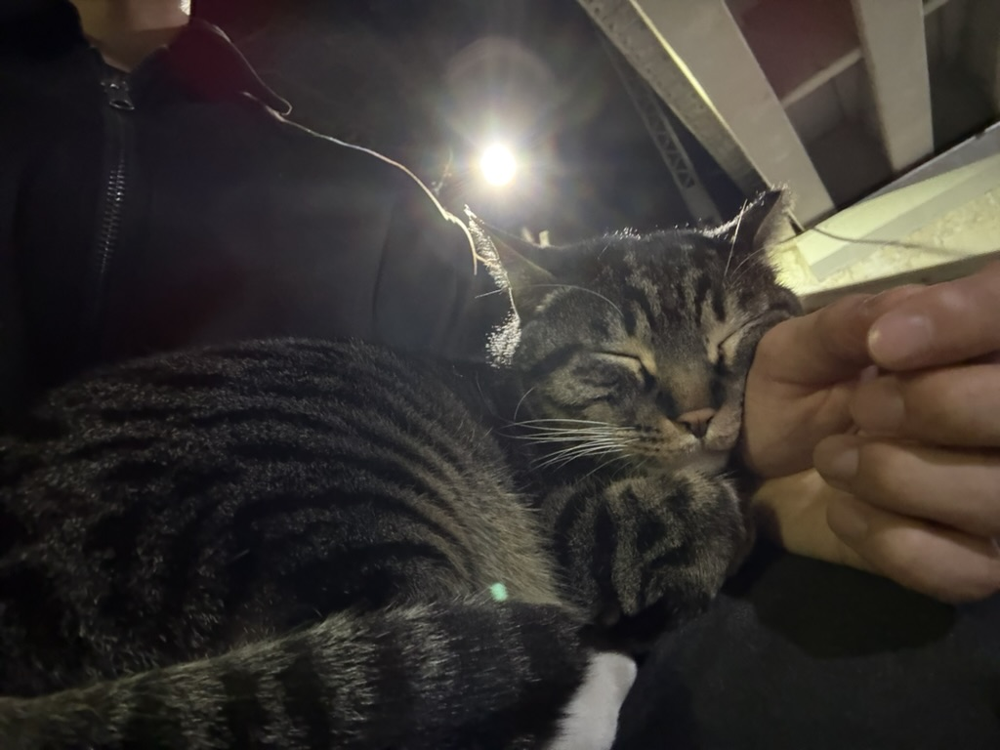
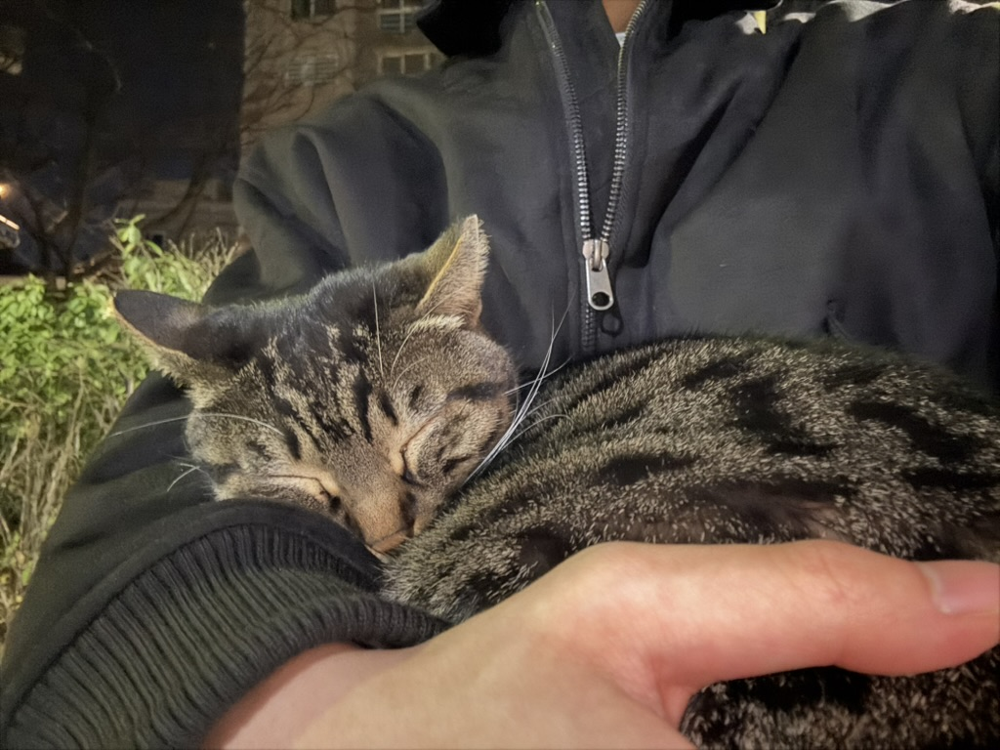

예전엔 나이 먹는게 싫었는데 요새는 빨리 나이들고 싶어졌다

은퇴할 나이쯤 되서 연금이나 투자로 수입을 채우고 여유롭게 알바나 하면서 하루를 보내고 싶은 생각이 든다

직장 다니다보니 시간이 훌쩍 지나가서 아마 눈 깜짝할 사이에 그 나이가 되어있을지도 모르겠다

배워야 할 것들이 산더미고 처리할 업무들이 조금씩 늘어가면서 시간에 점점 쫒기는 듯한 기분이 든다

실무는 내 생각과 많이 달랐다

개발은 전체 업무 중 일부일 뿐이고 문서 작성, 업무 계획, 결과 보고, 사업소 관리, 문의전화 대응 등 개발 외적인 부분들이 훨씬 크다

아직 어설프지만 이러한 부분들을 감내해야 될 수 밖에 없다는 걸 안다

언젠가 능수능란하게 일을 처리하고 칼퇴근한 뒤 다른 재밌는 것들을 하면서 시간을 보내고 싶다

생각보다 나를 위한 자기계발하는게 쉽지 않다

퇴근하고 저녁 먹으면 눈이 저절로 감기고 주말에는 좀 여유롭게 시간을 보내면 금방 월요일이 된다

백수일 때 많은 것들을 해보지 않아서 아쉬운 마음일 뿐이다

이사한 집에서 가족들과 함께 첫 명절을 보냈다

외할머니, 삼촌, 이모도 올라왔는데 사진 좀 찍어둘 걸 한장도 안남겼네

외가댁이랑 있으면 항상 고스톱을 친다

화투에 대해서 하나도 모르지만 구경만 해도 재밌다. 피박이 어쩌구 똥을 쌌네 마네

자취방에만 있다가 오랜만에 넓은 집을 가니까 너무 만족스러워서 그냥 내려가서 살까 생각도 잠깐 했다

이번 달에는 두 개의 전시회를 참관했다

하나는 세종문화회관에서 진행한 르네상스부터 인상주의까지 유명한 화가들의 작품을 보여주는 전시회였고

다른 하나는 알폰스 무하라는 체코인의 단독 전시회였다

그동안 클로드 모네나 르누아르 같이 인상주의 작품만 보다가 르네상스, 바로크, 로코코 시대의 작품을 보니 사뭇 다른 그림체와 성스러움에 경이로웠다

그냥 직접 보고 느껴봐야 된다

나도 그 시대에 유럽에서 살았다면 지금과 달리 신을 믿지 않을 수가 없었을 듯

한 가지 아쉬운 점은 내가 유럽 역사에 대해 잘 알지 못한다는 점이다

예술은 역사와 떼어놓을 수 없는 분야 중 하나인데 배경지식이 없으니 작품을 온전히 즐기지 못하는 느낌이 든다

가끔 밤에 머리도 식힐 겸 도림천에서 산책할 때마다 춘장이가 반겨준다

귀여운 녀석이다

이전에는 모르는 척 할 때도 있었는데 요새는 갈 때마다 꼭 곁으로 온다

옆으로 다가와 앉아있는 춘장이의 모습

심지어 이번에는 내 다리 위로 올라와서 식빵도 구웠다

은근슬쩍 젤리도 만져봤는데 쫀득쫀득했다

이 자식 자세를 조금 바꾸더니 잠까지 잔다 ;;

혹시나 깰까봐 한시간 가까이 움직이지도 못했다

이 날 기분이 좋아서 그랬나 싶어가지고 그 다음 주에도 한 번 찾아갔는데

당연한 듯이 또 다가와서 자리를 트고 잠을 자는 춘장이

공교롭게도 같은 옷을 입고 가서 그런지 나를 금방 알아본 것 같다

책임없는 쾌락이 이런 걸까...

춘장이 같은 고양이를 키우고 싶어졌다

언젠가 한마리 키우는게 꿈이다

아 생각해보니까 이번 달에 용양봉저장공원 대신에 명동대성당을 갔었지

성당을 갔을 때 해를 못봐서 그런가. 이번 달은 약간 꾸리꾸리했다

내일은 하늘공원을 갈 예정이다

일기예보상 흐리다고 나와있어 해를 보지 못할 거 같다

다음 달도 꾸리꾸리할려나

[이번 달 노래](https://youtu.be/gAJkUetwS4Y?si=Xcl4ooXHTBnlKccm)