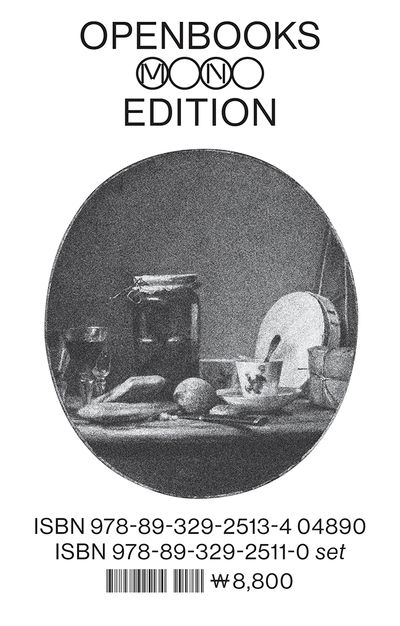

[그리스인 조르바](./니코스%20카잔차키스의%20그리스인%20조르바)를 완독하고 나서 다음으로 어느 책을 읽어볼까 하며 인터넷에서 열린책들 출판사에서 발간한 모노에디션 책들을 구경했다.

대부분은 변신, 노인과 바다, 1984와 같이 한 번쯤 들어본 유명한 책들이었다. 

그러다가 검색 결과에 이 책이 있는 걸 봤는데, 무슨 책인가 하고 클릭해봤다. 볼 생각은 조금도 가지고 있지 않았다.

카라마조프가의 형제들과 허클베리 핀의 모험 중 어느 걸 먼저 볼지 고민하고 있었던 참이었으니까.

책 소개를 건너뛰고 바로 리뷰부터 살펴봤다. 그중 어느 한 서평단의 리뷰가 눈길을 끌었다. 그래서 다음 날 바로 서점에 가서 이 책을 구입했다.

```text
대학생 때 교양 수업으로 들었던 문예 창작 수업에서, 교수님이 이런 말씀을 하신 적이 있다. "글을 쓰는 사람의 삶은 쉽게 무너지지 않는다." 물론, 그 말이 가난해지지 않는다는 뜻은 아니라고 덧붙이셨다. 그럴 수도 있겠다고 생각하면서도, 한편으론 '정말 그럴까?'라는 의문도 들었다. 우리가 글로 쓰는 내용은 대부분 자신이 평소에 품고 있던 생각이나, 주변에서 일어나는 아주 평범하고 일상적인 일들이다.

... 중략

만약 그가 임종 직전이 아니라, 살아가는 동안 꾸준히 자신의 삶을 기록해왔더라면 어땠을까? 자신이 겪은 질병이나, 방황, 사랑과 성취 같은 경험들이 평범함 속의 특별함이자, 삶을 풍성하게 만드는 요소들이라는 것을 더 빨리 깨달았을지도 모른다.

이 책을 읽으면서 교수님의 말을 비로소 이해하게 되었다. 쉽게 무너지지 않는 삶은 평범하다고 치부한 것을 새로운 시각으로 바라보는 일이라는 것을. 기록은 삶을 정리하게 하고, 돌아보게 하며, 더 나은 방향으로 나아가게 만든다. 어쩌면 글을 쓰는 사람의 삶이 쉽게 무너지지 않는 이유는, 자신의 삶을 성찰하며 풀을 먹이듯 단단해지고 있기 때문일 것이다.
```

블로그를 시작하면서 일상에서 보고 듣고 느끼는 것들에 대한 기록과 생각을 남기다 보니 나만의 족적을 만드는 게 얼마나 즐거운 일인지 알게 되었다.

꽃과 나무를 보고 아무 생각 없이 쉽게 지나치거나, 어떤 길이나 장소가 단순히 네이버 지도를 켜고 도착하면 되는 목적지가 되거나, 다른 사람들의 말이나 모습을 단편적으로 바라보고 금방 판단해버리는 일.

이런 것들은 단조롭고 수동적인 삶을 만드는 재미없는 일이라는 것도 알게 되었다. 

어쩌면 내 주변에 있는 것들에 대한 가치를 모르고 있다가 나중에 나이가 들어서야 '이런 걸 왜 이제야 알았을까' 하고 아쉬워했을지도 모른다.

그래서 나와 반대로 임종 직전의 사람이 자신의 삶을 어떻게 썼을까 하는 궁금증이 생겨서 이 책을 읽고 싶었다.

책은 쓰시마 슈지의 인간 실격처럼 이야기의 앞뒤가 주요 내용이 전개되는 부분을 감싸고 있는 액자식 구성이며, 주인공을 조금은 알고 있는 포펠이 주인공을 진찰한 의사에게 회고록을 전달받으면서 주인공의 이야기가 시작된다.

그리고 그리스인 조르바에서 조르바와 크레타섬으로 동행했던 주인공처럼 이름이 소개되지 않는다. 

주인공은 앓고 있던 심장병이 심해져서 자신이 곧 죽을 것이라는 걸 알고 있었다.

그래서 죽음을 대비하기 위해 주변을 정리하기 시작한다. 모든 서류와 편지를 점검하고 정돈했다.

깔끔하게 모든 걸 정리했지만 어딘가 모르게 불안함과 허전함을 느낀다. 자신의 삶 자체를 정리하지 않았다는 걸 알게 된 주인공은 간결하게 그동안의 삶을 기록하기로 한다. 

누가 쳐다보며 놀리기라도 하는 듯 주인공은 조금은 부끄러운 기색을 내비쳤으나 아주 평범한 사람의 삶에 대한 전기를 쓰게 됐다고 하며 이내 진지하게 삶을 되돌아보았다.

그러면서 특별한 경험이 없는 평범한 삶이라고 해서 부끄러울 게 없으며 자신의 삶이 전체적으로 행복했다고 말한다.

전기의 내용은 자신의 삶에 대한 이야기를 풀어낸 뒤, 알게 모르게 숨겨져 있던 자아들이 나타나며 내적 갈등을 빚는 부분과 후반부에 이르러서 이들이 화합하며 결말을 맺는 것으로 작성되었다.

초반에는 시간의 흐름에 따라 유년기부터 청소년기, 대학 시절, 역무원, 결혼 생활, 역장까지의 삶을 다룬다.

모든 생애주기가 한 사람의 인생에서 떨쳐내기 어려울 정도로 중요하겠지만 그중에서 주인공에게 가장 영향을 끼친 시기는 유년기라고 생각한다.

소목장의 아들로 태어난 주인공은 자신이 태어나기 전에 이미 죽은 형이 있었다. 그리고 천성적으로 몸이 약하게 태어난 주인공은 어머니에 의해 극진히 보살펴지게 된다.

어머니는 감성적이고 낭만적인 반면, 아버지는 열심히 일을 하고 정직하여 마을에서 인정받는 강하고 권위 있는 사람이었다. 그리고 성실하고 안정적인 것을 최고로 여겨 주인공이 공부를 잘하고 나중에 출세하기를 바란다.

주인공의 어머니가 주인공을 너무 아끼고 매번 걱정하던 탓에 주인공은 조용하고 내성적인 성격을 갖게 되어 친구들로부터 소외되거나 무시당했다. 

대신 집에 있던 시소를 아이들에게 태워주게 하여 같이 놀거나 교회 축일 날 단상에 있는 아버지 옆에 서서 다른 친구들보다 자신이 위에 있다는 우월함을 잠시나마 느꼈다.

하지만 그 뿐이었다. 시소를 함께 타지 않거나 마을 행사가 없는 대부분의 날의 주인공은 외톨이었다.

서러움과 오기를 느낀 주인공은 학교에서라도 뛰어나야겠다는 다짐을 한다. 

학교를 다니며 자신이 사는 세상이 두 개의 세계로 이루어져 있다는 걸 알게 된다.

하나의 세계는 소목장인 아버지나 열심히 일을 하는 사람들이 사는 평범한 세계, 그리고 다른 하나는 의사나 행정관, 신부님이 속한 높은 계급의 사람들이 사는 보다 높은 세계. 

주인공은 사회에는 위계질서라는 게 있다는 걸 어릴 때 알아차렸다.

친구들에게 소외되어 느끼게 된 외로움과 아버지 덕분에 맛본 우월감, 권력을 가진 사람들의 모습을 보게 되는 경험은 주인공이 우울한 자아와 명예를 탐하는 공격적인 자아를 갖게 만들었다.

또 다른 경험으로는 소목장 근처의 구석에서 나뭇가지로 울타리를 치고 자신만의 작은 세계를 꾸린 것이다. 주인공은 그 곳에서 소소한 행복을 느끼며 이후 외부로부터 단절되어 있는 자신만의 세계를 구축하는 것에 관심을 가진다.

한편으로 마을에서는 철도를 놓는 공사가 한창이었다. 주인공은 그걸 보고 기차나 공사장과 관련된 일을 하고 싶다는 꿈을 막연히 품게 된다. 

조용한 성격의 주인공은 도시에 있는 상급 학교에 진학하고 아주 우수한 성적을 거뒀다. 학창 시절의 아버지는 그를 상당히 자랑스러워했다.

하지만 공부는 어떤 명확한 목표를 이루기 위한 게 아니었다. 시골 아이인 주인공은 도시 친구들로부터 뒤지고 싶지 않아서, 그들과 어울릴 수 없기에 최소한 공부로 이들을 이기기 위함이었다.

주인공은 학교를 다닌 8년의 기간을 거의 아무런 것을 가지지 못하고 지나쳐버리기 위해, 삶의 진정한 자유를 얻기 위해 준비한 젊음의 세월이었다고 한다.

그리고 졸업 시험을 마치고 나서 프라하에 있는 어느 대학의 철학과에 입학한다. 

이 때 기차를 타고 내린 프라하역에서 어디로 가야할지, 무엇을 해야할지 알지 못한 주인공은 곤혹스러움을 느낀다. 모두가 자신을 바라보며 비웃는 듯한 느낌을 받았다고 한다.

짐을 들고 길거리를 걷다가 어떤 하숙집에 들어가게 되고 그곳에서 술주정뱅이 시인과 함께 생활하게 된다.

그와 같이 생활하다가 물들여져서 그전 학창시절의 모범적인 모습은 온데간데 없어지고 술을 즐기고 모든 것을 비관적으로 바라보고 시를 쓰며 방황하게 된다.

프라하역에서 당한 비웃음의 기억을 지우고자 이번에는 자신이 세상을 비웃었다.

결국 다니던 대학을 그만둔다. 그 소식을 들은 아버지가 직접 찾아와 난리를 피운다.

주인공은 집안으로부터 경제적으로 독립하기 위해 철도청 하급 공무원 자리에 구직 원서를 냈는데 운이 좋게 수습직으로 발령받아 프라하에 있는 역무원 생활을 한다.

어릴 때 철도와 관련된 일을 하고 싶다는 꿈을 꿨고, 기차를 타고 도착한 곳에서 창피함을 느꼈던 주인공이 역무원이 된 것이다. 

얼떨결에 유년기의 소망을 이룬 주인공은 이 때부터 본격적으로 철도와 가까운 삶을 살게 된다.

그러다가 피를 토하는 각혈을 하게 되어 산골에 있는 역으로 직장을 옮긴다. 산골에서 근무하며 주인공은 목가적인, 소박하면서 서정적인 생활을 이어간다.

이후 건강을 회복한 그는 다른 역으로 전근하게 되었고 그 역의 역장이 꾸린 세계에 몰입하며 일을 하게 된다.

그리고 역장의 딸과 결혼하여 직장 생활과 결혼 생활을 균형 있게, 주인공이 말하기를 인생에서 가장 행복했던 시간을 보낸다.

장인어른의 도움을 받아 조금 어린 나이에 다른 역의 역장을 맡게 된다.

어린 시절 집 근처에서 울타리로 만든 작은 세계는 이제 기차역이 되었다. 주인공에게 기차역은 소꿉놀이이기도 하지만 열정을 다하는 공간이기도 하다.

자신의 작은 세계에 애정을 쏟느라 아내와의 관계를 뒷전으로 미뤄두고 역을 운영하는 데 더 집중한다. 

시골에서 본 높은 세계의 사람들보다 더 높은 곳에서 사는 귀족들을 맞이하며 권력을 잠깐 맛보기도 한다.

하지만 그 작은 세계는 오래 가지 못했다. 전쟁이 발발하면서 애써 꾸며놓은 역은 보급품과 병력을 수송하는 곳으로 쓰이게 되며 망가지게 된다.

주인공은 자신의 역에 대한 애정을 버리고 종전 이후 새롭게 건국된 공화국의 새 철도청에 들어가 생활을 이어간다.

여기까지가 살아온 삶을 되돌아보는 내용이고, 책 중반부터는 '평범한' 자아가 아닌 다른 자아들이 나타나며 갈등이 시작된다.

출세를 위해서라면 무엇이든 저지를 호전적인 자아가 가장 먼저 등장하여 평범한 자아와 대화한다.

이 자아는 억척스러운 성격을 가지고 있어서 '억척'이라고 표현하며 그동안 평범한 자아가 풀어낸 내용에 있는 숨은 욕구들이 무엇인지 여실히 드러낸다.

처음에는 부정했으나 점차 인정해나갔고, 또 다른 자아 - 소극적이고 안전한 생활만을 추구하는 우울한 자아 - 가 나타난다.

평범한 자아, 호전적 자아, 우울한 자아. 이 세 가지 자아가 자신의 인생을 대부분 차지했던 주요한 자아라고 한다.

이외에도 시인, 낭만주의자, 안빈낙도를 추구하는 경건한 삶을 사는 거지, 전쟁 영웅 등 여러 가지의 자아들이 등장한다. 

각각의 자아는 자신이 놓였던 상황 속에서 무언가를 경험함으로써 만들어졌다. 

해당 자아가 주요 자아로 발현되었을 때 주인공의 삶의 모습이나 욕구로 나타난 것이다.

모든 자아들이 주요 자아로 자리 잡지는 못했으나 분명히 어느 순간과 일정 기간 동안에는 주인공의 모습으로 나타났었다.

그러면서 특정 자아가 어떤 방식으로 자기를 지배하게 될 수 있는지를 가정하면서 삶을 이해하기 시작한다.

이 설명을 통해 자신의 삶을 비춰볼 수 있으며 시간의 경과에 따라 전개되었던 삶이 아니라, '있던 일'과 '있을 수 있었던' 무한히 많은 삶 전체를 한 번에 상상할 수 있다고 한다.

즉, 철도와 관련된 일을 하던 자신이 아닌 다른 운명적인 수많은 가능성 중 하나의 삶을 살 수 있었다는 것을 깨닫게 된다. 

학교를 졸업하고 대학에 진학한 뒤 시인 생활을 하다가 역장을 역임하고 철도청의 공무원 생활을 하던 순간들은, 수많은 가능성 가운데 선택된 일부의 삶이었다는 것을 알게 되며 주인공은 잘 알고 있다고 생각한 자신의 평범한 삶의 흐름에서 위대함과 신비스러움을 느낀다.

또한 이 자아들이 만들어지게 된 경위를 주인공의 기억에 남아 있는 다른 사람들로부터 듣게 된다.

주인공은 주변 인물들과 내적으로 대화를 나누며 낭만주의자는 어머니로부터, 경건한 거지는 할머니로부터, 전쟁 영웅은 할아버지로부터 영향을 받아 만들어지게 된 것을 알게 된다.

그리고 될 수 있었지만 되지는 않은, 가능성으로만 존재했던 형제들(다른 모습의 나 - 모험가, 소목장이, 바람둥이 등)과 대화를 하며 어쩌면 다른 방식으로 살 수도 있었던 삶을 이야기한다.

더 나아가 타인의 모습도 자신과 마찬가지로 수많은 가능성 중 하나가 드러난 것이며 주인공도 이 모습 중 한 가지가 되었을 수 있다는 걸 알게 된다.

그 모습들은 주인공의 내면에도 있고, 타인의 모습 중 어떤 것들은 주인공의 일부를 살았을 수 있다. 

현명하고 말이 없던 신호수 노인, 주정뱅이 대위 등 이들은 모두 주인공의 삶이 될 수도 있었다는 것이다.

따라서 이들을 주의깊게 살펴보면 각각의 모습 속에서 자기 자신의 일부를 보게 될 것이라는 것도 알게 된다.

더 많은 사람들의 모습을 이해하고 받아들일수록 더 많은 나 자신을 발견하게 되며 삶이 완성되어 갈 것이고, 가능성으로만 존재했던 내면의 자아는 다른 사람을 통해 현실에서 나타나게 된다.

타인을 이해하는 삶. 그것이 주인공이 말하는 평범한 인생이었으며 마지막으로 자신과 함께 했던 기억 속 인물들이 가득 타고 있는 상상 속의 기차에 탑승하는 것으로 전기를 마친다.

자서전을 모두 읽은 포펠은 주인공을 돌본 의사에게 책을 돌려주며 자신의 인생은 주인공처럼 평범하지 않았다고 한다.

젊은 의사는 자기 자신의 내면을 뒤져 보는 일에 관심이 없다고 하고, 대신 주인공이 꾸렸던 정원에 가서 나무 갈이를 해줌으로써 고인이 없더라도 모든 게 정상으로 남아 있게 해주었다고 답변하며 소설의 이야기는 끝이 난다.

책을 사게 만든 리뷰를 다시 보니 책이 전하고자 하는 메시지보다는 기록하는 삶에 중점을 뒀었다. 물론 나 역시 이와 관련된 내용을 기대하고 책을 구매한 것이었다.

하지만 책의 내용은 생각했던 것보다 깊고 심오했다. 이해가 되지 않은 부분은 몇 차례나 반복하면서 읽었다.

책은 제목과 달리 평범하지 않았다.

기록하는 삶에 대한 내용은 다른 곳에서 쉽게 접할 수 있다. 어쩌면 기록에 대한 얘기는 이미 어느 정도 알고 있어서 따분하게 들릴 수도 있었을지 모른다.

오히려 기록에 중점을 두기보다는 삶과 타인에 대한 새로운 관점을 배우게 됐다. 

개인은 수많은 무한에 가까운 가능성 중 일부만 나타난 존재이며, 타인으로부터 나의 다른 가능성을 발견할 수 있고 그 모습 중 일부가 내 속에도 있을 수 있다는 것. 이게 더 값진 가르침이었다.

주인공은 '인생은 여러 상이하고 가능한 삶들의 집합이며, 그중에서 단지 하나 또는 몇 개만이 실현되는 반면, 다른 삶들은 단편으로서나 가끔 발현되는지, 또는 전혀 나타나지 않는다. 모든 사람들의 이야기가 그럴 거라고 생각한다'고 했다. 

이 사람은 임종 전 유년기부터 지금까지의 자신을 되돌아보았기에 그동안 살아왔던 삶의 총체적인 집합을 살펴볼 수 있었다.

나는 아직 그럴 수가 없다. 가는 데에는 순서가 없다지만 만약 주인공처럼 일흔이 조금 안 되는 나이까지 산다고 가정하면 이 글을 쓰는 지금까지 살아온 날들보다 앞으로 살아갈 날들이 더 많이 남았다.

그럼에도 현재까지 경험하거나 나타났던 모습을 돌이켜보면 여러 가능성 중 일부만 드러낸 존재였다.

이제 와서 보니 아 그런 길을 걸었을 수도 있었겠다하며 기억을 되짚었다. 그때는 몰랐지만 그건 내가 다른 모습으로 살아갈 기회였다.

학교를 다니며, 군대에서 통신 반장님과 작업을 하며, 식당 알바를 하며, 큰 고모부의 일을 도와드리며, 스타벅스와 전 직장에서 일을 하며, 친구나 연인과 함께 하며 다양한 모습을 바라보기도 했다.

이건 이 책을 읽기 전부터 자연스럽게 하던 습관이었다. 누구라도 과거를 생각하는 건 당연하니까 말이다.

대신 그 모습 중 일부가 나의 내면에 있을 거라는 책의 교훈은 그동안 타인으로부터 반면교사를 삼거나 본받기만 하려는 나의 생각을 확장시켰다.

동시에 내게도 그런 모습이 있지만 나타나지 않은 이유는 무엇일까하며 고민하게끔 만들어줬다.

그리고 책의 주인공처럼 짧지 않은 인생을 산다면 앞으로 내가 걸어갈 길과 나타날 모습은 어떤 것일까 하는 의문도 남겼다.

언젠가는 나도 나의 전기를 쓰게 될 날이 오지 않을까. 그때가 되어서야 나에게 평범한 인생이 무엇일지 알게 될지도 모른다.

