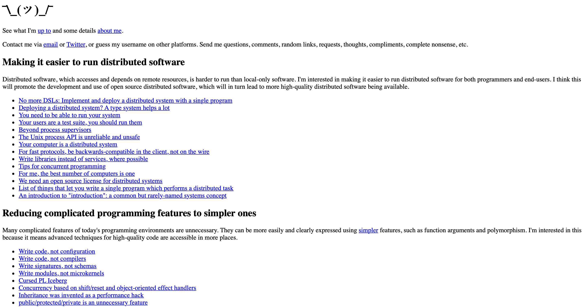
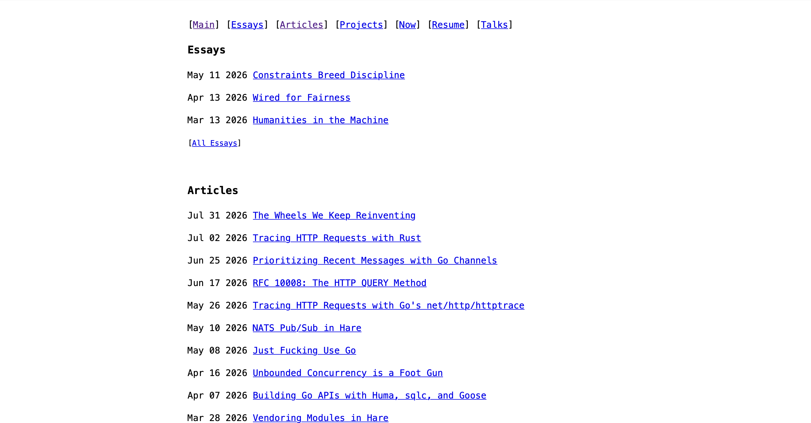
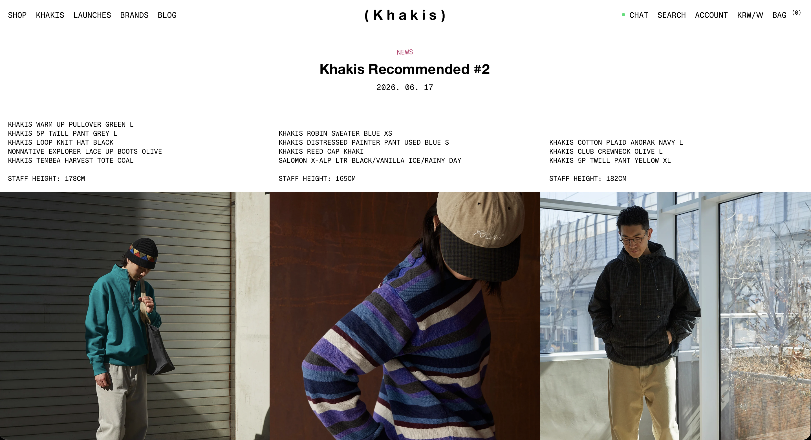

좋아하는 것들을 모아두거나 기록하는 공간

시작일시: 2025-07-01T04:42:20Z

상태: 진행 중

주소: <a href="https://hansanhha.github.io" target="_blank" rel="noopener noreferrer">https://hansanhha.github.io</a>

업데이트: <span id="blog-update-info"></span>

---

메뉴에 대한 소개

검색

제목, 내용 또는 키워드를 기반으로 블로그 내의 게시글들을 검색할 수 있는 기능이다. Jekyll의 Liquid 템플릿과 빌드 과정을 이용하여 검색용 파일을 만든 후 자바스크립트로 페치하고 필터링한 결과를 표시한다.

프로젝트

관심있는 주제, 만들고 싶은 것 또는 주기적으로 반복하는 공통된 행동을 프로젝트로 정의하고 운영한다. 단순한 생각이나 행동에 이름과 목적을 덧붙이고 실행과 기록을 통해 하나의 의미 있는 단위로 만들어간다. 프로젝트는 생각에서 실행으로 이어지고, 그 과정과 결과가 축적되는 선형적인 흐름을 가지며 흩어진 행위에 견고한 의미를 부여한다.

프로젝트를 설명하는 양식은 다음과 같다.

시작일시는 ISO-8601 UTC 형식으로 표시하고, 상태는 진행 중/일시 중단/종료 중 하나로 표시한다. 일시 중단과 종료 상태인 경우엔 그 시점을 명시한다.

주소는 인터넷 웹 주소 또는 실제 공간 주소를 입력한다.

업데이트는 깃허브 서버에 푸시된 마지막 커밋 일시를 표시하여 가장 최근의 블로그 업데이트 시점을 나타낸다. 다른 프로젝트의 소개글에서는 제외된다.

```text
간단한 소개

시작일시

상태

주소

업데이트

---

프로젝트에 대한 내용
```

프로그래밍

프로그래밍과 컴퓨터 과학에 대해 학습한 개념이나 직접 경험한 내용을 작성한다. 단순한 사용법부터 특정 도구에 대한 원리와 동작 방식까지 폭넓게 다루며, 구현한 것과 실험한 내용을 남기고자 한다.

일상

일상 속에서 경험한 것들과 떠오르는 생각들을 기록하는 공간이다. 주로 월초 또는 월말에 업로드한다.

아카이브

시간이 지나며 모아온 관심사와 자료들을 한 곳에 담아둔 곳으로 기억에 남기고 싶은 것들을 자료의 형태와 주제별로 구성해놓았다.

해맞이

매월 초, 새로운 한 달의 시작을 맞이하기 위해 해를 보러 가는 작은 프로젝트다. 지난 시간을 돌아보며 앞으로의 시간을 생각한다. [해맞이에 대한 설명](https://hansanhha.github.io/projects/sunrise)

---

인터페이스에 대한 소개

콘텐츠를 감싸고 있는 상단과 하단의 영역은 고정적으로 유지되며 콘텐츠의 내용만 동적으로 변경된다. 유틸리티의 글꼴 크기 조절 기능은 콘텐츠 영역의 글꼴 크기에만 영향을 미친다.

콘텐츠의 종류는 크게 네 가지로 분류된다. 인덱스 페이지와 게시글 페이지는 현재 페이지의 경로를 나타내는데, 링크를 통해 특정 페이지로 이동할 수 있다.

```text
홈 버튼과 검색창

유틸리티: 블로그에 대한 정보와 기능을 담은 구역 (접속일, 접속 환경, 글꼴 크기, 배경 색상, 선호하는 언어 등)

메뉴: 블로그 메뉴를 표시하는 구역 (프로젝트, 프로그래밍, 일상, 아카이브, 해맞이)

---

콘텐츠
├─ 홈페이지: 가장 최근에 작성한 글 10개를 표시하는 페이지. 한글과 영문에 따라 다르게 표시될 수 있다
├─ 인덱스: 특정 카테고리에 속한 글들을 작성일 기준 내림차순으로 정렬하는 페이지. '/카테고리/' 형태로 페이지의 계층을 표시하며 계층의 링크를 클릭하여 이동할 수 있다. 선택적으로 제목이 나타난다.
├─ 게시글: 선택한 글의 내용을 나타내는 페이지. 현재 페이지에 대한 경로를 '/카테고리/페이지 | 작성일' 형태로 표시하며 페이지의 이름과 작성일은 링크가 아닌 일반 문자열로 취급된다. 선택적으로 제목이 나타난다.
└─ 유틸리티: 검색 결과나 페이지 찾을 수 없음을 표시하는 페이지
---

기타 정보: 블로그에 표시할 공통된 정보나 외부 링크
```

시맨틱 태그 미사용, 8px 간격 시스템 사용

글꼴: -apple-system, BlinkMacSystemFont, "Segoe UI", Roboto, Helvetica, Arial, sans-serif

기본 글꼴 크기: 16px

---

영감을 준 페이지

<a href="https://catern.com" target="_blank" rel="noopener noreferrer">catern</a> 

위에서 아래로 자연스럽게 이어지는 수직적인 흐름과 불필요한 장식을 덜어낸 투박하고 직관적인 인터페이스를 참고하였다.



<a href="https://blainsmith.com" target="_blank" rel="noopener noreferrer">blainsmith</a> 

상단 메뉴 나열 방법과 게시글의 '일자 - 제목' 표시 형태를 참고하였다.



<a href="https://khakis2020.com/blog" target="_blank" rel="noopener noreferrer">Khakis</a>  

이미지들을 가로로 표시한 디자인으로부터 영감을 받아 아카이브에 모아둔 이미지들을 가로로 스크롤할 수 있도록 구현하였다.



---

로드맵

✓ 다크/라이트 모드

✓ 이미지 설명

✓ 검색 기능

✓ 디자인 전면 개편

✓ 게시글 한글/영문 전환

아카이브 메뉴 개편

기본 레이아웃의 디자인 시스템 설정

소스 코드 정리

---

아카이브

<a rel="noopener noreferrer" target="_blank" href="https://hansanhha.github.io/legacy">디자인 개편 이전 블로그</a>
