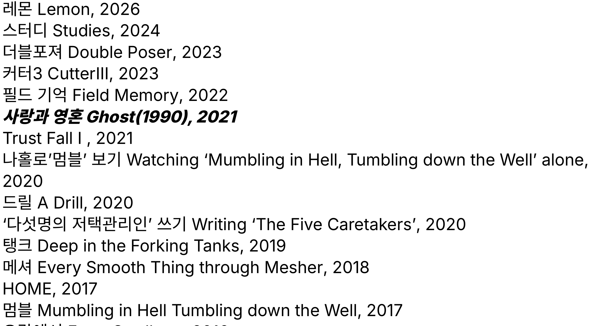

A place to collect and record the things I like.

Start Date: <span id="project-start-date">2025-07-01T04:42:20Z</span>

Status: In Progress

Address: <a href="https://hansanhha.github.io" target="_blank" rel="noopener noreferrer">https://hansanhha.github.io</a>

Updated: <span id="blog-update-info"></span>

---

I created this blog as a place to leave behind thoughts, images, and various other things.

Although the start date is set to July 1, 2025, the blog actually began sometime before then.

Since I could no longer determine the exact date when I first started it, I use the creation date of the GitHub repository that I recreated after deleting the original one.

Every post on the blog belongs to one of five categories: Projects, Programming, Daily Life, Archive, or Sunrise.

Categories serve both as folders that contain posts and as indexes. They are used to organize posts and can also have subcategories.

The purpose and character of each category are as follows.

**Projects**

I define and manage things I am interested in, want to create, or regularly do as projects. By giving simple thoughts or actions a name and a purpose, then developing them through execution and documentation, I turn them into meaningful units.

A project moves from thought to action, accumulating its process and results along the way. This linear flow gives a lasting sense of meaning to otherwise scattered activities.

The blog itself is also a project.

The format used to describe a project is as follows.

```text
A brief introduction

Start Date

Status

Address

Updated

--- Separator

Details about the project
```

The start date includes the year, month, day, day of the week, and time. The status is indicated as one of three states: In Progress, Paused, or Completed. For paused and completed projects, the date of the status change is also specified.

Paused means that I may return to the project someday, while Completed means that I do not intend to continue it.

Address refers to either a web address or a physical location.

Updated shows the date and time of the latest commit pushed to the GitHub server, indicating when the blog was most recently updated. This information is omitted from the introductions of other projects.

**Programming**

This section contains concepts I have learned about programming and computer science, as well as things I have experienced firsthand.

It covers a wide range of topics, from basic usage to the underlying principles and mechanisms of specific tools. I also document things I have implemented and experiments I have conducted.

**Daily Life**

A space for recording things I experience in everyday life and thoughts that come to mind. Posts are usually uploaded at the beginning or end of each month.

**Archive**

A collection of interests and resources I have gathered over time, organized by format and subject in one place. It is where I keep things that I want to remember.

**Sunrise**

A small project where I go out to watch the sunrise at the beginning of each month to welcome a new month.

I look back on the time that has passed and think about the time ahead. [Introduction to Sunrise](https://hansanhha.github.io/projects/sunrise)

---

About the "Simple" Interface

The blog's structure and posts are presented in a simple and intuitive way.

```text
Title

Utilities (interface, background color, preferred language, link to index page)

Content
├─ Home: A page listing all posts on the blog, sorted in descending order by date.
├─ Index: A page listing posts belonging to a specific category, sorted in descending order by date.
├─ Post: A page displaying the contents of the selected post.
└─ Utilities: Pages used to display errors or indicate that a page could not be found.
```

The title represents the title of the current page. On the home page, it is displayed as "한산하 HANSANHHA."

Posts listed on the home page are sorted in descending order by their most recently modified date. Posts that have never been modified are sorted by their original publication date.

The category of each post is displayed next to its title. If the post belongs to a subcategory, the subcategory is displayed instead.

The "Go to Index" button takes you to the index page of the current page's parent category.

The common design across all interfaces follows these principles:

- An 8px spacing system
- Font: -apple-system, BlinkMacSystemFont, "Segoe UI", Roboto, Helvetica, Arial, sans-serif
- Base font size: 16px
- Line height: 24px

---

About the "Verbose" Interface

The verbose interface organizes information about the blog, its categories, and its posts in a structured way.

```text
Home button and search bar

Utilities: A section containing information and features related to the blog
           (access environment, interface, font size, background color,
           preferred language, etc.)

Menu: A section displaying the blog's main categories
      (Projects, Programming, Daily Life, Archive, Sunrise)

Content
├─ Home: A page displaying the 10 most recently written posts.
│        The posts may differ depending on whether the page is in Korean or English.
├─ Index: A page listing posts belonging to a specific category in descending
│         order by date. The page hierarchy is displayed in the form
│         "/category/", and each level can be accessed by clicking its link.
│         The title may optionally be displayed.
├─ Post: A page displaying the contents of the selected post.
│        The current page's path is displayed in the form
│        "/category/page | date". The page name and date are treated as
│        plain text rather than links. The title may optionally be displayed.
└─ Utilities: Pages used to display search results or indicate that a page
              could not be found.

Other Information: Common information or external links displayed on the blog
```

The areas above and below the content remain fixed, while only the content itself changes dynamically.

The blog supports searching based on post titles and content. Changing the font size affects only the font size within the content area.

On index and post pages, the current page's path is displayed hierarchically. Each level can be accessed through its corresponding link.

Some posts in the Archive and Sunrise categories can also be navigated sequentially using the "Previous Page" and "Next Page" buttons.

---

Pages That Inspired Me

<a href="https://catern.com" target="_blank" rel="noopener noreferrer">catern</a>

I took inspiration from its vertical flow, which naturally leads from top to bottom, and its rough yet intuitive interface with unnecessary decoration stripped away.


<a href="https://blainsmith.com" target="_blank" rel="noopener noreferrer">blainsmith</a>

I referenced the way the top menu is arranged and the way posts are displayed in an "date - title" format. (The blog now displays titles only.)


<a href="https://khakis2020.com/blog" target="_blank" rel="noopener noreferrer">Khakis</a>

Inspired by its horizontal image layout, I implemented horizontal scrolling for images collected in the Archive.


<a href="http://kimheecheon.com/works/" target="_blank" rel="noopener noreferrer">Kim Heecheon</a>

Inspired by its simple presentation of links, I added the "Simple" interface.



---

Major Changes

☑︎ Dark/Light Mode

☑︎ Image Descriptions

☑︎ Search

☑︎ Complete Design Overhaul

☑︎ Korean/English Post Switching

☑︎ Added the "Simple" Interface

◻︎ Redesign the Archive Menu

◻︎ Establish a Design System for the Default Layout

◻︎ Clean Up the Source Code

---

Archive

<a rel="noopener noreferrer" target="_blank" href="https://hansanhha.github.io/legacy">Legacy Blog</a>