글의 순서
- [안국역](#안국역)
- [창덕궁과 가까운 곳](#창덕궁과-가까운-곳)
- [경복궁과 가까운 곳](#경복궁과-가까운-곳)
- [끝으로](#끝으로)

오늘은 북촌을 간다. 북촌은 한옥마을 관광지와 미술관이 모여 있는 동네로 경복궁 오른쪽, 창덕궁 왼쪽 사이에 위치해 있다. 

서촌이 경복궁의 서쪽에 있어서 서촌이라고 불리는 반면 정확히 그 반대편에 있는 마을은 이상하게도 동촌이라고 부르지 않는다.

실제로 조선시대 때는 동촌이 있었다고 한다. 동촌, 서촌, 남촌, 북촌이 모두 있었는데 동촌은 낙산 일대를 일컫는 지명이었다.

북촌은 창덕궁과 경복궁 사이의 마을을 종로와 청계천의 위쪽이라는 의미로 부르게 되면서 그 이름을 갖게 되었다.

어느 곳은 경복궁을 기준으로 하고, 어느 곳은 다른 곳을 기준으로 삼고 있어서 직관적이지 않지만 북촌한옥마을 대신 동촌한옥마을이었다면 또 그 나름대로 이상했을 것 같기도 하고.

산책 경로는 다음과 같다.

1. 안국역 3번 출구 -> 북촌문화센터(계동길) -> 사람사는세상 노무현센터(창덕궁길) -> 종로구립 고희동미술관
2. 백인제 가옥 -> 정독도서관 -> 북촌동양문화박물관 -> 가회동 31번지 -> 국립현대미술관 서울 -> 금호미술관 -> 열린송현 녹지광장

[북촌경로](./data/북촌_260819.gpx) 파일을 다운받아 네이버지도 앱의 GPX 기능에 업로드하면 도보 경로를 확인할 수 있다. (다만 지도상으로 지원되지 않는 구간이 있어서 실제 경로와 다른 부분이 조금 있다)

산책하면서 들을 노래로 Inner Wave의 Apoptosis 앨범을 골랐다. One in a Million, June, Take 3, Bones 등 사이키델릭이나 신스웨이브 사운드를 좋아한다면 이 앨범의 수록곡들은 모두 들어볼 만하다.

<a href="https://open.spotify.com/album/5Kl37pew4uRgdOjttuQHSN?si=PcSTwpmQTtWjixzH6BRyzw" rel="noopener noreferrer" target="_blank">스포티파이</a> <a href="https://music.apple.com/kr/album/apoptosis/1820521335" rel="noopener noreferrer" target="_blank">애플 뮤직</a> <a href="https://youtu.be/DTof1QBEJ_U?si=uer6F0Cxodd2mvbE" rel="noopener noreferrer" target="_blank">유튜브 뮤직</a> 

## 안국역

경로: **안국역 3번 출구** -> 북촌문화센터(계동길) -> 사람사는세상 노무현센터(창덕궁길) -> 종로구립 고희동미술관

안국역은 3호선 경복궁역 바로 다음 역으로, 신림역에서 출발한다면 을지로 3가역 또는 교대역에서 한 번 갈아타서 50분 내외로 도착할 수 있다.

역에 도착하면 [경복궁역](./seochon#경복궁역)처럼 일반적인 지하철역과는 사뭇 다른 공간 디자인을 볼 수 있다.

이 곳은 3·1 운동 100주년(1919년 3월 1일 ~ 2019년 3월 1일)을 기념하여 서울시에서 독립운동 테마역으로 지정했다.

승강장에서 대합실로 올라가는 길에는 100년 계단이 있다. 계단 벽면과 천장에 기미독립선언서에 나오는 자음과 모음이 하늘로 올라가 빛을 발하는 형상의 디자인을 담았다.

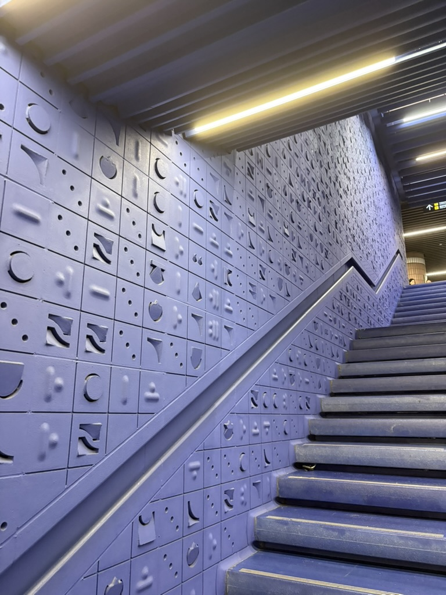

100년 계단을 걸어 올라가면 왼쪽에는 서울 독립운동 타임라인이 있고 오른쪽에는 우리나라의 임시헌장부터 제헌헌장을 볼 수 있는 100년 헌법과 3·1 운동 청색지도가 있다.

3·1 운동은 현대 대한민국 역사의 시작점이라고 볼 수 있다. 이 운동을 계기로 대한민국 임시정부가 수립되었으며 임시정부가 상하이에서 공포한 헌정 문서에서 최초로 대한민국이라는 명칭을 공식적으로 사용하고 민주공화제임을 명시했다.

이후 1948년 7월 17일에 공포된 제헌헌법에서 3·1 운동의 독립 정신과 임시정부의 법통을 계승한다는 것을 명시하여 역사적 정통성을 갖추었고, 이것이 100년이 훌쩍 지난 지금까지 이어져 오고 있다.

안국역이 3·1 운동의 주요 장소들을 잇는 거점이기에 서울시에서 독립운동 테마역으로 조성한 듯하다.

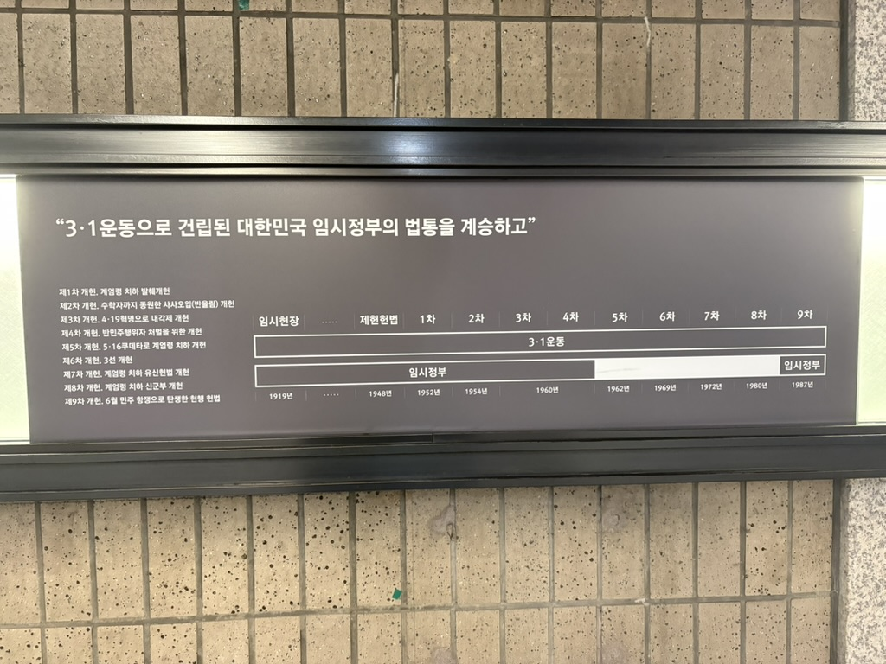

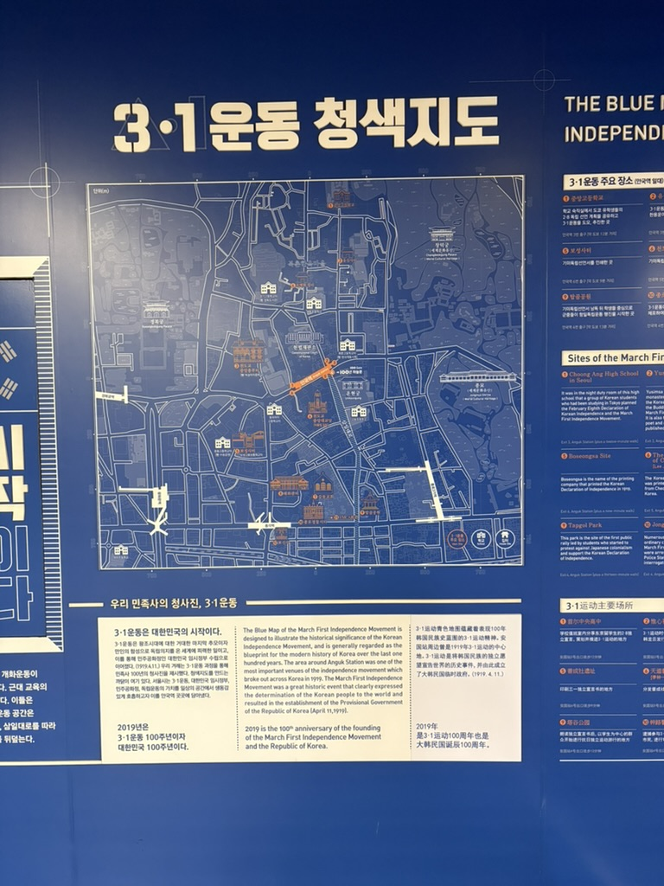

헌법사와 3·1 운동 청색지도를 보고 난 뒤 3번 출구 쪽으로 가는 길에는 800명의 얼굴이 모여 있는 100년 기둥과 100년 충전소 공간이 있다.

이 기둥은 100초에 한 번씩 새로 작동하여 독립운동에 참여한 사람들을 밝게 비춰준다. 100년 충전소에는 28개의 플러그를 꽂을 수 있다.

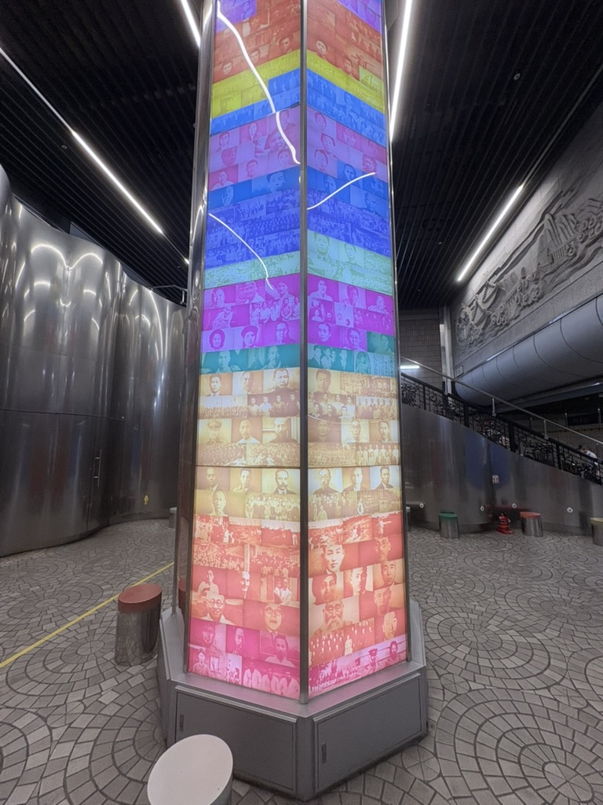

오랜만에 잠깐이나마 한국사를 되돌아보게 된 시간이었다. 우리나라만큼 비극적이면서 극적인 역사를 가진 나라가 또 있을까하는 생각이 들었다.

경로: 안국역 3번 출구 -> **북촌문화센터(계동길)** -> 사람사는세상 노무현센터(창덕궁길) -> 종로구립 고희동미술관

3번 출구에서 나와 앞으로 걸으면 현대건설 본사가 있고 카페 어니언이 있는 계동길이 나온다.

계동길을 따라 조금 걸으면 북촌문화센터가 보인다.

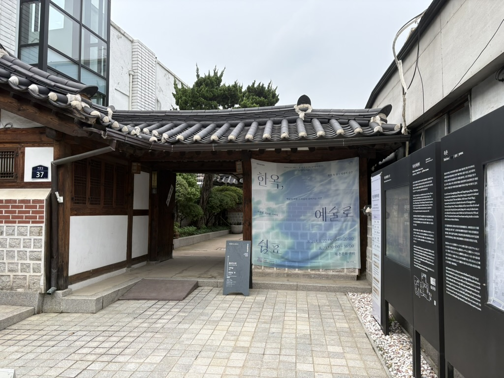

이 곳은 현재 북촌한옥마을에 대한 역사를 알려주고 체험 프로그램을 제공한다. 한옥에 직접 들어갈 수도 있다.

또 북촌산책과 골목기행이라고 하는 북촌과 인사동, 종묘 일대를 관광할 때 참고하기 좋은 안내지도를 배포한다.

신발을 벗고 한옥에 들어선다. 나무와 한지의 조화, 곡선적인 지붕 처마가 특징인 한옥에 들어서면 마음이 평화로워진다. 

대자로 누워 낮잠을 자거나 한여름에 마루에 앉아 할머니가 잘라주신 수박을 맛있게 먹는 상상을 해봤다.

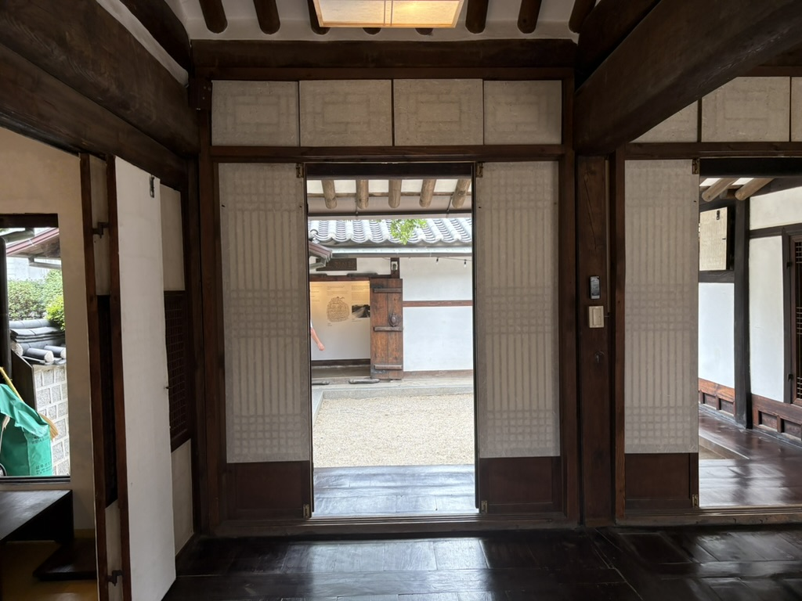

가외에 물이 담겨있는 돌 항아리 위에 비둘기가 가만히 앉아 있다. 

아니 앉아 있는 게 아닌가. 웅크리고 있는 건 봤어도 앉아 있는 건 못 본거 같기도 하다. 새들은 아빠다리를 할 수 없구나.

처음엔 모형인 줄 알았는데 가끔씩 물을 먹고 있길래 살아있구나 싶었다.

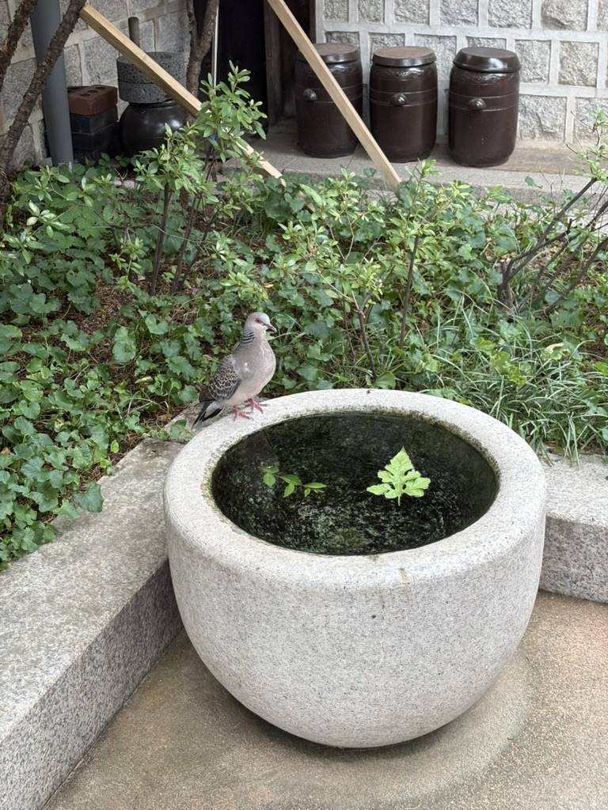

북촌문화센터를 기점으로 본격적인 산책을 떠난다. 서촌의 자하문로가 서촌의 동쪽과 서쪽을 나누듯이, 북촌은 북촌로가 북촌의 서쪽과 동쪽을 나눈다.

북촌로의 왼쪽은 경복궁과 가까운 곳이고 오른쪽은 창덕궁과 가깝다. 먼저 창덕궁과 가까운 곳부터 걸어본다.

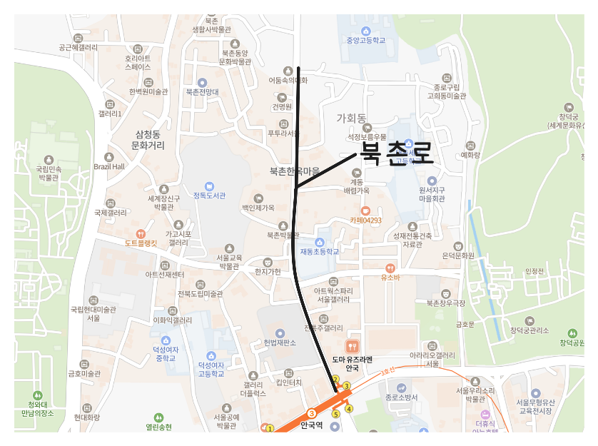

## 창덕궁과 가까운 곳

경로: 안국역 3번 출구 -> 북촌문화센터(계동길) -> **사람사는세상 노무현센터(창덕궁길)** -> 종로구립 고희동미술관

북촌문화센터에서 창덕궁길 쪽으로 향하면 북촌8경 중 북촌1경인 창덕궁 전경이 나온다.

날이 흐리지만 창덕궁의 인정전과 돌담, 나무들이 이루는 경치를 볼 수 있었다.

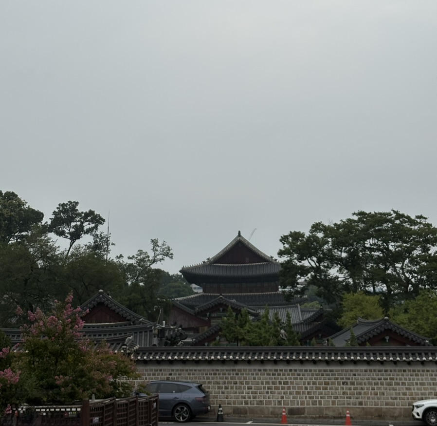

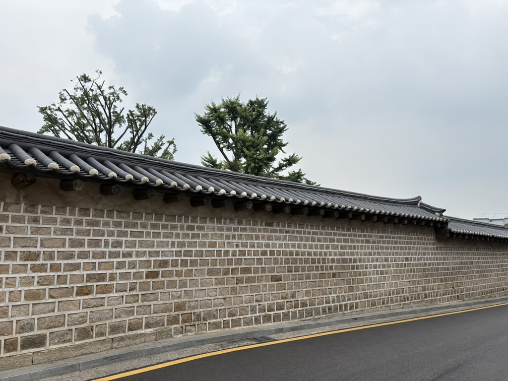

창덕궁 돌담길을 따라 걷다보면 사람사는세상 노무현센터가 나온다. 

사실 이름만 들어봤지 이 곳에 있을 줄은 몰랐다. 직접 검색하지 않는 이상 네이버 지도에서 확대해도 표시되지 않기 때문에 알 수 없다.

길을 걷다 가볼만한 공간을 우연히 발견하게 되어 기분이 좋았다.

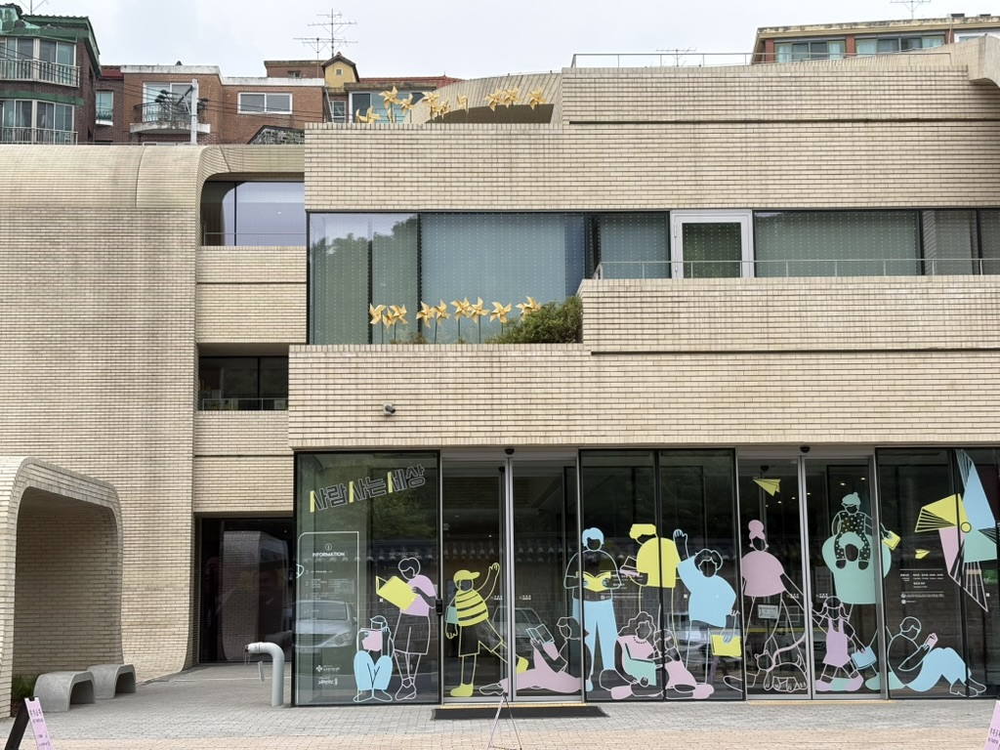

이 곳은 노무현재단에서 건립한 건물로 지하 2층부터 3층까지 있다. 기념공간, 다목적홀, 카페, 도서관 등 다양한 공간이 제공된다.

정치적인 걸 떠나서 건물을 구경하는 걸 좋아하는 사람이라면 한 번쯤 가볼만하다. 외관, 내관, 발코니 모두 구성을 알차게 해놓았다.

책을 읽거나 노트북 작업하기에도 괜찮다. 무료 입장이라 부담없이 이용할 수 있다.

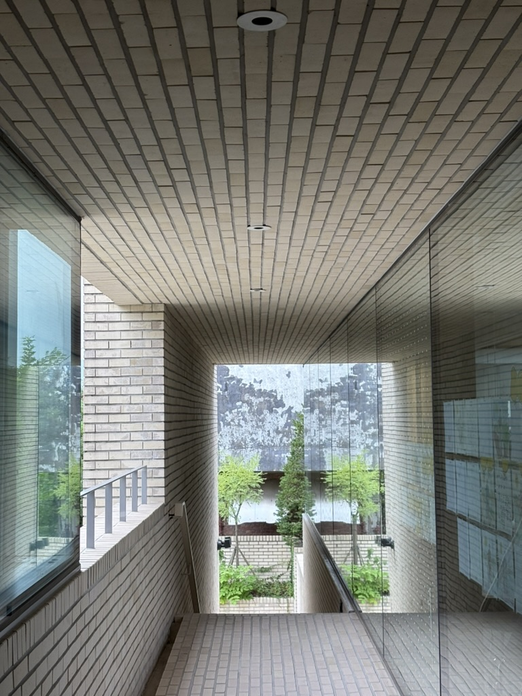

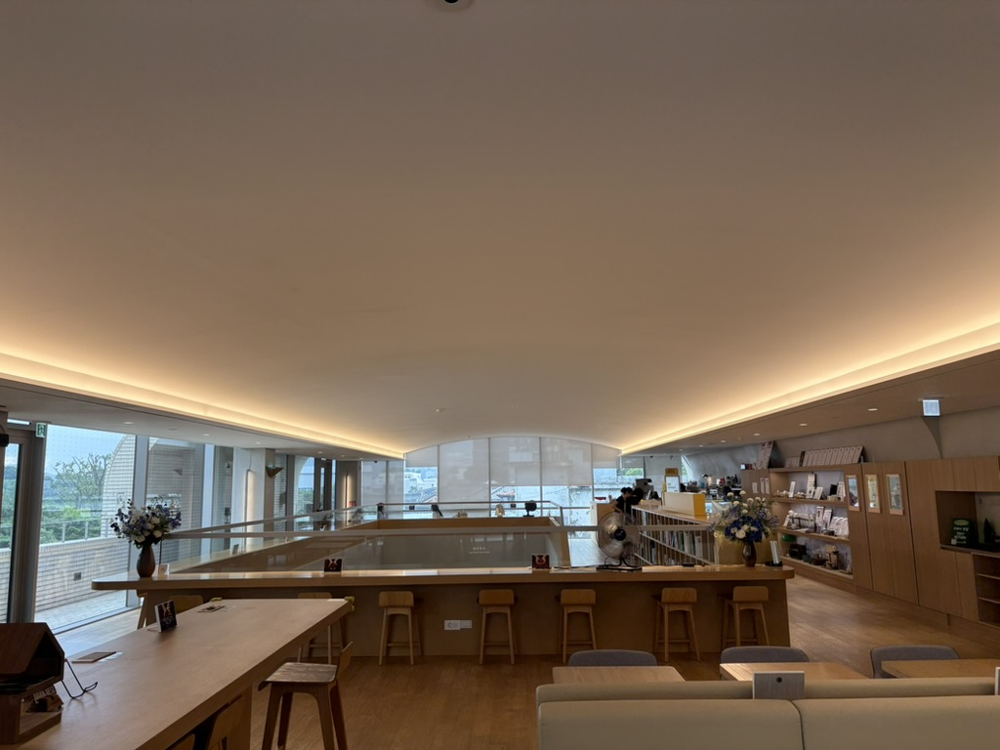

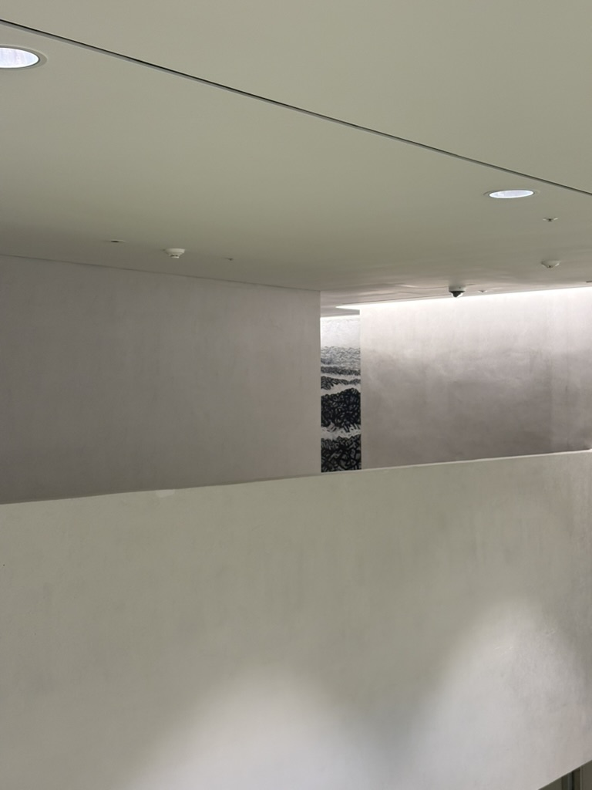

경로: 안국역 3번 출구 -> 북촌문화센터(계동길) -> 사람사는세상 노무현센터(창덕궁길) -> **종로구립 고희동미술관**

노무현센터에서 종로구립 고희동미술관으로 이동한다. 가는 길에 남산 타워가 보여 사진을 찍어봤다.

창덕궁길에는 전선을 모두 땅 속으로 옮겼는지 전봇대가 없다. 그래서일까 비둘기들이 보이지 않는다.

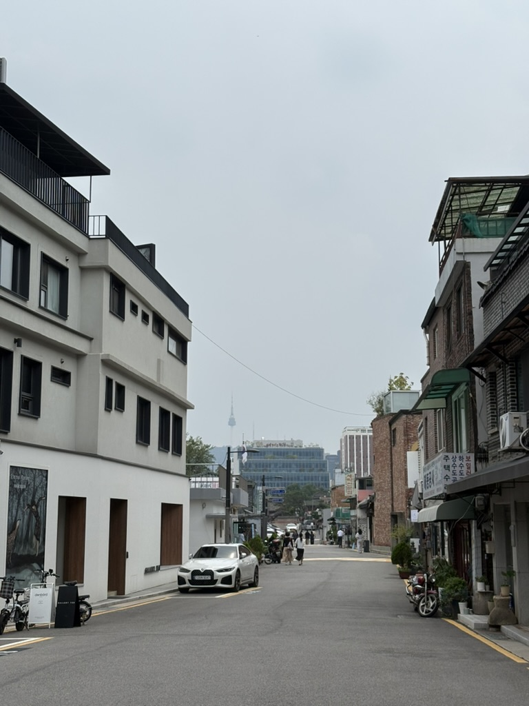

종로구립 고희동 미술관에 도착했다. 재개관 6주년을 기념하여 '만고상청: 군자의 품격'이라는 전시를 하고 있었다.

올해 12월 27일까지 전시가 이어지며 입장료는 무료이다.

매주 월요일 휴관이고 저녁 5시 30분까지만 입장할 수 있다.

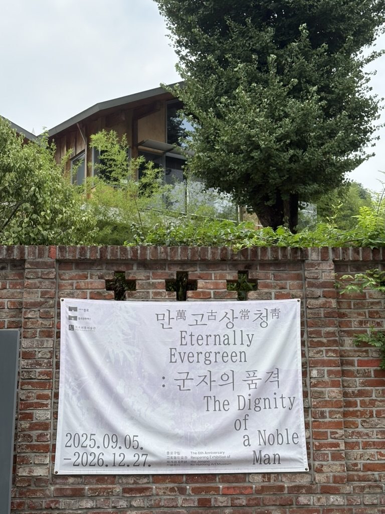

서촌의 박노수미술관처럼 이 곳도 개인 가옥이 미술관으로 운영된다. 위의 사진처럼 전시 안내를 하지 않았으면 그냥 지나칠 수도 있다.

미술관 앞 정원에는 모래가 깔려있고 미술관으로 들어가는 길에 돌들이 놓여있다.

나무들 사이로 고희동 화백의 흉상이 보인다.

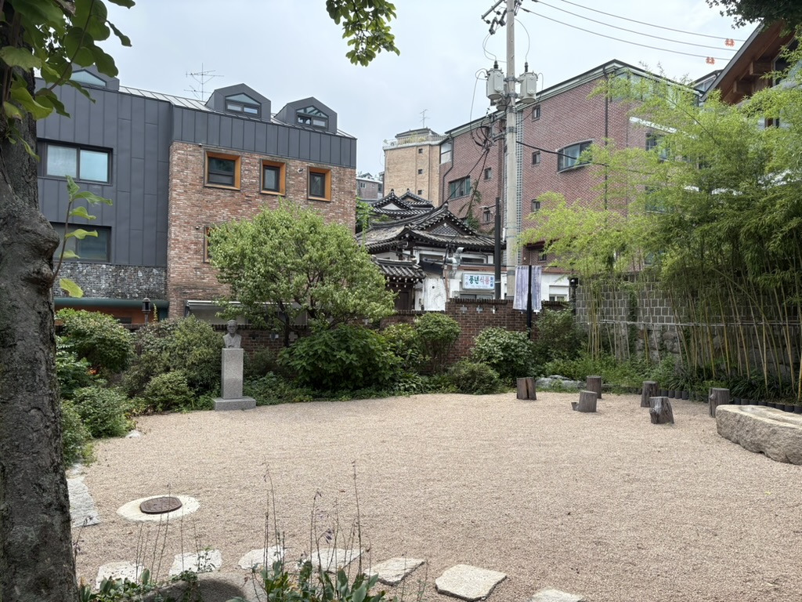

이 집은 화백이 일본 도쿄미술학교(현 도쿄예술대학) 유학을 다녀온 이후로 직접 집을 설계했다.

전통 한옥과 일본 가옥을 절충했다고 하는데 그래서인지 복도가 비좁다.

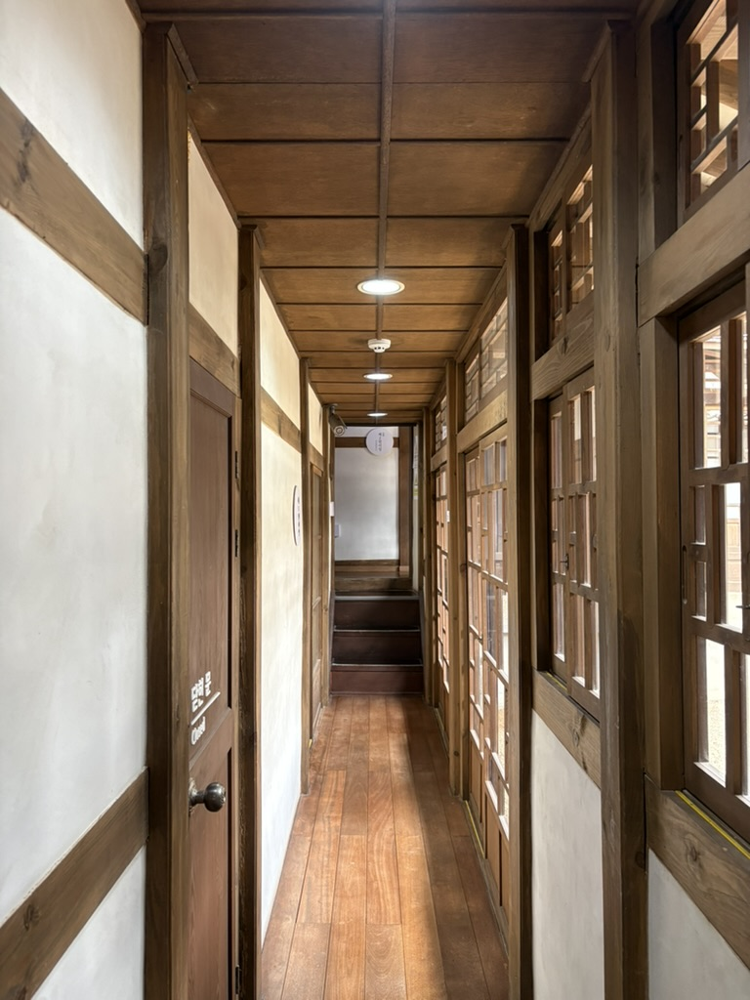

고희동 화백은 우리나라 최초의 서양화가이자 대한민국예술원의 초대회장이다. 제자 중 한 명이 시인 이상이라고 한다.

저번 [서촌 산책](./seochon#자하문로-서쪽) 때 집까지 찾아갔던 이상의 스승이라고 하니 왠지 모르게 알던 사람을 만난 반가운 기분이 든다. 이래서 지연이 무섭다니까

화백은 일제강점기 때 조선인 화가모임을 결성했다고 한다. 그들이 함께 그린 그림인 군방자재. 고희동 화백은 이 중에서 가장 왼쪽에 있는 먹으로 칠해진 바위를 그렸다.

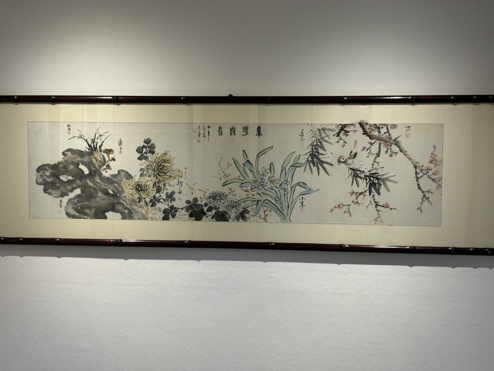

이제 창덕궁과 가까운 곳은 모두 걸었다. 북촌로를 건너 경복궁과 가까운 곳으로 갈 차례이다.

조금 걸었더니 배가 고파진다. 간단하게 연어 덮밥을 먹었다.

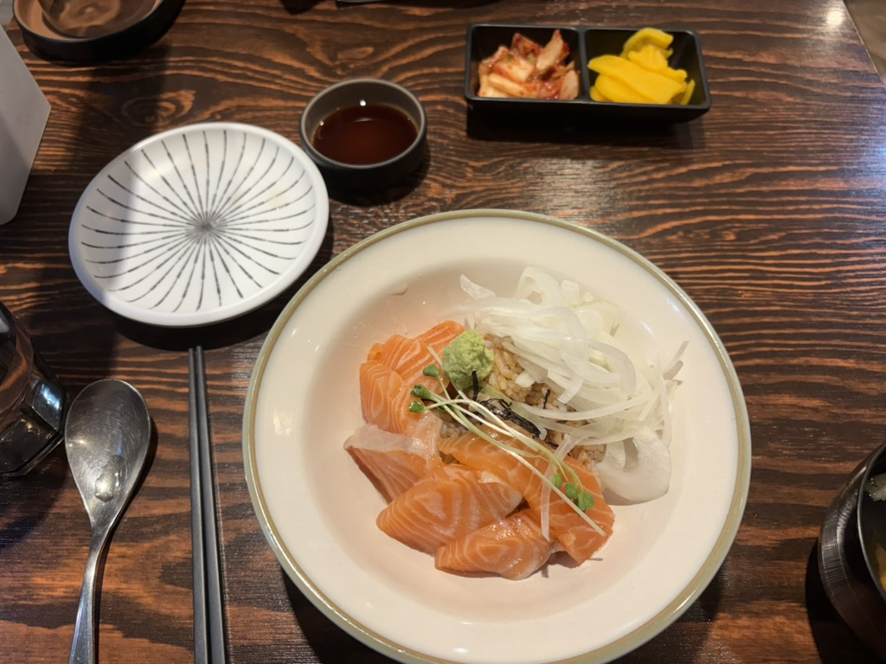

## 경복궁과 가까운 곳

경로: **백인제 가옥** -> 정독도서관 -> 북촌동양문화박물관 -> 가회동 31번지 -> 국립현대미술관 서울 -> 금호미술관 -> 열린송현 녹지광장

북촌의 서쪽에서는 가장 먼저 백인제 가옥에 들린다. 백인제는 독립운동가이자 인제대학교 백중앙의료원 설립자이다. 

이 곳은 일제강점기 한옥으로 이완용의 조카이자 친일부역자 한상룡이라는 사람이 건립하였다. 이후 최선익을 거쳐 백인제 선생에게 소유권이 이전되면서 백인제 가옥이라고 부르게 되었다.

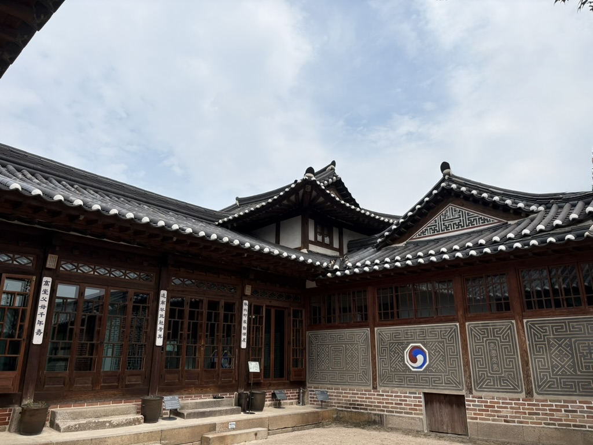

으리으리한 집이다. 서촌의 박노수 가옥보다 더 넓고 여러 채의 건물이 있다.

집을 둘러싼 정원길을 걸으니 마음이 편안해진다.

별당채 앞에 있는 단풍나무의 잎이 푸르다. 

가을에 오면 붉게 물든 단풍나무의 모습을 볼 수 있을 듯 하다.

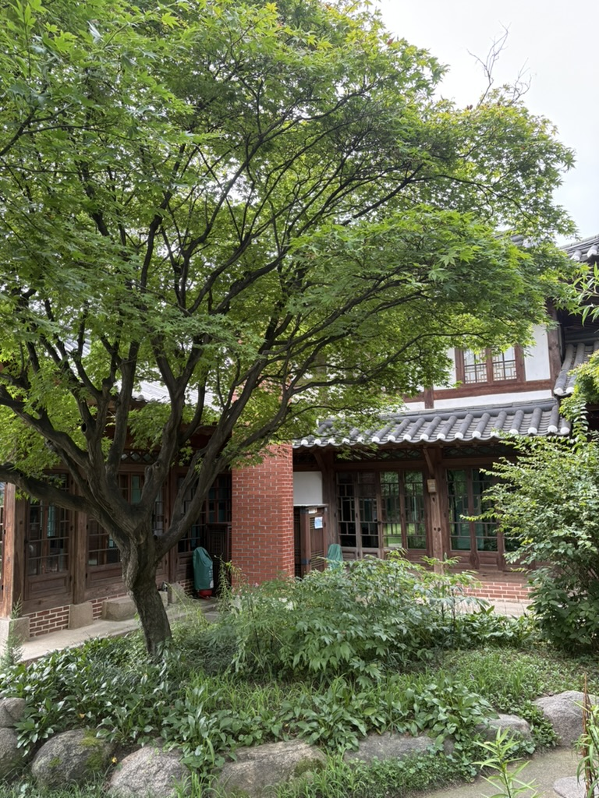

경로: 백인제 가옥 -> **정독도서관** -> 북촌동양문화박물관 -> 가회동 31번지 -> 국립현대미술관 서울 -> 금호미술관 -> 열린송현 녹지광장

정독도서관은 백인제가옥 바로 옆에 있긴한데 정독도서관의 입구로 갈려면 조금 돌아서 가야한다.

중간에 떡볶이 집이 있었는데 그냥 지나쳤다. 다음엔 꼭 먹어야지

방문일이 마침 휴관이어서 광장 중앙의 분수대가 멈췄다. 마치 빵빠레 윗 부분은 다 먹고 아래만 남은 모습이다.

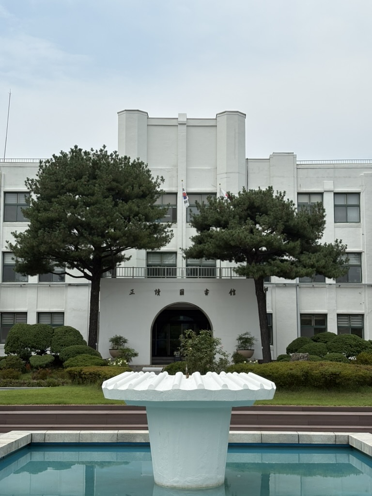

정독도서관은 백인제 가옥보다 더 넓은 정원을 가지고 있다. 걷기도 좋지만 군데군데 벤치가 있어 잠깐 쉬어가기에도 좋다.

길을 지나고 있는데 더위를 피해 나무 밑에서 쉬고 있던 흰 고양이를 마주쳤다.

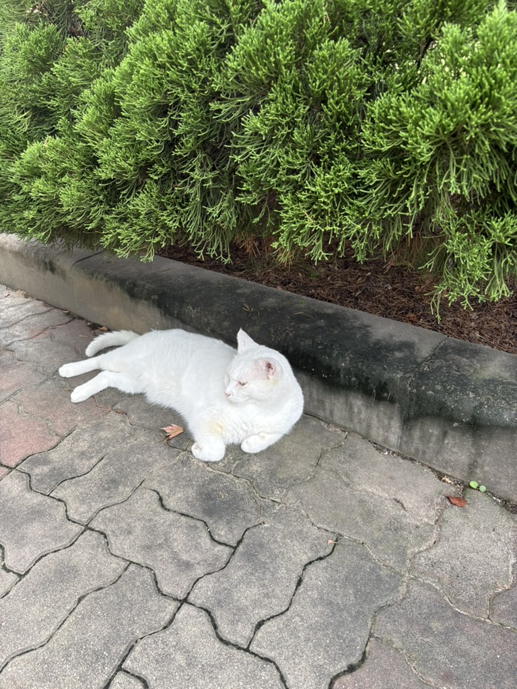

사람을 반기는 듯 나에게 다가와서 자리를 잡았다. 나도 쪼그려 앉다가 그냥 같이 길가에 자리잡았다.

고양이에게는 적당한 관심과 거리가 필요하다. 과도한 애정을 표해서도 안되고, 무관심도 아닌 중간 어딘가. 이들은 자신을 귀찮게 굴지 않으면서 같이 있는 걸 좋아한다.

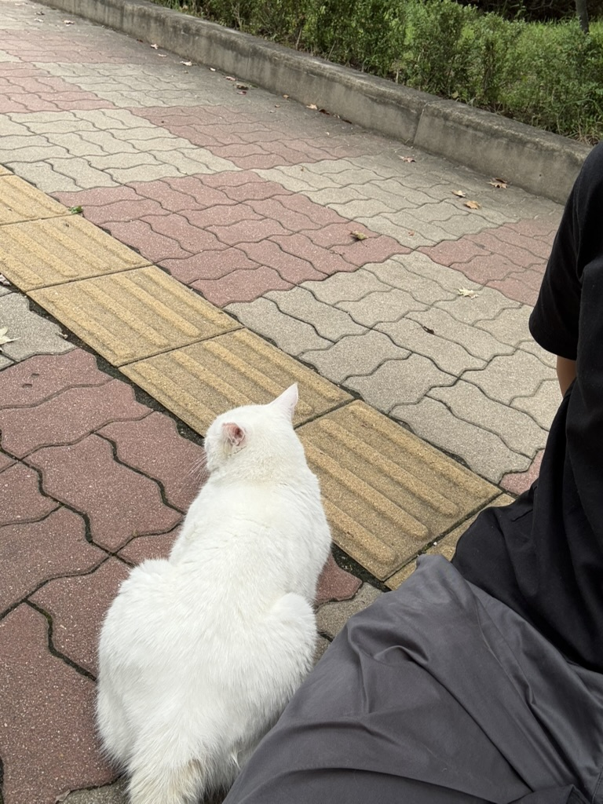

이내 아예 벌러덩 누워 내 쪽으로 몸을 틀더니 잠에 들었다. 움직이면 깰까봐 이건 같이 따라하지 못했다.

<video controls>
    <source src="./images/정독도서관고양이낮잠.mov">
</video>

고양이 덕분에 도서관 정원 한 가운데에 앉아서 낮은 시선으로 도서관을 바라볼 수 있었다. 고양이가 아니었다면 절대 이러지 않았을텐데.

지나가는 할머니들이 귀여운 듯 웃으셨다. 나도 괜히 따라 웃었다.

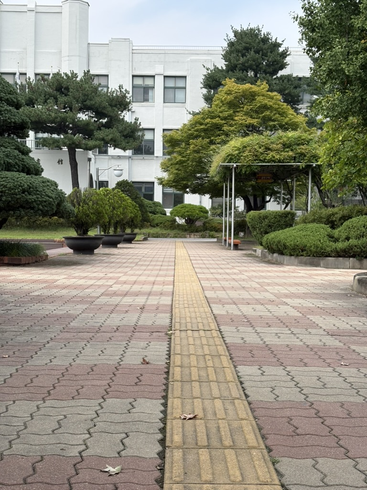

경로: 백인제 가옥 -> 정독도서관 -> **북촌동양문화박물관** -> 가회동 31번지 -> 국립현대미술관 서울 -> 금호미술관 -> 열린송현 녹지광장

아쉽지만 고양이와 인사를 나누고 정독도서관을 나온다. 북촌동양문화박물관으로 향하는 골목길에 들어선다.

골목길로 들어서기 전 오른쪽에는 정독도서관 돌담길이 있고, 왼쪽에는 가게들이 있는 것을 볼 수 있다.

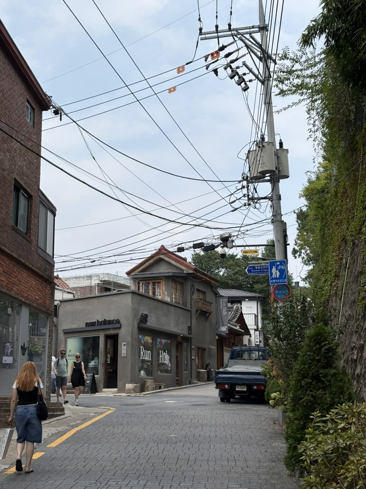

골목길 벽면에 독립운동가들의 그림이 보인다. 이렇게 북촌 곳곳에 우리나라 근현대 역사와 관련된 것들이 놓여 있다.

그 중 제빵사 모습으로 빵을 들고 있는 이봉창 의사를 찍었다. 이봉창 의사는 내선일체에 감화되어 진심으로 일본인으로 살고자 했다가 현실을 깨닫고 독립운동의 길을 걸은 사람이다.

쇼와 천황을 암살하려 했으나 아쉽게도 실패하고 순국하였다.

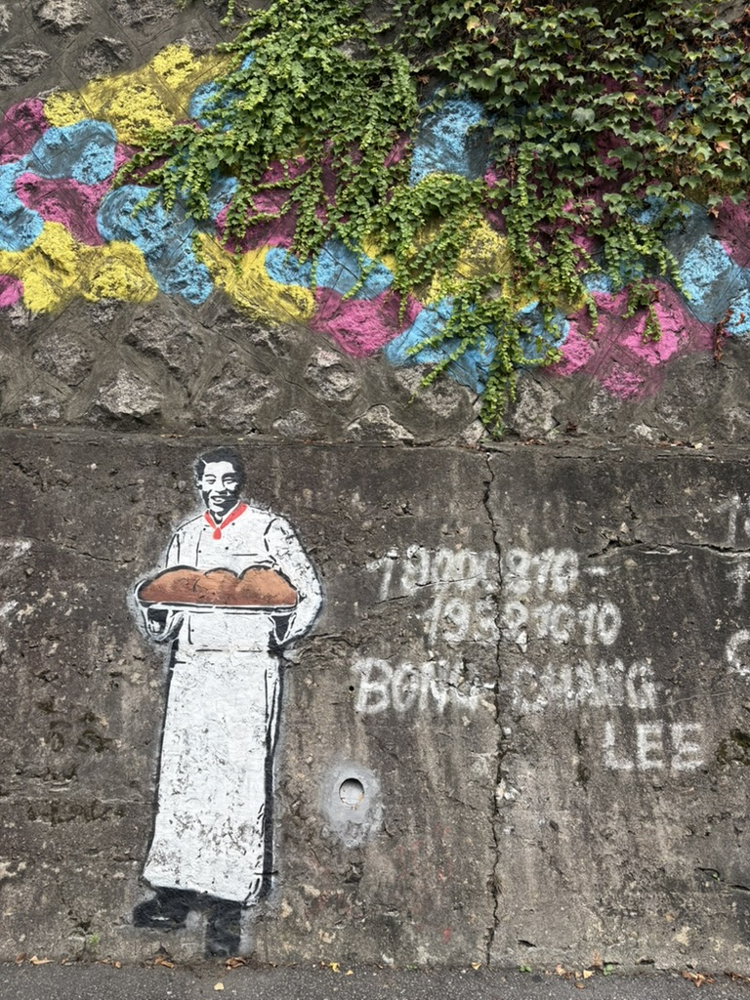

골목길의 벽면이 제각각이다. 빨간 벽돌인 곳, 콘크리트인 곳, 큼지막한 돌덩어리인 곳. 

그 사이에 나무들이 삐죽 나와있고 길쭉한 바닥길이 정갈하게 놓여 있어 분위기가 참 좋다.

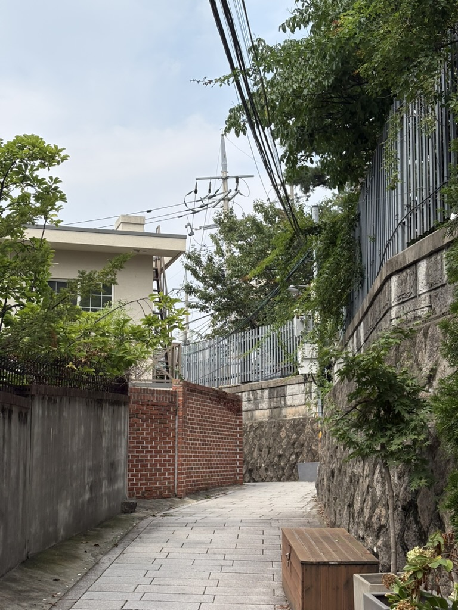

길을 따라 올라가면 코리아라는 글씨가 써있는 굴뚝이 보인다.

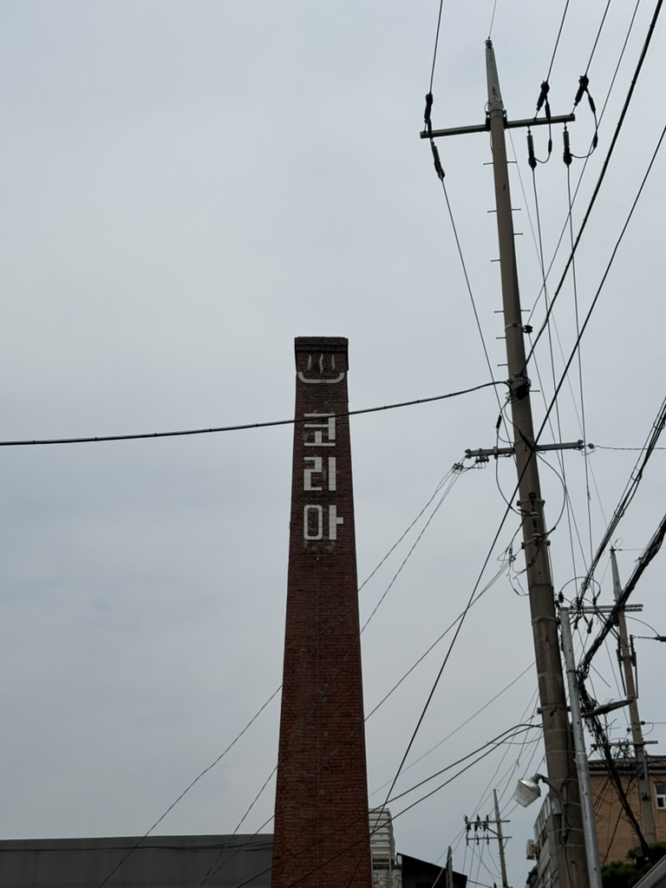

이 길에서 바라본 경복궁의 모습이다. 

실제 풍경을 카메라에 모두 담지 못해서 아쉽다.

조금 더 걸으면 북촌동양문화박물관이 있다. 

정독도서관에서 이 곳까지 오는 자세한 경로는 [북촌경로](./data/북촌_260819.gpx) 파일에서 확인할 수 있다.

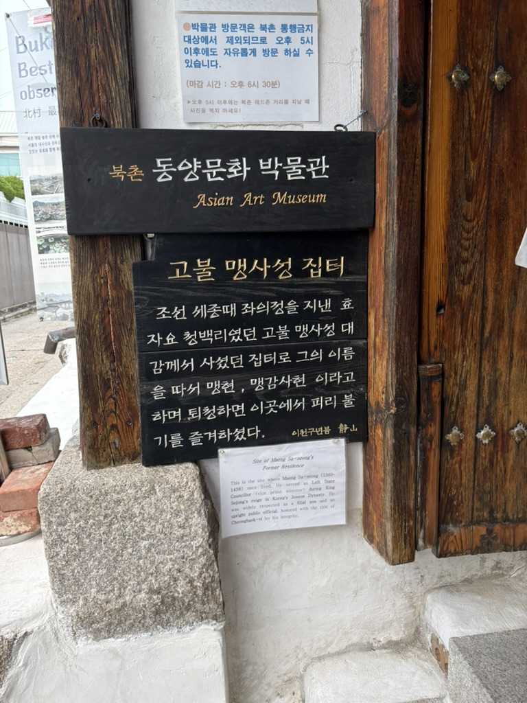

북촌동양문화박물관은 그림, 도자기, 기념품 등을 전시하고 판매하는 곳과 북촌을 전망할 수 있는 카페를 운영한다.

문을 열고 들어가면 먼저 전시 및 판매 공간이 나온다. 동양적 회화를 덧대어 표현한 도자기들에 눈길이 갔다. 우아함에 한 번 놀라고 가격에 한 번 놀랐다.

실컷 도자기를 구경하고 나서 카페로 간다.

카페는 입장료 6천원을 내고 들어갈 수 있다. 티켓을 보여주면 커피로 바꿔준다. 입장료 + 커피 구매 금액인 셈이다.

거의 대부분 외국인들이 오는 곳이라 티켓을 판매하시는 분과 커피를 주는 분 모두 나에게 영어로 말씀하셨다. 오히려 한국어로 소통하는 게 어색하게 들렸다.

북촌한옥마을에 있으면 우리나라가 아닌 코리아 타운에 놀러간 느낌이 들기도 한다.

카페 바깥은 정원으로 가꾸어져 있다. 전시 공간에서 카페로 가는 문을 열면 바로 정원이 나온다.

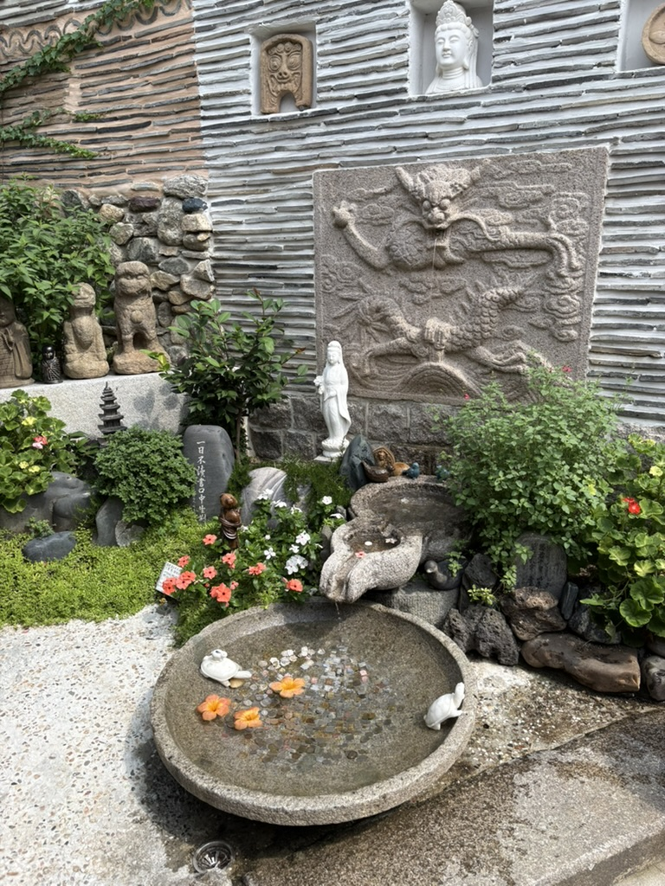

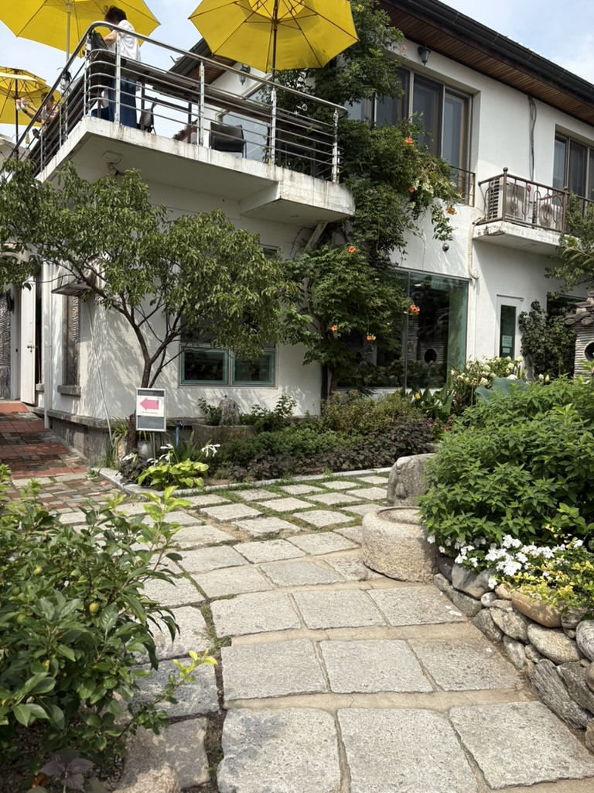

카페 1층에도 박물관 못지 않게 다양한 작품들과 가구들이 놓여 있다. 

1층과 2층 모두 앉을 수 있는 테이블이 있는데 2층은 풍경을 구경할 수 있어서 사람들이 주로 2층을 간다.

2층 테라스로 나가면 북촌 풍경을 더 넓게 볼 수 있다.

가까이에는 북촌 한옥 지붕들이 겹겹이 있고 저 멀리 광화문과 세종문화회관이 보인다.

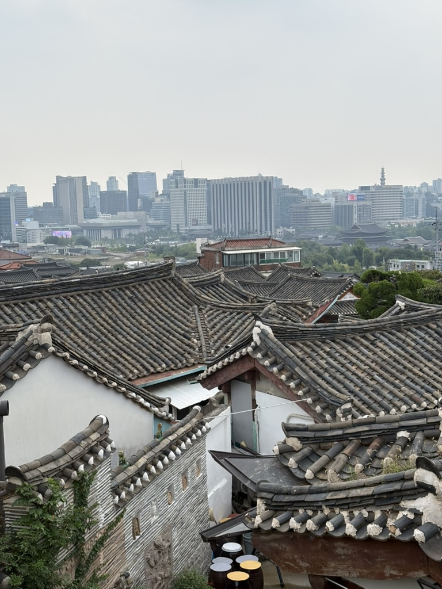

경로: 백인제 가옥 -> 정독도서관 -> 북촌동양문화박물관 -> **가회동 31번지** -> 국립현대미술관 서울 -> 금호미술관 -> 열린송현 녹지광장

가회동 31번지는 북촌동양문화박물관에서 나오면 바로 있다.

아마 북촌한옥마을하면 나오는 사진들은 모두 이 거리에서 찍었을 거다. 가회동 31번지 거리는 북촌5경과 북촌6경이다.

그래서 관광객들이 무지하게 많다. 

북촌한옥마을은 관광 구역이면서도 실제로 사람이 사는 주민거주지라 종로구에서 저녁 5시부터 다음 날 아침 10시까지 방문시간을 제한하니까 이를 참고하자.

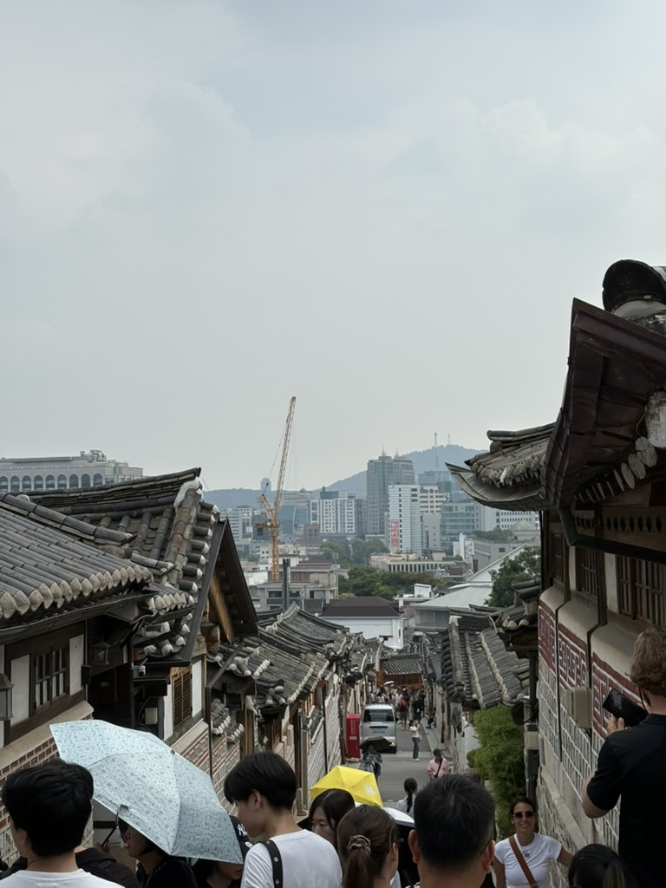

한옥 반, 사람 반 구경을 하고 사람이 한적한 한옥마을 사이의 골목을 돌아다니다가 고양이를 마주쳤다.

이 녀석은 목에 빨간 장식을 두른 걸 보아 이 근방에서 키워지는 듯했다.

아까 정독도서관 흰 고양이처럼 사람을 무서워하지 않고 오히려 반겼다. 같이 있다가 반대편 길에서 다른 사람들이 오길래 자리를 피해줬다.

사진은 고양이가 몸을 긁으며 시원해하는 모습을 담았다.

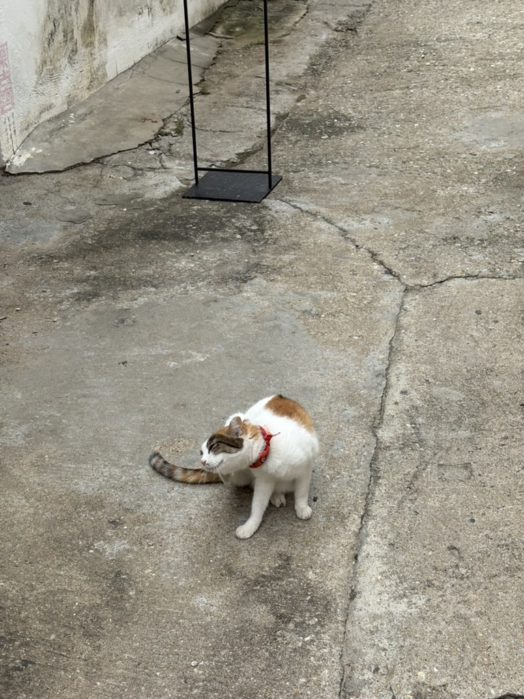

경로: 백인제 가옥 -> 정독도서관 -> 북촌동양문화박물관 -> 가회동 31번지 -> **국립현대미술관 서울** -> 금호미술관 -> 열린송현 녹지광장

이제 북촌한옥마을 구경을 끝내고 경복궁 방향으로 내려온다. 지나가는 길에 고풍스러우며 아름다운 대리석 조각들이 놓여 있었다.

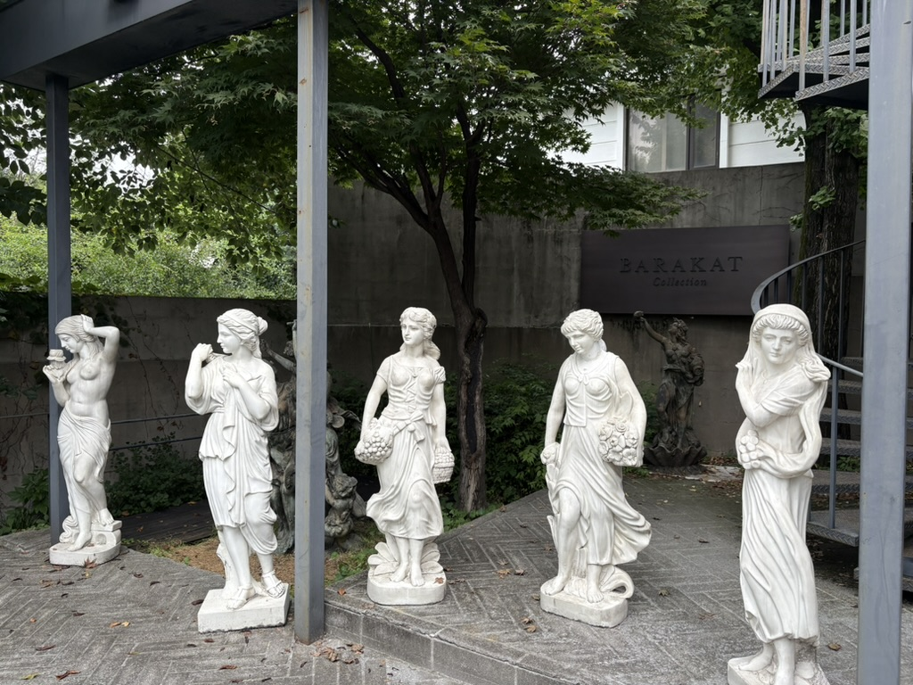

국립현대미술관에서 올해의 작가상 2026과 이것은 개념미술이 (아니)다 전시를 진행하고 있었다.

국립현대미술관 서울관은 주 7일 운영하며 월, 화, 목, 금, 일요일은 오후 5시 30분까지, 수요일과 일요일은 20시 30분까지 입장할 수 있다.

이 중에서 올해의 작가상 2026 전시를 봤다. 티켓은 2천원이며 올해 12월 6일까지 이어진다.

전시는 매년 4명의 작가를 선정하고 동시대 예술이 마주한 주요한 질문과 흐름을 공유한다.

작가상이라는 단어는 중의적으로 사용되는 것 같았다. 전시를 할 수 있는 기회를 4명에게 제공한 뒤 최종 수상자를 뽑는 상(작가에게 주는 상)과 작가가 전시를 통해 나타내고자 하는 모습을 일컫는 말(작가가 나타낼 상).

국립현대미술관의 설명에 따르면 전시에 나타낼 상은 두 개라고 한다. 하나는 형상이고 다른 하나는 현상이다.

형상은 예술이 만들어내는 형상. 현상은 예술을 통해 드러나는 시대의 현상.

예술이 무엇을 나타낼지와 예술로 무엇이 나타나는지에 대한 전시이지 않을까 싶었다.

전시 작품 중 이해민선 작가의 '잔설'

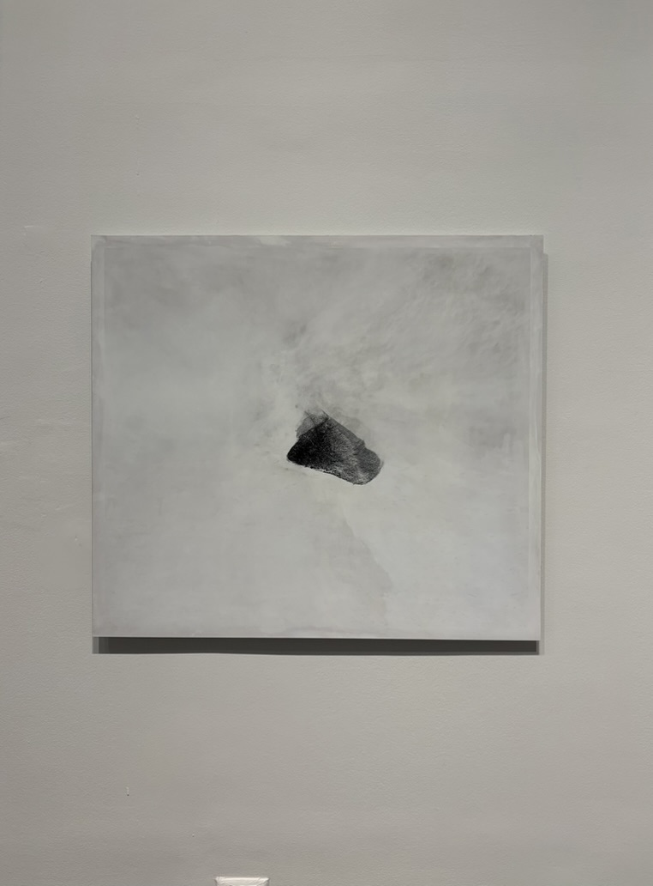

이해민선 작가가 말하는 잔설이란 한겨울에 지난 후 녹지 않고 한 켠에 뭉치고 쌓인 눈이다. 이 눈들은 쌓이고 녹는 과정을 반복하며 형태를 유지한다.

실제 잔설을 사진으로 찍은 후 인화지 위에 화약약품을 써서 이미지 일부를 인위적으로 녹이고 지웠다고 한다.

그 다음 지워진 풍경과 원래 인화지의 흰색에 먼지와 얼룩을 그려 잔설을 간접적으로 표현했다.

작가는 외부 환경을 버텨내는 사물의 상태에서 취약한 우리 존재의 모습을 보았다고 한다. 

계속해서 변형되고 유실되면서도 악착같이 끈질기게 버티는 사물의 모습을 전시 공간에 녹여냈다.

이 모습은 우리에게도 나타난다. 사연없는 사람없듯이 누구에게나 어려움이 있지만 버텨내는 모습.

녹아내리지 않는 눈의 형상을 만들어내고 이를 사회 속 우리가 버티며 살아가는 현상과 희망을 말하고 싶었던 걸까?

또 다른 작품인 '나는 여기 있다'. 초라하지만 무너지지 않고 애쓰는 모습이다. 

하찮지만 귀엽다.

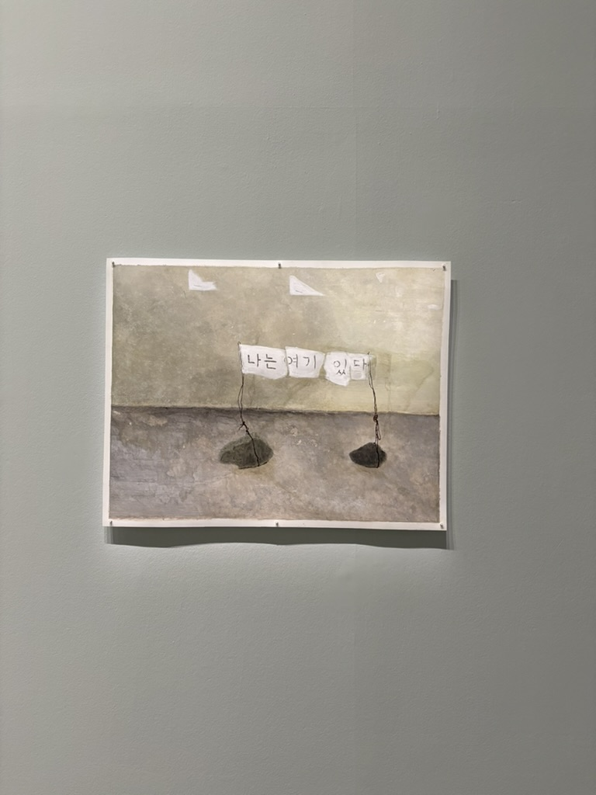

전시를 모두 관람하고 나오면 국립현대미술관과 LG전자가 협력하는 프로젝트인 MMCA x LG OLED 시리즈 2026을 볼 수 있다.

여기에 선정된 김 크리스틴 선의 '완고한 바위, 무모한 싸움들' 전시가 진행 중이다.

웅장한 사운드, 대형 OLED 디스플레이, 드로잉, 미국 수어 등을 선보인다. 작가는 이를 통해 우리가 겪는 소통의 어려움을 은유한다.

반복되는 갈등과 소모적인 논쟁, 자신의 생각이 맞다고 완고하게 믿고 우기며 상대방의 의견을 듣지도 않는 소통 말이다.

대화가 통하지 않는 대상을 바위라고 표현하여 순간 웃음이 났다. 

이 전시는 짧게 보고 지나갔지만 전시가 담고 있는 '반복되는 갈등과 소모적인 논쟁'의 모습은 이후 금호미술관에서 보게 될 단편 영상에서 여실히 드러났다.

<video controls>
    <source src="./images/김크리스틴선_완고한바위무모한소통.mov">
</video>

경로: 백인제 가옥 -> 정독도서관 -> 북촌동양문화박물관 -> 가회동 31번지 -> 국립현대미술관 서울 -> **금호미술관** -> 열린송현 녹지광장

국립현대미술관을 나와 금호미술관으로 자리를 옮긴다.

내려가는 길 오른쪽을 보면 경복궁의 건춘문이 있다.

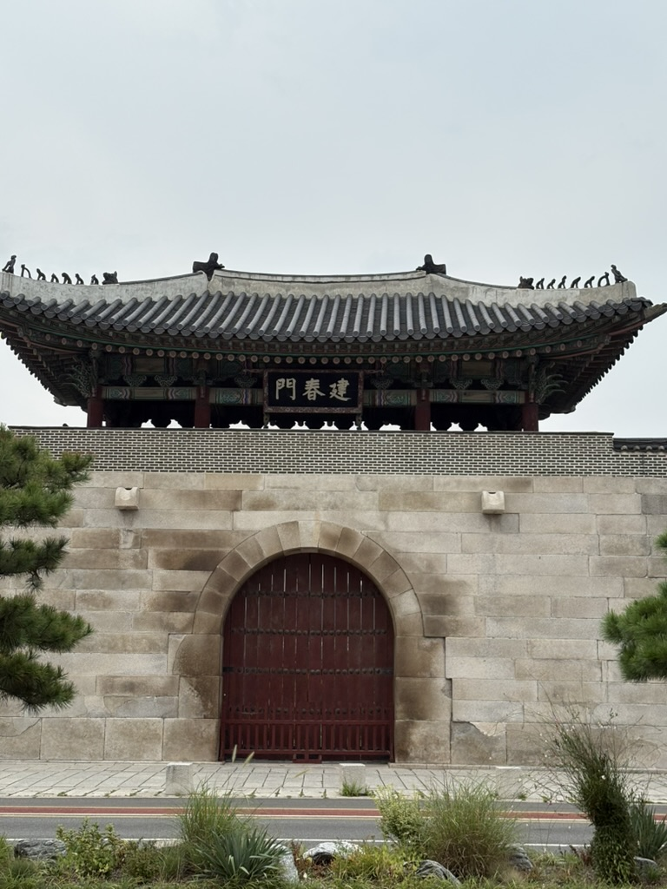

금호미술관에서는 박혜수 예술가의 '사람들은 진실에 관심이 없다' 전시를 진행하고 있다.

티켓은 5천원이고 올해 10월 18일까지 이어진다. 매주 월요일 휴관이고 오후 5시 30분까지만 입장할 수 있다.

이 전시는 한국 사회의 집단인 우리, 그 안에서의 나는 누구인가에 대한 질문을 던지며, 단순히 관람이 아닌 참여를 통해 이 질문에 대해 생각하길 유도한다. 

1층부터 3층까지, 그 다음 지하 1층 순으로 전시가 이뤄진다.

1층에선 집단에서 나는 어떤 성향의 그룹에 속하는지 알아보고, 

2층에선 극단적으로 분열된 이들이 각 집단의 대표로 나서 논쟁을 벌이는 영상을, 

3층에선 한국 사회 집단의 뿌리인 가족에 대해, 

그리고 지하 1층에선 집단 속 다수의 침묵에 대해 다룬다.

사진은 2층에 올라가 영상을 시청하기 전 계단에 있는 글씨이다. 모든 이야기에는 세 가지 측면이 있다. 당신 편, 내 편, 그리고 진실.

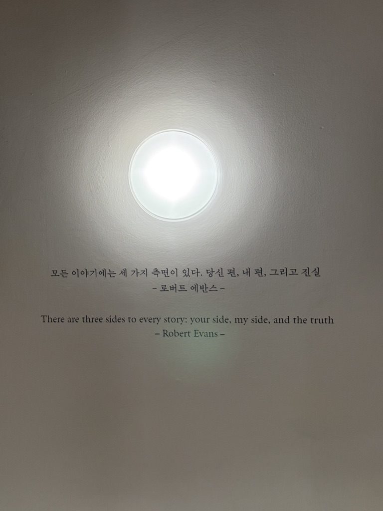

2층에서 상영되는 영상은 헤밍웨이 글로 알려진 '누가 아기 신발을 팔았을까'에서 모티프를 얻어 각 집단의 대표가 가상의 토론을 펼친다.

토론의 주제는 '아기 신발을 판매한다는 신문 기사가 왜 비극일까'에서 시작하여 가부장, 친일, 친중, 군대, 육아, 가사노동, 여성할당제, 남성성 등으로 주제가 변해간다.

세대, 성별, 정치 성향에 따라 극단적으로 나뉜 이들이, 토론의 원래 주제와는 별개로 진실은 뒤로 하고 관련없는 의혹을 남발하며 자신의 입장만 대변하거나 상대방을 공격하는 논쟁만 이어간다.

아까 관람한 국립현대미술관의 OLED 전시에서 말했던 '반복되는 갈등과 소모적인 논쟁', '바위'가 생각났다.

그리고 이 전시의 주제인 '사람들은 진실에 관심이 없다'도 동시에 겹쳐 보였다.

이해와 관용, 양보는 곧 내가 상대방에게 굴복하는 것이자 다른 사람들의 눈에 나는 약한 존재로 비춰지며 별 볼일 없는 사람으로 무시당하는 것처럼 느껴지기에. 지는 기분이 드니까 상대방을 이겨야 하며, 내 의견을 고수하고 주장하여 흔들리지 않는 것처럼 하는 모습을 보이고 상대방을 짓눌러야 이긴다고 느끼는게 이 사람들의 모습인 것 같았다.

내 말이 틀리지 않았다는 것에 진실보다 더 중요한 가치를 두며, 타인으로부터 옳다고 인정받아야 대화가 통한다고 느낄 것이다. 하지만 토론에 참석한 그 누구도 상대방의 의견에 동의하지 않았다. 소모성 논쟁에 지친 이들이 점점 자리를 떠난다. 그리고 영상의 마지막에 '비극이다'라는 말로 끝이 난다.

적어도 미디어나 온라인에서 이런 모습을 자주 보게 된다. 우리 진영, 나와 뜻을 함께 하는 사람들만 챙기기에도 급급하니까, 한 번 봐줬다가 내가 화를 입거나 비웃음을 당할지도 모르니까. 그 사람이나 집단에게서 베푼 은혜에 대한 덕택을 받을지 안받을지 모르니까 말이다.

집단 안에서 약육강식처럼 상대방을 밀어내면서도, 우리는 스스로를 인간답다고 생각한다. 그렇다면 인간다움과 포용은 어디에서 시작되는걸까.

지하 1층에 들어서면 어두운 공간 속에 비명같은 소리가 들린다. 

들어서기 전 안내하는 직원이 검은 원통(?)에다가 '디 엠퍼러 헤즈 노 클로즈'를 외쳐야 공간에 불이 들어오고 소리도 멈춘다고 알려줬다.

그래서 한 번 외쳐봤다. 소리가 작았는지 더 크게 외쳤다. 그제서야 조용해지고 빛이 들어왔다.

'디 엠퍼러 헤즈 노 클로즈'는 벌거벗은 임금님에서 유래한 말로 모두가 진실을 알면서도 눈치보며 침묵할 때 누군가가 나서서 거짓을 폭로하는 상황을 뜻한다.

나는 이런 생각들을 떠올렸다.

다수가 말을 하지 않는 이유가 있지 않을까? 아니면 거짓되고 모순된 것을 말하면 더 나아질까?

다른 사람들의 마음을 다치게 하지 않으려는 선한 거짓말이 있듯이 집단 내에서도 일부러 드러내지 않는 문제들이 있을 수 있다.

소수가 문제점을 제기한다고 해서 동화책처럼 해피엔딩을 맞이하지 않는다. 세상에는 끝이 없기 때문이다. 오히려 해결되지 않는 더 큰 문제로 번져 폭로한 소수마저도 조용히 침묵하는 선택에 이를지도 모른다.

하지만 모순에 대해 침묵으로 일관하는 태도 또한 올바르지 않다. 그래서 갈피를 잡기가 어려운 것 같다. 나는 편한 길을 선택할까 용기를 선택할까?

전시를 보고 나온 뒤 아래로 내려가면 불일미술관과 법련사가 보인다. 왼쪽에 조그마한 길이 있는데 그 곳으로 가면 세 개의 불상이 있다.

경로: 백인제 가옥 -> 정독도서관 -> 북촌동양문화박물관 -> 가회동 31번지 -> 국립현대미술관 서울 -> 금호미술관 -> **열린송현 녹지광장**

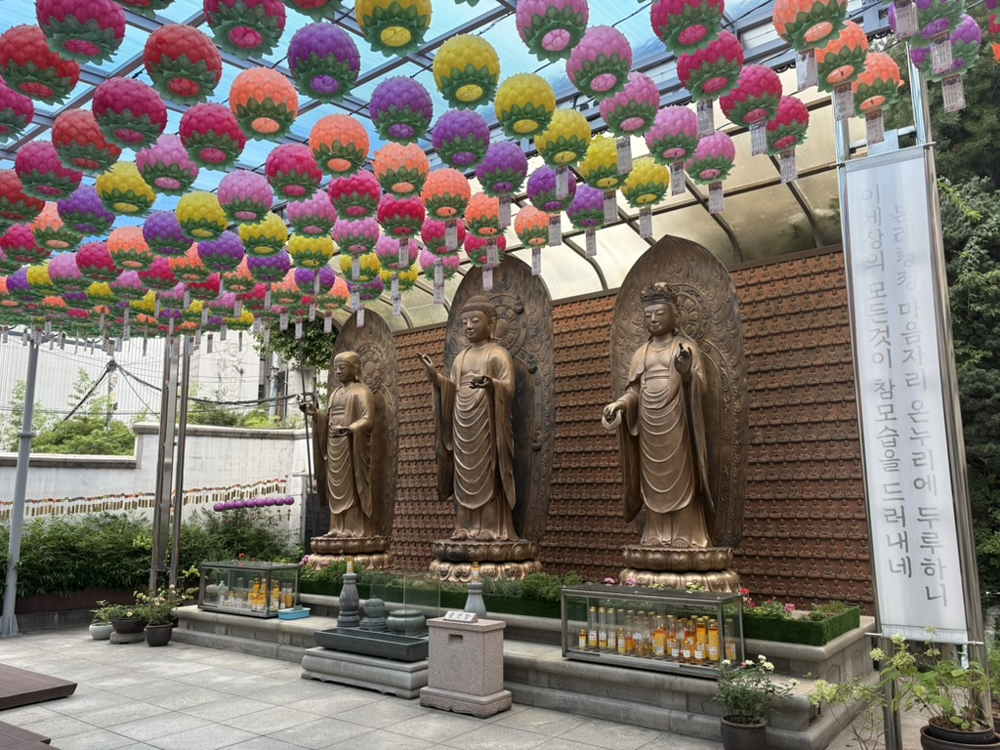

불상을 지나친 뒤 앞으로 가면 열린송현 녹지광장이 나온다.

광장 뒤편으로 서울공예박물관이 보인다. 운영시간이 지나서 들어가지 못했다.

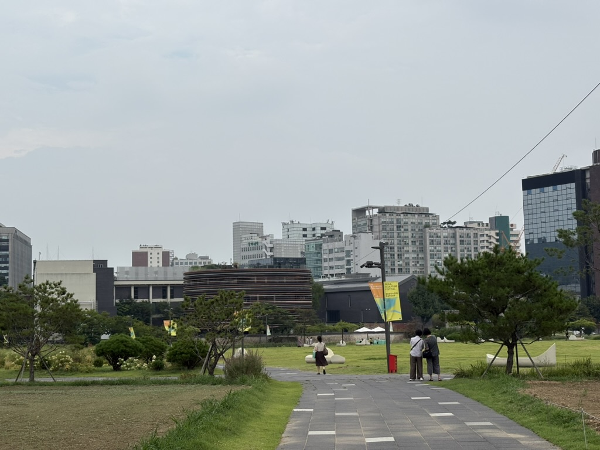

잔디와 조형물, 꽃들과 나무를 구경하며 걷다가 광장을 돌아보았다.

구름에 비춰진 햇빛 밑에 걸어온 길과 법련사가 보인다.

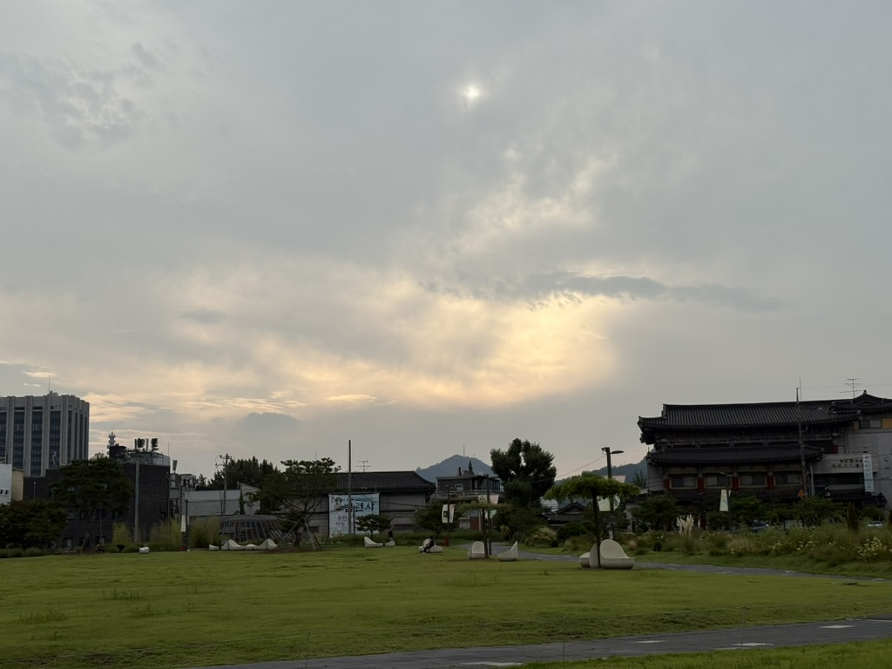

녹지광장을 나와 다시 안국역으로 돌아가는 길에 어떤 아저씨가 키우는 토끼를 보았다.

하얀 토끼가 귀를 쫑긋세우고 맛있게 밥을 먹고 있다. 나도 저녁 먹으러 집에 가야지

<video controls>
    <source src="./images/토끼먹방.mov">
</video>

## 끝으로

이번 산책에서는 안국역이 품고 있는 역사를 알아보고, 한옥 지붕을 실컷 구경하고, 미술관에서 사람들의 논쟁을 봤다.

길을 걷다 보면 장소에 따라 여러가지 생각들이 교차할 때가 있다.

안국역에서는 대한민국의 근현대사에 대해 생각했고, 미술관에서는 존재와 소멸, 집단과 개인, 그리고 사람 사이의 소통에 대해 생각했다.

서촌과 북촌에 있는 깊은 역사와 문화가 재밌는 질문을 하게끔 만들어준다.

그리고 생각하지 못한 친구들도 우연히 만났다. 고양이 두 마리와 토끼. 이들에게 산책을 즐겁게 만들어줘서 고맙다고 말하고 싶다.

열린송현 녹지광장에서 나오면 인사동의 입구가 보인다. 끝인 줄 알았는데 시작이다.

