글의 순서
- [시청역](#시청역)
- [덕수궁 일대](#덕수궁-일대)
- [서울시청 일대](#서울시청-일대)
- [끝으로](#끝으로)

[서촌](./seochon)과 [북촌](./bukchon)에 이어서 이번에는 어디를 갈까 하다가 두 동네 사이에 있는 세종대로를 타고 쭉 내려오면 있는 정동을 선택했다.

정동이라는 이름은 태조 이성계의 계비인 신덕왕후의 능침, 정릉에서 유래하였다. 행정동은 소공동이다.

오늘 걸어볼 시청역이나 서울시립미술관 등 일부는 다른 지역이지만 편의상 근처에 있는 일대를 정동으로 한데 묶었다.

산책 경로

1. 시청역 12번 출구 -> 덕수궁 석조전, 돈덕전, 국립현대미술관 -> 서울시청 서소문청사 -> 서울시립미술관 -> 정동길 -> 배재학당 역사박물관 -> 덕수궁 중명전  -> 고종의 길 -> 구 러시아 공사관 -> 국립정동극장 세실마루 전망대
2. 서울광장 -> 서울시청하늘전망대, 하늘광장 갤러리, 내 친구 서울 -> 환구단

오늘은 앨범 대신 몇 개의 노래만 선곡했다. 그 중 하나인 Mac DeMacro의 Chamber Of Reflection. 아직 이 노래가 담긴 앨범 전체를 들어보진 못했다.

<a href="https://open.spotify.com/track/1Snko28yJOihcRVXs9dAo9?si=0492af7f83644bde" rel="noopener noreferrer" target="_blank">스포티파이</a> <a href="https://music.apple.com/kr/album/chamber-of-reflection/6789834398?i=6789834619" rel="noopener noreferrer" target="_blank">애플 뮤직</a> <a href="https://youtu.be/MJoSyNdffGo?si=YlIdm29mccbHSXoS" rel="noopener noreferrer" target="_blank">유튜브 뮤직</a> 

세종대로를 기준으로 왼쪽은 덕수궁, 오른쪽은 서울시청 본청사로 구역을 나눈다.

정동은 장소가 밀집되어 있어서 서촌과 북촌에 비해 작아보이지만 산책로를 돌다 보면 생각보다 많이 걷게 된다. 걸음 수 측정 앱으로 확인해보니 북촌보다 약 4천보 정도 더 걸었다.

오늘은 세 곳의 전망대에 올라가 본다. 서울 일대의 모습이 각 전망대에 따라 어떻게 보이는지가 이번 산책의 또 다른 포인트가 된다.

## 시청역

경로: **[시청역 12번 출구]** -> 덕수궁(석조전, 돈덕전, 국립현대미술관) -> 서울시청 서소문청사 -> 서울시립미술관 -> 정동길 -> 배재학당 역사박물관 -> 덕수궁 중명전  -> 고종의 길 -> 구 러시아 공사관 -> 국립정동극장 세실마루 전망대

시청역은 1호선과 2호선을 환승할 수 있는 역이다. 서울시청 앞에 있다고 해서 시청역이라는 이름이 붙었다.

신림역에서 출발하면 시청역까지 도착하는데 환승할 필요없이 30분 정도 걸린다.

2호선 대부분은 3호선 [안국역](bukchon#안국역)이나 [경복궁역](./seochon#경복궁역)처럼 테마를 가지고 조성된 곳이 없다. 그나마 시청역 2호선은 빨간 벽돌 벽면과 기둥으로 꾸며져 있어 아늑함을 느낄 수 있다.

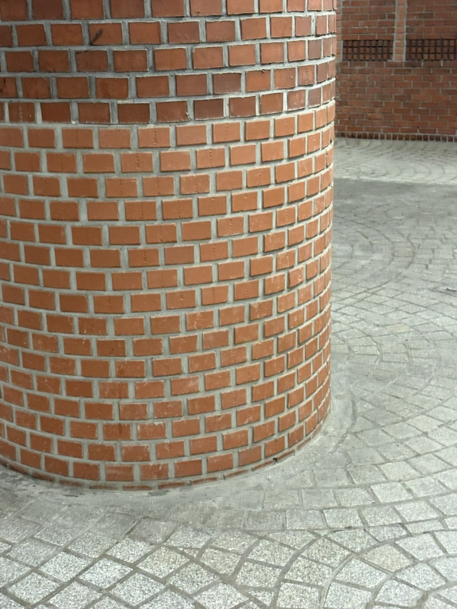

느긋하게 집에서 나왔다가 덕수궁 석조전 예약 시간까지 얼마 남지 않았다. 근처를 구경할 새도 없이 12번 출구로 나가서 덕수궁으로 향한다.

시청역 2번, 3번 출구가 덕수궁과 더 가깝긴 한데 그 쪽은 시청역 1호선이다. 그래서 12번 출구에서 나와 걸어가는게 더 빠르다. (아마도)

## 덕수궁 일대

덕수궁의 정문인 대한문을 카메라에 담지 못했다. 티켓을 끊고 곧장 석조전까지 빠른 걸음으로 갔다. 덕수궁의 입장료는 1천원이며 매주 월요일 휴궁이다. 

경로: 시청역 12번 출구 -> **[덕수궁 석조전]**, 돈덕전, 국립현대미술관 -> 서울시청 서소문청사 -> 서울시립미술관 -> 배재학당 역사박물관 -> 덕수궁 중명전  -> 정동길 -> 구 러시아 공사관 -> 고종의 길 -> 국립정동극장 세실마루 전망대

덕수궁 석조전은 <a href="https://royal.khs.go.kr/ROYAL/contents/R601000000.do?schGroupCode=dsg&schGroupCodeNm=덕수궁" target="_blank" rel="noopener noreferrer">궁능유적본부 사이트</a>에서 해설을 예약해야 관람할 수 있다.

일반 해설과 심화 해설을 제공해주는데 오늘은 45분짜리 해설인 일반 해설을 듣는다.

다행히 예약시간에 늦지 않게 도착했다. 들어가기 전 활짝 핀 배롱나무의 꽃과 석조전이 예뻐서 사진을 찍었다.

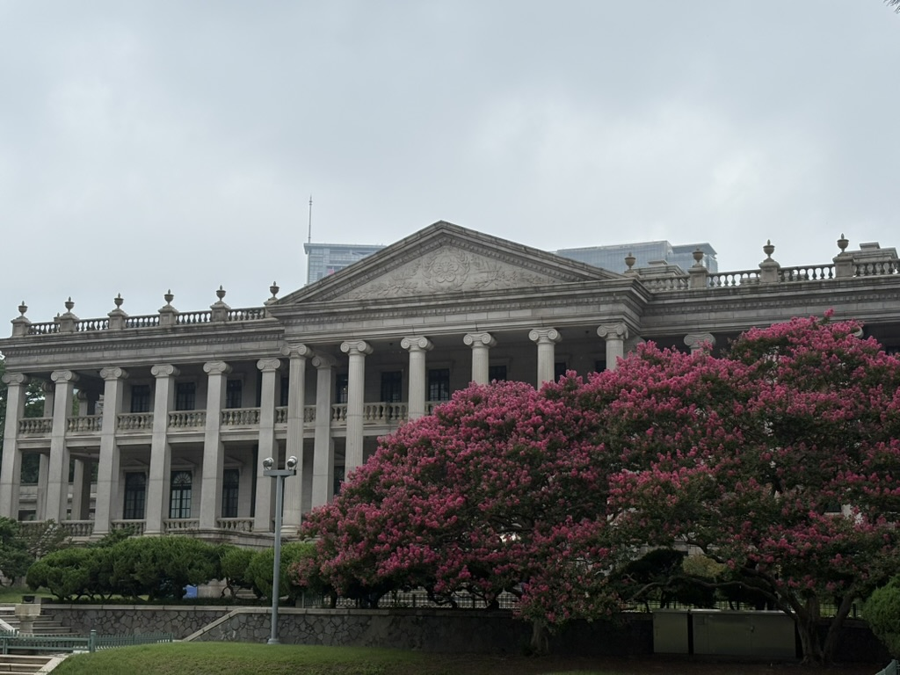

해설을 예약한 인원들과 함께 해설사 분의 설명을 들으며 덕수궁 석조전 내부를 돌아다닌다.

덕수궁 석조전은 1910년 12월에 지어졌다. 완공되기 전 이미 한일병합조약이 체결되면서 일제강점기에 들어선 시점이다.

일제강점기와 광복을 거치며 이왕가미술관, 미소공동위원회, 국립현대미술관으로 쓰여지다가 현재 대한제국역사관으로 운영되는 것이라고 한다.

대한제국 최초의 서양식 건물로 당시 유럽에서 유행하던 신고전주의 궁전 건축 양식으로 지어져 건물 외관 정면이 그렇듯이 내부도 좌우 대칭 엄격하게 맞춰져 있다.

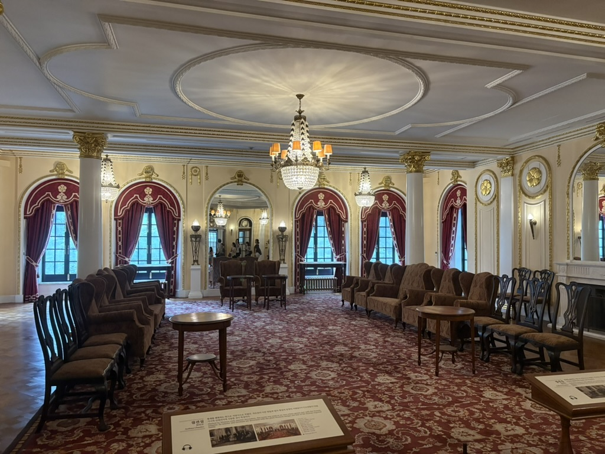

실제로 내부를 돌아다녀보면 이 대칭성이 꽤 강하게 느껴진다.

1층은 업무 공간이고 2층은 생활 공간이었다고 한다. 

2층 황후 거실의 가구와 화분이 화려하게 놓여 있다. 옆에 있는 황제 거실보다 이 곳이 더 마음에 들었다.

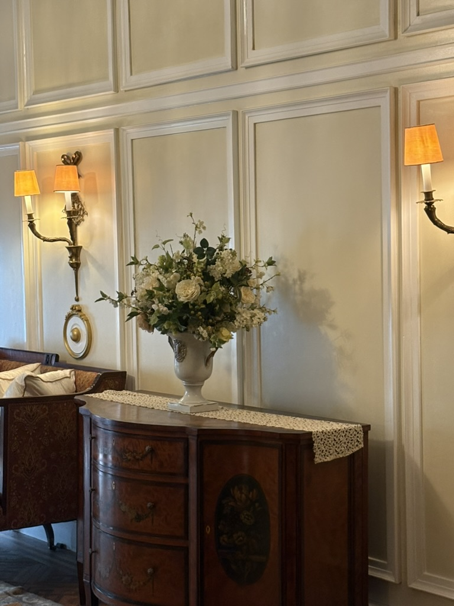

1층의 대식당은 더 고급스럽고 화려하다. 아무래도 손님들에게 만찬을 베푸는 곳이다보니 그런 듯 하다.

이 곳에서 불투명 유리를 통해 석조전의 내부 재질을 보여주며 석조전은 외관만 화강암으로 만들어져 있고 내부는 벽돌로 만들어졌다는 사실을 알려준다.

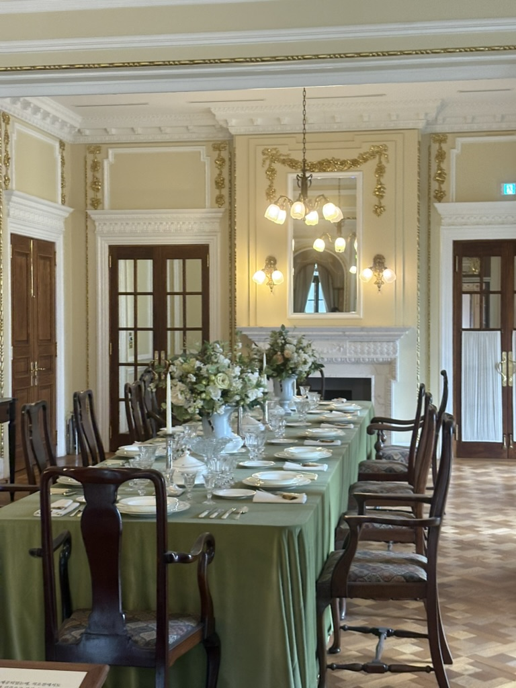

2층 테라스에서 바라본 정원이다. 이 곳도 여러 번 바뀌다가 지금의 모습을 갖추게 되었다.

궁전 기둥이 앞을 가리고 있어 정원만 사진으로 담기에 약간 어설펐다.

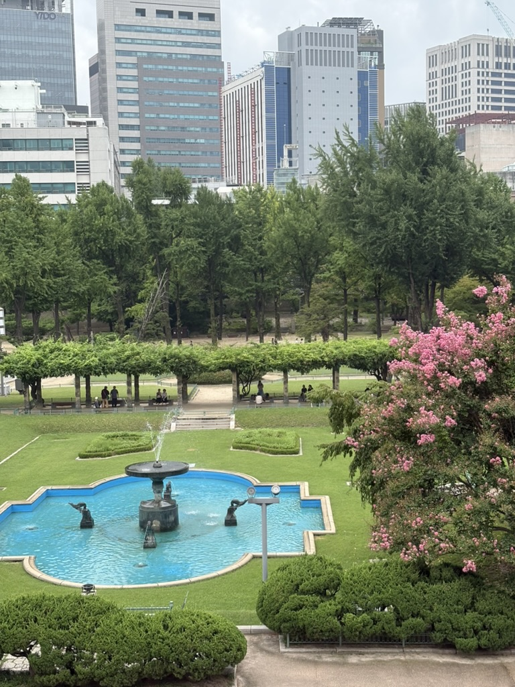

시청역 12번 출구 -> 덕수궁 석조전, **[돈덕전]**, 국립현대미술관 -> 서울시청 서소문청사 -> 서울시립미술관 -> 배재학당 역사박물관 -> 덕수궁 중명전  -> 정동길 -> 구 러시아 공사관 -> 고종의 길 -> 국립정동극장 세실마루 전망대

해설을 모두 듣고 난 후 뒷편에 있는 돈덕전을 갔다. 과거에 철거되었다가 문화재청에서 복원한 뒤 2023년부터 다시 개관되었다.

이 곳은 예약없이 무료로 방문 할 수 있다. 돈덕전은 낮보다 밤에 보는 게 더 예쁘다.

현재 한국-프랑스 수교 140주년을 기념하여 '반화, 상서로운 마음'이라는 특별전을 개최하고 있다. 올해 8월 30일까지만 한다.

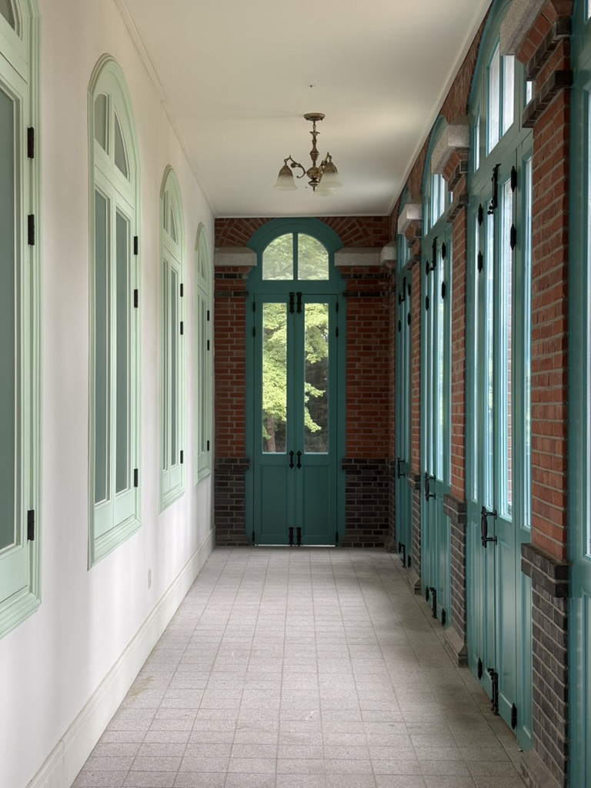

들어가면 세 가지의 엽서 종류 중 한 개를 고를 수 있다. 

잠시 고민하다가 꽃 잎의 모양이 매력적인 엽서를 골랐다.

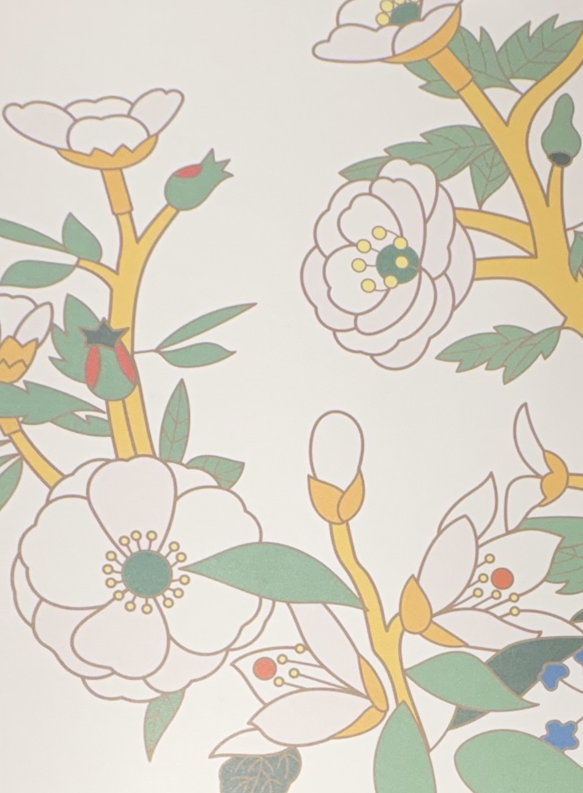

반화는 꽃이나 나무에 보석과 금속 장식을 한 장식품을 말한다. 

고종이 프랑스 대통령에게 수교 기념으로 반화를 선물로 준 것을 기념하여 이번 전시가 열린 것이다.

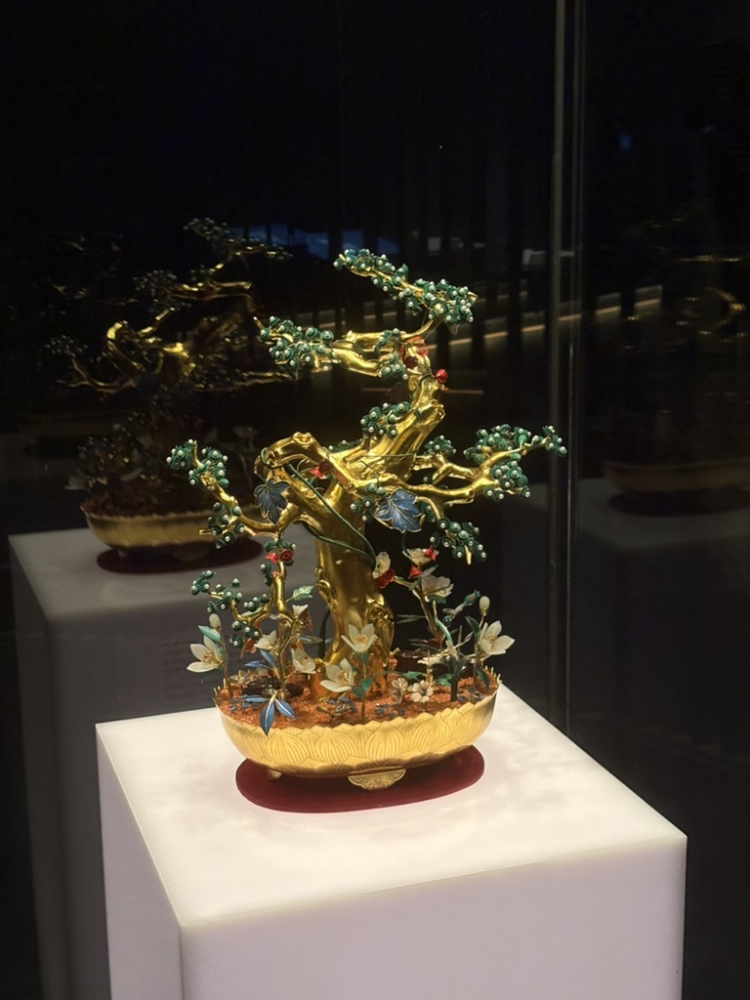

가볍게 돈덕전을 구경하고 바로 앞에 있는 국립현대미술관 덕수궁관에 들린다.

경로: 시청역 12번 출구 -> 덕수궁 석조전, 돈덕전, **[국립현대미술관]** -> 서울시청 서소문청사 -> 서울시립미술관 -> 배재학당 역사박물관 -> 덕수궁 중명전  -> 정동길 -> 구 러시아 공사관 -> 고종의 길 -> 국립정동극장 세실마루 전망대

이 곳에서는 '이대원: 당신을 슬프게 하는 것은 하나도 없다'라는 전시를 올해 11월 8일까지 진행한다.

들어가기 전 국립현대미술관 덕수궁관 앞에 있는 배롱나무를 찍었다. 흐린 하늘과 활짝핀 꽃의 진한 분홍빛깔의 조합이 마음에 든다.

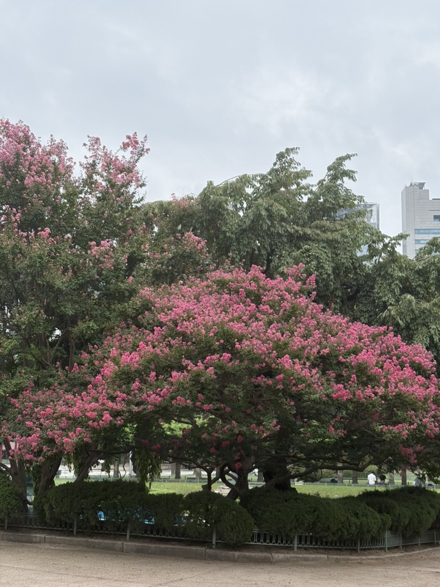

국립현대미술관 덕수궁관의 입장료는 2천원이다. 이대원의 그림을 천천히 구경한다. 

시기별로 공간을 나누어 4개의 섹션을 구성했는데 아래의 그림은 1960년에 자택의 벽면과 담쟁이의 일부를 그린 것이다.

그림의 질감과 색, 평면 구성이 예뻐서 사진으로 남겨놨다. 이 차분한 색감은 나중에 완전히 화사하게 뒤바뀐다.

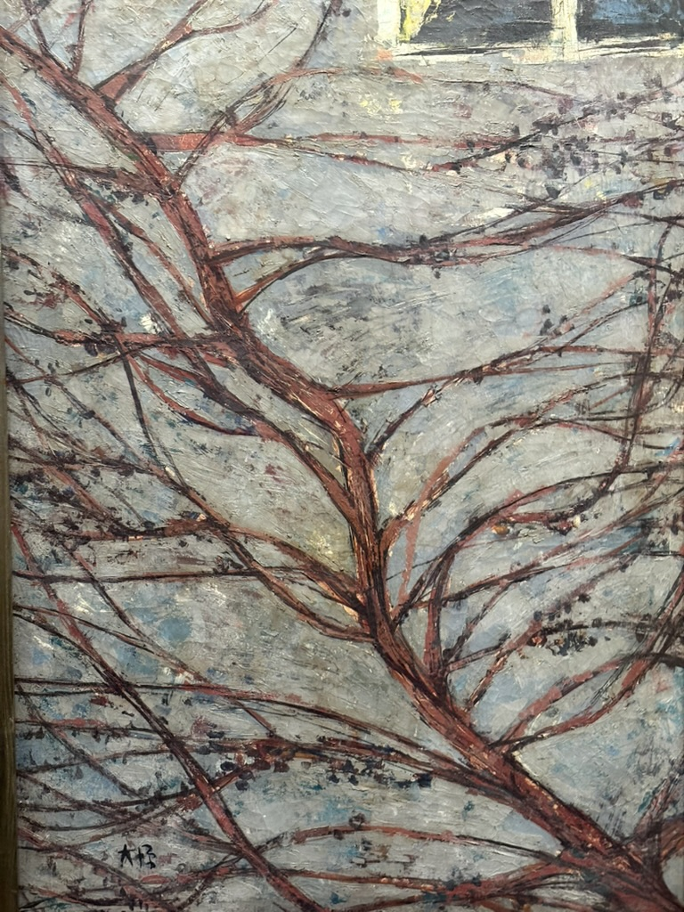

이번 전시의 제목인 '사람을 슬프게 하는 것은 하나도 없다'는 마지막 섹션의 제목이다.

이대원은 말년에 고향 파주에서 산과 사과나무, 들판을 그렸는데 자신만의 주체적인 화법으로, 더 넓고 깊은 그림을 구사했다.

입구 벽면에 있는 설명 중 '관람자는 그림을 단순히 바라보는 게 아닌 그 안으로 들어간 것처럼 느끼게 된다'는 문구가 있었다.

그래서 마치 그 안에서 걸어다니고 있는 나를 상상하며 그림을 바라보았다.

아래 그림에서 바람에 흔들리는 들판과 나뭇가지가 보였다. 전시장을 돌아다니며 이 모습을 생각해보니 바람 소리가 들리는 것 같았다.

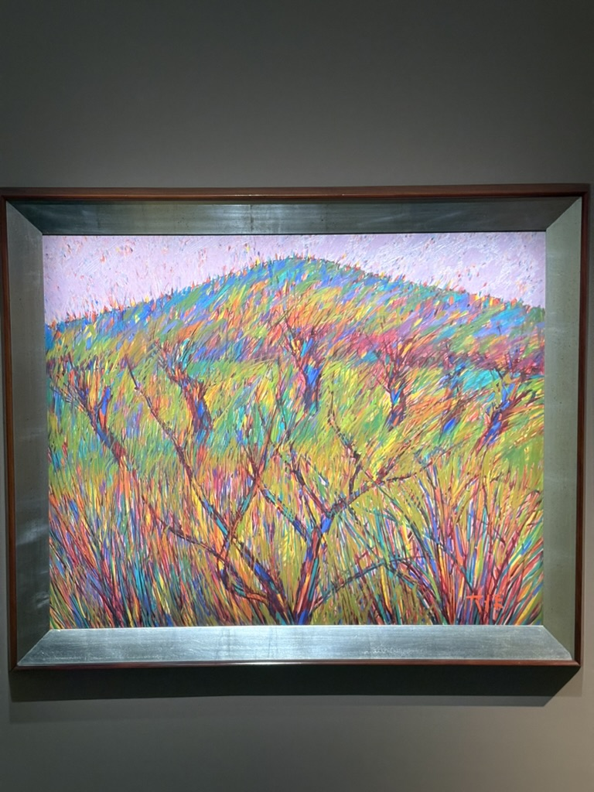

오늘은 금요일 오전인데도 불구하고 사람들로 붐볐다. 평소보다 훨씬 많아서 그림 앞으로 사람들이 번번이 지나갔다.

그래서 생각을 바꿨다. 그림으로부터 조금 떨어져서 사람들과 그림을 함께 보기로 했다.

사진을 찍으려고 하거나 골똘히 바라보는 사람들의 모습을 바라보는 것도 하나의 재미였다.

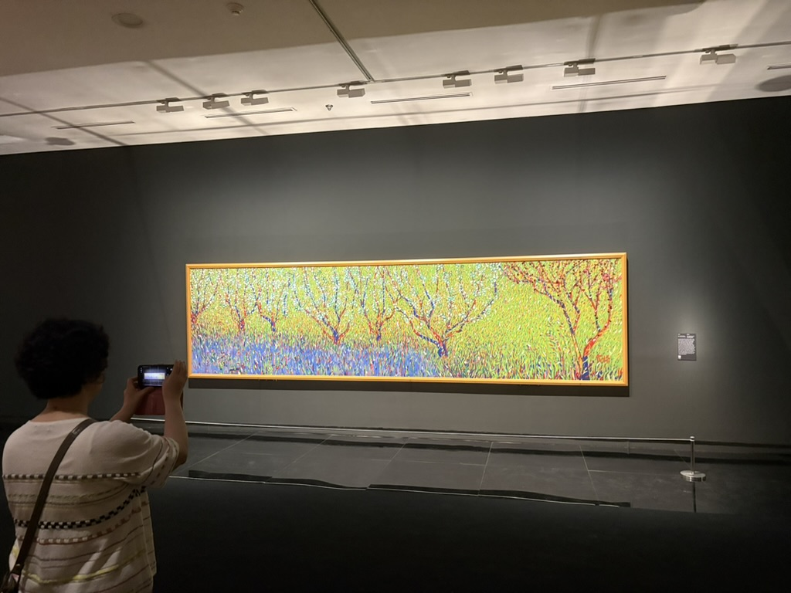 

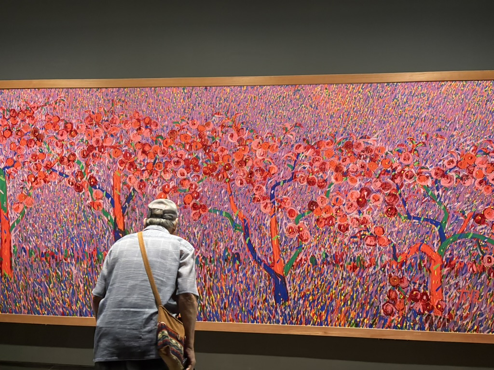

전시장을 나온 뒤 앞에 있는 분수대를 찍어봤다.

정원너머로 나무에 가려진 중화전이 보인다. 그리고 왼쪽에 서울시청이 조금 나온다. 이따가 저 쪽으로 가서 이 곳을 다시 구경할 것이다.

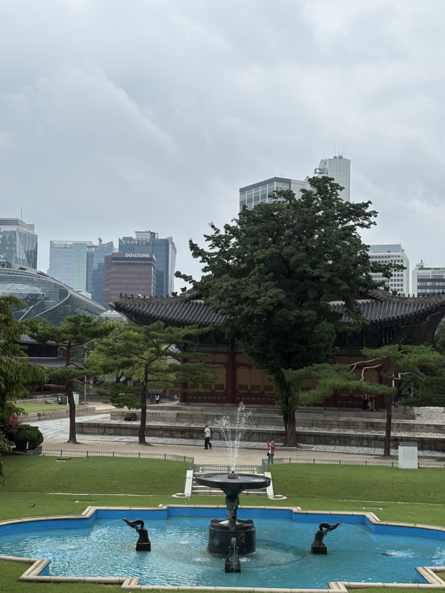

아까 왔던 덕수궁 돈덕전 쪽으로 가면 덕수궁 외곽을 도는 산책길이 있다. 

가는 길에 저 멀리 고양이가 보인다.

덕수궁에도 고양이가 살고 있나 보다.

위를 쳐다보다가 가볍게 폴짝 뛰어올라 수풀로 들어서려고 한다.

그냥 지나칠 수 없지. 고양이에게 다가서기로 한다.

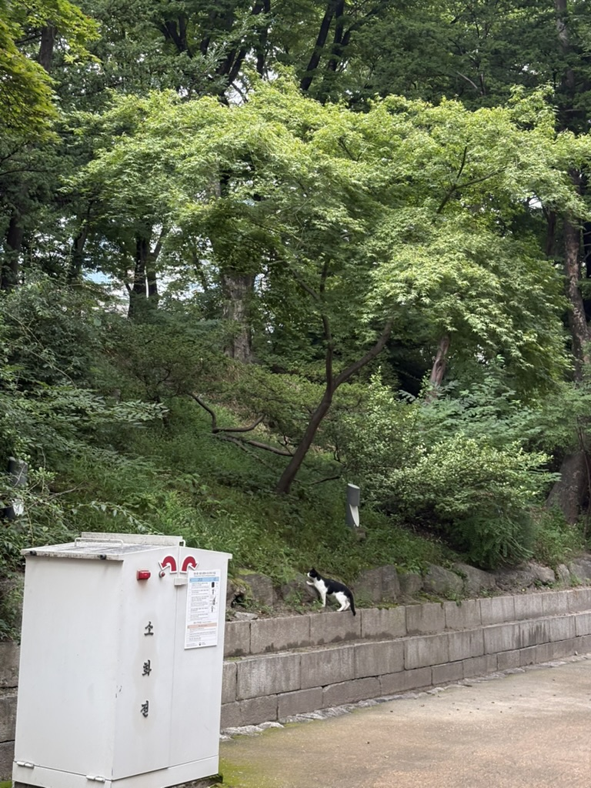

천천히 녀석에게 다가가니 경계하며 빤히 나를 쳐다본다.

까만색과 흰색이 적절히 섞인 예쁜 고양이다.

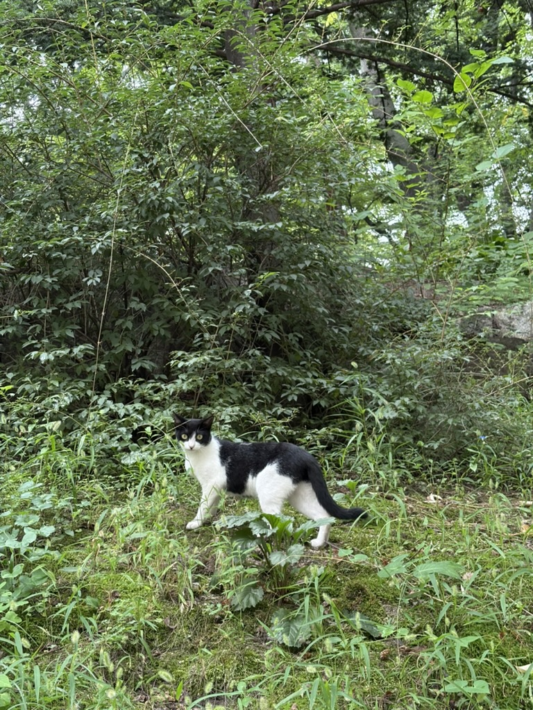

조금 더 다가가니 도망치듯 수풀로 숨어버렸다. 사람을 무서워하는 고양이였다.

반대쪽을 보니 덕수궁 석조전의 뒷편이 있었다. 배관마저 완벽히 좌우대칭을 이루고 있는 모습을 볼 수 있다.

이번에도 고양이 덕분에 우연한 발견을 하게 되었다.

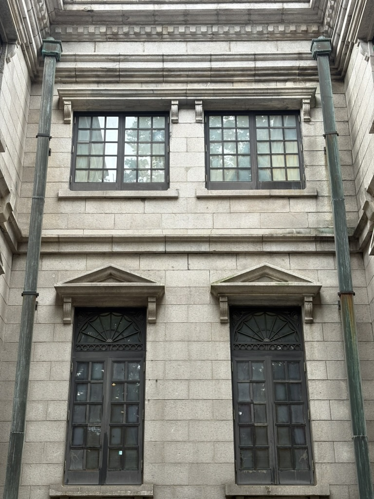

다시 산책길로 간다. 

그런데 아까 도망친 고양이와 다시 마주쳤다. 더위를 피하려고 나무 밑에 있는 모습이었다.

이번에도 빤히 나를 쳐다본다. 언제든 달아날 수 있게 발을 앞으로 뻗은 모습이다. 쳇 이번엔 내가 먼저 간다.

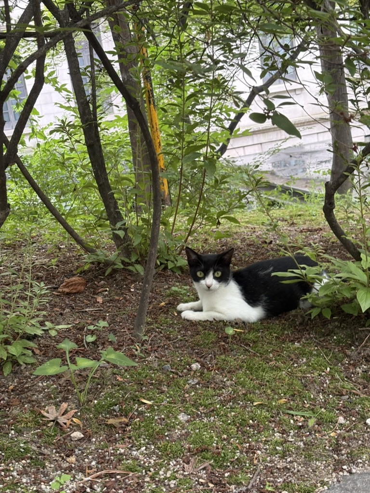

이 길은 내가 덕수궁에서 가장 좋아하는 길이다. 

키가 큰 나무 사이로 길이 놓여 있고 오른편으로 덕수궁의 전각들이 보여 마치 궁궐 속 숨은 장소를 걷는 듯한 기분을 들게 해준다.

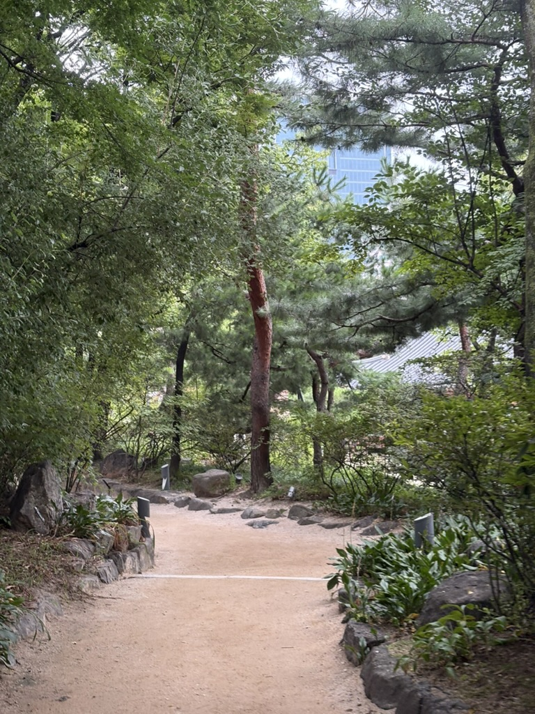

길을 따라 나오면 석어당, 정관헌, 중화전 등을 구경할 수 있다.

중화전을 등지고 분수대와 아까 전시를 본 국립현대미술관을 이 곳에서 다시 바라봤다.

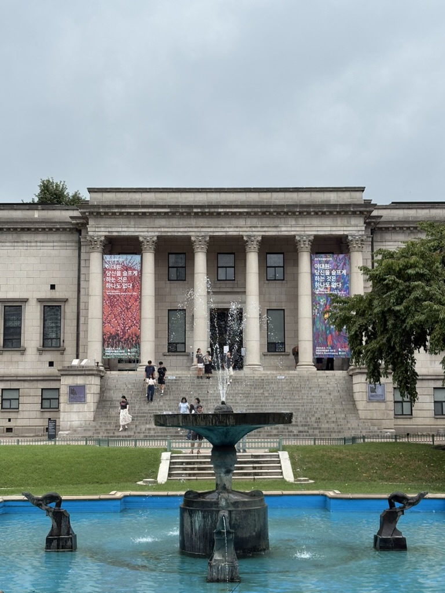

마지막으로 카페 겸 기념품샵에 들린다.

공책이 있길래 살까하다가 한 글자도 안적히고 집 서랍에 처박혀 있는 다른 공책들을 생각하며 참았다.

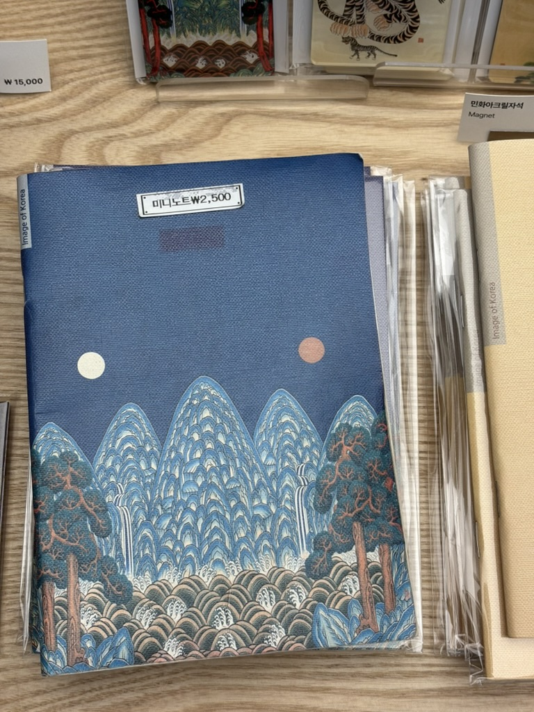

덕수궁 입장료 1천원, 국립현대미술관 2천원으로 볼 거 다보고 신나게 걷다 나왔다.

배가 밥달라고 꼬르륵 외치길래 근처 지하 1층에 있는 식당에 들어가 돈까스를 시켜 먹었다.

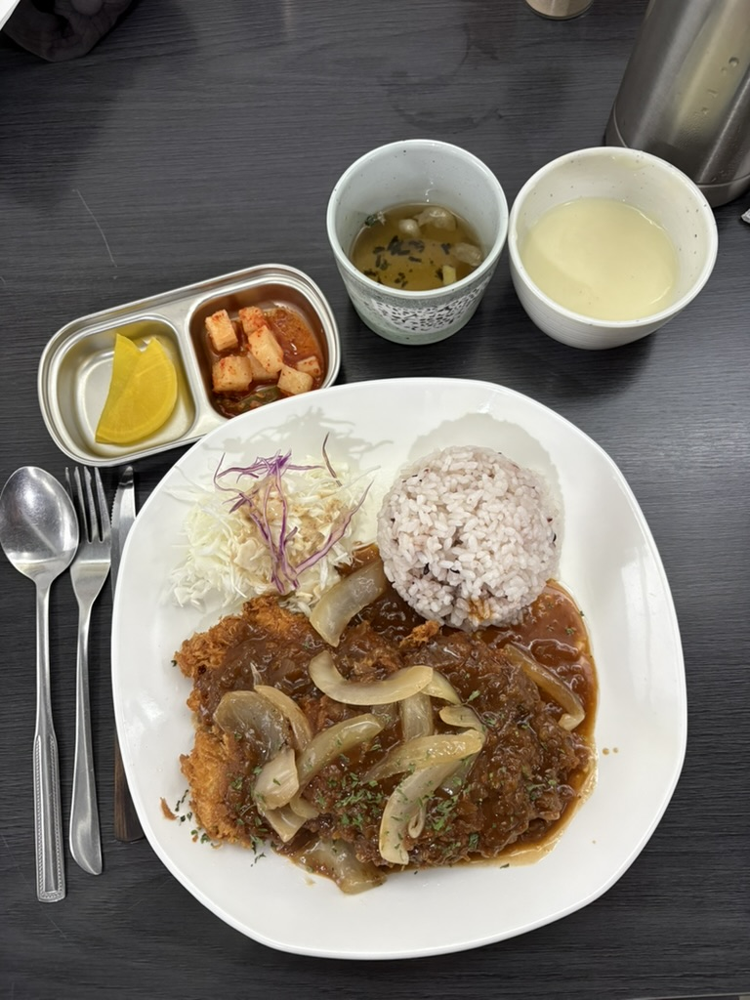

경로: 시청역 12번 출구 -> 덕수궁 석조전, 돈덕전, 국립현대미술관 -> **[서울시청 서소문청사]** -> 서울시립미술관 -> 배재학당 역사박물관 -> 덕수궁 중명전  -> 정동길 -> 구 러시아 공사관 -> 고종의 길 -> 국립정동극장 세실마루 전망대

이제 서울시청 서소문청사를 갈 차례이다. 이 곳 13층 일부가 전망대로 일반인에게 공개되어 있으며 따로 예약하지 않고 이용할 수 있다.

들어가면 관람객을 위한 출입구가 따로 마련되어 있다. 엘레베이터를 타고 가서 전망대에 도착했다.

위에서 바라본 덕수궁과 국립현대미술관 덕수궁관이다.

궁궐의 크기에 비해 사람은 개미 콩알딱지만큼 작아보인다. 중화전이 저 정도로 컸었구나 하는 생각이 든다.

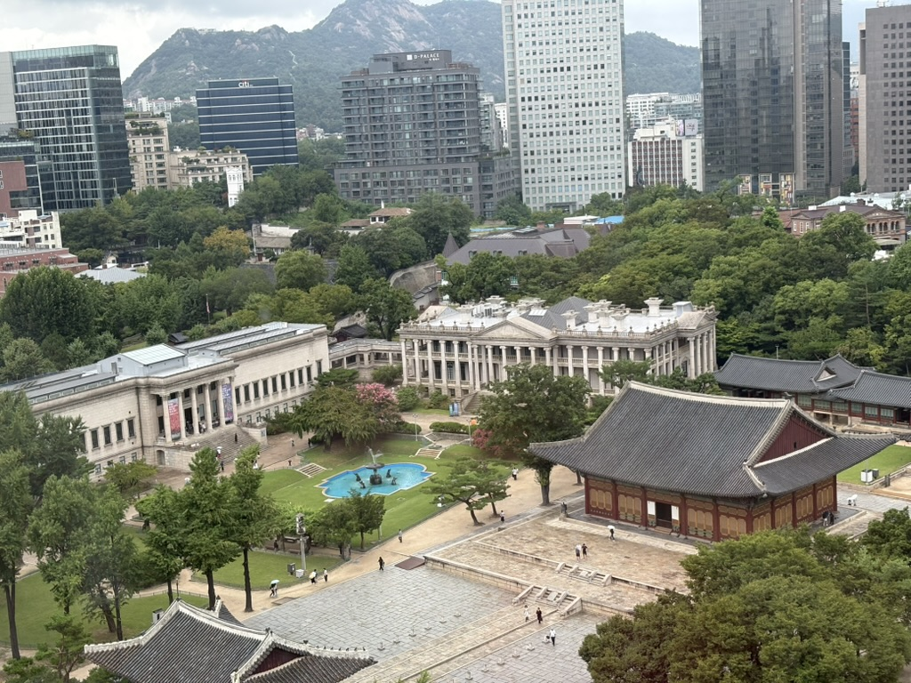

덕수궁 궁궐 뒷편으로 국립정동극장과 서울주교좌성당이 보인다.

조금 이따가 저 곳의 전망대에 올라가서 경치를 구경할 것이다.

사진에 담기진 않았지만 전망대에서 세종대로와 경복궁도 볼 수 있었다.

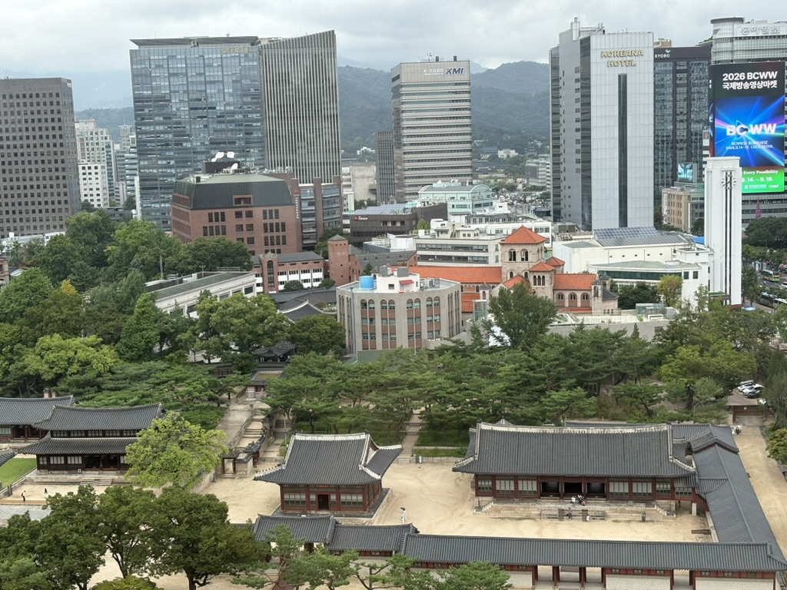

서울시청 서소문청사에서 바라본 서울시청 본청사의 모습이다. 본청사의 전망대에도 올라가서 경치를 구경할 예정이다.

앞 쪽으로 서울도서관(서울시청 구청사)과 서울광장이 있다.

본청사 외관 디자인을 왜 저렇게 했을지 궁금해서 찾아봤는데 각종 규제(고도 제한, 문화재 등)로 인해 엄격한 제한을 받아서 저렇게 만들어진건가 했다.

그럼에도 불구하고 주변 건물과 조화롭지 않을 뿐더러 건물 자체가 못생겼다.

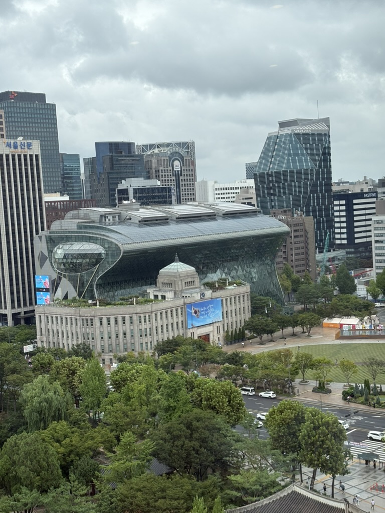

경로: 시청역 12번 출구 -> 덕수궁 석조전, 돈덕전, 국립현대미술관 -> 서울시청 서소문청사 -> **[서울시립미술관]** -> 배재학당 역사박물관 -> 덕수궁 중명전 -> 정동길 -> 구 러시아 공사관 -> 고종의 길 -> 국립정동극장 세실마루 전망대

서소문청사에서 나와서 덕수궁길을 걷는다. 덕수궁 돌담길로도 유명한 길이다.

이 길을 따라 가다보면 사거리가 나오는데 바로 안쪽으로 서울시립미술관이 있다.

'유영국: 산은 내 안에 있다'와 '기술의 저변: 경계에 선 장면들', '사랑의 기원' 전시를 개최하고 있다.

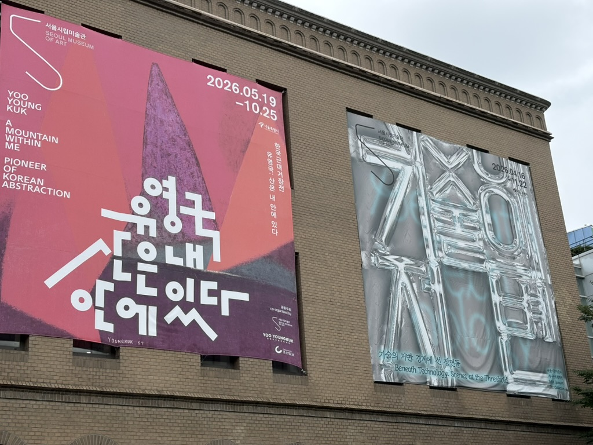

유영국은 아까 국립현대미술관 덕수궁관에서 본 전시의 주인공인 이대원과 동문이다. 둘 모두 사토 구니오라는 사람에게 교육받은 바 있다.

전시장 한 켠에 걸린 사진. 유영국(왼쪽)과 김환기(오른쪽)가 거리를 지나는 모습이다.

언젠가 한 번쯤은 저 시절의 복장이 유행했으면 좋겠다는 생각이 든다.

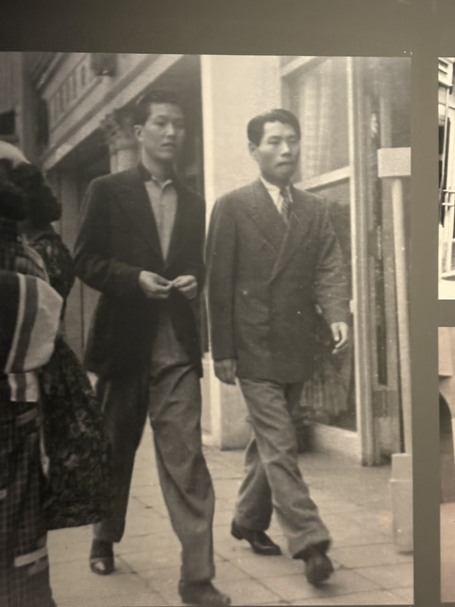

이대원 전시처럼 시기 별로 섹션을 구성해놓았다. 유영국 화가 역시 시기에 따라 그림을 표현하는 방식이 변해감을 볼 수 있었다.

초기의 기하학적인 형태는 삼각형, 직선, 마름모 등 더 절제된 구도로, 거친 질감은 매끄러운 질감으로 이어진다.

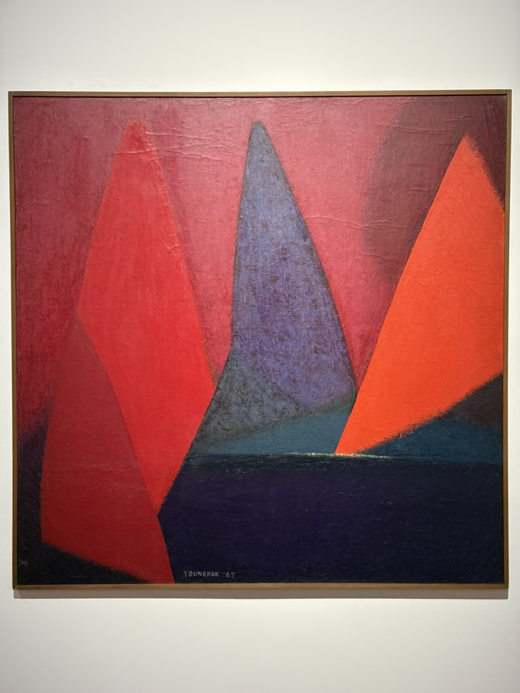

경로: 시청역 12번 출구 -> 덕수궁 석조전, 돈덕전, 국립현대미술관 -> 서울시청 서소문청사 -> 서울시립미술관 -> **[배재학당 역사박물관]** -> 덕수궁 중명전 -> 정동길 ->  구 러시아 공사관 -> 고종의 길 -> 국립정동극장 세실마루 전망대

각 층의 전시를 본 후 미술관에서 나왔다. 왼쪽에 있는 길로 들어서면 배재학당 역사박물관으로 들어가는 길이 나온다.

정면에서 찍은 배재학당. 이제보니 너무 가까이서 찍어서 전체 모습을 담지 못한 것 같다.

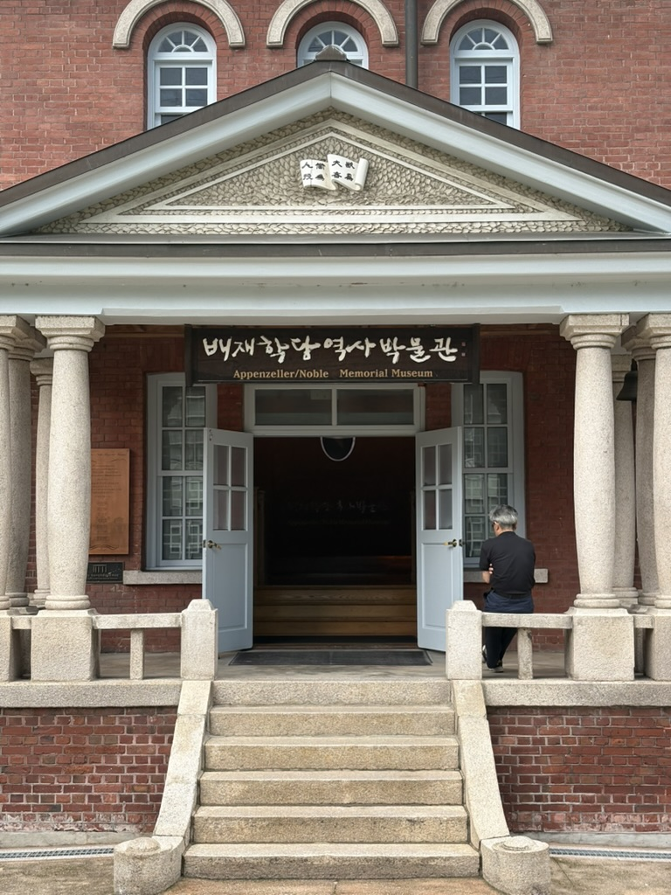

배재학당은 우리나라 최초 근대식 교육기관으로 미국의 선교사 아펜젤러가 고종 때 설립했다.

'배재'라는 단어가 유용한 인재를 기르고 배우는 집이라는 뜻이라는 걸 이 곳 전시를 보다가 알았다.

주시경 선생, 이승만 초대 대통령, 김소월 시인 등 역사적인 인물들이 배재학당을 졸업하였다. 

배재학당에서 나와 왼쪽으로 꺾으면 아까 서울시립미술관으로 들어갔던 사거리가 다시 나온다. 국립정동극장 옆에 있는 길로 들어선다.

경로: 시청역 12번 출구 -> 덕수궁 석조전, 돈덕전, 국립현대미술관 -> 서울시청 서소문청사 -> 서울시립미술관 -> 배재학당 역사박물관 -> **[덕수궁 중명전]** -> 정동길 -> 구 러시아 공사관 -> 고종의 길 -> 국립정동극장 세실마루 전망대

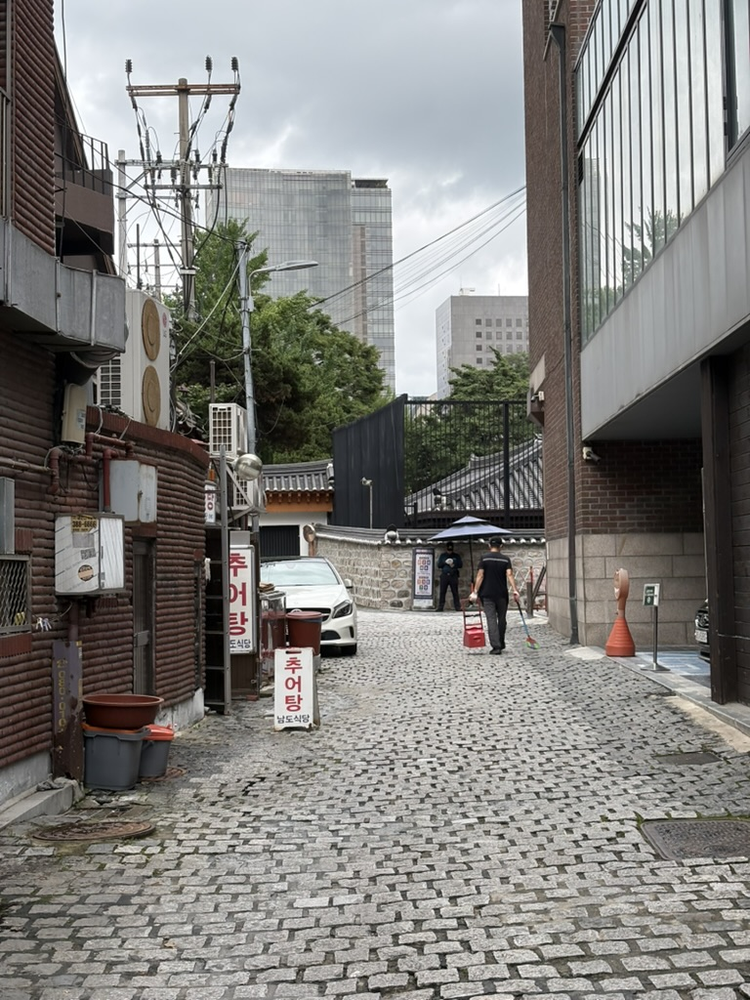

국립정동극장 옆길로 가면 덕수궁 중명전이 나온다. 

덕수궁 중명전은 이토 히로부미와 을사오적이 1905년에 을사늑약을 체결한 곳이자, 헤이그 특사를 파견한 곳이다.

1904년 덕수궁(당시 경운궁)에 큰 불이 나서 고종이 수옥헌이라고 하는 도서관에서 거처하고 업무를 봤다고 하며 이 때 이름을 중명전으로 바꾸었다고 한다.

고종은 조약 체결을 끝까지 반대했으나 강제로 체결되었다. 이 조약에 대한 내용이 중명전 내부 전시실에 나온다. 

당시 일본은 대한제국을 '보호한다'는 명목하에 외교권을 빼앗고 행정을 통치하는 통감부를 설치한다. 초대 통감은 이토 히로부미이다.

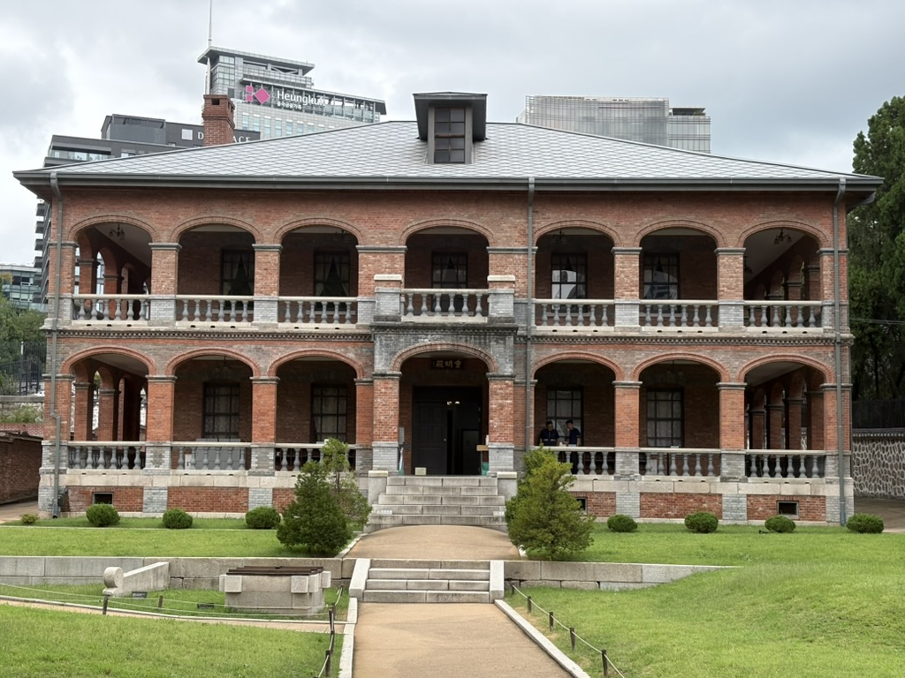

경로: 시청역 12번 출구 -> 덕수궁 석조전, 돈덕전, 국립현대미술관 -> 서울시청 서소문청사 -> 서울시립미술관 -> 배재학당 역사박물관 -> 덕수궁 중명전 -> **[정동길]** -> 구 러시아 공사관 -> 고종의 길 -> 국립정동극장 세실마루 전망대

덕수궁 중명전에서 나와 정동길을 걷는다. 

파릇파릇한 나뭇잎들이 대롱대롱 가지에 매달려있다. 길가에는 낙엽 하나 없다.

이 길에는 분위기 좋은 식당과 카페가 즐비하다. 아직은 날이 습하고 더워서 해가 진 다음에야 바깥 공간에서 식사할 수 있을 것 같다.

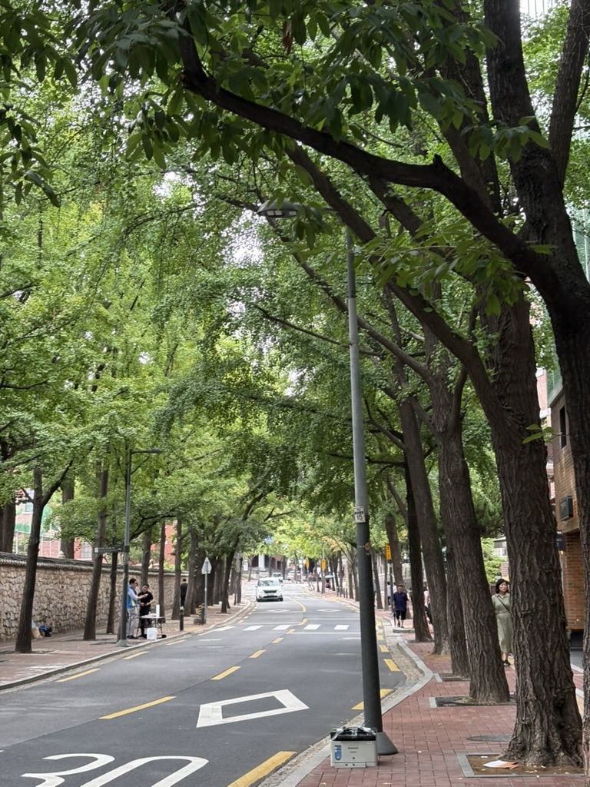

경로: 시청역 12번 출구 -> 덕수궁 석조전, 돈덕전, 국립현대미술관 -> 서울시청 서소문청사 -> 서울시립미술관 -> 배재학당 역사박물관 -> 덕수궁 중명전 -> 정동길 -> **[구 러시아 공사관]** -> 고종의 길 -> 국립정동극장 세실마루 전망대

정동길을 걷다보면 예원학교가 나온다. 예원학교 옆에 길이 있다.

그 길은 정동역사공원으로 가는 길이다. 공원 위 쪽에는 구 러시아 공사관이 있다.

이 곳은 을미사변 이후 신변의 위협을 느껴 고종이 1896년 경복궁을 떠나 거처를 옮긴 곳이다. (아관파천)

고종은 이후 1년 뒤 덕수궁으로 환궁하고 외세 간섭에서 벗어나고자 자주독립을 선포하여 대한제국을 수립한다.

지금 내가 있는 자리가 과거 중요한 역사가 만들어진 곳이라고 생각하며 걸어보면 괜히 의연해진다.

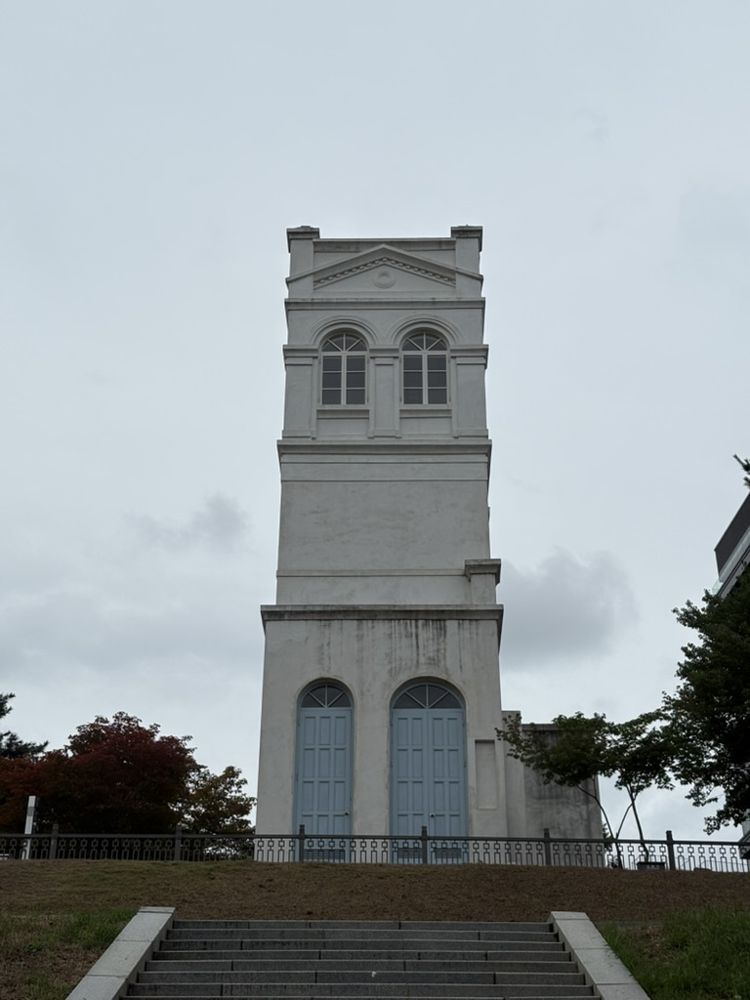

경로: 시청역 12번 출구 -> 덕수궁 석조전, 돈덕전, 국립현대미술관 -> 서울시청 서소문청사 -> 서울시립미술관 -> 배재학당 역사박물관 -> 덕수궁 중명전 -> 정동길 -> 구 러시아 공사관 -> **[고종의 길]** -> 국립정동극장 세실마루 전망대

구 러시아 공사관 옆 길로 올라가면 어떤 문이 있다. 그 문을 건너면 고종의 길이 시작된다.

고종이 아관파천 이후 머물던 러시아 공사관에서 덕수궁을 오갈 때 사용한 길로 추정되어 고종의 길이라고 한다.

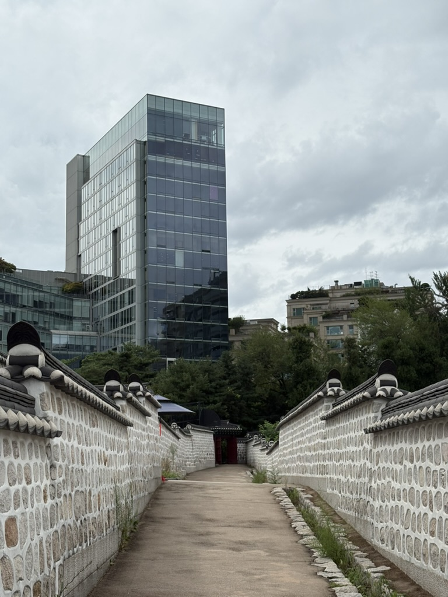

고종의 길을 걷고 나면 덕수궁 선원전 영역이 나온다.

지금은 한창 복원 공사를 진행하고 있다.

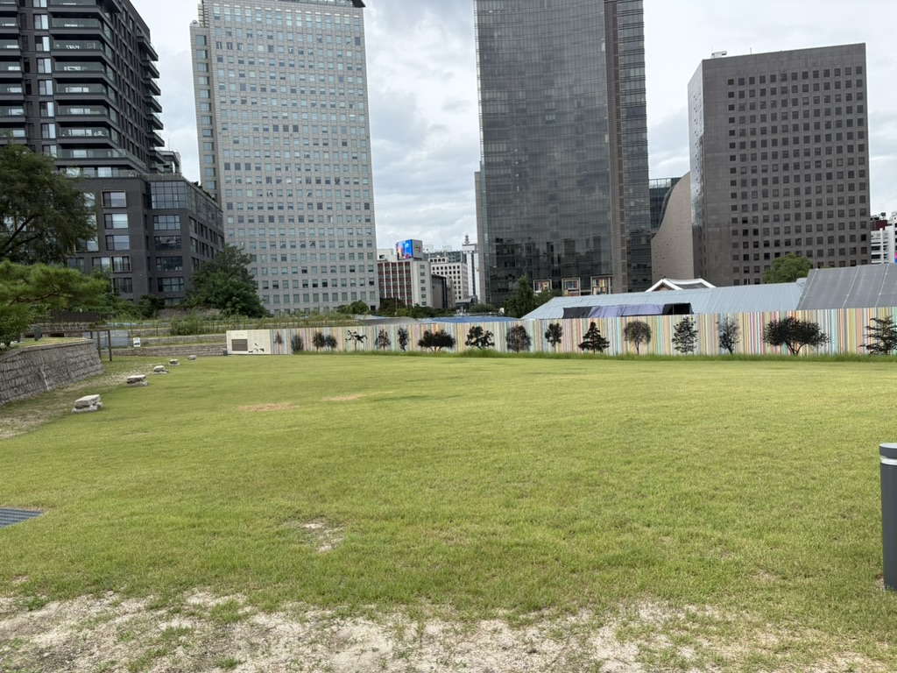

덕수궁 선원전 영역 앞에는 삼거리가 있다.

바로 직진하면 덕수궁 돌담길이 나온다. 서울시립미술관으로 가는 덕수궁 돌담길과는 또 다른 매력이 있는 길이다.

이 길은 그동안 영국대사관 부지로 통행이 제한되다가 일반인에게 공개된지 이제 10년정도 지났다.

사진의 왼쪽은 주한영국대사관이고 오른쪽은 덕수궁이다.

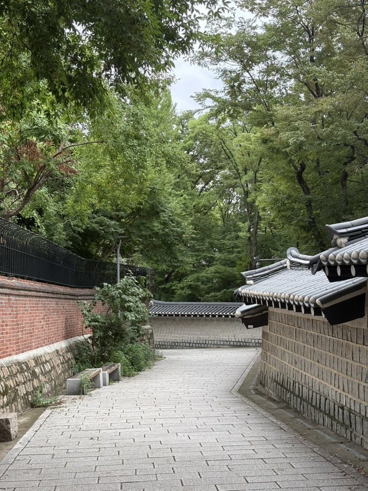

경로: 시청역 12번 출구 -> 덕수궁 석조전, 돈덕전, 국립현대미술관 -> 서울시청 서소문청사 -> 서울시립미술관 -> 배재학당 역사박물관 -> 덕수궁 중명전 -> 정동길 -> 구 러시아 공사관 -> 고종의 길 -> **[국립정동극장 세실마루 전망대]**

이 길의 끝은 신기하게도 덕수궁 입구이다. 영국대사관이 있어서 바깥으로 향하는 길은 막혀있고 덕수궁 뒷길로 들어가야 한다.

아까 고양이를 마주치고 걸어간 길 옆으로 임시 통행로가 있다.

특이하게 속이 비어 있는 나무를 봤다. 다이어트를 과하게 한 것 같다. 마운자로라도 맞았나보다.

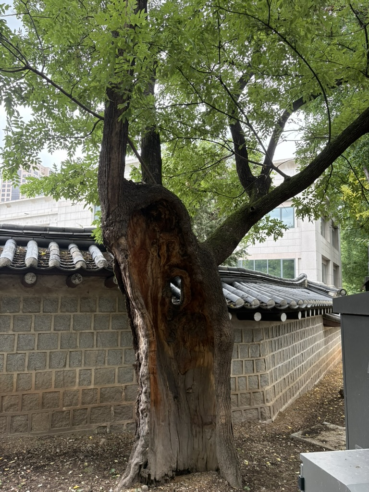

다시 덕수궁에서 나오면 아래의 사진처럼 서울시청이 보이는 국립정동극장 세실 길이 나온다.

조금 내려가다보면 왼쪽에 뜬금없이 엘레베이터가 있는데 이걸 타고 올라가면 세실극장 옥상전망대에 이른다.

입장료를 따로 받지 않으니 부담없이 갈 수 있다.

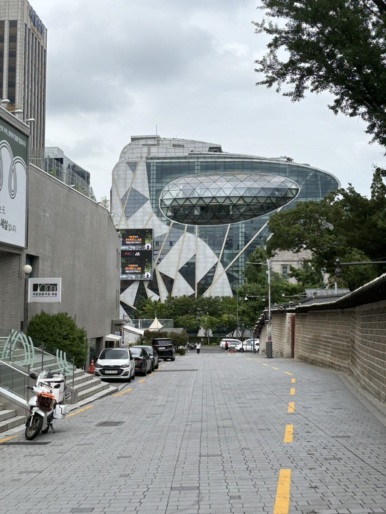

옥상전망대에 올라가서 대한성공회 서울주교좌성당을 찍어본다.

사진으로 남기지는 않았으나 여기선 서울시청의 전망대 사람들이나 덕수궁을 관람하고 있는 사람을 볼 수 있다.

다른 전망대에 비해 고도가 낮아서 서울 일대를 보는 것보다 옆에 있는 성당을 보는게 좋았다.

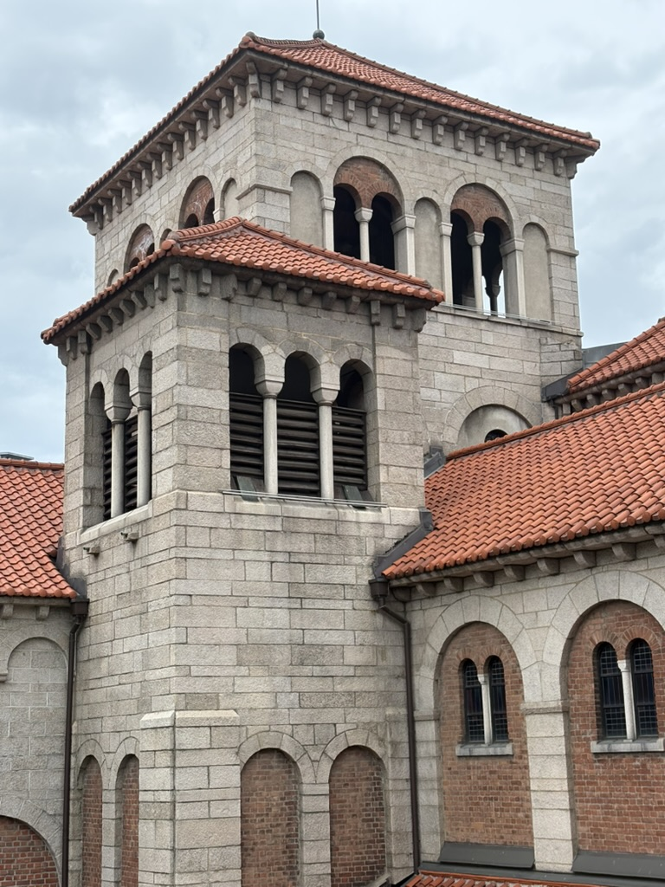

원래는 서울도시건축전시관도 가려고 했었으나 내부 공사 중인 것 같아서 발걸음을 돌렸다.

이제 횡단보도를 건너서 서울시청을 간다.

## 서울시청 일대

경로: **[서울광장]** -> 서울시청 하늘전망대, 하늘광장 갤러리, 내 친구 서울 -> 환구단

서울광장에서 바라본 서울시청과 서울도서관이다. 서울도서관은 다음 산책 때 가보기로 한다. 

서울광장은 1910년에 덕수궁 담길이 있던 자리이다. 그래서 서울광장에 이 길을 재현하여 놓았다.

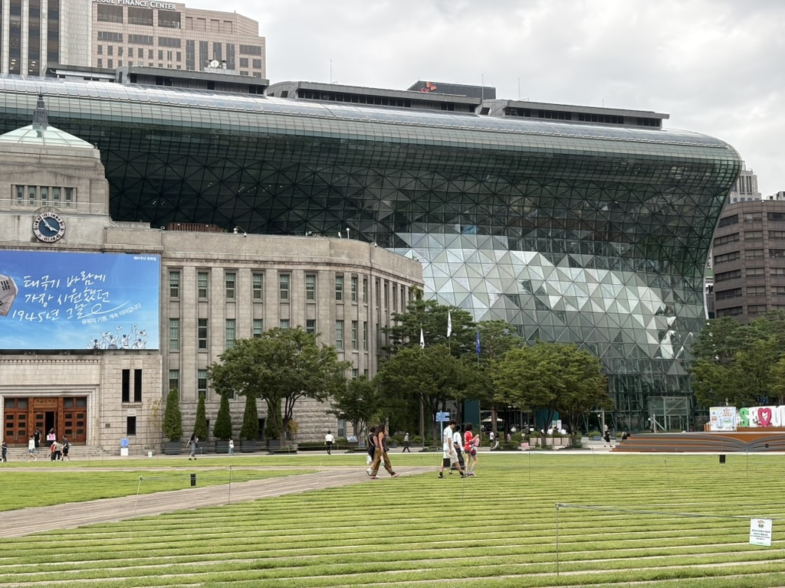

서울광장을 지나 서울도서관 앞에 도착했을 때, 뒤를 돌아보면 더 플라자 호텔과 서울센터빌딩 사이로 남산타워가 우뚝 서있는 걸 볼 수 있다.

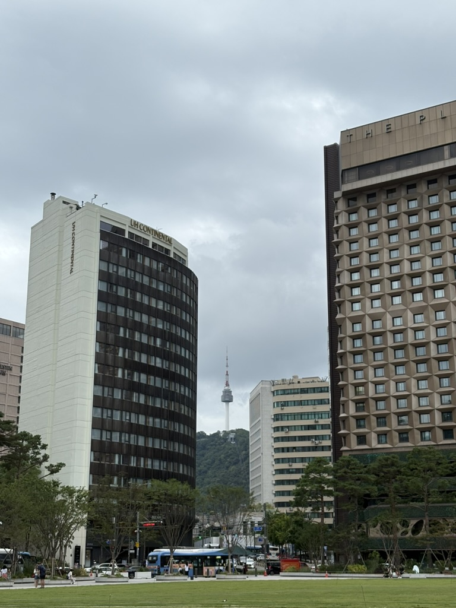

경로: 서울광장 -> **[서울시청 하늘전망대]**, 하늘광장 갤러리, 내 친구 서울 -> 환구단

서울시청에 들어간다. 직원들의 업무공간이면서도 시민을 위해 개방한 공간들이 많이 있다.

8층과 9층은 하늘전망대와 하늘전망대 갤러리가 있다. 서소문청사처럼 전용 엘레베이터를 타고 올라간다.

도착하자마자 TV로 독도 실시간 방송을 보여주고 있었다.

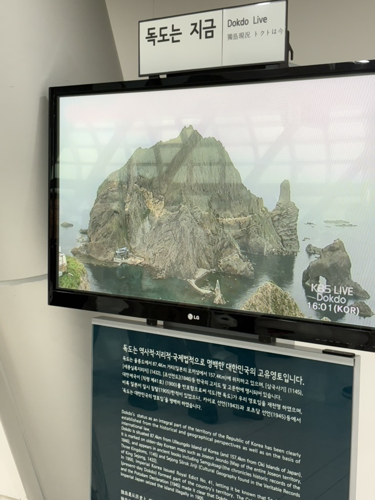

하늘전망대에서 바라본 국립정동극장과 서울주교좌성당이다.

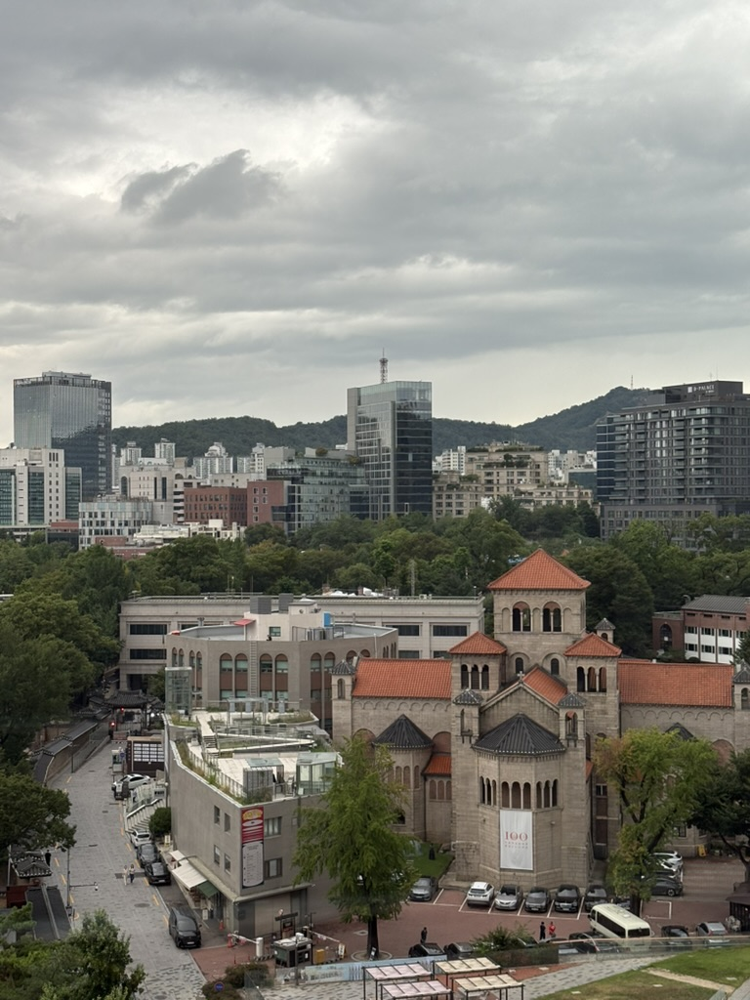

덕수궁과 국립현대미술관은 조금 멀리서 보인다.

국립정동극장과 서울주교좌성당 보기엔 본청사의 하늘전망대가 좋지만 외관 디자인으로 인해  앞이 뜨문뜨문 가려져 있어서 전체적으로 구경하려면 서소문청사의 전망대가 좋은 것 같다. 

특히 하늘전망대에서 서울광장을 보기가 어렵다.

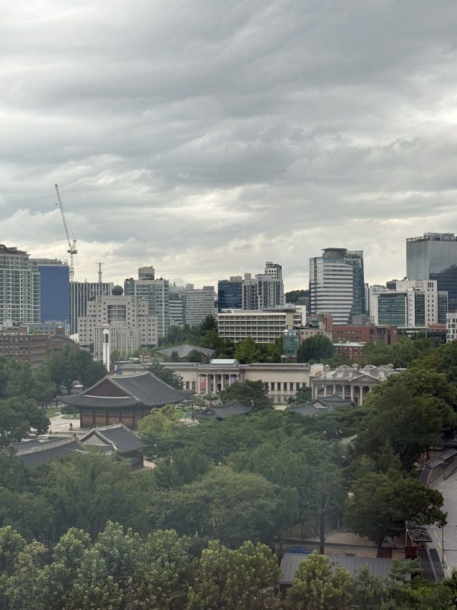

참고로 서울도서관에는 야외 전망대가 있다.

다음 정동 산책 때 저 곳에 가서 전망을 살펴봐야겠다.

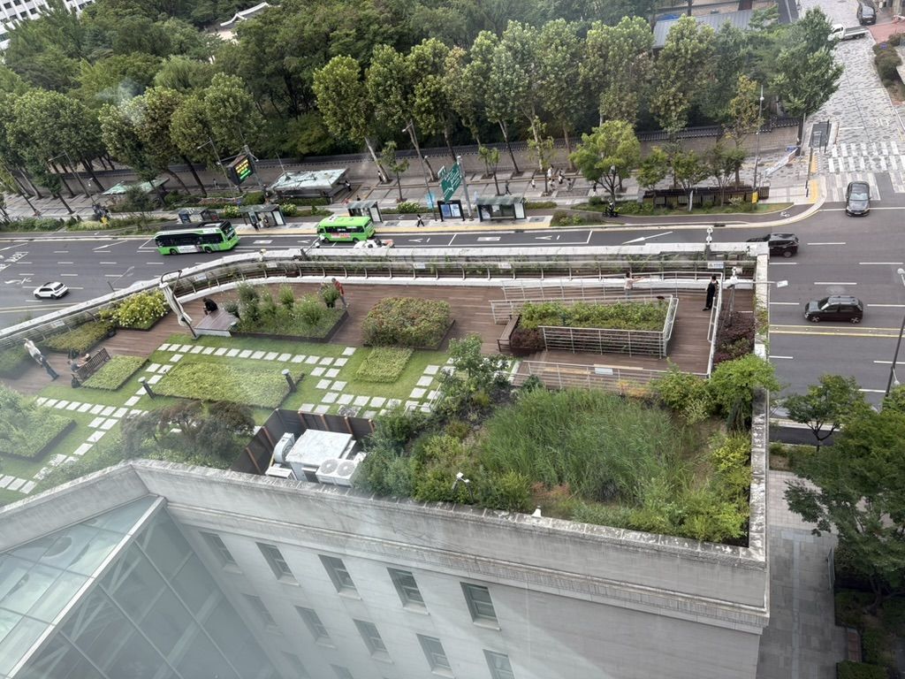

경로: 서울광장 -> 서울시청 하늘전망대, **[하늘광장 갤러리]**, 내 친구 서울 -> 환구단

계단을 타고 8층으로 내려가면 '서울의 흔적'이라는 전시를 하고 있다.

사라져가는 골목의 소소한 일상과 풍경을 보여주는 전시였다. 

서울은 참 신기한 곳이다. 조선시대와 근대부터, 근현대 및 6·25 전쟁 이후 빠른 발전을 거듭한 현재까지 다양한 모습이 길거리에 남아있다.

이제 서촌과 북촌, 그리고 정동 일대를 돌아보며 그 일부분을 바라보았다. 서울은 아직도 보여줄 것들을 많이 갖고 있다.

사라져가는 것에 아쉬워해도 마냥 슬퍼할만할 필요는 없다. 공간의 모습은 언제나 바뀌기 마련이니까. 지금은 그 변화 속 일부 모습을 간직하고 있는 것이다. 

그렇기에 소중함을 느낄 수 있다. 이별을 생각하면 사랑이 떠오르듯이 말이다.

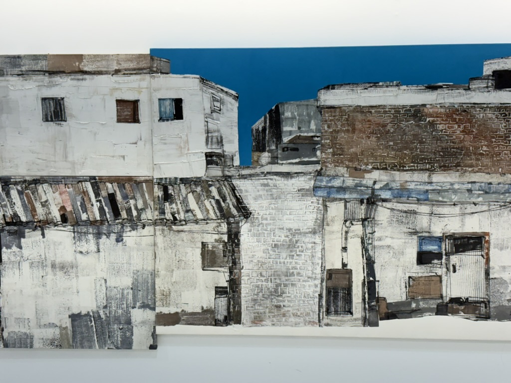

이렇게 말해놓고도 난 미련이 많은 사람이라 지나가는 것들에 대해 아쉬움을 느끼는 편이다.

그래서 이 프로젝트를 시작한 것이다. 내가 본 것들을 글과 사진, 약간의 동영상으로 남겨서 추억하고 싶었다.

경로: 서울광장 -> 서울시청 하늘전망대, 하늘광장 갤러리, **[내 친구 서울]** -> 환구단

하늘전망대에서 다시 엘레베이터를 타고 내려가면 내 친구 서울, 서울 갤러리라고 써 있는 곳이 보인다.

이 곳으로 내려가면 역사 전시관, 책방, 카페 등 다양한 시민 공간이 있다.

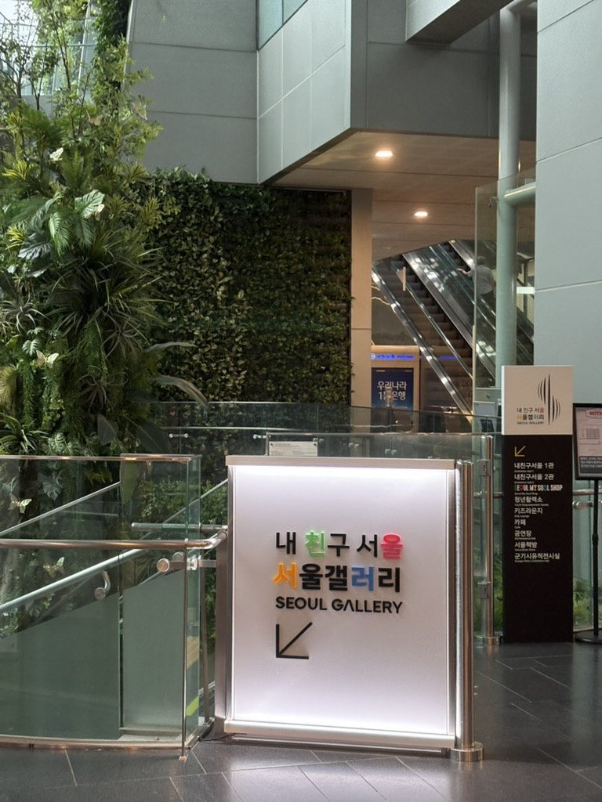

서울책방에서는 서울에 관한 책들을 판매하고 있었다.

아래의 사진은 서울에서 놀거리를 안내해주는 서울 플레이북 365 책과 사람들에 대한 이야기를 다루는 서울 메이트 365 책이다.

이 밖에도 서울과 관련된 역사, 행정, 건축, 심지어는 노량진, 망우동처럼 동네에 대해 다루는 책도 있다.

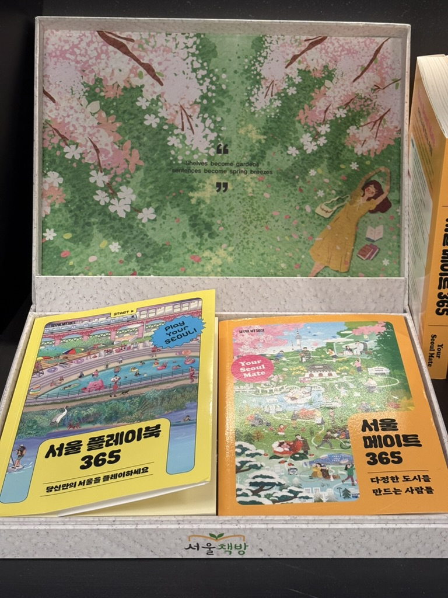

목이 말라서 뭐좀 마시고 싶던 찰나에 카페를 발견했다.

무인카페라길래 보니까 로봇이 커피를 만드는 가게였다. 서울시청의 로봇이 만들어주는 커피가 궁금했다.

로봇이 만들어주는 바닐라라떼. 영상 마지막 쯤에 나오는 온몸을 비틀며 라떼를 섞는 모습이 하찮아서 웃음이 나왔다.

<video controls>
    <source src="./images/서울시청_바닐라라떼.mov">
</video>

라떼를 훌쩍훌쩍 마시고 내 친구 서울 갤러리를 갔다. 이 곳은 올해 2월에 문을 연 따끈따끈한 새로운 공간이다.

1관은 서울의 정책을 알려주고 서울 전역을 축소화하여 표현한 전시 공간, 2관은 서울을 세계 주요 도시와 비교하여 서울의 경쟁력을 보여준다. 

사진에 담긴 것보다 훨씬 크게 구성되어 있어서 구경하는 재미가 있다.

서울 시청이 있는 곳이랑 신림동은 모형 중앙부에 있어서 찾기가 쉽지 않았다.

한강 근처에 있는 동네는 가까이에 있어서 쉽게 볼 수 있다. 한강뷰가 여기서도 빛을 발한다.

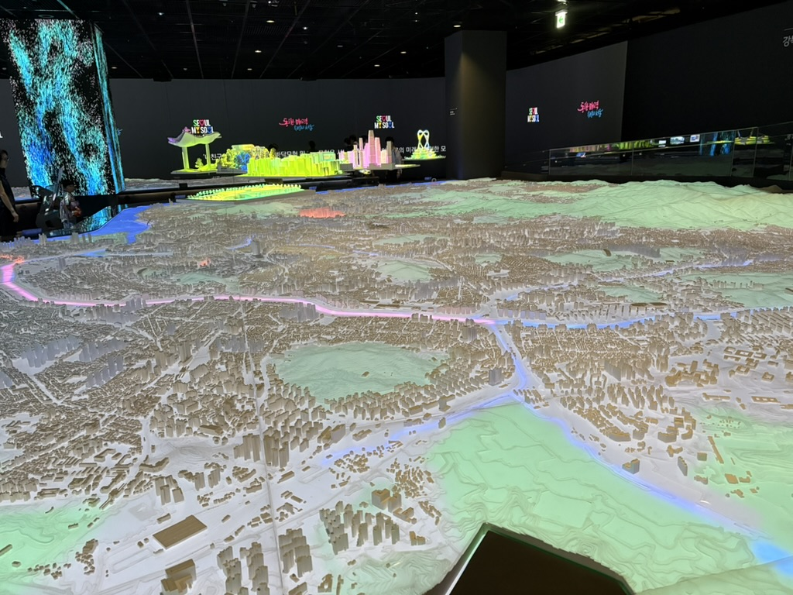

서울시청을 나와 오늘 산책의 마지막 경로인 환구단을 간다.

경로: 서울광장 -> 서울시청 하늘전망대, 하늘광장 갤러리, 내 친구 서울 -> **[환구단]**

아까 서울광장에서 남산타워를 볼 때 있던 서울센터빌딩 옆에 환구단이 있다.

환구단은 황제가 하늘에 제사를 드리는 곳이다. 조선총독부가 대부분 철거시키고 환궁우과 삼문 등 일부만 남겨놓았다.

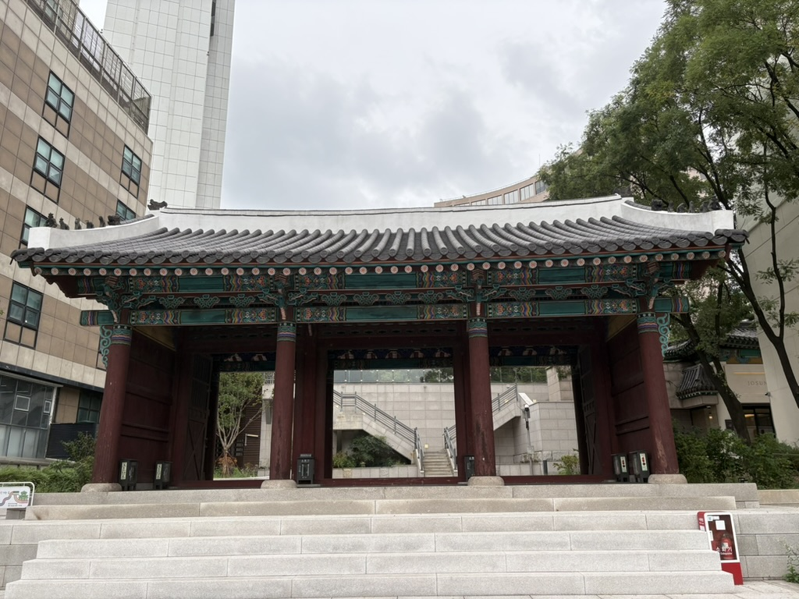

환궁우로 올라가는 계단에는 마치 멍이 든 것처럼 여러 알 수 없는 자국들이 묻어 있었다. 별로 사진으로 남기고 싶지는 않았다.

환궁우 근처에 있는 협문 위에는 용의 그림이 있다.

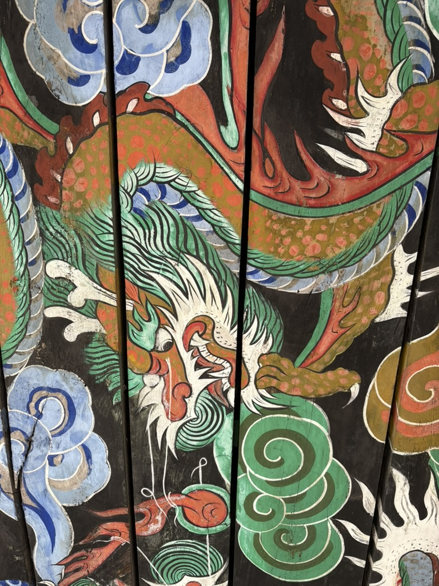

## 끝으로

오늘은 덕수궁과 서울시청 일대를 걸어보았다.

대한제국의 역사가 깃들어 있고, 미술관과 오래된 건물, 골목이 한데 모여 있는 곳이었다.

거리를 걷다 보면 익숙해서 그냥 지나쳤던 장소에도 생각보다 많은 이야기가 담겨 있다는 걸 알게 된다.

새로운 길을 알게 될지도 모른다. 그러면 그 곳은 이전과 다르게 느껴지게 된다. 이게 산책의 매력이다.

오늘 본 것도 언젠가는 사라지고 다른 모습으로 바뀔 것이다. 그러니 지금의 모습을 볼 수 있던 것만으로도 충분한 가치가 있다.

다음에는 또 무엇을 보게 될지 기대가 된다.

안녕

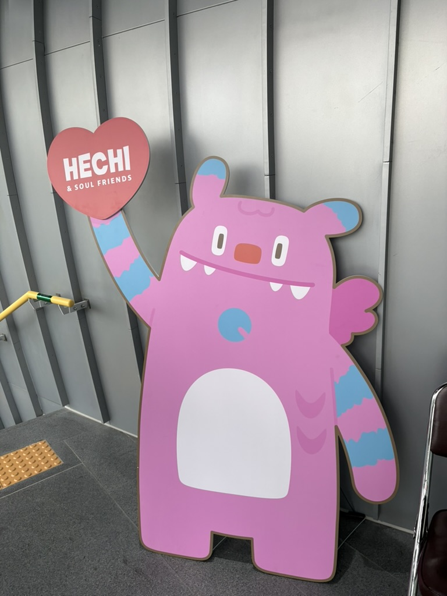