글의 순서
- [경복궁역](#경복궁역)
- [자하문로 서쪽](#자하문로-서쪽)
- [자하문로 동쪽](#자하문로-동쪽)
- [끝으로](#끝으로)

이번 방문 목적은 서촌이라는 동네를 걸어보며 이곳이 어떤 동네인지 알아보는 것이다. 그래서 서촌의 주요 명소와 공간을 둘러보고자 했다.

서촌은 경복궁 좌측-인왕산 동쪽 사이에 위치한 동네로 세종대왕이 태어난 곳이라 세종마을이라고도 한다. (세종대왕은 태종이 왕이 되기 전이라 궁궐에서 태어나지 않았다고 한다)

조선시대에는 중인(양반과 서민 사이)과 일반 서민들의 터전이었고 광복 이후에는 이중섭, 윤동주, 박노수 등의 예술가들이 살았다고 한다.

산책 경로: 경복궁역 2번 출구 -> 세종마을 음식문화거리 -> 이상의 집 -> 대오서점 -> 종로구립 박노수미술관 -> 윤동주 하숙집 -> 수성동 계곡 -> 해맞이동산 -> 통인시장 -> 통의동 보안여관 -> 대림미술관 -> 스타벅스 적선점

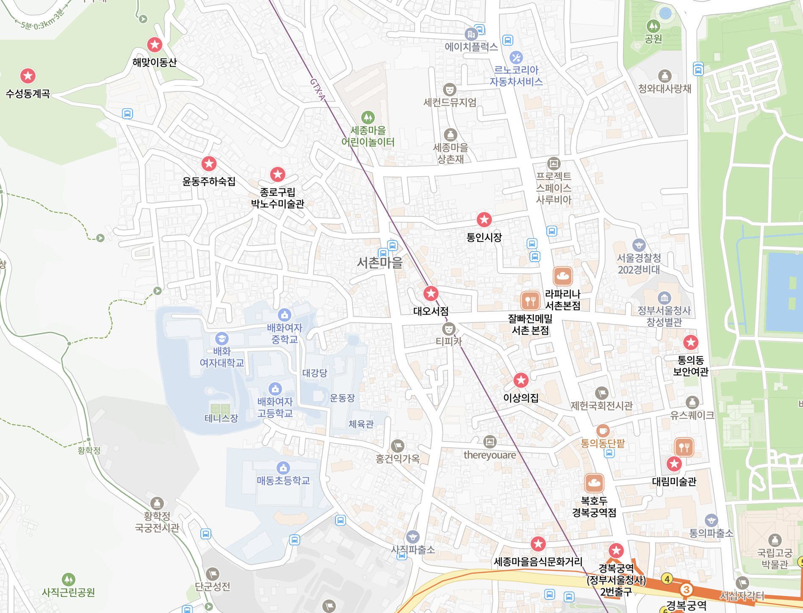

## 경복궁역

가장 먼저 집에서 나서 경복궁역으로 출발한다. 신림역을 기준으로 을지로 3가역 또는 교대역에서 한 번 갈아타면 경복궁역까지 50분 이내로 도착한다. 

그 이름에 걸맞게 궁궐의 석조전과 디자인을 본따 화강석 마감, 아치형/사각형 틀 구조를 가진 천장이 특징인 공간을 구현해놓았다.

이를 설계한 류춘수와 김수근 건축가는 우리나라 현대 건축 1세대인이며, 이 중 김수근 건축가는 워커힐 호텔, 자유센터(남산제이그랜하우스), 남산 타워호텔(반얀트리 클럽 앤 스파 서울), 세운상가, 올림픽주경기장, 남영동 대공분실 등을 설계했다고 한다. <a href="https://ko.wikipedia.org/wiki/김수근_(건축가)#주요_작품" target="_blank" rel="noopener noreferrer">자세한 내용</a>

2024년까지 역 내부에 메트로미술관을 운영했으나 통행 불편을 해소하기 위해 폐관되었다.

 

경복궁역은 1985년 중앙청역이라는 이름으로 개통되었다가 현재의 이름으로 바뀌었다고 한다.

중앙청은 일제강점기 해방 이후 대한민국 정부 수립 초기에 조선총독부 청사 건물을 부르던 이름이다.

광복 이후 미군의 군정청, 대통령 집무실, 국립중앙박물관으로 사용되다가 광복 50주년을 맞아 1995년 광복일을 시작으로 김영삼 정부때 완전히 철거되었다.

아마 이 역이 만들어질 당시에는 중앙청(조선총독부 청사 건물)이 있었기 때문에 설계하는데 경복궁 뿐만 아니라 중앙청도 영향을 주지 않았을까 싶다.

## 자하문로 서쪽

서촌은 크게 자하문로라는 길을 기준으로 동/서로 나뉜다.

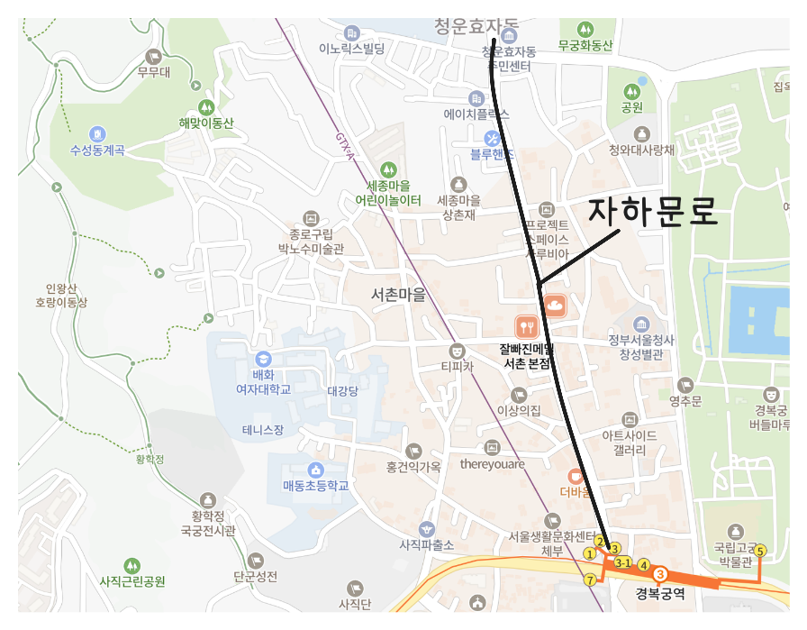

세종마을 음식문화거리, 이상의 집, 대오서점, 종로구립 박노수미술관, 윤동주 하숙집, 수성동 계곡, 해맞이동산, 통인시장은 자하문로의 서쪽에 위치한다.

가장 먼저 세종마을 음식문화거리를 가기 위해 경복궁역 2번 출구로 나온다.

이 거리는 먹자골목으로 과거에는 금천교 시장이라고 불리다가 2011년에 세종마을 음식문화거리라는 명칭이 붙었다.

일요일 낮에 갔는데 다들 인왕산으로 등산하러 간건지 길거리가 한산했다. 거리에 도착했을 때 딱히 땡기는 음식이 없어서 거리만 구경하고 지나쳤다.

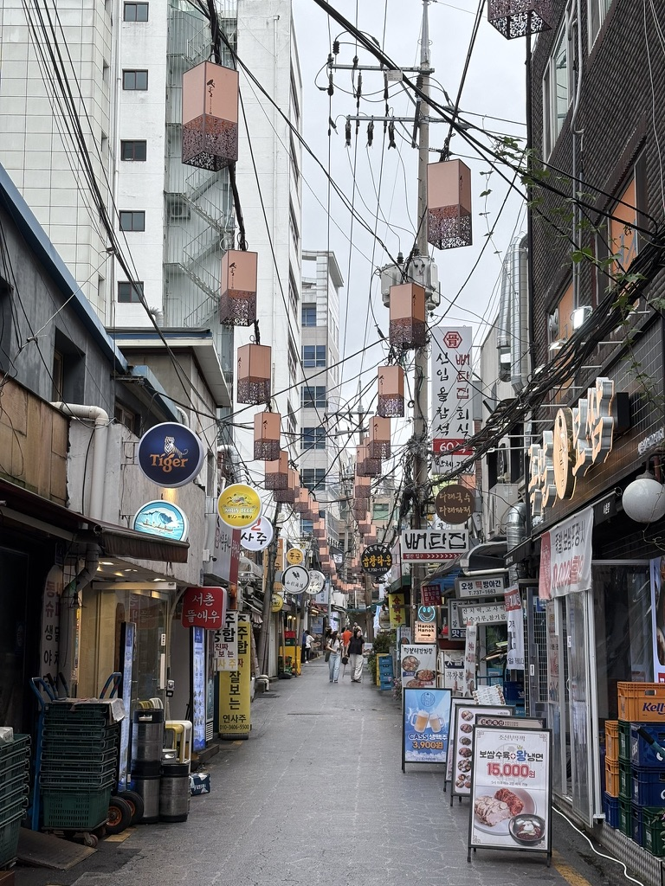 

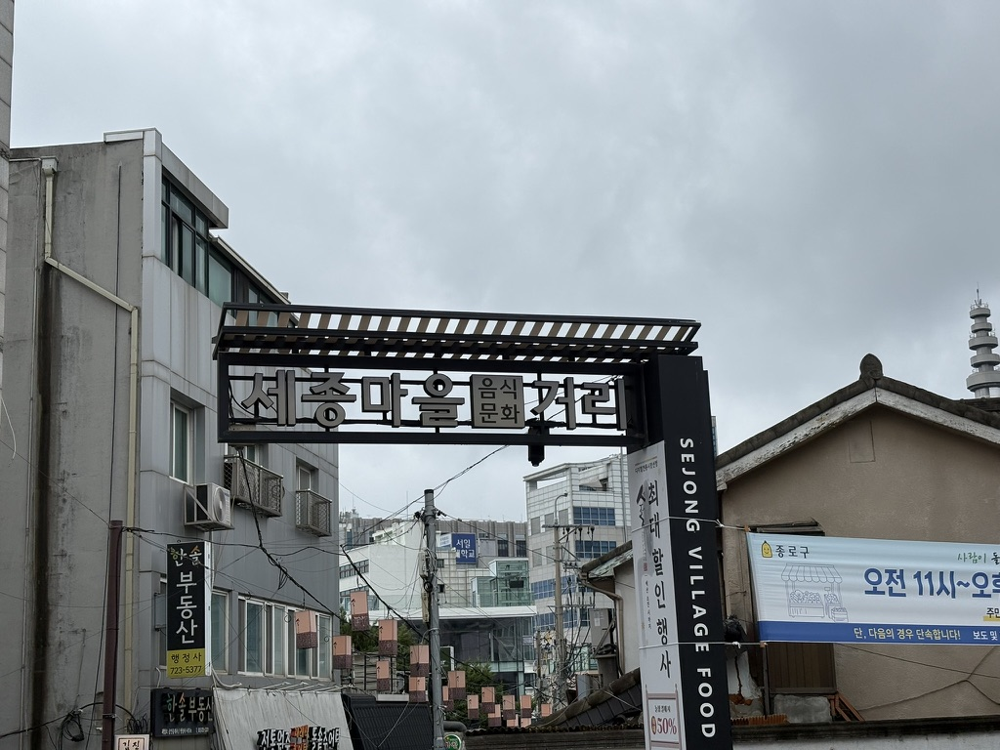

그 다음 이상의 집으로 가는 길에 삼계탕 집이 보였는데 말복이 지난지 얼마 안되서 그런가 대기줄이 끝날 줄 모를 정도로 길었다. (올해 말복은 삼계탕 대신 맥도날드의 맥윙으로 보냈다)

이상의 집은 일제강점기 시대의 소설가이자 시인 이상이 태어나고, 세 살부터 20여 년간 살았던 집터 중 일부분을 매입하여 만든 작은 문화 공간이다. 

1층에는 이상의 초상화와 작품들이 아카이브되어 있고 2층에는 마당을 둘러볼 수 있는 난간이 있다. (공간이 아담하다)

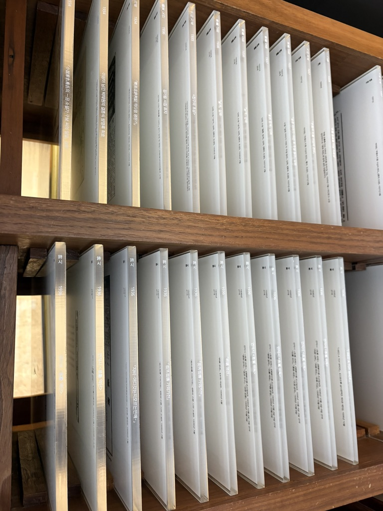

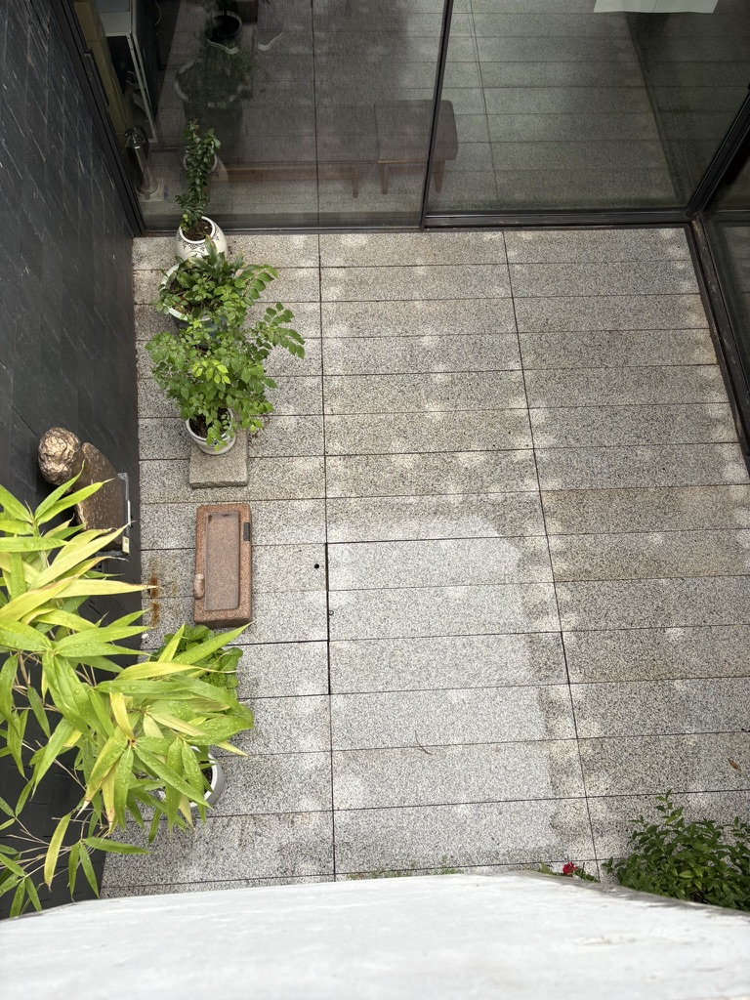

그동안 이상이 본명인 줄 알았는데 김해경이 본명이고 이상은 필명 중 하나라고 한다. 김해경은 이상 외에도 비구, 보산, 화융 등의 필명을 사용하였다.

본래 화가를 꿈꾸었으나 아버지의 반대로 경성고등공업학교 건축과(현 서울대학교)에 진학하고 수석으로 졸업하였다. 

이후 학교의 추천으로 조선총독부에서 건축 기사로 근무하게 되고, 조선총독부에서 발간하던 잡지인 '조선'에 장편소설 '12월 12일'을 연재하면서 데뷔하였다.

날개, 지주회시, 오감도 등의 작품을 발표하다가 폐결핵이 악화되어 27세의 나이로 세상을 떠났다.

인터넷으로 시인 이상에 대해 좀 더 찾아보니 이성과 관련된 흥미로운 이야기들을 살펴볼 수 있었다. 

폐결핵을 치료하고자 들린 온천에서 만난 여성(금홍)과 함께 다방을 차리고 동거를 한 점, 장사가 잘 되지 않자 여성이 가출하고 일탈하여 이를 소설 '날개'에서 나타낸 점.

자신의 친구(정인택)와 또 다른 여성(권순옥)과의 삼각 관계 - 결국 정인택과 권순옥이 결혼하고 이상이 결혼 사회를 봤다는 이야기.

그리고 이상과 김환기의 아내가 동일한 인물이라는 점. 자세한 내용은 링크 참고

<a href="https://ko.wikipedia.org/wiki/이상_(작가)#이상의_연인들" target="_blank" rel="noopener noreferrer">이상의 연인들에 대한 이야기</a>

<a href="https://m.blog.naver.com/leesobia/222816971079" target="_blank" rel="noopener noreferrer">이상의 변동림, 김환기의 김향안에 대한 이야기</a>

천재 시인이라고 들었던 인물에게서 생각보다 인간적인 면모를 보였던 점이 재밌었다.

이상의 집을 나와 대오서점으로 향했다. 내부에 사람이 많아서 바깥의 모습만 촬영했다.

서울에서 가장 오래된 서점이자 현재는 카페로 운영되는 곳인데 건물이 주는 분위기가 아늑하며 정겹다.

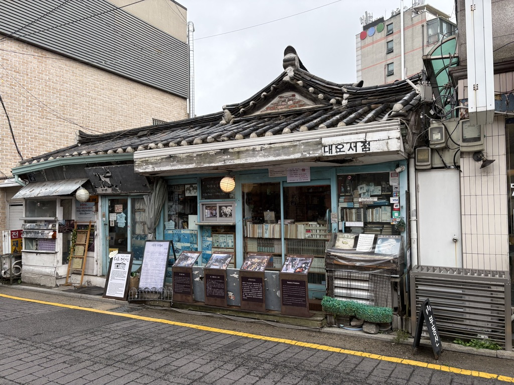

그 다음 목적지는 박노수미술관. 종로구에서 운영하는 곳으로 입장료는 3천원이다.

개관 12주년을 기념으로 산수·격물 전시를 진행하고 있었다. 전시는 올해 12월 6일까지 진행한다고 한다. 

관람 시간은 오전 10시부터 저녁 18시까지이며 매주 월요일은 휴관이다.

미술관은 80년전, 약 1930년대 후반에 친일파 윤덕영이 자신의 딸을 위해 지은 가옥이다.

1970년대에 박노수 화백이 인수한 뒤 40년 간 거주했었으며 사망하기 전 종로구에 자신의 작품과 미술품, 집을 기증하여 현재 종로구립 박노수미술관이 되었다. 친일파의 집에서 화백의 집으로, 지금은 미술관으로 운영되는 것이다.

박노수 가옥은 1991년에 서울시 문화재자료 제1호로 지정되었다. 

내부 촬영을 허용하지 않아 사진으로 남기지는 못했으나 한옥 건물의 구조에 근현대 서양식으로 내부를 꾸민 것 같았다. <a href="https://www.jfac.or.kr/site/main/content/parkns01" target="_blank" rel="noopener noreferrer">사진 출처</a>

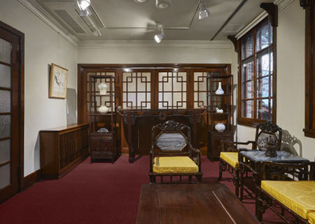

오래된 벽돌집이기도 하고 문화유산이다보니 신발을 벗고 관람해야 했다. 누군가의 집에 들어가서 실내화를 신고 그림을 보는 이색적인 경험이었다.

박노수 화백은 동양화가이다. 강렬한 색채를 쓰면서도 여백을 적절히 활용하여 간결하고 절제되어 있는 한국적인 그림을 구사한다.

바깥에는 작은 정원들이 집을 둘러싸고 있었다. 소박하지만 소중하게 느껴졌다.

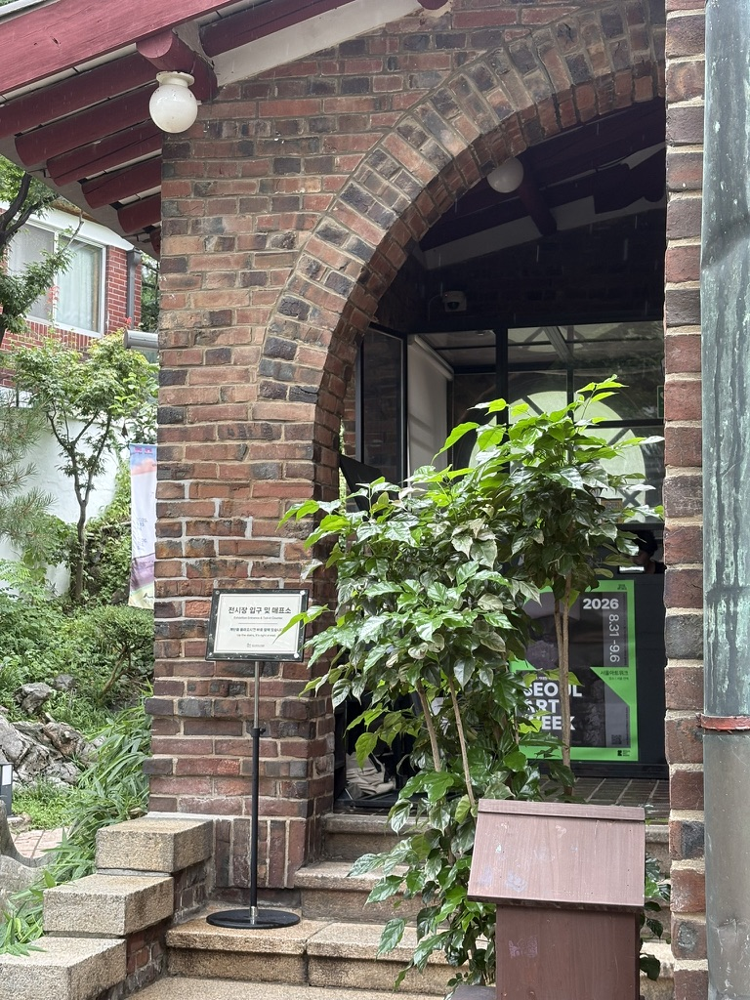

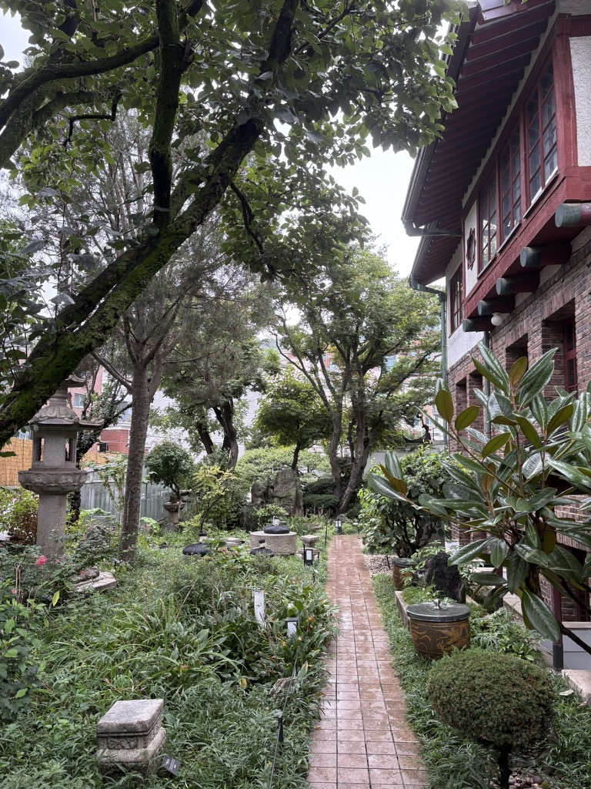

이제 수성동 계곡을 갈 차례이다. 가는 길에 윤동주 하숙집 터가 있다.

현재는 빌라가 들어서 있고 윤동주 하숙집 터임을 알려주는 안내판만 입구에 부착되어 있었다.

표지판에 나온 내용에 대해 알아보니 윤동주 시인은 후배 정병욱과 함께 1941년 연희전문학교(현 연세대학교) 기숙사에서 나와 머물 곳을 찾다가 우연히 소설가 김송의 집에 머물게 되었다고 한다.

둘은 인왕산의 길을 따라 산책을 하거나 저녁 때마다 문학적 영감을 교류하였고, 시인은 이 집에서 머물며 '서시', '별 헤는 밤', '자화상' 같은 대표작들을 만들었다.

그리고 4개월 정도 하숙하다 일본으로 유학을 떠난다. 일본으로 가기 전 시편을 모아 시집으로 만들고 한 권은 자신이 소장하고, 다른 한 권은 후배 정병욱에게, 마지막 한 권은 스승 이양하 교수에게 전달하였다.

일제로부터 해방하기 몇 개월 전 세상을 떠나게 되고 정병욱에게 준 원고가 '하늘과 바람과 별과 시'라는 제목으로 세상에 공개되었다. 

윤동주가 처음에는 '병원'이라는 이름으로 출판을 준비했으나 주변 인물들의 만류로 인해 출판하지 못했고, 이후 출판사와 유족, 친구들이 그의 시 세계를 대표하는 핵심 소재를 모아 새롭게 명명했다고 한다.

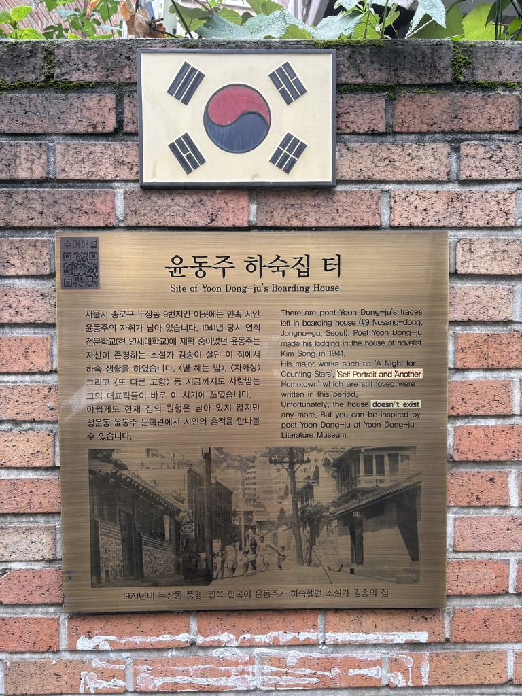

언덕을 더 오르다 보면 인왕산과 인왕산의 수성동 계곡에 도착한다.

인왕산의 수성동 계곡은 맑고 경쾌한 물소리가 난다 하여 그 이름이 지어졌다고 하며, 조선시대 화가 겸재 정선의 ‘장동팔경첩’에 묘사된 그림이 실려 있다고 한다.

1970년대 아파트가 들어서면서 경관이 훼손되었다가 2008년에 서울시에서 아파트를 철거하고 복원 사업을 시행하면서 과거의 모습을 재현하였다.

아쉽게도 계곡에 물이 흐르지 않아 그 소리를 들을 수 없었지만, 숲 속의 분위기를 느끼기에는 더할 나위 없이 좋았다.

조금 더 걸어올라가면 인왕산 자락길이 나오는데 강아지 두마리가 시원하게 물에 발을 담그고 있는 귀여운 모습을 볼 수 있었다.

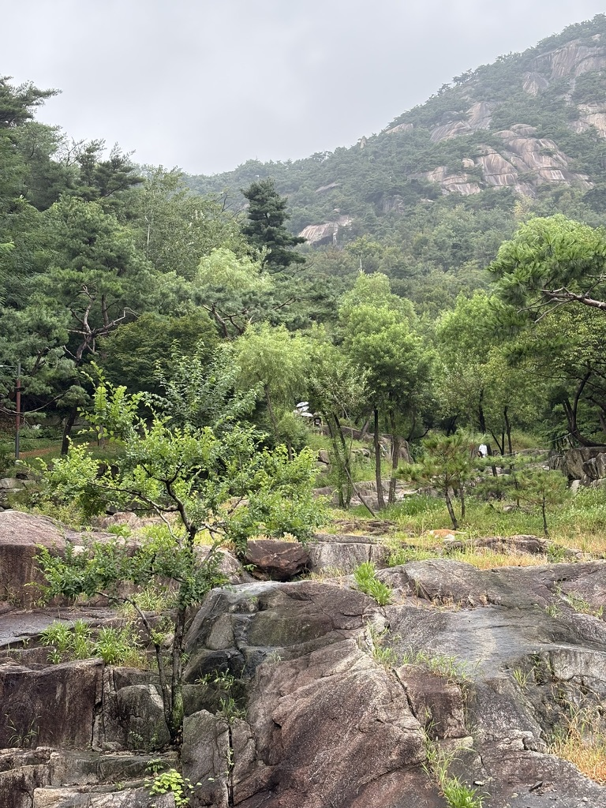

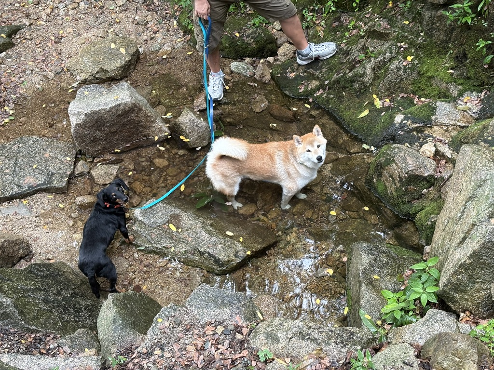

해맞이 동산을 올라가는 길에 마주친 고양이들

인왕산 수성동 계곡 근처에는 고양이들이 여럿 살고 있다. 다만 마주친 모든 고양이가 사람을 경계하는 듯 했다.

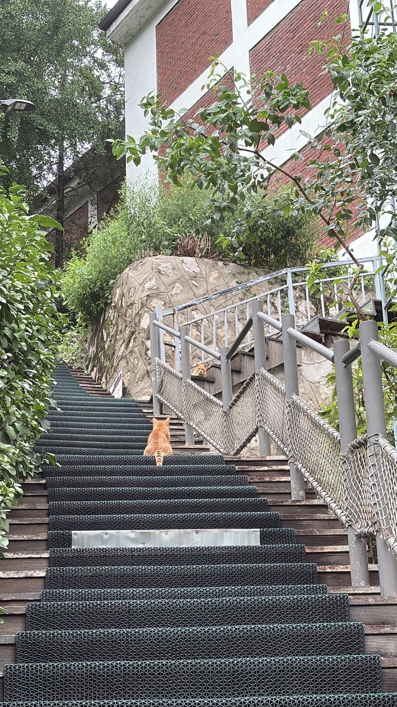

해맞이 동산은 인왕산에서 가장 멋진 일출을 볼 수 있다고 한다.

지금은 한여름이라 그런지 온통 나무로 둘러쌓여 있어서 아침에 해가 뜨는 모습을 볼 수 있을지 의문이 들었다.

다음에 이 곳으로 와서 해를 맞이해야겠다.

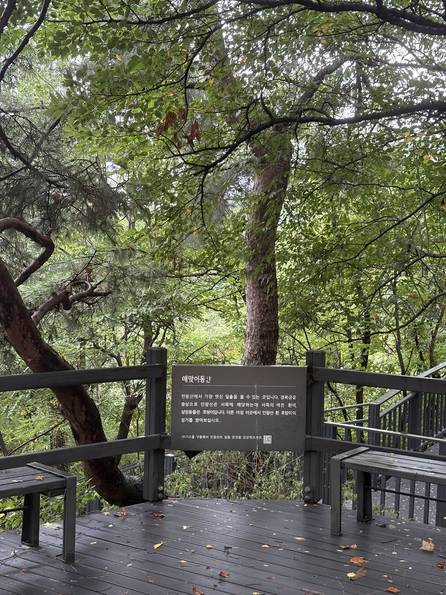

해맞이 동산에서 내려온 다음 통인시장으로 간다. 통인시장은 기름떡볶이가 유명한 걸로 알고 있다.

예전에 한 번 먹어봤는데 입맛에 맞지 않아서 기름떡볶이 대신 통인시장 팔각정 입구에 들어서면 나오는 분식집에 있는 떡볶이를 시켜서 먹었다.

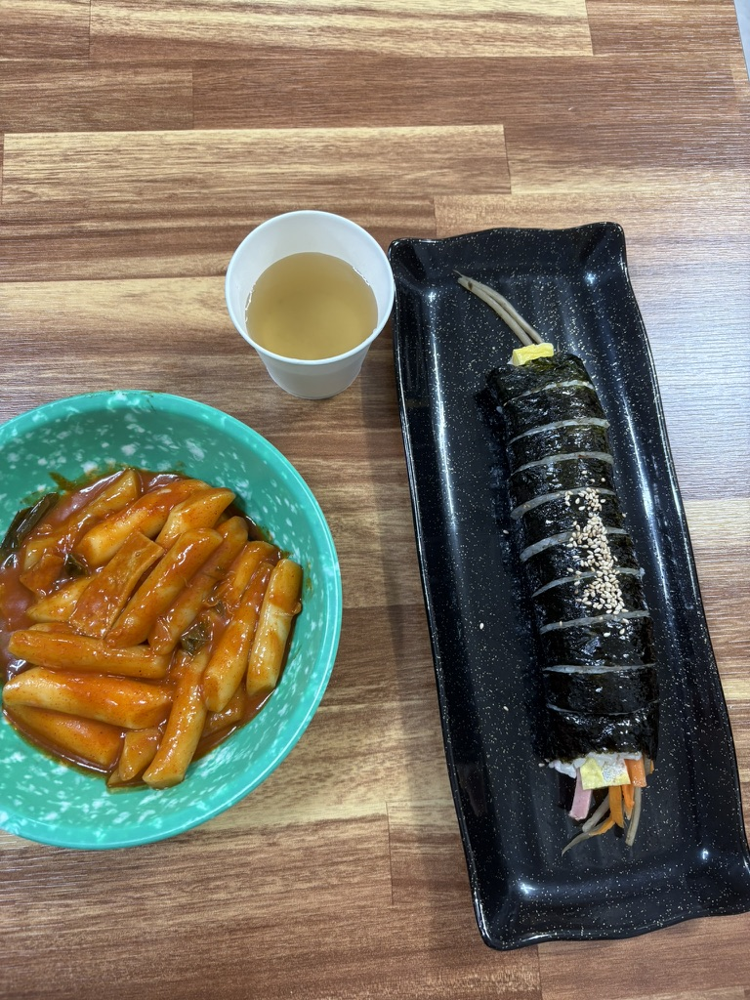

이제 자하문로를 건너서 동쪽으로 이동할 차례이다.

골목길에 노란색 페인트로 칠해진 벽, 주황색 문, 예쁜 화분과 테이블 보가 놓여 있었다.

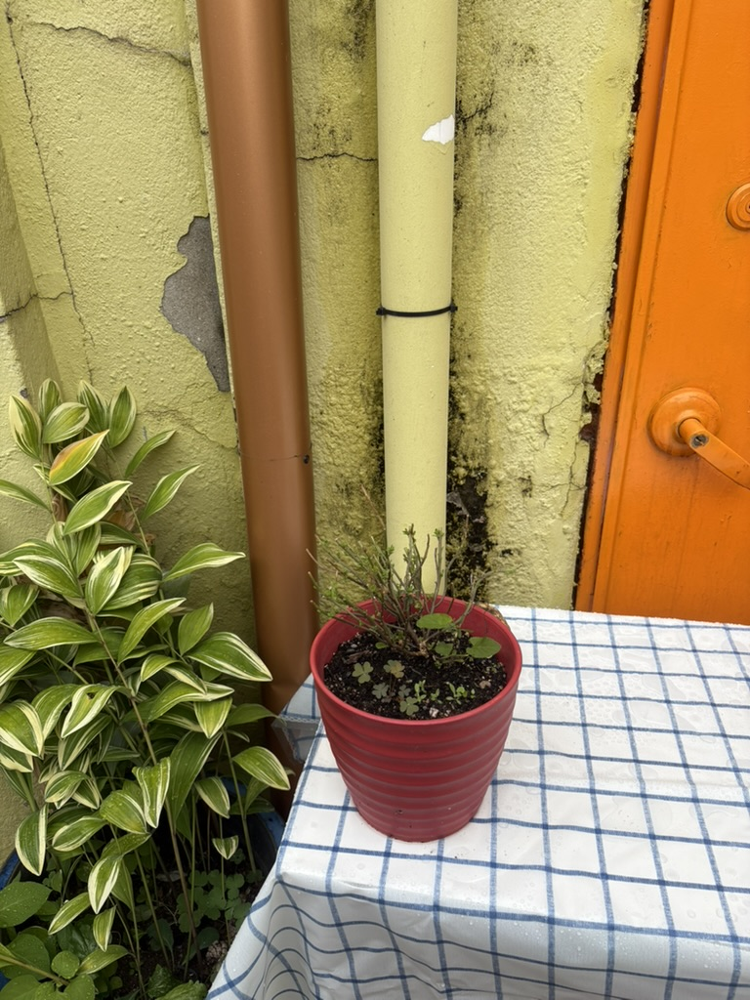

## 자하문로 동쪽

자하문로 동쪽의 첫 번째 목적지는 통의동 보안여관이다.

1940년대부터 여관으로 운영되어오다가 현재는 전시 공간, 카페 등 복합문화공간으로 탈바꿈하였다.

전시 준비를 위해 잠시 문이 닫힌 상태였다.

마지막 경로인 대림미술관도 알고 보니 휴관일이어서 보안여관과 대림미술관 모두 들어가지 못했다.

아쉬운대로 스타벅스 적선점을 가기 전, 경복궁 내의 국립고궁박물관으로 들어가는 작은 출입문을 찍어보았다.

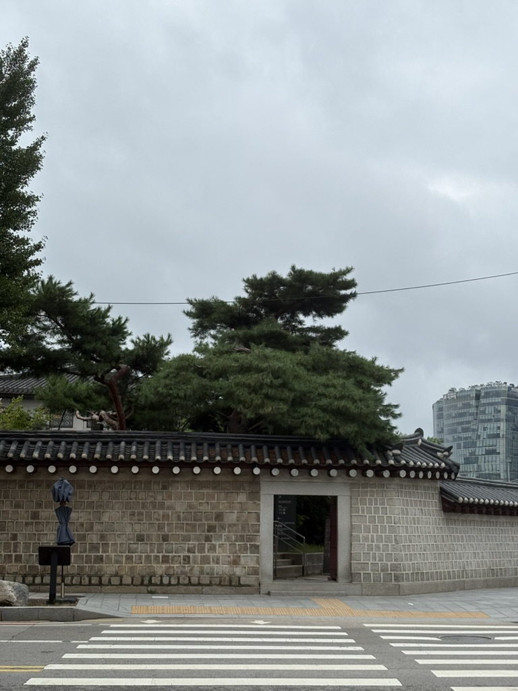

스타벅스 적선점은 거의 대부분이 작업을 할 수 있는 공간이고 세종대로에 있는 다른 지점들에 비해 자리도 널널하다. 주말이라 인근에서 근무하는 직장인들이 없어서 그런듯하다.

## 끝으로

첫 산책으로 서울의 가장 핵심인 곳을 가고 싶어서 경복궁을 기점으로 나뉜 북촌과 서촌 둘 중 고민하다가 상대적으로 몇 번 가보지 않은 서촌을 가기로 했다.

국립현대미술관이나 정독도서관이 있는 북촌에 비해 심심할 것만 같았는데, 이번 산책을 하면서 서촌이 지닌 역사적인 가치를 직접 보고 알게 되면서 이전과 다르게 느껴졌다.

특히 수성동 계곡에서 바라본 인왕산의 모습이 상당히 멋스러웠다. 겸재 정선이 이 곳을 그린 이유를 알 것 같았다.

아직 볼 것들이 많이 남았다. 오늘 가지 못했던 곳들부터 시인의 언덕과 윤동주 문학관, 청운문학도서관, 작은 골목길과 사람들이 붐비는 가게까지.

그리고 돌아다니다가 가고 싶은 식당이 생겼는데 다음 방문 때 한 번 들려보려고 한다.   