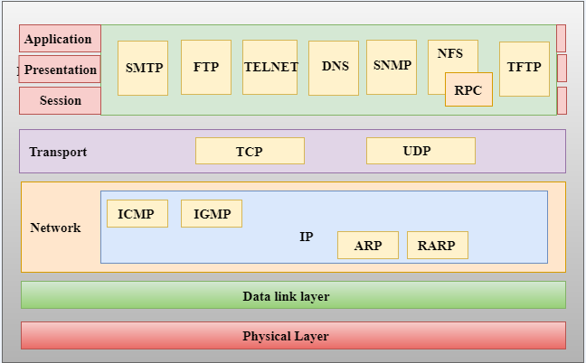

#### index
- [tcp/ip](#tcpip)
- [application layer](#application-layer)

## tcp/ip

tcp/ip는 tranmission control protocol/internet protocol의 약자로 네트워크에서 데이터를 주고받기 위한 표준화된 프로토콜 스택이다

이메일, 웹, 스트리밍 등 모든 인터넷 활동의 기반이 되는 모델로, 네트워크 통신을 계층적으로 나누어 처리하여 서로 다른 네트워크 장치와 네트워크가 상호작용할 수 있도록 한다

tcp는 순서 보장 및 손실 복구 기능을 통해 데이터 전송의 신뢰성을 보장한다

ip는 데이터 패킷 주소 지정과 라우팅을 담당한다

애플리케이션, 전송, 인터넷, 네트워크 액세스라는 **네 개의 계층**으로 모델을 구성한다

특징
- 패킷 교환(packet switching) 기반 통신
- 분산형, 개방 프로토콜
- 특정 장치나 네트워크 유형에 종속되지 않음

## application layer

[이미지 출처](https://www.tpointtech.com/computer-network-tcp-ip-model)

모든 계층 중 가장 위에 위치하여 사용자가 직접 접하는 계층으로 애플리케이션과 네트워크 간 인터페이스를 제공한다

즉, 응용 프로그램(애플리케이션)이 네트워크 서비스를 이용할 수 있게 한다

애플리케이션 계층의 데이터 흐름
- 브라우저가 DNS 서버에게 도메인 이름에 해당하는 IP 주소 변환을 요청한다 (DNS 프로토콜)
- DNS 서버에서 IP 주소를 반환한다
- 브라우저가 웹 서버에 HTTP 요청을 전송한다 (HTTP 프로토콜)
- 웹 서버의 응답 데이터 반환
- 브라우저가 HTML/CSS/JS 데이터를 해석하여 화면을 출력한다

애플리케이션 계층의 모든 요청은 하위 계층(전송, 인터넷, 네트워크 액세스 계층)으로 전달되며 이 과정에서 각각의 계층에서 지원하는 데이터 포맷으로 변환된다

이후 반환된 응답은 반대순으로 데이터가 변환되어 최종적으로 다시 이 계층의 프로토콜(HTTP, SSH 등)에서 사용하는 데이터 포맷으로 변환된다

주요 역할

### 데이터 포맷 변환

하위 계층에서 네트워크 통신 중 사용된 데이터들 중 사람이 이해할 수 있는 데이터를 현재 계층에서 사용할 수 있도록 변환한다

### 데이터 압축 및 암호화

네트워크 효율성을 높이기 위해 데이터를 압축하고 보안을 강화한다

### 서비스 요청 및 응답 처리

애플리케이션 계층은 클라이언트-서버 모델을 따르는데 이 모델간 요청과 응답을 처리한다

### 프로토콜 관리

HTTP, FTP, SMTP 등 다양한 프로토콜을 지원하여 응용 프로그램에서 원하는 포맷으로 데이터를 송수신한다

주요 프로토콜
- HTTP/S(80, 443): 웹 페이지 또는 컨텐츠 처리(HTTPS는 TLS/SSH로 보안을 강화한 프로토콜임)
- FTP(21): 파일 전송
- SMTP/POP3/IMAP(25, 110, 143): 이메일 전송(SMTP) 및 수신(POP3, IMAP)
- DNS(53): 도메인 이름 -> IP 주소 변환
- Telnet/SSH(23, 22): 원격 접속(Telnet - 비보안, SSH - 암호화)
- SNMP: 네트워크 장비 관리

애플리케이션 간의 상호 운용성을 보장하고 다양한 서비스를 제공한다

다만 프로토콜별로 성능 차이가 존재하고 HTTP, Telnet과 같은 특정 프로토콜의 경우 보안에 취약하다

이를 보완하기 위해 HTTPS, SSH, SFTP와 같은 보안이 적용된 특수 프로토콜을 제공하거나 성능 최적화를 위해 압축, 캐싱 기술을 지원한다