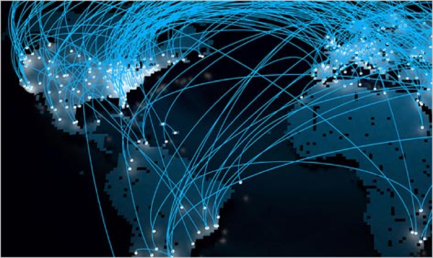
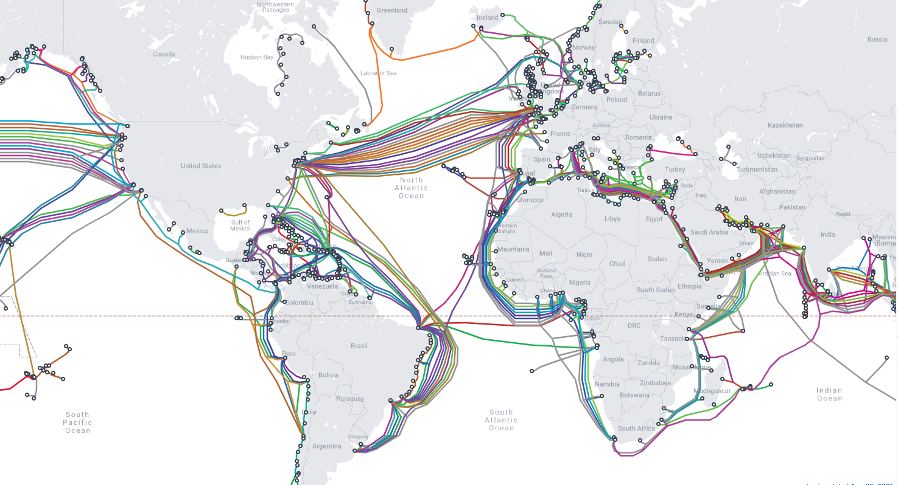
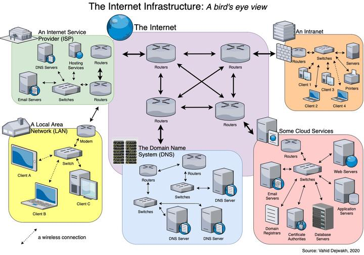
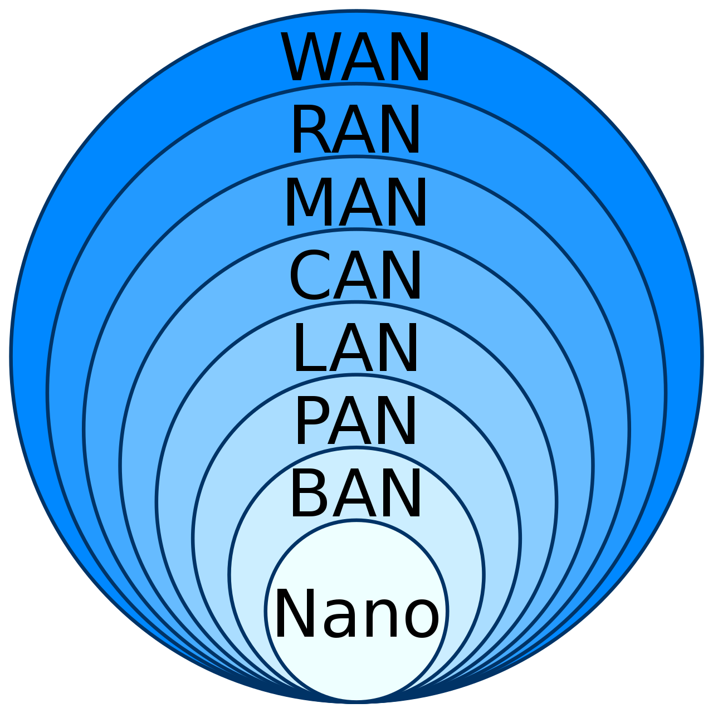
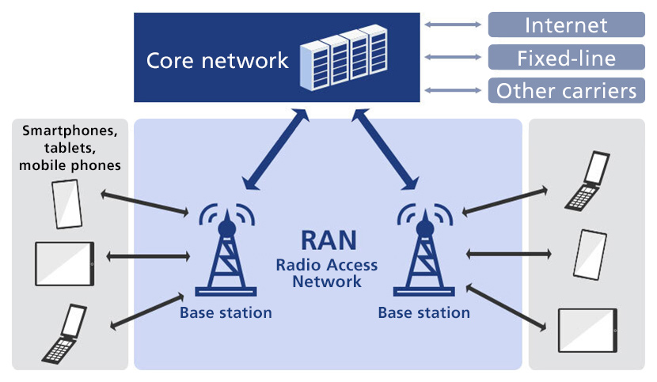

#### index
- [what is internet?](#what-is-internet)
- [internet network types](#internet-network-types)
- [other networks](#other-networks)
- [what is www?](#what-is-www)
- [evolution of the web](#evolution-of-the-web)
- [web3](#web3)
- [web3 techinal factors](#web3-technical-factors)

## what is internet?

인터넷은 전 세계적으로 연결된 컴퓨터 네트워크의 시스템이다

수많은 로컬 네트워크와 광역 네트워크, 데이터 센터 등이 상호 연결되어 데이터를 주고받을 수 있는 분산형으로 구축된 네트워크이다

중앙 집중식이 아닌 **분산 네트워크 구조**는 특정 노드에서 장애가 발생하더라도 전체 시스템을 유지시킬 수 있으며 수십억 개의 장치를 연결할 수 있는 확장성을 가진다

그리고 경로와 자원을 동적으로 관리하며 계층 구조를 통해 데이터의 신뢰성을 보장한다

제3차 산업 혁명(정보통신혁명)을 일으킨 기술 중 하나로 20세기 중반(1960년대)부터 시작되어 컴퓨터, 전자 기술, 통신 기술의 발전으로 산업과 인간 사회 절반에 걸쳐 근간을 바꾼 핵심적인 역할을 수행한다

제3차 산업 혁명의 핵심 기술: 컴퓨터, 인공위성, 인터넷

컴퓨터가 가장 먼저 등장하고 그 이후 반도체 기술(트랜지스터, 집적회로 발명)의 비약적인 발전으로 전화망에서 데이터 통신으로의 전환이 이루어졌다

이러한 기술적 기반 위에서 1960년대 미국 국방부의 ARPANET 프로젝트를 기반으로 데이터 공유를 위한 분산형 네트워크가 개발되면서 인터넷은 네트워크 기술의 집약체로 등장했다

ARPANET은 [패킷 교환(packet switching)](./routing-and-switching.md#packet-switching) 기술을 도입하며 [기존 전화망(회선 교환)](./routing-and-switching.md#circuit-switching)과 차별화된 데이터 전송 방식을 구현했다

이후 1970년대에 개발된 tcp/ip 프로토콜이 서로 다른 네트워크 간 연결을 표준화하고 1983년에 ARPANET의 표준 프로토콜로 채택되며 인터넷이란 용어가 공식화되었다

### components

인터넷이란 분산형 네트워크를 구성하는 요소는 다음과 같다 (웹 구성 요소 포함)

단말 장치
- 클라이언트: 사용자가 인터넷에 접근하는 장치 (컴퓨터, 스마트폰, 태블릿 등)
- 서버: 리소스를 저장하고 제공하는 장치 (웹 서버, DB 등)

네트워크 장비
- 다른 네트워크 또는 컴퓨터로부터 데이터를 수신하고 전달하는 장비
- 라우터: 서로 다른 네트워크 간 데이터를 전달하는 장치
- 스위치: 동일 네트워크 내에서 데이터를 장치 간에 전달
- 모뎀: ISP의 신호(광섬유, DSL 등)를 가정용 네트워크가 이해할 수 있는 디지털 신호로 변환하는 장치
- 액세스 포인트: 무선 네트워크(wifi)를 제공해 단말 장치를 네트워크에 연결

전송 매체
- 데이터를 전달하기 위해 사용되는 매체
- 대륙 간 네트워크 통신을 위해 위와 지도와 같이 해저 통신 케이블을 설치해둔다 [참고 사이트](https://www.submarinecablemap.com))
- 유선: 이더넷 케이블(구리선), 광섬유
- 무선: 와이파이, 셀룰러 네트워크(4g, 4g), 위성 통신 

dns
- 사람이 읽기 쉬운 도메인 이름을 ip 주소로 변환하는 시스템
- dns 서버는 웹 요청이 올바른 서버로 전송되도록 도와준다

cdn
- 웹 리소스를 전 세계에 분산된 서버에 캐싱하여 사용자가 더 빠르게 접근할 수 있게 한다
- cloudflare, akamai

계층 구조
- 네트워크는 계층적으로 설계되어 각 계층이 특정 역할을 맡는다
- osi 모델
- tcp/ip 모델

프로토콜
- 데이터가 어떻게 전송되고 라우팅되는지 정의하는 스펙 (네트워크 장치 간 통신 규칙)
- ip: 데이터를 보낼 목적지 주소를 지정한다
- tcp: 데이터가 손실없이 순서대로 도착하도록 보장한다
- http/s: 웹 페이지 요청 및 전송
- tls/ssl: 데이터 암호화로 보안 유지

인터넷 서비스 제공자(ISP)
- 사용자를 인터넷 백본에 연결하는 중개자를 마랗며 대규모 라우터와 광섬유 네트워크를 운영한다
- 인터넷 백본: 대륙 간 데이터를 연결하는 초고속 광섬유 네트워크 (해저 통신 케이블 포함)
- kt, skt, verizon, at&t

### how it works

[이미지 출처](https://vahid.blog/post/2020-12-15-how-the-internet-works-part-i-infrastructure/)

인터넷의 동작은 위의 이미지처럼 물리적 하드웨어부터 소프트웨어 프로토콜까지 [다양한 요소](#components)와 [네트워크](#internet-network-types)가 상호작용하여 이루어진다

데이터가 ISP, 전송 매체를 통해 전달되는데, 이 때 **패킷 교환** 방식을 사용해 작은 조각(패킷)으로 나누어 전송하고 목적지에서 다시 조립한다

이 방식은 네트워크 경로가 막히거나 오류가 발생해도 유연하게 대처할 수 있게 하여 전통적인 회선 교환과 비교했을 때 더 높은 네트워크의 유연성과 효율성을 가진다

주요 과정
- 사용자 요청: 웹의 경우 사용자는 웹 브라우저에 URL을 입력한다 (URL은 도메인 이름과 경로로 나뉘며 브라우저가 이 요청을 네트워크로 전달하기 위해 준비하는데, 이를 처리하기 위해 IP 주소를 필요로 한다)
- 도메인 이름 해석(dns 조회): 브라우저는 일련의 과정을 거쳐 dns 서버로부터 요청을 보낼 목적지 서버의 ip 주소를 획득한다
- 연결 설정(tcp 3-way handshake): 클라이언트(사용자)와 서버(목적지) 간 tcp 연결을 설정한다 (syn, syn-ack, ack)
- 데이터 요청(http/s): 브라우저가 서버에 http 또는 https 요청을 보내는데, 이 요청은 패킷으로 나뉘어 네트워크를 통해 서버로 전송된다 (50~200ms 소요)
- 패킷 전송(ip routing): 요청 데이터가 패킷 단위로 네트워크를 통해 서버로 전달될 때, 각 패킷은 출발지/목적지 ip 주소와 순서 정보를 포함한다. 라우터가 라우팅 테이블을 참조해 최적 경로를 선택하고 패킷을 다음 목적지로 전달하며 패킷은 ips 네트워크, 해저 케이블 등을 거친다 (대륙 간 전송은 100~300ms 지연 발생)
- 서버 응답: 웹 서버가 요청을 처리하고 응답을 보낸다. 응답도 마찬가지로 패킷으로 나뉘며 http 상태 코드를 포함하여 클라이언트로 전송된다 (웹 서버 또는 웹 애플리케이션의 처리 시간 발생)
- 데이터 수신 및 렌더링: 클라이언트가 패킷을 받아 원래 데이터(서버 응답)를 재조립하고 브라우저가 웹 페이지를 표시한다 (tcp, rendering) 수신부터 렌더링까지 100ms~1초 정도의 시간이 소요된다

## internet network types

인터넷의 네트워크 유형은 주로 지리적 규모와 네트워크를 구축하기 위한 장비를 기준으로 구분된다

### ban (body area network)

ban은 인체 주변의 소규모 네트워크로 신체에 부착되거나 근처에 위치한 장치들을 연결한다

센서나 웨어러블 장치가 신체 데이터를 수집해 스마트폰이나 게이트웨이로 전송하기 위한 용도로 사용된다

사물인터넷(iot)의 일부로 클라우드 서버에 데이터를 업로드해 원격 진단이나 분석을 지원한다

저전력이며 실시간 모니터링을 할 수 있지만 개인적인 데이터가 유출될 수 있으며 배터리 의존성을 가진다

예시: 스마트워치, 심박수 모니터, 의료 센서 등

### pan (personal area network)

pan은 개인 주변의 소규모 장치들을 연결하는 네트워크로, 한 사람의 작업 공간(보통 10m 이내)에서 사용된다

무선(bluetooth, wifi, zigbee, irda) 또는 유선(usb, thunderbolt)를 사용하여 스마트폰, 노트북, 무선 키보드/마우스 등의 장비를 연결한다

주로 장치 간 직접 통신(스마트폰과 블루투스 이어폰) 또는 인터넷 연결을 위한 게이트웨이 연결(스마트폰 wifi 핫스팟)을 사용한다

예시: 노트북과 무선 마우스 연결, 스마트폰과 에어팟 맥스 연결

### lan (local area network)

lan은 제한된 지리적 범위 내에서 장치들을 연결하는 네트워크로 인터넷의 최종 사용자 단말 네트워크이다 (pan도 lan에 포함되는 것으로 간주)

즉, 사용자가 인터넷에 접속하는 출발점이자 응답을 수신하는 끝 점이다

가정, 사무실, 학교, 건물 등 1km 이내의 범위에 속하며 이더넷 케이블 또는 wifi 연결을 통해 데이터를 고속으로 전송(10mbps~10gbps)할 수 있다

개인이나 소규모 조직 스위치, 허브, 무선 액세스 포인트 네트워크 장비를 통해 관리한다

lan 내 장치(컴퓨터, 프린터, 스마트폰 등)는 ip 주소를 공유하며 데이터를 주고받는다 (사설 ip: 192.168.x.x)

그리고 라우터를 통해 인터넷(wan)에 연결할 수 있으며 이 때 nat(network address translation)를 사용해 사설 ip를 공인 ip로 변환한다

### wlan (wireless local area network)

wlan은 무선 기술을 사용해 lan을 구현한 네트워크로 물리적 케이블 없이 장치를 연결한다

lan의 무선 확장으로 사용자가 이동하면서도 인터넷에 접속할 수 있게 하지만, 실질적으로 인터넷 연결은 유선 lan과 wan을 통해 제공된다

무선 라우터, 액세스 포인트, 클라이언트 장치를 통해 wifi 또는 라디오 주파수로 연결하며 성능에 따라 수십~수백미터의 범위를 가진다

무선 라우터가 신호를 방송하면 장치가 이를 수신해 네트워크에 접속한다 (카페 공용 wifi, 사무실 무선 네트워크 등)

### can (campus area network)

can은 캠퍼스나 단지 내 여러 건물의 lan을 연결하는 네트워크로 대학, 기업 등에서 사용된다

각 건물의 lan의 네트워크를 통합해 인터넷 접속을 중앙에서 관리하여 데이터와 자원을 공유하는 구조를 가진다

수백 미터에서 수 킬로미터 범위와 수십 mbps~수 gbps 속도를 가진다

이더넷, 광섬유, wifi로 연결되며 데이터는 스위치, 라우터, 광섬유 케이블을 통해 전송된다

### man (metropolitan area network)

man은 도시나 대규모 지역 내 네트워크를 연결하는 중간 규모로 lan보다 크고 wan보다 작다

여러 lan을 통합하거나 isp가 고속 연결을 제공한다

수 킬로미터에서 수십 킬로미터 범위와 수십 mbps~수 gbps 속도를 가진다

광섬유, dsl, 무선(wimax)로 연결되며 데이터는 라우터, 스위치, 광섬유 네트워크 장비를 통해 전송된다

예시: 도시 내 케이블 tv 네트워크, 통신사 dsl 네트워크

### ran (radio access network)

[이미지 출처](https://www.softbank.jp/en/sbnews/entry/20220630_01)

ran은 무선 통신을 위해 사용자 장치를 코어 네트워크에 연결하는 네트워크로 셀룰러 네트워크(3g, 4g, 5g)의 핵심 구성 요소이다

모바일 인터넷의 접속 계층으로 스마트폰, 태블릿 같은 단말 장치가 무선 신호를 통해 기지국에 접속하게 하며 기지국은 데이터를 코어 네트워크(wan)로 전달한다

연결 구성 요소
- 기지국(base station): 신호 송수신
- 백홀(backhaul): 기지국과 코어 네트워크 간 유/무선 연결
- 컨트롤러: 트래픽 관리 및 핸드오버(기지국 간 이동) 처리

프로토콜: 3gpp 표준(lte, 5g)

수십 킬로미터(기지국 커버리지)까지 네트워크 범위를 가지며 수 mpbs(3g)에서 수십 gbps(5g) 속도를 지원한다

기지국, 안테나, 모바일 장치를 통해 무선(셀룰러 주파수: lte, gr) 또는 기지국에 연결된다

예시: 5g 기지국이 스마트폰의 데이터를 받아 인터넷으로 연결

### wan (wide area network)

wan은 넓은 지리적 범위를 커버하는 네트워크로 도시, 국가, 대륙 간 장치를 연결한다 (인터넷 자체가 가장 큰 wan을 말함)

국가 내부 또는 대륙 간 범위를 가지며 광섬유, 위성, 전용 회선(mpls), 셀룰러 네트워크를 사용하며 데이터의 전송 속도가 당연히 lan보다 느리다 (수십mpbs~수gpbs)

isp 또는 통신사가 라우터, 광섬유 스위치, 백본 네트워크 장비를 통해 관리한다

데이터는 패킷 교환 방식을 사용하여 라우터와 백본 네트워크 통해 데이터를 장거리로 전달된다

bgp(border gateway protocol)로 네트워크 간 경로를 설정하고 mpls(multi-protocl label switching)로 트래픽을 관리한다

## other networks

### san (storage area network)

san은 대용량 스토리지 장치를 서버에 연결하는 고속 네트워크로, 데이터 저장과 접근을 중앙화하여 클라우드 같은 인터넷 서비스의 백엔드 스토리지를 지원한다

데이터 센터 내에서 서버가 san을 통해 스토리지에 직접 접근하며 1gpbs~16gbps 이상의 빠른 속도와 블록 단위 데이터 전송을 지원한다

예시: 기업 데이터 백업, 클라우드 스토리지 시스템

### san (system area network)

san은 고성능 컴퓨팅(hpc) 환경에서 노드 간 통신을 위한 네트워크로 서버의 클러스터링에 사용된다

서버간 저지연 및 고대역 통신을 제공하여 고성능 백엔드(검색 엔진, ai 연산) 서비스를 지원한다

예시: 슈퍼컴퓨터 클러스터, 데이터베이스 서버 등

### epn (enterprise private network)

epn은 기업이 자체적으로 구축한 사설 네트워크로 외부로부터의 보안을 유지하면서 내부적으로 자원 공유를 위해 사용된다

자사 간 데이터를 암호화된 전용 회선으로 연결하여 내부 데이터는 사설망으로 보호한다

인터넷을 통해 외부와 연결하면서도 높은 보안을 유지할 수 있다

예시: 은행 지점 간 네트워크, 대기업 사내 네트워크

### vpn (virtual private network)

vpn은 공용 인터넷을 가상 사설망을 사용하여 보안 통신을 제공하는 네트워크를 말한다

주로 데이터 보안(데이터 도청 및 변조 방지), 프라이버시 보호(사용자 신원과 위치 보호) 및 접근성(지역 제한 우회, 원격 네트워크 접속)의 목적으로 사용된다

공용 네트워크 위에 가상의 사설 네트워크를 생성하여 사용자가 마치 전용 회선을 사용하는 것처럼 하여 외부의 접근을 차단한다

동작 방식
- 연결 설정: 사용자가 vpn 클라이언트를 실행하거나 vpn 지원 라우터를 통해 vpn 서버에 연결 요청을 보낸다 (필요에 따라 인증을 해야 연결이 승인됨)
- 암호화: 사용자가 보내는 데이터는 암호화된다(aes-256, 키 교환 등)
- 터널링: 암호화된 데이터는 터널링 프로토콜을 통해 캡슐화되어 전송된다 (터널링은 데이터를 보호막(터널)에 넣어 외부에서 볼 수 없게 함)
- 데이터 전송: 암호화된 패킷은 공용 인터넷을 통해 vpn 서버로 전달된다 (외부에서는 데이터 내용이 보이지 않으며 최종 목적지 서버에게 보내는 요청의 출발지 ip가 vpn 서버의 ip로 대체됨 -> ip 마스킹)
- 복호화 및 목적지 전달: vpn 서버가 데이터를 수신해 복화한 후 최종 목적지로 데이터를 전달한다 (응답 데이터도 동일한 과정을 거쳐 사용자에게 전달함)

구성 요소
- vpn 클라이언트: nordvpn, openvpn
- vpn 서버: 데이터 중계 및 암호화/복호화, ip 마스킹
- 터널링 프로토콜: 데이터 전송 경로 보호
- 암호화 기술: 데이터 보안(aes, sha)
- 인터넷 연결: vpn이 작동하는 기반 네트워크

종류
- 원격 접속 vpn (remote access vpn)
  - 개인 사용자가 공용 네트워크를 통해 사설 네트워크(회사 네트워크 등)에 접속하기 위한 vpn
  - 개발자가 집에서 vpn으로 회사 인트라넷 접속
- 사이트 간 vpn (site-to-site vpn)
  - 서로 다른 위치의 네트워크 연결하기 위한 vpn
  - 기업의 분산 네트워크 통합
- 클라이언트-서버 vpn
  - 클라이언트가 특정 서버에만 접속하기 위한 vpn
  - 상업용 vpn 서비스
  - 인도 유튜브 프리미엄 가입을 위한 vpn
- 모바일 vpn
  - 모바일 장치에서 안정적인 연결을 유지하는 vpn
  - 5g에서 wifi로 전환해도 vpn이 유지됨
  

## what is www?

월드 와이드 웹(www)은 인터넷을 기반으로 작동하는 서비스 중 하나로 http/s 프로토콜을 사용해 웹 페이지와 콘텐츠를 제공한다

팀 버너리스 리가 1989년 발명하고 2년 뒤인 1991년에 공개하면서 널리 퍼지게 되었고 인터넷의 폭발적인 사용률을 이끌었다

웹은 사용자가 웹 브라우저를 통해 웹 서버에 저장된 정보(html, css, javascript 등)에 접근하고 상호작용할 수 있게 하는 역할을 한다

웹을 사용하는 서비스로 웹 사이트, 웹 애플리케이션(유튜브, 인스타그램), 검색 엔진(구글, 네이버) 등이 있다

### differences between internet and www

인터넷은 전 세계에 물리적으로 연결된 컴퓨터의 분산 네트워크를 이루는 인프라인 반면, 웹은 그 인프라를 사용하는 특정 서비스이다

즉, 웹은 인터넷 위에서 http/s를 통해 웹 페이지/컨텐츠를 제공하는 서비스이고 인터넷은 컴퓨터 간의 네트워크를 구성하는 시스템으로서 웹 이외에도 이메일, 파일 공유, 온라인 게임 등의 서비스에서도 사용된다

인터넷의 가장 핵심 서비스 중 하나가 웹이라는 것은 누구도 부정할 수 없을 것이지만 웹이 인터넷의 전부가 아니다

## evolution of the web

웹은 일반적으로 기술적 발전, 사용자 경험의 변화, 데이터 관리와 소유주 구조의 변화에 따라 세 단계로 구분된다

### web1

웹1은 인터넷의 초기 단계로 1990년대 초반~2000년대 초반까지의 시기를 말하며 주로 정적이고 읽기 전용인 웹 사이트로 구성되었다

팀 버너스 리가 1990년 cern에서 월드 와이드 웹을 제안하며 작되었으며 html, uri/url, http 같은 기술의 기초가 형성된 시점이다

주로 이미 만들어진 정보를 제공하는 기능이 주를 이뤘고 사용자가 컨텐츠를 생성하거나 상호작용할 수 있는 기능은 거의 없었다

### web2

21세기 초반부터 현재까지의 웹 환경을 web2라고 일컫는다

웹1과 달리 읽기-쓰기 상호작용이 특징이며 모바일 인터넷과 장치(아이폰, 안드로이드)의 보급으로 웹의 생태계가 급속도로 확장되었다

단순 html, css를 넘어서 자바스크립트, 비디오 등의 다양한 컨텐츠를 제공하는 소셜 미디어와 앱이 주를 이루고 있다

좋아요, 공유, 댓글, 게시 등과 같은 사용자 참여 기능이 지원되면서 커뮤니티를 형성하고 이에 따라 소매, 엔터테이먼트, 미디어, 광고 산업에 파괴적 혁신을 가져다 주었다

사용자 참여를 극대화하며 디지털 경제를 성장시켰으나 데이터 소유권이 대형 기술 회사(faang 등)에 집중(플랫폼 중앙화)되어 프라이버시 문제가 대두되고 있다

## web3

웹3는 현재 발전 중인 차세대 인터넷으로 탈중앙화와 사용자 주권 등을 중점으로 두고 있다

중앙화된 권력 집중, 데이터 독점, 프라이버시 침해와 같은 기존 웹의 문제점을 해결하고 인터넷을 더 개방적이고 공정한 공간으로 재구성하려는 의도를 가진다

### 탈중앙화 (decentralization)

탈중앙화란 중앙 권력(정부, 대기업)이 아닌 사용자와 커뮤니티가 네트워크를 통제하는 것을 말한다

블록 체인 네트워크에서 누구나 노드를 운영하며 네트워크를 유지하여 중앙 서버 없이 분산된 노드들이 데이터를 저장하고 관리한다

### 사용자 주권 (user sovereignty)

사용자 주권이란 개인이 자신의 데이터, 신원 및 자산을 완전히 소유하고 통제할 권리를 말한다

웹2에서 사용자가 플랫폼에 데이터를 맡기면 이를 대기업에서 상업적 목적(광고 타겟팅 등)으로 활용하는 것을 사용자 주권을 통해 방지하고자 한다

사용자가 디지털 지갑을 통해 자신의 데이터와 자산을 관리하며 제3자 의존성을 줄이고 nft를 소유하고 거래하여 플랫폼이 아닌 개인이 가치를 결정한다

### 신뢰 없는 시스템 (trustlessness)

신뢰 없는 시스템는 웹2에서 은행, 플랫폼 같은 중개자를 신뢰하다가 발생하는 비용과 위험을 줄이고자 중개자 없이도 시스템이 투명하고 공정하게 작동해야 한다는 원칙을 가진다

스마트 계약과 암호학으로 신뢰를 코드로 대체하고 모든 거래가 검증 가능하도록 한다

### 개방성과 포용성 (openness and inclusivity)

개방성과 포용성이란 인터넷은 누구나 참여할 수 있는 공공재여야 하며 경제적 기회를 모두에게 열어야 한다는 이상적인 특성을 말한다

오픈소스 기술과 분산형 프로토콜로 진입 장벽을 낮추고 글로벌 참여를 촉진하여 소수에게 집중되는 이익을 분배하고자 한다

누구나 dapp(분산형 애플리케이션)을 개발하고 배포할 수 있게한다

### 경제적 재구성 (economic reimagination)

경제적 재구성은 디지털 경제가 사용자와 창작자에게 더 공정하게 보상해야 한다는 비전을 가진다

웹2에서 플랫폼이 창작자의 수익을 과도하게 가져가는 부작용을 줄이고자 토큰 경제와 분산형 금융(defi)을 통해 중개자 없이 가치를 직접 교환한다 -> 아티스트가 nft로 작품을 판매하며 중개 수수료 없이 수익을 전액 받음

### 단점 및 한계

기술적 복잡성: 블록체인 확장성(트랜잭션 속도, 비용) 문제

보안: 스마트 계약 취약점, 해킹, 사이버 범죄 등

규제: 탈중앙화로 인해 법적 책임 소재 불분명

사용자 경험: 웹2보다 떨어지는 접근성과 편의성 

환경 문제: 비트코인 채굴 같은 작업 증명 방식의 에너지 소비

## web3 technical factors

### 블록체인과 분산 원장 (blockchain and distrubted ledger)

블록체인과 분산 원장은 데이터를 중앙 서버가 아닌 분산된 노드에 저장하고 모든 거래를 투명하게 기록하는 개념으로 웹3의 데이터 저장과 신뢰 기반을 제공하는 시스템을 말한다

특징
- 데이터를 수정할 수 없으며, 누구나 블록체인을 검증할 수 있다
- 단일 통제 주체가 없어서 특정 인원이 모든 데이터를 소유할 수 없다
- 비트코인(가치 저장), 이더리움(스마트 계약)

### 스마트 계약 (smart contracts)

스마트 계약은 조건이 충족되면 자동으로 실행되는 프로그래밍된 계약을 말한다

중개자 없이 실행되어 자율성과 코드로 동작을 보장하는 신뢰성을 가진다

거래와 서비스를 자동화하여 신뢰 비용(중개 플랫폼 수수료)을 감소시킬 수 있다

중개 플랫폼이 완전히 없지 않고 스마트 계약을 관장하는 defil 플랫폼이 존재한다

### 디지털 신원과 자산 (digital identity and assets)

디지털 신원과 자산은 사용자가 자신의 신원과 자산을 암호화된 디지털 지갑으로 관리하여 데이터 소유권과 경제적 참여를 사용자에게 돌려주게 한다

특징
- 자기 주권 신원: 제3자 없이 신원 증명, did(decentralized identifier) 로그인
- 토큰화: 자산(부동산, 예술품)을 디지털 토큰(nft, erc-20)으로 변환

### 분산형 애플리케이션 (dapps)

분산형 애플리케이션은 중앙 서버 없이 블록체인 위에서 실행되는 애플리케이션을 말한다

uniswap(탈중앙화 거래소) axie infinity(블록체인 게임) 등 웹2의 중앙화된 앱을 대체한다

특징
- 오픈소스: 모든 코드 공개
- 분산 실행: 노드 네트워크에서 작동

### 토큰 경제 (token economy)

토큰 경제는 암호화폐와 토큰으로 경제 활동을 촉진한다

참여자에게 보상 토큰을 지급하거나, dao에서 투표권으로 사용할 수 있다