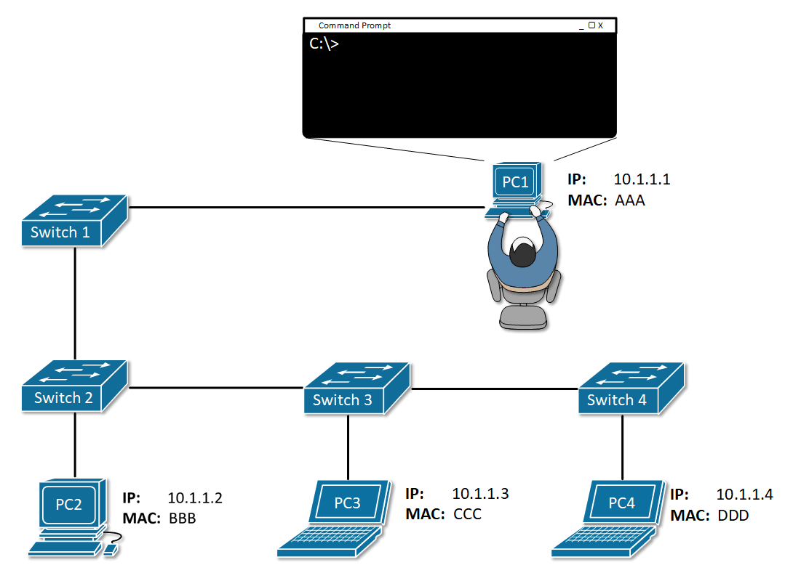

#### index
- [Internet Layer](#internet-layer)
- [IP](#ip)
- [Packet](#packet)
- [IP Addressing](#ip-addressing)
- [IP Addressing System](#ip-addressing-system)
- [Private IP, Public IP](#private-ip-public-ip)
- [Loopback Address (127.0.0.1)](#loopback-address-127001)
- [NAT (Network Address Translation)](#nat-network-address-translation)
- [ICMP (Internet Control Message Protocol)](#icmp-internet-control-message-protocol)
- [ARP (Address Resollution Protocol)](#arp-address-resollution-protocol)
- [Unicast, Broadcast, Multicast, Anycast](#unicast-broadcast-multicast-anycast)
- [MTU (Maximum Transmission Unit)](#mtu-maximum-transmission-unit)
- [Fragmentation](#fragmentation)


## Internet Layer

인터넷 계층은 TCP/IP 모델의 두 번째 계층으로 **논리 주소 기반**으로 동작하여 출발지 호스트에서 목적지 호스트까지 패킷(데이터그램)이 **전달(라우팅)**되도록 보장한다

##### 전송 계층 -> 인터넷 계층 -> 네트워크 전송 계층

전송 계층이 목적지 포트 번호에 따라 데이터를 인터넷 계층에 데이터를 전달하면, 이 계층은 받은 데이터에 IP 헤더를 붙인다

IP는 패킷 단위로 데이터를 관리하며 어디로 보낼지(IP 주소) 결정한 뒤 라우팅을 통해 인터넷 백본을 이용하여 데이터를 전달한다

마지막으로 최종 패킷을 전달할 다음 홉(Next Hop)의 MAC 주소가 필요한데 이를 위해 ARP를 이용해 MAC 주소를 조회한 뒤 이너뎃 프레임으로 캡슐화하여 물리 매체로 데이터를 전송한다

참고로 IP는 **비연결형/비신뢰성** 전송 방식을 사용하므로 패킷 손실 및 순서 뒤바뀜, 중복 전달 등의 문제가 발생할 수 있다

그래서 상위 계층인 전송 계층의 TCP에서 이 신뢰성을 담당한다

UDP는 TCP처럼 신뢰성, 연결 지향 프로토콜이 아니기 때문에 그대로 데이터를 전달한다

인터넷 계층이 가지는 주요 역할은 다음과 같다

##### 논리 주소 지정 (Logical Addressing)

IP 주소를 통해 인터넷에 연결된 각 장치를 식별한다

유동적으로 할당할 수 있는 특성을 가지며 이로 인해 유연한 네트워크를 구성할 수 있다

##### 패킷 전달 (Packet Forwarding)

목적지 IP 주소를 기반으로 다음 홉을 결정하고 라우터를 통해 데이터(패킷)를 전달하는 방식으로 동작한다

##### 라우팅 (Routing)

다음 목적지로 데이터를 전달할 때 라우터가 경로 선택 알고리즘을 통해 최적의 경로를 산출하여 전달한다

##### 분할 (Fragmentation) 및 재조립 (Reassembly)

네트워크 접속 계층의 MTU (Maximum Transmission Unit) 제한을 초과하는 IP 패킷은 분할되어 전송된다

이후 수신 측에서 분할된 패킷을 재조립한다

##### 오류 처리 및 진단

ICMP 프로토콜을 통해 네트워크 오류 상태를 전달한다

### Internet Layer Keyword

|범주|키워드|
|---|---|
|기본 개념|IP, IPv4, IPv6, Packet, Datagram|
|주소 지정|IP Address, Subnet Mask, CIDR, Private IP/Public IP, Loopback Address (127.0.0.1), Link-local Address|
|라우팅|Routing, Static Routing, Dynamic Routing, Routing Table, Default Gateway|
|라우팅 프로토콜|RIP, OSPF, BGP|
|패킷 전달 구조|Source IP, Destination IP, TTL (Time To Live), Fragmentation, MTU (Maximum Transmission), Checksum|
|주소 변환|NAT (Network Address Translation), SNAT, DNAT, PAT|
|ICMP 기반|ICMP (Internet Control Message Protocol), Ping, Traceroute, Destination Unreachable|
|IP 계층 보안|IP Spoofing, IPsec|
|ARP|ARP (Address Resolution Protocol), RARP|
|IPv6 추가 요소|IPv6 Header, Stateless Address Autoconfiguration, Neighbor Discovery Protocol (NDP)|
|멀티캐스트/브로드캐스트|Unicast, Broadcast, Multicast, Anycast|
|실제 구성 요소|Router, L3 Switch, Host|
|계층 관계|전송 계층(TCP/UDP) 아래, 네트워크 전송 계층 위에서 동작|
|대표 포로토콜|IP, ICMP, IGMP, ARP (L2-L3 중간)|

### Internet Layer Protocol

IP (Internet Protocol): 패킷 전달의 핵심, 비신뢰성/비연결형

ICMP (Internet Control Message Protocol): 오류 메시지 전달, 네트워크 진단

ARP (Address Resolution Protocol): IP <-> MAC 주소 변환 (L2와 L3 사이에 위치)

IGMP (Internet Group Management Protocol): 멀티캐스트 그룹 관리

IPsec: IP 계층에서 암호화 및 인증 제공 (보안 확장)


## IP

IP는 인터넷 상에 하나의 장치(호스트)를 식별하는 주소로 물리적인 MAC 주소와 달리, 논리적인 주소로써 장치에 유동적으로 할당할 수 있다

현재 4 버전과 6 버전이 있으며 4 버전이 가장 널리 사용되고 있다

**IPv4**는 1980년대부터 인터넷의 표준 주소 체계로 사용된 IP 프로토콜로 네트워크 주소와 호스트 주소로 구성되어 있다

이 중 가장 첫 번째 주소(호스트 비트가 전부 0인 주소)를 네트워크 주소라고 하고, 마지막 주소(호스트 비트가 전부 1인 주소)를 브로드캐스트 주소라고 한다

실제로 사용할 수 있는 호스트 주소는 이 두 개의 주소를 제외한 중간 IP 목록이 된다

아래와 같이 전체 IP 주소를 8비트씩 4개로 나눠 온점으로 구분하고 10진수로 표현한다

`192.168.0.1`

### Classful Addressing

초기 인터넷에서는 IP 주소를 더 간단하게 할당하고 라우팅하기 위해 IP 주소 공간(32비트)을 **클래스**라고 하는 고정된 크기의 블록으로 나누는 방식을 사용했다

이걸 **클래스 기반 주소 체계 (Classful Addressing)**이라고 하는데, 크게 3가지 종류의 클래스로 구성된다

|클래스|시작 비트|주소 범위|기본 서브넷 마스크|네트워크 수|호스트 수|
|---|---|---|---|----|---|
|클래스 A|0xxxxxxx|0.0.0.0 ~ 127.255.255.255|255.0.0.0(/8)|128개|약 1670만 개|
|클래스 B|10xxxxxx|128.0.0.0 ~ 191.255.255.255|255.255.0.0(/16)|약 1.6만개|약 6.5만개|
|클래스 C|110xxxxx|192.0.0.0 ~ 223.255.255.255|255.255.225.0(/24)|약 210만개|254|

클래스가 낮아질수록 네트워크 수가 늘어나고 호스트 수가 줄어든다

고정된 서브넷 마스크 방식을 사용하기 때문에 IP 대역을 나누는 유연성이 부족하여 IP 주소를 낭비하게 된다

또한 서브넷마다 라우팅 테이블에 일일이 기록해야 해서 라우팅 테이블의 크기가 커지는 단점도 있다

이 문제를 해결하기 위해 고정된 클래스 개념을 없애고 프리픽스 길이를 활용해 IP를 유연하게 할당하는 [CIDR 방식](#cidr)이 1993년에 도입되었다

### IPv6

IPv4의 가변 길이 헤더는 다양한 옵션을 포함시킬 수 있으나 성능 저하의 원인이 될 수 있다

인터넷 기기에 비해 지정할 수 있는 주소가 턱없이 부족하다는 치명적인 단점이 있다

이를 해결하기 위해 IPv6를 이용하거나 NAT, 사설 IP, CIDR 등을 사용하는 방법이 있는데 그 중 IPv6는 IPv4의 한계를 해결하기 위해 설계된 차세대 표준 IP 프로토콜이다

32비트 길이를 가지는 4 버전보다 훨씬 긴 128비트 길이를 가지며 16비트씩 8개의 블록으로 나눈다

0 블록은 `::`으로 표현하여 생략하며, 앞에 오는 0은 생략할 수 있다 (0370 -> 370)

고정 길이 헤더로 단순하고 처리 효율이 좋다 (필요한 추가 기능은 확장 헤더로 외부화)

|구분|IPv4|IPv6|
|---|----|---|
|주소 길이|32비트(4바이트)|128비트(16바이트)|
|주소 수|약 42억개(2^32)|2^128|
|표기 방식|점 10진수 (192.168.0.1)|콜론 16진수 (2001:odb8:85a3::8a2e:0370:7334)|
|헤더 크기|가변 (20~60바이트)|고정 40바이트|
|브로드캐스트 지원|지원|멀티캐스트, 애니캐스트만 지원|
|NAT 사용|자주 사용됨|불필요|
|보안|선택 사항|기본 내장|
|주소 자동 구성|DHCP 의존|SLAAC 지원 (Stateless Address Autoconfiguration)|
|QoS 지원|TOS 필드|Flow Label 필드 추가|

## IP Addressing System

공인 IP 주소는 아무나 막 쓸 수 없다

글로벌 -> 지역 -> 국가/기관 단위로 특정 대역의 IP 주소를 할당받고 개인은 이 중 일부분의 공인 IP 주소를 사용할 수 있다

미국의 ICANN(Internet Corporation for Assigned Names and Numbers) 산하 IANA(Internet Assigned Numbers Authority)에서 전 세계 인터넷 주소 자원을 관리한다

이 기관은 IP 주소뿐만 아니라 도메인 이름 체계(DNS Root), 포트 번호, 프로토콜 번호 등도 관리한다

전 세계 IP 주소 대역을 대륙별 인터넷 등록기관(RIR, Regional Internet Registry)에 나눠준다

RIR은 5개 대륙별마다 하나씩 존재하고 IANA에서 대규모 IP 블록(IPv4/IPv6)을 할당받는다

|RIR 이름|지역|국가|
|---|----|---|
|ARIN|북미|미국, 캐나다 등|
|RIPE NCC|유럽, 중동, 중앙 아시아|독일, 프랑스, 이란 등|
|APNIC|아시아, 태평양|한국, 일본, 호주 등|
|LACNIC|중남미|브라질, 아르헨티나 등|
|AFRINIC|아프리카|나이지리아, 남아공 등|

RIR마다 할당된 IP 주소는 다시 국가관리기관(NIR)별로 분배된다

우리나라의 경우 한국인터넷진흥원(KISA) 산하 KRNIC(Korea Network Information Center)에서 RIR에서 받은 IP 주소들을 관리하며 이를 다시 KT, LGU+, SKB 같은 ISP나 기업/공공기관에 할당한다

```plaintext
IANA -> APNIC -> KRNIC -> ISP -> 기업, 개인, 호스팅 서비스 등
```

[대한민국 ISP 목록](https://한국인터넷정보센터.한국/jsp/business/management/isCurrent.jsp)


## Packet

IPv4 패킷의 전체 및 세부 구조는 다음과 같다

```plaintext
┌──────────────────┐
│     IP Header    │
├──────────────────┤
│  TCP/UDP Header  │ ← 전송 계층
├──────────────────┤
│ Application Data │ ← 애플리케이션 계층
└──────────────────┘
```


Version: IP 버전 (IPv4 or IPv6)

IHL (IP Header Length): 헤더 길이

TOS/DSCP: 패킷 전달 우선순위, 서비스 품질 지정

Total Length: 전체 패킷 길이

Identification: 패킷 분할 시 사용되는 식별자

Flags/Fragment Offset: 분할 관련 정보

TTL (Time To Live): 최대 홉 수 제한, 라우팅 루프 방지

Protocol: 상위 계층 프로토콜 (TCP=6, UDP=17)

Header Checksum: 오류 검사용 (IPv6에는 없음)

Source Address: 출발지 IP 주소

Destination Address: 목적지 IP 주소

Options: IP 헤더 확장 필드 (보안, 라우팅 관련 추가 기능)

Data: TCP/UDP 세그먼트


## IP Addressing

회사나 공장같이 수백/수천대의 네트워크 장비를 사용하는 곳에서 모든 IP를 하나씩 관리하면 확장성이 떨어지고 혼란만 생긴다

또한 라우터는 목적지 IP를 개별적으로 다루는 대신 이 IP 대역(네트워크 주소)을 어디로 보내야 하는지만 알고 있다

IP 주소가 네트워크 상의 장치를 식별하기 위한 논리적 주소라면, 특정 IP 주소들을 하나의 논리적 그룹으로써 관리할 수 있다

그래서 일반적으로 IP 주소는 특정 네트워크 대역에 포함되어 네트워크와 호스트 주소로 구분될 수 있다

**네트워크 주소 (아파트 동 번호)**는 하나의 네트워크 대역 안에서 공통적으로 사용하는 주소의 접두 부분, IP 주소에서 네트워크를 식별하는 부분으로 특정 IP가 어느 네트워크에 속하는 가를 나타낸다

동일한 서브넷에 있는 모든 장치는 같은 네트워크 주소를 공유한다

네트워크 주소는 위에서 설명했듯이 IP를 네트워크 단위로 나눠서 관리하거나 라우터가 목적지에 대한 경로를 찾을 수 있도록 한다

또한 직접 통신이 가능한지 여부를 결정하며 접근 제어, 방화벽 설정의 기준이 되기도 한다 (같은 네트워크 주소인 경우 ARP, 아닌 경우 라우터)

**호스트 주소 (각 집 번호)**는 해당 네트워크 내에서 각 장치를 구분한다

참고로 가장 첫 주소(`X.X.X.0`)가 네트워크 주소이며 가장 마지막 주소는 브로드캐스트 주소(`X.X.X.255`)이기 때문에 호스트 주소로 사용할 수 없다

### Subnet Mask

서브넷 마스크는 전체 IP 주소에서 네트워크 주소와 호스트 주소를 필터링하여 다음과 같은 역할을 한다
- 네트워크 범위 정의: 어느 IP들이 같은 네트워크에 있는지 판단할 수 있게 한다
- 라우팅 결정: 게이트웨이(라우터)가 패킷을 어디로 보낼지 결정할 때 사용한다
- IP 분할: 하나의 네트워크를 여러 서브넷으로 나누는 데 사용된다

IP주소와 서브넷 마스크를 AND 연산자로 계산하면 네트워크 주소를 알아낼 수 있다

서브넷 마스크의 1비트는 네트워크 부분, 0비트는 호스트 부분을 나타낸다

```plaintext
IP 주소:      192.168.10.25
서브넷 마스크:  255.255.255.0

IP 주소:      11000000.10101000.00001010.00011001
서브넷 마스크 : 11111111.11111111.11111111.00000000
```

위의 마스크는 앞의 24비트(`255.255.255`)가 네트워크 부분을 의미하여 `192.168.10` 까지가 네트워크 주소, `25`가 호스트 주소임을 나타낸다

### CIDR

CIDR은 Classless Inter-Domain Routing의 약자로 IP주소를 `IP Address/Prefix` 형식으로 나타내어 기존의 클래스 기반 주소 체계를 대체하면서 더 유연하고 효율적인 IP 주소 관리를 가능하게 한다

프리픽스 길이 값이 서브넷 마스크의 비트 수(네트워크 주소)를 의미하며 나머지 비트가 사용 가능한 호스트 수를 결정한다

|CIDR 표기|서브넷 마스크|호스트 수|사용 가능한 호스트 수|
|---|----|----|---|
|/8|255.0.0.0|약 1600만|호스트 수 - 2|
|/16|255.255.0.0|약 6.5만|호스트 수 - 2|
|/24|255.255.255.0|256|254|
|/30|255.255.255.252|4|2|

`192.168.1.0/24`: 상위 24비트는 네트워크, 나머지 8비트는 호스트 주소를 의미한다 (총 호스트 수 2^8 - 2개)

`10.0.0.0/12`: 네트워크 12비트, 호스트 20비트 (총 호스트 수 2^20 - 2개)

CIDR 덕분에 라우팅 테이블을 효율적으로 압축할 수 있게 됐는데 이를 Route Aggregation 또는 Supernetting이라고 한다

기존에는 아래와 같이 라우터가 다음 4개의 라우팅 정보를 기억해야 했다

```plaintext
192.168.0.0/24  
192.168.1.0/24  
192.168.2.0/24  
192.168.3.0/24
```

CIDR을 쓰면 이걸 하나로 합칠 수 있다 -> 라우팅 테이블의 크기가 작아짐

```plaintext
192.168.0.0/22
```

### Subnetting

서브네팅이란 하나의 네트워크 대역을 논리적으로 하위 네트워크 대역(서브넷)으로 쪼개는 기법을 말한다

이를 통해 네트워크를 분리하면 트래픽을 차단 및 격리하거나, 보안을 강화할 수 있다

일반 IP 주소 체계와 동일하게 각 서브넷은 독립적인 네트워크 주소와 브로드캐스트 주소가 있으므로 사용 가능한 호스트의 수는 전체 호스트 수 - 2개이다

아래와 같은 IP 주소와 서브넷 마스크가 있다고 해보자
- IP 주소: 192.168.1.0
- 서브넷 마스크: 255.255.255.0 (/24)

앞 24비트는 네트워크 주소, 뒤의 8비트는 호스트 주소가 된다 (2^8 - 2, 254개의 호스트 주소)

254개의 호스트 주소를 서브넷으로 분할하려면 다음과 같은 절차를 거친다

##### 필요한 서브넷 수 파악

현재 네트워크에서 서브넷으로 분할하기 위해 필요한 비트를 계산한다

`2^n >= 서브넷 수`

4개의 서브넷으로 분할하려면 2^n >= 4 -> x = 2 비트가 필요하다

##### 호스트 비트에서 필요한 비트만큼 네트워크 비트로 가져온다

기존 마스크: /24 -> 새 마스크: /26 (255.255.255.192)

##### 서브넷 계산

192.168.1.0/24 CIDR 블록(전체 네트워크)에서 위의 계산을 통해 4개의 서브넷으로 분할하면 더 작은 블록으로 나눠서 관리할 수 있다

각 서브넷은 자기만의 네트워크처럼 동작하고 라우터나 스위치에서 분리된 네트워크로 인식된다

서브넷 당 호스트 수: 2^6 - 2 = 62개
- 192.168.1.0/26: 192.168.1.0 ~ 192.168.1.63
- 192.168.1.64/26: 192.168.1.64 ~ 127
- 192.168.1.128/26: 192.168.1.128 ~ 191
- 192.168.1.192/26: 192.168.1.192 ~ 255


## Private IP, Public IP

공인 IP란 인터넷에서 직접 통신할 수 있는 주소로 ISP 또는 클라우드 벤더를 통해 할당받을 수 있다

IPv4 주소의 한계로 인해 전 세계에 최대 약 43억개만 할당할 수 있다

사설 IP는 사설 네트워크 안에서만 사용되는 IP 주소로 인터넷에서 직접 접근할 수 없고 NAT를 통해서만 외부 통신이 가능하다

외부에서 직접 접근할 수 없으며 NAT를 통해 접근을 차단하여 보안을 강화시킬 수 있다

또한 사설 IP는 공인 IP와 달리 서로 다른 네트워크에서 중복으로 할당할 수 있기 때문에 IPv4 주소 할당 한계를 일부분 보완한다

공식적으로 정해진 대역 (아래의 IP 주소는 공인 IP 주소로 사용할 수 없음)

|대역|규모|
|---|---|
|10.0.0.0 ~ 10.255.255.255|대규모 기업 네트워크|
|172.16.0.0 ~ 172.31.255.255|중간 규모 네트워크|
|192.168.0.0 ~ 192.168.255.255|가정용, 소규모 네트워크|


## Loopback Address (127.0.0.1)

루프백 주소는 자기 자신을 가리키는 네트워크 주소를 말한다 

어떤 프로세스에서 127.0.0.1로 요청을 보내면 네트워크 장치(NIC)를 거치지 않고, 그 요청은 내부적으로 커널 수준에서 로컬 호스트(자기 자신)에게 전달된다 -> 외부 트래픽과 무관함

정확히는 클래스 A의 127.0.0.0 ~ 127.255.255.255 주소가 루프백 전체 대역이고 127.0.0.1은 그 중 대표 주소이다

CIDR 표기: 127.0.0.0/8

IPv6 루프백 주소: ::1

통칭 이름: localhost (대부분 DNS에 127.0.0.1로 매핑됨)

0.0.0.0은 모든 ip 주소를 의미하며 일반적으로 바인딩할 때 사용된다

참고로 도커 같은 컨테이너에서 127.0.0.1 또는 localhost는 호스트 머신이 아닌 컨테이너 자기 자신을 의미한다

즉, 컨테이너와 호스트는 루프백이 전혀 공유되지 않는다


## NAT (Network Address Translation)

NAT는 내부 사설 IP 주소를 외부에서 사용 가능한 공인 IP 주소로 변환해주는 기술이다

한정된 공인 IP만으로 전 세계의 네트워크 장치를 다룰 수 없으니까, NAT를 통해 다수의 장치를 인터넷에 연결한다

```plaintext
[사설 네트워크]  <--->  [NAT 장비]    <--->    [인터넷]
192.168.x.x         공인 IP: 203.0.113.10
```

NAT는 외부(인터넷)와 내부(가정, 기업 등)의 통신 간 매개체로써 라우터, 방화벽, 게이트웨이 역할을 할 수 있다

패킷의 IP 헤더를 조작해서 목적지나 출발지 IP를 변환한다
- 내부 -> NAT -> 외부: 192.168.0.10:51500 -> NAT -> 203.0.113.10:49152
- 외부 -> NAT -> 내부: 203.0.113.10:49152 -> NAT -> 192.168.0.10:51500

NAT는 이 매핑 정보를 테이블에 저장하고 일치하는 응답이 들어오면 내부로 전달한다

결국 내부의 192.168.0.10 컴퓨터에서 보낸 요청이 NAT를 거치고 외부에서 보면 203.0.113.10처럼 보이게 된다

AWS의 프라이빗 서브넷에서 NAT Gateway를 사용하여 외부 요청이 가능하되 외부에서 접근 불가하도록 설정할 수 있다

도커 브릿지 네트워크는 기본적으로 NAT 기반으로 동작하여 컨테이너 -> 외부 요청은 NAT 테이블을 통해 연결되며, 외부 -> 컨테이너는 포트 포워딩 설정이 필요하다

### Port Forwarding

포트 포워딩이란 외부에서 들어오는 네트워크 요청을 내부의 특정 IP:Port로 전달해주는 NAT 장비의 설정 방식을 말한다

NAT나 방화벽이 있는 환경에서는 외부에서 내부 네트워크의 서비스에 도달하는 접근을 제어할 수 있다

포트 포워딩을 설정하면 아래와 같이 특정 포트를 기준으로 들어오는 외부의 접근(공인 IP)을 내부의 목적지, 포트로 전달할 수 있다

```plaintext
외부: 203.0.113.10:8080 → 내부: 192.168.0.10:80
```

### NAT Type

Static NAT
- 내부 IP와 일대일 매핑되는 NAT
- 보안에 유리하지만 공인 IP 자원이 부족하므로 드물게 사용된다

Dynamic NAT
- 사설 IP가 요청하면 풀(pool)내 공인 IP 중 하나를 할당한다
- 공인 IP가 고갈되면 연결할 수 없다

PAT (Port Address Translation) / NAPT
- 여러 사설 IP가 하나의 공인 IP를 공유하고 포트 번호를 다르게 하여 연결을 구분한다 (NAT + Port)
- 라우터가 포트 정보를 보고 적절히 라우팅한다

```plaintext
192.168.0.10:3000 → 203.0.113.10:49152
192.168.0.55:3000 → 203.0.113.10:49153
```


## ICMP (Internet Control Message Protocol)

ICMP는 IP 프로토콜과 함께 동작하며 네트워크 상태나 오류 정보를 전달하는 제어 메시지용 프로토콜이다 (L3.5 수준)

IP 패킷이 목적지에 제대로 전달되지 못했을 때 그 이유를 설명해주는 오류 보고 시스템으로 네트워크 진단 도구(ping, traceroute)에서 내부적으로 사용한다

주요 ICMP 메시지 유형

|타입|코드|설명|
|---|---|---|
|0|0|Echo Reply (ping 응답)|
|8|0|Echo Request (ping 요청)|
|3|다양|Destination Unreachable (목적지에 도달할수 없음)|
|5|다양|Redirect (라우팅 정보 변경 권고)|
|11|다양|Time Exceeded (TTL 초과)|

IPv4를 기반으로 하는 ICMPv4와 IPv6를 기반으로 하는 ICMPv6으로 나뉜다


## ARP (Address Resollution Protocol)

ARP는 IP 주소를 MAC 주소로 변환(인터넷 계층-> 네트워크 전송 계층)해주는 프로토콜이다 (3계층인 IP와 2계층인 MAC 사이의 2.5 계층 프로토콜)

IP 주소: 논리 주소로서 인터넷 백본에서 네트워크 전송에 쓰인다

MAC 주소: 물리 주소로서 LAN 내부에서 실제 전송에 사용된다

같은 네트워크에 있는 장비들끼리 통신(이더넷 상에서 직접 통신)할 때 IP 주소뿐만 아니라 MAC 주소도 알아야 하는데 이를 해결하는 것이 ARP의 역할이다

또한 라우팅을 통해 특정 네트워크 대역에 도착한 패킷은 해당 대역 중 목적지 호스트에 도달하기 위해 ARP를 사용한다



[이미지 출처](https://www.networkacademy.io/ccna/ethernet/what-is-arp)

ARP는 브로드캐스트 기반 질의 응답 구조로 동작하여 목적지 호스트의 MAC 주소를 알아낸다

이후 최초 출발지에서 보낸 데이터를 ARP를 통해 찾아낸 호스트에게 이더넷을 통해 전달한다

##### 1. ARP Request

송신자가 네트워크에 브로드캐스트로 목적지 IP를 가진 호스트를 물어본다

이 때 브로드캐스트 주소 FF:FF:FF:FF:FF:FF로 전송된다


[이미지 출처](https://www.networkacademy.io/ccna/ethernet/what-is-arp)

##### 2. ARP Reply

해당 IP를 가진 장비가 자기 MAC 주소를 포함하여 응답한다


[이미지 출처](https://www.networkacademy.io/ccna/ethernet/what-is-arp)

##### 3. ARP Cache

응답을 받은 송신자는 IP-MAC 매핑을 ARP 캐시에 저장하여 다음 요청부터 브로드캐스트 없이 바로 MAC 주소를 사용한다

### ARP Packet


[이미지 출처](http://www.ktword.co.kr/test/view/view.php?no=2188)

Hardware Type: 이더넷이면 1

Protocol Type: IPv4면 0x0800

Hardware Length: MAC 길이 (6)

Protocol Length: IP 길이

Operation: 1=Request, 2=Reply

### ARP Spoofing

ARP는 인증/검증 없이 동작하기 때문에 스푸핑 공격에 매우 최약하다

스푸핑이란 신원을 위조하여 다른 시스템을 속이는 공격 행위로, 어떤 시스템이나 사용자인 척 위장하여 신뢰를 얻고 이를 기반으로 정보를 탈취하거나 시스템에 침투한다

공격자가 네트워크에 몰래 접속하고 침투할 호스트와 게이트웨이에 각각 가짜 ARP 응답을 보낸다

그럼 피해자와 게이트웨이 사이의 모든 패킷이 공격자에게 전달되는데, 공격자를 이 패킷을 읽거나 조작한다 (MITM, Man-In-The-Middle)

이러한 공격을 방지하기 위해 Static ARP table, IP 스푸핑 방지, DNS 스푸핑 방지 등의 방법을 사용한다


## Unicast, Broadcast, Multicast, Anycast

Unicast, Broadcast, Multicast, Anycast는 IP 네트워크에서 데이터를 전달하는 방식을 말한다

### Unicast (1:1)

유니캐스트는 하나의 송신자가 특정한 하나의 수신자에게 데이터를 전송하는 가장 흔한 통신 방식이다

e.g) 웹 브라우저 -> 특정 서버 요청

IP 패킷은 단일 목적지 IP 주소를 가지며 네트워크 장비(라우터, 스위치)는 목적지까지 최적의 경로를 찾아 패킷을 전달한다

통신의 정밀성이 높으며 상태 추적이 쉽다 (TCP 연결 유지 등)

다만 동일한 데이터를 여러 클라이언트에 보낼 때는 데이터 중복 전송으로 비효율적이다

### Broadcast (1:All)

브로드캐스트는 하나의 송신자가 같은 네트워크 상의 모든 노드에게 데이터를 전송하는 방식이다

목적지 주소는 255.255.255.255 (limited broadcast) 또는 X.X.X.255 (directed broadcast)가 된다

ARP 요청이나 DHCP Discover에서 사용된다

### Multicast (1:N)

멀티캐스트는 송신자가 특정 그룹에게만 데이터를 전송하는 방식이다

목적지 IP 주소: 224.0.0.0 ~ 239.255.255.255

수신자가 데이터를 전송받으려면 IGMP를 사용하여 멀티캐스트 그룹에 가입해야 한다

라우터는 그룹 정보를 기반으로 트래픽을 전달한다

TV 같은 실시간 방송 스트리밍, 금융 거래소 실시간 데이터 전송, 라우팅 프로토콜 등에서 사용된다

대규모 수신자에게 효율적으로 데이터를 전송하고 중복 패킷이 없어 대역폭을 절약할 수 있다

대신 설정이 복잡하며 모든 네트워크 장비가 지원하지 않는다

### Anycast (1:1)

애니캐스트는 여러 노드에 같은 IP 주소가 설정되어 있고 가장 가까운 노드(최적 경로)로 라우팅되는 방식을 말한다

라우팅 프로토코링 최단 거리 노드로 트래픽을 단 1명의 수신자에게 전달한다

DNS 서버, CDN, DDos 대응에 활용된다

빠른 응답, 지연 최소화, 부하 분산 및 고가용성의 특징을 가진다


## MTU (Maximum Transmission Unit)

MTU는 한 번에 네트워크를 통해 전송할 수 있는 최대 데이터 크기(바이트)를 의미한다

이 때 데이터는 IP 패킷의 헤더를 제외한 순수 데이터 영역인 Payload를 의미한다

MTU는 네트워크 인터페이스(이더넷, 무선) 단위로 정의된다

L2(데이터 링크) 계층에서 적용되는 개념이지만 인터넷 계층(L3)인 IP의 패킷 크기에 직접적인 영향을 준다

L3(IP 패킷 전체 크기) = L2(MTU) - L2 헤더 크기

MTU보다 큰 패킷은 [조각 처리](#fragmentation)해야 되며 이로 인해 성능 저하, 오류 발생, 보안 문제가 발생할 수 있다

기본 MTU 값

|네트워크 종류|기본 MTU 값|
|---|---|
|Ethernet|1500 바이트|
|PPPoE|1492 바이트|
|802.11 (WiFi)|약 2300 바이트|
|Loopback|65536 바이트|


## Fragmentation

IP 조각화는 하나의 IP 패킷이 네트워크를 통해 전송되기에 너무 클 때 (MTU보다 클 때) 작은 조각들(Fragment)로 나눠 전송하는 것을 말한다

패킷 전송 시 MTU보다 크면 IP 계층은 패킷을 여러 조각으로 나눈다

각 조각은 같은 패킷인지 식별하는 값과 순서 등의 정보를 포함한 자체적인 IP 헤더를 가진다

인터넷 계층에서 처리하는 작업으로 분할된 패킷은 목적지에서 다시 재조립(Reassembly)돼야 한다