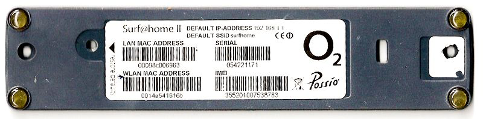

#### index
- [Network Access Layer](#network-access-layer)
- [Frame](#frame)
- [MAC Address](#mac-address)
- [NIC (Network Interface Controller)](#nic-network-interface-controller)
- [Network Topology](#network-topology)

network device
- [Hub](#hub)
- [Switch](#switch)
- [Router](#router)
- [Wireless Access Point](#wireless-access-point)
- [Modem](#modem)
  
technology
- [Signaling, Encoding](#signaling-encoding)
- [MTU (Maximum Transmission Unit)](#mtu-maximum-transmission-unit)
- [ARP](#arp)
- [Ethernet](#ethernet)
- [802.11](#80211)
- [Wi-Fi](#wi-fi)


## Network Access Layer

네트워크 액세스 계층은 TCP/IP 모델의 가장 아래에 위치하며 OSI 7 계층 모델의 물리 계층(L1)과 데이터 링크 계층(L2)의 기능을 합쳐놓은 것으로 볼 수 있다

이 계층은 물리적인 네트워크 매체(케이블, 광섬유, 무선 전파 등)를 통해 데이터를 실제로 전송하고 수신하는 역할을 한다

상위 계층인 인터넷 계층에서 내려온 IP 패킷(또는 데이터그램)을 받아서 특정 네트워크 하드웨어 및 매체 기술에 맞는 형태로 변환하고, 같은 로컬 네트워크(LAN) 상에 있는 다른 장치로 전달하거나 물리적인 연결을 통해 직접 연결된 장치로 전달한다 (데이터 -> 물리적인 신호 변환 및 전송)

대표적인 기술: [이더넷(유선랜)](#ethernet), [와이파이(무선랜)](#wi-fi), PPP

주요 장비: [NIC](#nic-network-interface-controller), [스위치](#switch), [허브](#hub), [브릿지](#bridge), [무선 액세스 포인트](#wireless-access-point), [모뎀](#modem)

#### 물리적 전송 (Physical Transmission, L1)

데이터를 전기 신호, 빛 신호 또는 전파 등 물리적인 신호로 변환하여 케이블이나 공기 중으로 전송한다

사용되는 물리적 매체(UTP 케이블 종류, 커넥터 규격, 무선 주파수 대역)와 신호 방식(전압 레벨, 인코딩 방식 등)을 정의한다

#### 데이터 프레이밍 (Data Framing, L2)

인터넷 계층으로부터 받은 패킷 앞 뒤에 헤더와 트레일러 정보를 추가하여 **프레임(Frame)**이라는 전송 단위를 만든다

헤더는 주로 목적지 및 출발지의 MAC 주소와 같은 제어 정보가 포함한다

트레일러에는 전송 중 오류를 감지하기 위한 FCS(Frame Check Sequence) 값이 포함된다

프레임의 구조는 사용하는 네트워크 기술(이더넷, 와이파이 등)에 따라 상이하다

#### 물리적 주소 지정 (Physical Addressing, L2)

[NIC](#nic-network-interface-controller) 제조 시 할당되는 MAC 주소라는 하드웨어 고유한 주소를 사용하여 동일한 로컬 네트워크(LAN) 내에서 장치를 식별한다

[ARP 프로토콜](./internet-layer.md#arp-address-resollution-protocol)을 통해 MAC 주소 정보를 획득할 수 있다

#### 매체 접근 제어 (MAC, Media Access Control, L2)

하나의 네트워크 매체(이더넷 케이블, 와이파이 채널)를 여러 장치가 공유할 때 데이터 충돌 없이 서로 통신할 수 있도록 접근 순서나 방법을 제어한다

유선 이더넷: CSMA/CD (충돌 감지)

무선랜(와이파이): CSMA/CA (충돌 회피)

#### 오류 감지 (Error Detection, L2)

프레임의 FCS 값을 이용하여 수신된 데이터에 대해 물리적 전송 과정에서 발생할 수 있는 데이터 오류를 감지한다

오류가 감지되면 해당 프레임은 폐기되며, 일반적으로 상위 계층(전송 계층)에서 오류 복구를 담당한다


## Frame


[이미지 출처](https://www.industrialethernetu.com/courses/ie201.html)

프레임은 상위 계층에서 IP 패킷을 받아서 물리적인 통신 매체(이더넷 케이블, 와이파이 등)를 통해 전송할 수 있는 형태의 데이터를 말한다

프레임: 헤더 + 데이터(IP 헤더, TCP 헤더, 페이로드) + 트레일러

전송 매체별로 프레임의 구조가 결정되며 가장 널리 사용되는 Ethernet II 프레임 구조는 아래와 같다

|필드|크기 (바이트)|설명|
|---|----|---|
|Preamble|7|동기화 (수신자가 시작 위치를 알 수 있게 함)|
|SFD (Start Frame Delimiter)|1|프레임 시작 알림|
|Destination MAC address|6|목적지 장치의 MAC 주소|
|Source MAC address|6|출발지 장치의 MAC 주소|
|EtherType|2|상위 프로토콜(IP 등) 캡슐화 명시|
|Payload|46~1500|실제 데이터|
|FCS (Frame Check Sequence)|4|CRC 방식 오류 검출 코드|

프레임은 [NIC (Network Interface Card)](#nic-network-interface-controller)를 통해 스위치 등 L2 장비를 거쳐 네트워크로 전송된다 (L2 장비는 프레임을 보고 목적지 MAC 주소에 따라 프레임을 전달함)

이 때 충돌이 발생하지 않도록 CSMA/CD (Ethernet), CSMA/CA (Wi-Fi) 같은 접근 제어 방식을 적용하기도 한다

이더넷에서 [MTU (Maximum Transmission Unit)](#mtu-maximum-transmission-unit)는 1500 바이트로 제한된다

Payload가 이 크기를 초과하면 상위 계층(IP)에서 [Fragmentation](./internet-layer.md#fragmentation)이 발생한다 (프레임엔 헤더와 트레일러가 포함되기 때문에 프레임 전체 크기는 MTU보다 클 수 있음)

프레임의 끝에는 FCS라는 값이 있는데 이는 CRC (Cyclic Redundancy Check)를 이용하여 데이터 전송 오류를 검출한다
- 송신자가 데이터로부터 CRC 값을 계산해 FCS에 저장한다
- 수신자는 다시 계산해서 FCS 값과 비교한다
- 불일치하면 오류로 판단하고 프레임을 폐기한다

이 방식은 오류 검출 및 프레임 폐기를 하고, 복구는 전송 계층에서 담당한다


## MAC Address



[이미지 출처](https://ko.wikipedia.org/wiki/MAC_주소)

MAC (Media Access Control) 주소는 [NIC](#nic-network-interface-controller)에 할당되어 있는 48비트(6바이트) 크기의 고유 식별자로 로컬 네트워크(LAN) 상에 존재하는 하드웨어를 식별하는 데 사용된다

IP 주소가 유동적으로 할당할 수 있는 논리 주소라면 MAC 주소는 일반적으로 고정된 물리적인 주소다

NIC에 하드웨어적으로 내장되기 때문에 변경할 수 없으며 전 세계에서 중복되지 않도록 관리하고 있다

원칙적으로는 하드웨어 고정이지만 특정 목적으로 인해 소프트웨어적으로 변경할 수 있다 (이로 인해 MAC 스푸핑 같은 보안 공격이 발생함)

MAC 주소는 프레임의 헤더에 담겨 전송되는데, 스위치 같은 장비가 MAC 주소를 보고 목적지를 결정한다

로컬 네트워크의 최종 목적지 호스트에 데이터를 전달하기 전 [ARP](./internet-layer.md#arp-address-resollution-protocol) 프로토콜을 통해 목적지 IP를 MAC 주소로 변환한 뒤 프레임을 전송한다

### MAC Address Structure

아래와 같이 6바이트로 구성되어 있고 16진수 2자리씩 6블록으로 표현된다

```plaintext
00:1A:2B:3C:4D:5E
```

앞의 3바이트(24비트)는 OUI(Organizationally Unique Identifier) 제조사 식별 번호를 의미한다

[OUI 검색 사이트](https://hwaddress.com)

00-03-93 -> Apple

00-02-78 -> Samsung

뒤의 3바이트는 해당 제조가 각 장비에 부여하는 고유 번호(NIC 일련번호)를 의미한다


## NIC (Network Interface Controller)


[이미지 출처](https://ko.wikipedia.org/wiki/네트워크_인터페이스_컨트롤러)

NIC는 컴퓨터나 서버, IoT 기기 같은 디지털 장치가 네트워크에 연결되도록 해주는 하드웨어 장치다

이 NIC가 IP 주소를 갖고 MAC 주소를 갖고 데이터를 프레임 단위로 송수신하는 역할을 한다

주요 기능
- MAC 주소 제공: LAN 내 하드웨어 장치 식별
- 데이터 캡슐화/디캡슐화: 패킷 <-> 프레임
- 송수신 중 데이터 임시 저장 (버퍼링)
- 전기/무선 신호 변환: 디지털 <-> 아날로그
- 인터럽트 생성: 수신 이벤트 발생 시 CPU 알림

NIC가 한 번에 처리할 수 있는 최대 프레임 크기를 [MTU(Maximum Transmission Unit)](#mtu-maximum-transmission-unit)라고 하며 이더넷을 사용하는 경우 1500 바이트까지 한 번에 처리할 수 있다

NIC는 연결 방식, 버스 형태, 용도에 따라 여러 종류로 나뉜다
- 연결 방식: Ethernet, Wi-Fi
- 버스 형태: PCI, PCle, USB, M.2
- 용도: 일반 데스크탑 NIC, 서버용 고성능 NIC, 가상 NIC (vNIC)

### How NIC works

전송 과정

```plaintext
1. 응용 계층 데이터 -> TCP/UDP -> IP -> NIC
2. NIC가 IP 패킷을 MAC 주소 기반으로 캡슐화하여 프레임 생성
3. 프레임을 전기 신호로 변환해서 이더넷 케이블/무선(와이파이 등)으로 전송
```

수신 과정

```plaintext
1. NIC가 외부로부터 신호 수신
2. 신호를 프레임으로 복원 후 MAC 주소 확인
3. 목적지 MAC 주소가 일치하면 OS로 전달
4. OS는 상위 계층(IP, TCP 등)으로 전달하며 최종적으로 응용 계층에서 데이터를 수신
```

### Virtual NIC

VM, 컨테이너 또는 클라우드 환경에서는 하드웨어 NIC 대신 가상 NIC를 사용한다

이 NIC는 실제 물리 NIC에 매핑되거나 브릿지, NAT 방식으로 외부와 통신할 수 있다

AWS EC2의 NIC는 ENI(Elastic Network Interface)라고 하며 AWS에서 네트워크 통신을 위해 제공하는 리소스로 가상 머신(EC2)에 연결된 가상 네트워크 인터페이스이다

AWS ENI 구성 요소
- MAC 주소: 가상 MAC 주소
- Private IP: VPC 내부에서 사용하는 IP 주소
- Public IP: Elastic IP (선택적)
- 보안 그룹: EC2에 연결된 방화벽 규칙
- 서브넷 연결: ENI는 하나의 서브넷에만 연결될 수 있다

EC2 인스턴스를 생성하면 기본적으로 하나의 기본 ENI가 함께 생성된다

필요에 따라 고급 구성을 통해 추가 ENI를 연결해 다중 네트워크를 구성할 수 있다 
- 멀티 NIC: 퍼블릭 트래픽용, 프라이빗 트래픽용 구분
- 보안 분리: ENI마다 다른 보안 그룹 적용


## Network Topology

네트워크 토폴로지는 네트워크에서 장비들(컴퓨터, 라우터, 스위치 등의 노드)이 어떻게 연결되어 있고, 그 연결 구조가 어떤 식으로 통신 흐름을 만들어내는지를 정의한다

크게 물리적, 논리적 관점으로 나뉘어 설명한다

물리적 토폴로지: 장비가 실제로 어떻게 연결되었는가 (케이블, 하드웨어 중심)

논리적 토폴로지: 데이터가 어떻게 흐르는가 (프로토콜, 라우팅 중심)

### Bus Topology


모든 노드가 직접적으로 단일 중앙 통신 선에 연결된 네트워크 토폴로지를 버스 토폴로지라고 한다

케이블 하나만 있으면 여러 장치를 연결할 수 있으며 별도의 스위치나 허브가 필요없다

송신 장치가 데이터를 중앙 선을 통해 모든 노드로 전파되며 (브로드캐스트) 수신 대상만 자신의 주소를 보고 데이터를 수신한다

여러 장치가 하나의 선로를 공유하는 방식으로 인해 많은 노드가 동시에 사용하면 트래픽 병목이나 충돌이 발생하며, 이를 방지하기 위해 CSMA/CD 방식이 사용된다

또한 중앙선에서 장애가 발생하면 전체 마비로 이어진다 (단일 지점 실패)

### Star Topology


[이미지 출처](https://en.wikipedia.org/wiki/Star_network)

스타 토폴로지는 네트워크에서 각 장치가 중앙 장비(허브, 스위치 등)에 별 모양으로 연결된 형태의 네트워크 구조를 말한다

모든 통신은 중앙 장비를 거쳐 이루어지고 노드 간에는 직접 연결되지 않는다

새 노드를 추가하기 매우 쉬운 구조이며 특정 노드에서 문제가 발생해도 네트워크 전체의 문제로 이어지지 않는다

다만 많은 노드가 접속하면 허브/스위치에 부하가 걸리게 된다

중앙 장비에 장애가 발생하면 전체 네트워크가 마비될 수 있기에 (단일 지점 실패) 안정적인 네트워크 설계를 위해 중앙 장비 이중화 (이중 스위치 구성)를 고려할 수 있다

인터넷 공유기가 스타 토폴로지 기반의 구조를 사용한다

클라우드 가상 네트워크(VPC) 내부에서 ENI 간 통신하는 방식(중앙 게이트웨이나 라우팅 장치가 중계하는 구조)에서도 이 구조를 사용한다

### Ring Topology


[이미지 출처](https://en.wikipedia.org/wiki/Ring_network)

네트워크에 있는 모든 노드가 고리 형태로 서로 연결되어 있는 구조를 링 토폴로지라고 한다

순환 연결 리스트처럼 각 노드는 이전 노드와 다음 노드에만 연결되어 있고, 데이터는 한 방향 또는 양방향으로 흐르며 네트워크를 순환한다

하나의 토큰이 네트워크를 돌며 전송 권한을 부여하는데, 토큰을 가지지 못한 노드는 데이터를 전송할 수 없다 (토큰 패싱) -> 충돌 방지, 순차적인 전송 보장

구조 자체가 단순하여 간단하게 구현할 수 있으며 토큰 기반일 경우 중앙 허브 없이도 충돌 없이 안정적으로 데이터를 전송할 수 있다

다만 단방향 링일 경우 노드 하나만 고장나도 전체 네트워크에 장애를 일으킨다

노드 추가 시 전체 연결 수정이 필요하며, 노드 수가 많아질수록 전송이 지연된다

이러한 문제를 해결하기 위해 양방향 링 구조와 장애 시 자동 우회하는 기능을 도입한다

### Mesh Topology

메시 토폴로지는 네트워크에 연결된 모든 노드들이 서로 직접 연결된 구조를 말한다

한 노드가 다른 노드와 직접적인 통신 경로를 가지고 있다

모든 노드가 다른 모든 노드와 직접 연결되는 **완전 메시**와 일부 노드들만 직접 연결되고 나머지는 라우팅을 통해 연결되는 **부분 메시**로 나뉜다

완전 메시


부분 메시


[이미지 출처](https://en.wikipedia.org/wiki/Mesh_networking)

노드 간 독립 경로가 존재하여 하나의 연결이 끊겨도 다른 경로로 데이터를 전달할 수 있으며 (고가용성), 트래픽이 분산되어 데이터 충돌이 적다

또한 병렬 통신을 통해 네트워크 성능을 향상시킬 수도 있다

다만 노드 수가 늘수록 연결 수가 기하급수적으로 증가하며 케이블, 포트 수, 라우터 수가 많아짐에 따라 비용이 상승한다

실제 네트워크에서 물리적으로 메시를 구성하지 않더라도 라우팅 테이블 또는 라우터 간 동적 경로 계산을 통해 논리적 메시 구조를 구현하기도 한다

블록체인/분산 시스템에서는 전체 노드가 직접 연결되지 않더라도 논리적으로 메시 형태를 구현한다

### Tree Topology


[이미지 출처](http://www.ktword.co.kr/test/view/view.php?no=1332)

트리 토폴로지는 스타 토폴로지와 버스 토폴로지의 하이브리드 형태로 루트 노드(중앙 장비)를 중심으로 하고 그 아래에 계층적으로 자식 노드들이 연결되는 구조를 가진다

루트 노드: 최상위 노드, 트래픽 중심 허브

중간 노드: 루트와 리프를 잇는 중간 장비

리프 노드: 최하위 노드, 호스트 또는 클라이언트

부모-자식 노드 간 통신만 가능하며 형제 간에는 직접 통신을 할 수 없다

계층적인 구조 덕분에 새로운 노드를 손쉽게 추가하거나 루트 노드에서 하위 노드들을 통제할 수 있다

대규모 네트워크를 구성할 때 체계적인 설계가 가능하다

다만 루트나 중간 노드가 고장나면 전체 통신이 중단될 수 있으며 형제 노드 간 통신을 위해 반드시 상위 노드를 통해야 한다

트리 토폴로지는 구조 자체가 루프에 취약하기 때문에 STP (Spanning Tree Protocol)이라는 프로토콜을 사용하여 토폴로지를 안정화한다

이 프로토콜은 스위치 네트워크에서 루프를 방지하고 트리 형태를 유지하며 백업 경로를 유지하여 장애 발생 시 자동 회복 기능을 갖고 있다


## Hub


[이미지 출처](https://ko.wikipedia.org/wiki/이더넷_허브)

허브란 네트워크 장비 중에서 가장 기본적인 물리 계층(L1) 장비로, 들어온 신호를 단순히 모든 포트로 전달한다 (브로드캐스트)

즉, 한 장비가 허브에 메시지를 보내면 같은 허브에 연결된 모든 장비가 해당 메시지를 받는다

스위치처럼 MAC 주소를 학습하거나 판단하지 않는다

허브의 한계
- 하나의 허브 네트워크에서 여러 장치가 동시에 통신하면 충돌 발생 -> 성능 저하 및 네트워크 지연 발생
- 누구나 트래픽을 엿볼 수 잇음 -> 보안 위협
- 사용자 수가 늘어나면 네트워크 성능이 금방 저하됨

위의 한계점으로 인해 현재는 허브를 스위치로 대체한다

## Switch


[이미지 출처](https://www.cloudflare.com/ko-kr/learning/network-layer/what-is-a-network-switch/)

[이미지 출처](https://en.wikipedia.org/wiki/Network_switch)

네트워크 스위치는 로컬 네트워크(LAN) 상에서 여러 장비(PC, 서버 등)를 연결하고 MAC 주소 기반으로 프레임을 전송해주는 2계층(데이터링크 계층) 장비다

스위치 핵심 기능
- MAC 주소 테이블: 주소 학습 및 포트 매핑(유니캐스트)
- 스패닝 트리 프로토콜(STP): 루프 방지
- VLAN: 논리적 네트워크 분할
- QoS(Quality of Service): 트래픽 우선순위 설정
- 포트 미러링: 트래픽 복제(보안 및 모니터링용)
- 링크 집합: 여러 포트를 하나로 묶어 대역폭 증가


[이미지 출처](https://www.ciscopress.com/articles/article.asp?p=3089352&seqNum=6)

허브와 달리 **MAC 주소 테이블**을 관리하기 때문에 무작위로 보내지않고 필요한 목적지 장비에만 데이터를 전송할 수 있다

MAC 주소 테이블은 스위치의 포트 번호와 해당 포트에 연결되어 있는 하드웨어 장치의 MAC 주소를 매핑하여 저장한다

프레임을 수신할 때 출발지 MAC 주소와 수신한 포트 번호를 MAC 주소 테이블의 항목에 등록한다 (MAC 주소 학습 기능)

수신한 프레임의 목적지 MAC 주소를 테이블에서 찾고 있으면 매핑된 포트로 유니캐스트 전송을 하고, 없으면 브로드캐스트 전송을 한다

동일한 MAC 주소가 다른 포트에서 다시 등장하면 해당 MAC의 스위치 포트 번호를 새 포트로 갱신한다

또한 일정 시간 동안 프레임을 수신하지 않으면 테이블에서 해당 매핑 항목을 삭제한다 (기본 5분)


## Router


[이미지 출처](https://en.wikipedia.org/wiki/Router_(computing))

라우터는 L3 장비로 IP 패킷을 목적지 네트워크로 전달하는 최적의 경로를 결정하고 데이터를 전송한다

주요 역할
- 패킷 전달: 목적지 IP 주소를 기반으로 다음 홉(next hop)으로 패킷을 전송한다
- 라우팅 경로 선택: 라우팅 테이블 또는 라우팅 프로토콜(알고리즘)을 통해 최적의 경로를 계산한다
- 네트워크 분할: 브로드캐스트 도메인을 분리해 트래픽을 최적화한다
- 주소 변환(NAT): 사설 IP <-> 공인 IP 변환 (가정용 공유기 역할)
- 보안 제어: ACL(Access Control List)로 특정 트래픽을 필터링한다

### How Router Works

##### 1. 패킷 수신

NIC를 통해 들어오는 IP 패킷을 받는다

##### 2. IP 헤더 검사

IP 패킷의 헤더 중 Destination IP 주소를 확인한다

##### 3. 라우팅 테이블 확인

목적지 IP가 속한 네트워크 대역이 라우팅 테이블에 있는지 확인한다

전달할 수 있는 후보 중 최적의 경로를 선택하여 다음 홉을 결정한다

##### 4. 패킷 전달

다음 라우터나 최종 목적지(스위치)로 패킷을 전달한다

### Routing Table

라우터는 패킷을 전달할 수 있는 경로를 기억하기 위해 내부적으로 라우팅 테이블을 관리한다

라우팅 테이블의 각 항목은 다음의 정보를 포함한다
- 네트워크 주소: 목적지 네트워크 (e.g 192.168.1.0/24)
- 다음 홉: 다음으로 보낼 라우터 IP 주소
- 인터페이스: 해당 패킷이 나갈 라우터 포트
- 메트릭: 경로 비용 또는 우선순위 (짧은 거리를 선호함)

### Static Routing vs Dynamic Routing

라우팅이란 IP 패킷을 목적지까지 최적의 경로로 전달하는 과정을 말하며, 라우팅 테이블을 통해 전송 경로를 결정한다

이 테이블에 전송 경로를 어떻게 넣느냐에 따라 정적, 동적 라우팅으로 나뉜다

**정적 라우팅**은 라우터 관리자가 수동으로 라우팅 테이블에 경로를 직접 설정하는 방식이다

고정된 경로만 사용하고 자동 학습이나 재계산을 하지 않는다

오버헤드가 거의 없기 때문에 간단한 네트워크에서 성능이 뛰어나며 네트워크 변경이 거의 없는 경우 적합하다

**동적 라우팅**은 라우터가 서로 라우팅 정보를 주고받으며 자동으로 경로를 학습하고 구성하는 방식이다

RIP, OSPF, BGP 등과 같은 라우팅 프로토콜을 사용하여 네트워크 변화에 따라 실시간으로 라우팅 테이블을 갱신한다

복잡한 네트워크에서 경로 관리가 용이하며, 경로 장애 시 자동으로 우회할 수 있다

다만 BGP hijack과 같이 잘못된 라우팅 정보가 퍼질 가능성이 있다

대부분의 환경에서는 정적 + 동적 라우팅을 병행해서 사용한다

핵심 경로는 정적 라우팅으로 고정하여 보안성과 안정성을 확보하고, 나머지 대역이나 원격지는 동적 라우팅으로 유연하게 처리한다
- 기업 본사 <-> 지사: 정적 라우팅
- 본사 <-> 인터넷 백본: BGP 사용

### Home Router


[이미지 출처](https://en.wikipedia.org/wiki/Router_(computing))

가정용 라우터(공유기)는 일반 라우터(엔터프라이즈급)보다 저렴하며 소규모 네트워크에서 사용하는 장비로 라우팅 기능이 조금 떨어지지만 개인이 사용하는데 지장이 없도록 다양한 기능이 통합되어 있다

대부분의 공유기가 라우터 + 스위치 + DHCP + NAT + 방화벽 + 무선 AP, QoS 등의 복합 기능을 수행한다

또한 쉽게 설정할 수 있도록 웹 기반 UI를 제공한다 (192.168.0.1)

보통 1개의 WAN 포트를 지원하여 인터넷과 연결하며 (광 단자 또는 모뎀) 내부 장치들은 LAN 포트에 연결된다

포트 포워딩을 설정하면 외부 요청을 내부 장치에 연결할 수도 있다

공유기 데이터 흐름

```plaintext
    내부 PC (192.168.0.10)
       ^
       |
       V
     공유기 (NAT 변환, 사설 IP <-> 공인 IP)
       ^
       |
       V
   광 단자/모뎀
       ^
       |
       V
      ISP
       ^
       |
       V
     인터넷
```

### Cloud Router

클라우드에서는 물리적 라우터 대신 가상 라우터 개념으로 동작한다

AWS의 경우 VPC 라우팅 테이블 및 인터넷 게이트웨이를 통해 VPC 내의 리소스들이 통신할 수 있도록 한다

이 때 보안 그룹 및 ACL 등과 함께 동작하여 특정 트래픽만 허용한다


## Wireless Access Point

무선 액세스 포인트는 무선 단말(스마트폰, 노트북 등)이 유선 네트워크에 접속할 수 있도록 연결을 중계해주는 장비이다

즉, Wi-Fi 신호를 쏴서 유선 네트워크에 연결시켜주는 무선 중계기로 OSI 계층 상 L2(데이터링크 계층)에 해당한다

핵심 역할
- 무선-유선 브릿지: 무선 장치와 유선 LAN 사이 중계
- SSID 송출: 특정 이름의 와이파이 네트워크 식별 신호 송출
- 인증 처리: WPA2, WPA3 등 보안 인증 처리
- MAC 주소 필터링: 접근 허용된 장치만 연결 허용
- 패킷 포워딩: 연결된 클라이언트의 트래픽을 유선 LAN으로 전달

```plaintext
[Internet]
    |
[Router (DHCP, NAT)]
    |
[Switch] (AP1,2는 유선 스위치에 연결됨)
  |    \
[AP1]  [AP2] → 무선 단말 연결 (SSID 동일하게 구성)
```

무선 액세스 포인트는 공유기와 달리 NAT, DHCP 기능을 제공하지 않으며 WAN 포트도 없다

단순히 무선 신호만 송수신하는 역할만 하여 주로 와이파이 영역을 확장하는데 사용한다

독립형 AP는 각 AP가 독립적으로 동작하며 소규모 사무실, 가정용에 적합하다

컨트롤러 기반 AP는 수십~수백 개 AP를 중앙 WLAN 컨트롤러가 관리하며 대기업, 캠퍼스 등에서 사용하기 좋다

### How WAP Works

##### 1. SSID 브로드캐스트

AP는 SSID라는 무선 네트워크 이름을 주기적으로 전파한다

##### 2. 클라이언트 탐색 및 연결 요청

단말기(노트북, 스마트폰 등)가 SSID 스캔 후 연결을 요청한다

##### 3. 인증 및 암호화 협상

WPA2/WPA3 키를 통한 인증을 수행한다

##### 4. Assosication 완료 후 통신 시작

인증에 성공하면 AP는 단말기 MAC 주소를 기준으로 세션을 유지한다

단말기에서 전달한 프레임을 유선 LAN으로 전달한다

## Modem

Modem은 Modulator + Demodulator의 합성어로 디지털 신호를 아날로그 신호로 변환하고 다시 디지털로 되돌리는 장비이다

인터넷은 디지털 데이터이고 전화선이나 케이블 등은 아날로그 신호 기반이 많은데, 이 둘을 연결해주는 **신호 번역기** 역할을 수행하는 게 모뎀이다

변조 (Modulation): 디지털 신호 -> 아날로그 신호 변환 (송신)

전송 (Transmission): 변조된 아날로그 신호를 통신 회선에 실어 전송

복조 (Demodulation): 수신된 아날로그 신호 -> 디지털 신호로 복원

전화선 기반 인터넷의 경우 컴퓨터의 디지털 신호를 모뎀을 통해 아날로그 신호로 변환하여 전송하고, 다시 모뎀이 반대쪽에서 디지털로 복원하여 통신한다

```plaintext
컴퓨터 -> 디지털 신호 -> 모뎀 -> 아날로그 신호 -> 데이터 전송 -> 모뎀 -> 디지털 신호 -> 컴퓨터
```

```plaintext
[인터넷 회선]
      ↓
   [모뎀] ← ISP 제공 (케이블, DSL, 광)
      ↓
   [라우터] ← DHCP, NAT 수행
      ↓
   [스위치] ← 여러 유선 장치 연결
      ↓
 [PC, 서버, NAS 등]
```

### Modem Type

#### 전화선 기반 모뎀 (DSL/ADSL)

전화선(PSTN)을 통해 전화와 인터넷을 동시에 사용할 수 있는 모뎀

주로 가정에서 사용된다

#### 케이블 모뎀

TV 케이블망(Coaxial)을 통해 데이터를 송수신하는 모뎀

케이블 ISP에서 주로 사용된다

#### 광 모뎀 (FTTH, Fiber to the Home)

광 케이블을 통해 광 신호 <-> 전기 신호를 변환하여 초고속 통신하는 모뎀

별도의 ONU (광 네트워크 장치) 또는 G-PON 모뎀을 사용한다

#### 셀룰러 모뎀 (LTE/5G)

4G/5G 모바일 네트워크를 통해 데이터를 연결하는 모뎀

USB 모뎀, 스마트폰 테더링, IoT 장비에서 사용한다


## Signaling, Encoding

**신호화(Signaling)**는 디지털 데이터를 전기적, 광학적, 무선 주파수 등의 물리적인 신호로 변환하여 통신 매체(케이블, 공기, 광섬유 등)를 통해 전송하는 기법이다

즉, 비트(0과 1)를 실제 전압/광/주파수 변화로 표현하는 것을 말한다

신호화 예시
- 이더넷 케이블 (UTP): 전기적 전압 신호로 표현 (0 -> 0V, 1 -> 5V)
- 광케이블 (FTTH): 빛이 깜빡이는 패턴으로 0과 1을 표현
- 와이파이 (무선): 무선 주파수의 위상/진폭을 조절

**부호화(Encoding)**는 디지털 데이터를 정의된 규칙에 따라 비트 패턴(신호 패턴)으로 변환하는 과정이다

즉 비트(0과 1)를 실제 전송 가능한 전기 신호 패턴으로 매핑하는 규칙으로 1은 어떤 전압으로, 0은 어떤 전압으로 보낼지 결정한다

목적이나 성능에 따라 다양한 인코딩 기법을 선택해서 사용할 수 있다


## MTU (Maximum Transmission Unit)

MTU는 한 번에 네트워크를 통해 전송할 수 있는 최대 데이터 크기(바이트)를 의미한다

이 때 데이터는 순수 데이터 영역인 Payload를 의미한다

MTU는 네트워크 인터페이스(이더넷, 무선) 단위로 정의된다

L2(데이터 링크) 계층에서 적용되는 개념이지만 인터넷 계층(L3)인 IP의 패킷 크기에 직접적인 영향을 준다

L3(페이로드, 세그먼트를 포함한 IP 패킷 전체 크기) = L2(MTU) - L2 헤더/트레일러 크기

MTU보다 큰 패킷은 [조각 처리](./internet-layer.md#fragmentation)해야 되며 이로 인해 성능 저하, 오류 발생, 보안 문제가 발생할 수 있다

기본 MTU 값

|네트워크 종류|기본 MTU 값|
|---|---|
|Ethernet|1500 바이트|
|PPPoE|1492 바이트|
|802.11 (WiFi)|약 2300 바이트|
|Loopback|65536 바이트|


## ARP

[참고](./internet-layer.md#arp-address-resollution-protocol)

## Ethernet

LAN, MAN, WAN 등에서 가장 많이 활용되는 기술 규격으로 1970년대 초, 미국에서 **유선 환경**에서 다수의 장치들이 신호를 주고받을 수 있는 시스템을 고안하면서 탄생했다

당시에 엄청나게 빠른 속도로 컴퓨터의 통신을 지원하는 모습을 빛의 매질인 Ether (에테르) 라는 단어에 빗대어 이더넷이라는 이름으로 지어졌다


[이미지 출처](https://ko.wikipedia.org/wiki/이더넷)

이더넷 케이블은 동축, UTP, 케이블 등이 있다

이더넷은 본래 여러 대의 컴퓨터가 하나의 물리적인 선을 공유하면서 통신하는 구조([버스 토폴로지](#bus-topology)) 였다

버스 토폴로지 특성 상 여러 장치가 동시에 통신을 하게 되면 신호가 충돌되는데 이를 방지하기 위해 CSMA/CD를 만들었다

기술이 발전하면서 허브에서 스위치로 로컬 네트워크 장치가 변경하면서 이더넷도 각 컴퓨터가 독립적인 통신 경로를 가지게 되었다

스위치 이더넷은 충돌이 아예 없어졌고 더 빠르고 효율적으로 진화하게 되어 1Gbps, 10Gbps, 100Gbps의 속도를 지원할 수 있다

이더넷은 데이터를 [프레임](#frame)이라는 단위로 전송하는데 이런 프레임이 전기 신호, 광 신호 또는 무선 신호로 변환되어 이더넷 케이블을 타고 전송되거나 스위치를 거쳐 라우터를 통해 인터넷으로 나가게 된다

데이터 충돌 방지를 위해 CSMA/CD를 사용한다 (와이파이는 CSMA/CA 사용)


## 802.11

802.11은 미국 전기전자학회(IEEE)에서 만든 무선 랜(WLAN) 표준 시리즈 중 하나이다 (이더넷은 802.3)

IEEE 802.11: 802(IEEE 네트워크 관련 기술 그룹 번호), .11(무선 랜 기술을 담당하는 세부 규격)

와이파이는 802.11 규격을 구현한 상용 기술 브랜드명이다 (Wi-Fi Alliance 인증을 받은 제품)

초창기 모든 네트워크는 유선(이더넷) 기반이었는데 시간이 지나면서 무선 네트워크의 요구사항이 증가하면서 1990년대에 최초의 802.11 표준이 등장했다

이후로 속도/주파수 대역/보안/품질 향상을 위한 서브 표준이 만들어지고 있다

무선 통신 보안 기술
- WEP: 초창기 보안
- WPA: 개선된 버전, PSK 방식
- WPA2: AES 기반 암호화
- WPA3: 가장 최신, 향상된 키 교환 및 보안성

802.11 환경 구성 요소
- AP(Access Point): 무선 신호를 송수신하는 장치 (유선 랜과 무선 단말 간의 중계기)
- Station (STA): 노트북, 스마트폰, IoT 등 무선 접속 장치
- BSS (Basic Service Set): 하나의 AP와 그에 연결된 STA 집합
- ESS (Extended Service Set): 여러 BSS를 유선으로 연결한 확장 네트워크


## Wi-Fi

와이파이는 무선 랜 기술 중 하나로 IEEE에서 제정한 [802.11](#80211) 표준을 기반으로 동작하는 무선 통신 기술 브랜드명이다

Wi-Fi Allliance 협회에서 상호운용성과 품질 인증을 받으면 Wi-Fi 인증 마크를 붙일 수 있다

주로 사용하는 대역
- 2.4GHz: 긴 거리, 간섭 많음
- 5GHz: 짧은 거리, 속도 높음
- 6GHz: Wi-Fi 6E부터 추가된 대역

주요 통신 흐름
1. **AP(Access Point)**가 SSID라는 이름으로 네트워크 브로드캐스팅
2. **클라이언트(Station)**가 SSID를 스캔해서 탐색
3. 접속 요청 → 인증(Authentication) → 연결(Association)
4. 연결 후, 무선 링크를 통해 데이터 송수신

CSMA/CA (Collision Avoidance): 송신 전 채널이 비어있는지 확인하고 전송하여 서로 다른 장치 간의 데이터 충돌을 방지한다

|세대|IEEE 표준|최대 속도|주파수|특징|
|Wi-Fi 1|802.11b|11 Mbps|2.4GHz|초창기|
|Wi-Fi 2|802.11a|54 Mbps|5GHz||
|Wi-Fi 3|802.11g|54 Mbps|2.4GHz||
|Wi-Fi 4|802.11n|600 Mbps|2.4/5GHz|MIMO 도입|
|Wi-Fi 5|802.11ac|6.9Gbps|5GHz|Beamforming|
|Wi-Fi 6|802.11ax|9.6 Gbps|2.4/5GHz|OFDMA|
|Wi-Fi 6E|확장형|위와 동일|+6GHz||
|Wi-Fi 7|802.11be|30Gbps|2.4/5/6GHz|초저지연, 고속|

가정에서는 주로 공유기(AP)을 통해 스마트폰, TV, 냉장고 등 IoT 기기에 연결된다

기업에서는 복수 AP를 ESS로 구성하고 Radius 기반 WPA2-엔터프라이즈 인증을 사용하고 VLAN, QoS로 트래픽을 분리한다