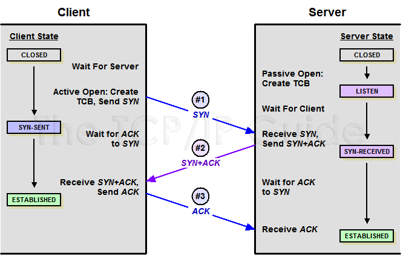

### index
- [transport layer](#transport-layer)
- [tcp](#tcp)
- [udp](#udp)


## transport layer

전송 계층은 애플리케이션 계층의 데이터를 클라이언트-서버 간에 안전하고 효율적으로 주고받을 수 있도록 도와준다

대표적으로 사용되는 프로토콜로 TCP와 UDP가 있다


## TCP

TCP는 흐름 제어, 혼잡 제어, 오류 제어 등의 기능을 통해 네트워크의 신뢰성을 보장하는 프로토콜로 각 기능의 세부사항은 다음과 같다

### TCP segment

세그먼트란 전송 계층의 데이터 전송 단위를 말한다

전송 계층에서 애플리케이션 계층의 데이터를 적절한 크기로 분할하고, TCP 헤더를 붙인 뒤 세그먼트로 포장한 뒤 [인터넷 계층](#internet-layer)으로 전송한다

TCP는 신뢰성 있는 전송을 위해 UDP에 비해 많은 제어 정보를 담은 헤더를 사용한다

```plaintext
┌─────────────────────────────┐
│         TCP Header          │  ← 제어 정보 (20~60 Bytes)
└─────────────────────────────┘
┌─────────────────────────────┐
│         Application Data    │  ← 실제 전송할 데이터 (Payload)
└─────────────────────────────┘
```


- Source Port (16 bits): 송신 포트 번호
- Destination Port (16 bits): 수신 포트 번호
- **Sequence Number** (32 bits): 각 세그먼트의 순서 지정 (바이트 단위, 수신자는 이 번호를 기반으로 조립함)
- **Acknowledgment Number** (32 bits): 수신자가 어떤 바이트까지 정상 수신했는지 송신자에게 알려주는 번호 (신뢰성 보장)
- Data Offset (4bits): 헤더 크기 지정
- Flags (6 bits): SYN, ACK, FIN 등 제어 비트
- **Window Size** (16 bits): 수신자가 한 번에 받을 수 있는 데이터 양 (흐름 제어)
- **Checksum** (16ibts): 데이터 전송 중 손상 여부 검증 (오류가 있으면 재전송 요청)
- Urgent Pointer (16bits): 긴급 데이터 위치
- Options (가변): 성능 향상 기능 (윈도우 크기 확장 등)

아래와 같은 목적으로 세그먼트를 이용할 수 있다
- 성능 분석: 네트워크 지연이나 전송 실패 시 세그먼트 재전송 패턴 확인
- 보안 분석: 세그먼트 내부 데이터를 분석하여 공격(포트 스캐닝 등) 탐지
- 트러블슈팅: Wireshark 등의 툴로 세그먼트를 캡처하여 문제 원인 파악

### 3-way handshake

TCP는 신뢰성 보장에 중점을 둔 연결 지향 프로토콜로 클라이언트와 서버가 서로 데이터를 전송하기 전 다음 조건을 만족해야 한다
- 양 쪽이 네트워크 전송을 하기 위한 정상 상태(Reachability)인 것을 확인 
- 초기 시퀀스 번호(ISN)를 교환하여 순서 제어 준비
- 서로의 연결 의사 표현 (통신할 준비가 되었는지 확인)

신뢰성 있는 데이터 통신을 위해 실제 데이터 전송 전, 양 측간의 연결을 먼저 만드는 3-way handshake 과정을 거친다



[이미지 출처](http://www.tcpipguide.com/free/t_TCPConnectionEstablishmentProcessTheThreeWayHandsh-3.htm)

SYN(synchronization): 연결 요청 플래그

ACK(acknowledge): 응답 플래그

1단계: 클라이언트 -> 서버 (SYN)
- 클라이언트는 ISN(Initial Sequence Number)를 포함 서버에게 연결 요청을 보낸다
- 클라이언트 TCP 상태: CLOSED -> SYN-SENT

2단계: 서버 -> 클라이언트 (SYN+ACK)
- 서버가 SYN 요청을 받으며 연결을 수락한다
- 동시에 자기 자신의 ISN을 담은 SYN과 응답을 의미하는 ACK를 함께 보낸다
- ACK는 클라이언트의 ISN + 1로 설정한다
- 서버 TCP 상태: LISTEN -> SYN-RECEIVED

3단계: 클라이언트 -> 서버 (ACK)
- 클라이언트는 서버의 SYN + ACK에 대해 확인 응답(ACK)을 보낸다
- 서버의 ISN + 1을 자신의 ACK 번호로 설정한다
- 클라이언트, 서버 TCP 상태: ESTABLISHED

TCP는 전송되는 모든 바이트에 시퀀스라는 고유 번호를 붙이는데, 이 번호를 기준으로 재전송, 정렬, 손상 감지 등을 수행한다

ISN의 값은 랜덤하게 선택되어야 세션 하이재킹 공격으로부터 방어할 수 있다

### 4-way handshake

클라이언트와 서버의 네트워크 통신이 종료할 때 4-way 핸드쉐이크 과정을 통해 TCP 연결을 끊는다

클라이언트의 FIN -> ACK, 서버의 FIN -> ACK 동작으로 인해 4번에 걸쳐서 연결을 종료한다

TCP는 Half-Close를 지원하기 때문에 한 쪽이 FIN을 보낸다고 해서 상대방이 즉시 종료해야 되는 것이 아니다

서로 독립적으로 종료할 수 있어야 하므로 FIN은 한 방향씩 종료하는 구조를 가진다


1단계: 클라이언트 -> 서버 (FIN)
- 클라이언트가 서버에게 더 이상 보낼 데이터가 없음을 알린다
- 클라이언트의 송신 스트림만 종료되고 서버는 아직 데이터를 보낼 수 있다
- 제어 플래그 FIN=1 설정
- 클라이언트 TCP 상태: ESTABLISHED -> FIN_WAIT_1

2단계: 서버 -> 클라이언트 (ACK)
- 서버가 클라이언트 FIN에 응답한다
- 클라이언트 TCP 상태: FIN_WAIT_1 -> FIN_WAIT_2
- 서버 TCP 상태: ESTABLISHED -> CLOSE_WAIT

3단계: 서버 -> 클라이언트 (FIN)
- 서버가 자신의 송신 스트림이 종료되었음을 클라이언트에게 알린다
- 클라이언트 TCP 상태: FIN_WAIT_2 -> TIME_WAIT
- 서버 TCP 상태: CLOSE_WAIT -> LAST_ACK

4단계: 클라이언트 -> 서버 (ACK)
- 클라이언트가 마지막 FIN을 확인하고 ACK를 전송한다
- 클라이언트 TCP 상태: TIME_WAIT -> CLOSED
- 서버 TCP 상태: LAST_ACK -> CLOSED

### flow control

흐름 제어란 수신자가 데이터를 처리할 수 있는 만큼 송신자의 전송 속도를 자동으로 조절하는 메커니즘이다

송신자는 네트워크 속도와 상관없이 수신자의 처리 속도에 맞춰 데이터를 전송하며 수신자는 현재 버퍼 여유 공간을 계속 업데이트해서 송신자에게 자신이 처리할 수 있는 값을 알리는 방식으로 동작한다

TCP에서는 수신 윈도우(rwnd, receive window)라고 하는 값을 통해 수신자가 얼마만큼의 데이터를 더 받을 수 있는지 송신자에게 알려주며, 이 값은 매 세그먼트마다 TCP 헤더에 포함되어 전송된다


[이미지 출처](https://www.sanfoundry.com/computer-network-tcp-flow-control/)

흐름 제어 동작 과정
- 연결 설정 (3-way handshake): 수신자가 처음 윈도우 크기를 알린다
- 데이터 수신: 수신자는 현재 버퍼 여유 공간을 업데이트해서 송신자에게 알린다 (ACK에 포함)
- 수신자의 처리 속도 저하 시: 윈도우 사이즈가 줄어들고 그에 따라 송신자가 보내던 걸 대기한다
- 수신 버퍼 여유: 윈도우 사이즈가 늘어나고 송신자가 다시 전송을 재개한다

### congestion control

혼잡 제어란 네트워크 자체가 과부화되지 않도록 송신자의 전송 속도를 조절하는 메커니즘이다

네트워크의 상태를 모니터링하면서 전송 속도를 증가 또는 감소시키는 방식이다

네트워크는 대역폭과 라우터 버퍼에 한계가 있는데, 여러 송신자가 동시에 많은 데이터를 보내면 라우터의 버퍼가 오버플로우되어 패킷 손실이 발생할 수 있다

패킷 손실을 복구하기 위해 데이터를 재전송할수록 더 많은 트래픽이 유입되면서 데이터 전송이 지연되거나 처리할 수 없는 상황으로 치달으며 네트워크 전체가 혼잡 상태에 빠진다

TCP는 이러한 혼잡 상태를 방지하고자 혼잡 윈도우(cwnd, congestion window)라고 하는 값과 수신 윈도우(흐름 제어에서 사용하는 값) 값 중 더 작은 값을 송신 가능한 데이터 양으로 정하는 알고리즘을 기반으로 데이터를 전송한다

rwnd: 수신자 버퍼 상태 기반 (흐름 제어)

cwnd: 네트워크 혼잡 상태 기반 (혼잡 제어)

TCP 혼잡 제어 알고리즘
- TCP Reno
- TCP NewReno
- TCP Cubic
- H-TCP
- BBR/BBR2
- TCP Vegas

### error control

오류 제어란 네트워크 전송 중 발생할 수 있는 오류(손실, 손상, 순서 뒤바뀜)를 감지하고 복구하는 메커니즘이다

TCP는 데이터가 올바르고 완전하게, 순서대로 수신자에게 도달하도록 하기 위해 송신자와 수신자 사이에서 다단계 검증 및 복구 절차를 사용한다

오류 제어의 구성 요소
- 체크섬: 데이터 손상 감지
- ACK: 수신자의 정상 수신 여부 확인
- 재전송: 데이터 손실 시 재전송 수행
- 순서 재조합: 순서 뒤바뀐 세그먼트 정렬
- 중복 제거: 동일한 세그먼트 중복 수신 시 제거
- 타임아웃 관리: ACK 응답 미수신 시 재전송 수행

**체크섬**은 세그먼트의 데이터 무결성을 확인을 위해 사용한다

송신자는 TCP 헤더 + 데이터 전체에 대해 체크섬을 계산하고 세그먼트에 포함시킨다

수신자는 받은 데이터에 대해 체크섬을 재계산하고 전송 중 손상이 발생했는지 감지한다 -> 오류가 있으면 폐기하고 재전송 요청을 유도한다

**ACK**는 수신자가 정상적으로 세그먼트를 받으면 확인 응답을 보내는 용도로 사용한다

누적 ACK 방식을 사용하여 현재까지 받은 데이터의 바이트 범위를 표시한다

1~999 바이트까지 잘 받았으면 ACK의 값을 1000으로 응답하여 데이터를 잘 받았다는 의미와 다음에 1000번부터 보내라는 신호를 보낸다

중복 ACK가 발생하면 데이터 손실을 감지한다 (혼잡 제어와 연결됨)

**재전송**은 타임아웃 기반 재전송과 중복 ACK 기반 재전송 방식으로 수행된다

타임아웃 기반 재전송은 세그먼트를 전송하고 일정 시간 내에 ACK를 못받으면 타임아웃이 발생하여 데이터를 재전송하는 방식이다

중복 ACK 방식은 같은 ACK가 3번 이상 중복되면 데이터 손실로 추정하여 타이머를 기다리지 않고 즉시 재전송하는 방식이다

**순서 재조합**은 세그먼트의 순서를 보장하는 프로토콜로 수신자가 시퀀스 번호를 기준으로 도착 순서를 정렬하여 재조합한다 -> 순서가 뒤섞여서 도착한 경우 버퍼에 임시 저장하고 다음 번호가 오기를 기다림

**중복 제거**는 네트워크 특성 상 같은 세그먼트가 중복 수신될 수 있는데, 이 때 시퀀스 번호를 기반으로 중복 세그먼트를 감지하고 폐기하는 것을 말한다

### multiplexing, demultiplexing

멀티 플렉싱이란 여러 애플리케이션(프로세스)의 데이터를 하나의 전송 통로(네트워크 연결)를 통해 보내는 기법을 말한다

디멀티플렉싱은 수신 측에서 받은 데이터를 적절한 애플리케이션(소켓)으로 전달하는 것을 말한다

즉, 송신 측에서는 여러 애플리케이션의 데이터를 한 네트워크 연결로 모아서 보내고, 수신 측에서는 받은 데이터를 각 애플리케이션에게 정확히 분배하는 과정이다

TCP는 이를 위해 포트라는 개념을 사용하며 세그먼트에 출발지 포트와 목적지 포트를 헤더에 포함시킨다

이 두 값으로 어느 애플리케이션과 통신 중인지 식별할 수 있다

**송신 측 멀티플렉싱**

전송 계층은 애플리케이션에서 받은 데이터를 포트 번호로 구분하고 인터넷 계층에서 목적지 주소(IP)를 설정하여 최종적으로 어느 컴퓨터의 애플리케이션과 통신할 지 명시한다

|애플리케이션|연결 정보|전송 시 식별자|
|---|----|----|
|크롬 (HTTP)|192.168.1.2:50000 -> 142.250.1.1:443|포함|
|Outlook (SMTP)|192.168.1.2:50001 -> 14.225.1.20:25|포함|

Source IP, Destination IP, Source Port, Destination Port를 합쳐서 소켓쌍(Socket Pair)또는 연결 식별자(Connection ID)라고 한다

서버 애플리케이션은 일반적으로 고정된 포트에서 리스닝하고, 클라이언트는 임시 포트(에페머럴 포트)를 사용하여 연결한다

**수신측 디멀티플렉싱**

수신한 세그먼트에서 목적지 포트를 확인하고 운영체제 커널에서 해당 포트를 사용하는 열린 소켓을 찾는다

이후 해당 소켓으로 데이터를 전달함으로써 송신-수신 애플리케이션 간 통신이 이루어진다

만약 해당 포트를 사용하는 프로세스가 없다면 TCP RST(Reset) 플래그를 보내서 연결을 종료한다


## UDP

UDP는 전송 계층의 또 다른 프로토콜로 신뢰성 보장에 중점을 두는 TCP와 달리, 빠르고 단순한 데이터 전송을 목표로 한다

|프로토콜|특징|신뢰성|속도|용도|
|---|---|---|---|---|
|TCP (Transmission Control Protocol)|연결 지향, 신뢰성 보장|O|느림|웹(HTTP), 이메일(SMTP), 파일 전송(FTP)|
|UDP (User Datagram Protocol)|비연결형, 빠른 전송|X|빠름|실시간 스트리밍, 게임, DNS|

TCP가 가진 연결지향, 신뢰성, 순서 제어 등을 포기하여 데이터 손실을 감수하고서라도 지연이 적은 통신이 필요할 때 사용한다

즉, 데이터 전송 전 클라이언트와 서버 간의 연결 설정 작업을 하지 않고 패킷이 순서대로 도착하는지 확인하지 않으며 데이터가 손실되어도 재전송하지 않는다

주로 실시간 스트리밍(유튜브, 넷플릭스), 온라임 게임(fps), 화상 통화, DNS, DHCP와 같이 정확성보다 속도가 중요한 애플리케이션에서 사용된다

### UDP datagram

데이터그램이란 전송 계층의 데이터 전송 단위를 말한다

전송 계층에서 애플리케이션 계층의 데이터를 적절한 크기로 분할하고, UDP 헤더를 붙인 뒤 데이터그램으로 포장한 뒤 [인터넷 계층](#internet-layer)으로 전송한다

UDP는 TCP와 달리 순서 보장, 재전송, 흐름 제어를 지원하지 않고 오류 제어만 제공하기 때문에 헤더가 매우 작다

또한 세그먼트가 아닌 데이터를 데이터그램 단위로 포장한 뒤 인터넷 계층에 전송한다


[이미지 출처](https://www.cs.ait.ac.th/~on/O/oreilly/tcpip/tcpip/ch01_06.htm)

### UDP upper protocol

UDP는 TCP가 수행하는 일련의 연결 과정 및 신뢰성 메커니즘을 제거하여 빠른 데이터 전송 속도를 강점으로 갖지만 이로 인해 다음과 같은 부작용이 발생한다

- 신뢰성 없음 -> 데이터 손실 및 순서 오류 감지 불가
- 혼잡 제어 없음 -> 네트워크 폭주 위험 존재
- 보안 취약 -> UDP Flooding, Spoofing 등의 네트워크 공격에 노출

그래서 UDP의 부족한 점을 보완하고자 상위 프로토콜을 도입한다

RTP: 실시간 멀티미디어 전송에 필요한 순서 지정, 타임스탬프, 페이로드 분할 등

QUIC: UDP를 기반으로 TCP 수준의 신뢰성과 TLS 암호화 제공 (구글 개발)

DTLS: TLS를 UDP에 적용한 보안 전송 프로토콜