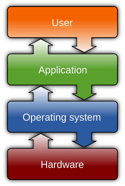
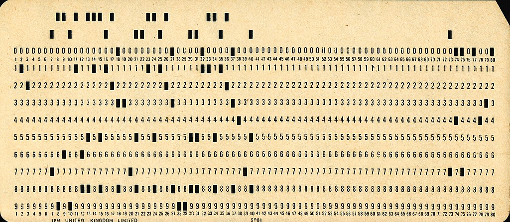
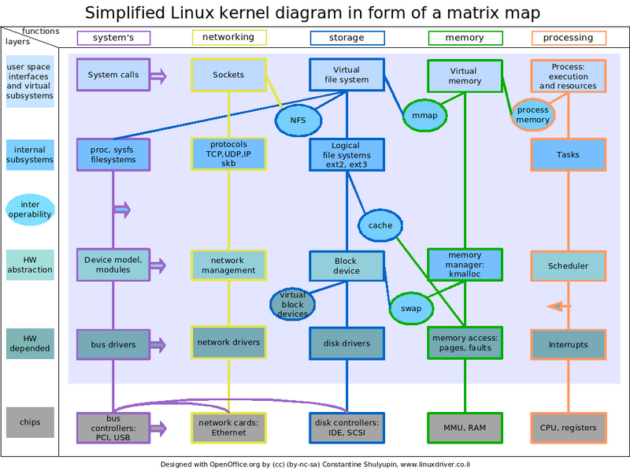

#### index
- [operating system](#operating-system)
- [os chronology](#os-chronology)
- [basic terms](#basic-terms)

#### reference
- [the linux kernel teaching](https://linux-kernel-labs.github.io/refs/heads/master/index.html)
- 

## operating system

운영체제는 컴퓨터 하드웨어와 소프트웨어 자원을 관리하며 프로그램에 공통 서비스를 제공하는 소프트웨어를 말한다

사용자와 하드웨어 간의 중간자 역할을 하여 복잡한 하드웨어 세부 사항을 이해하지 않고도 시스템을 쉽게 사용할 수 있도록 한다

시스템 관리
- 자원 할당: cpu, 메모리, 저장 장치, 입출력 장치 등 하드웨어 자원을 효율적으로 배분하고 관리한다
- 프로세스 관리: 프로그램 실행 단위인 프로세스를 생성하고 스케줄링하며 동기화와 통신을 관리한다
- 메모리 관리: 가상 메모리, 페이징, 세그멘테이션 등을 통해 메모리를 효율적으로 할당하고 보호한다
- 파일 시스템 관리: 파일과 디렉토리를 조직화하고 접근 권한을 설정하며 저장 장치를 관리한다
- 입출력 장치 관리: 장치 드라이버와 인터럽트를 통해 입출력 장치를 제어하고 DMA(Direct Memory Access)로 효율성을 높인다

시스템 운영
- 사용자 인터페이스 제공: CLI 또는 GUI를 통해 사용자가 시스템과 상호작용할 수 있게 한다
- 네트워크와 통신: 인터넷과 네트워크를 통해 다른 시스템과 연결하고 자원을 공유한다
- 보안 및 보호: 사용자 인증, 권한 부여, 데이터 암호화를 통해 시스템을 보호한다
- 애플리케이션 계층: 개발자가 소프트웨어를 만들고 실행할 수 있는 환경을 제공한다
- 오류 처리: 하드웨어 오류나 소프트웨어 버그를 감지하고 처리하여 시스템 안정성을 유지한다

## os chronology

### punch card (1940~1950)

1940~1950년대 초반의 컴퓨터는 사용자가 직접 하드웨어를 조작해야 동작할 수 있었다

컴퓨터에게 어떤 프로그램을 실행하고 데이터를 줄 것인지 알려주기 위해 천공 카드라는 물리적인 종이를 카드 리더를 통해 입력으로 전달했다

천공 카드에 구멍을 뚫어 데이터를 표현하는 방식으로 구멍의 유무가 0과 1을 나타낸다

당시에는 운영체제가 없었기 때문에 사용자가 프로그램을 직접 로드하고 실행하며 하드웨어를 관리해야 했다 -> 직접 사람이 카드 리더에 천공 카드를 넣어야 됨

프로그램을 천공 카드 덱으로 준비해 운영자에게 제출하면 운영자가 이를 순차적으로 컴퓨터에 입력해 실행하는 방식이었다 -> cpu가 이미 작업을 처리해도 입/출력 처리 과정으로 인해 유휴 상태에 있는 시간이 길어 비효율적이었다

### early os (1950~1960)

하드웨어 관리와 작업의 자동화의 필요성이 대두되면서 IBM의 FMS(Fortran Monitor System) 등과 같은 초기 운영체제가 등장했다

이들은 주로 입출력 장치 관리와 프로그램 실행 자동화를 담당했다

이전에는 cpu가 사람이 직접하는 입출력 작업이 끝날 때까지 기다려야했지만 운영체제가 cpu와 입출력 장치(프린터, 테이프 드라이브) 간의 통신을 조정하면서 cpu가 유휴 상태에 놓이는 시간이 줄어져 효율성이 높아졌다

이 시기의 운영체제는 여전히 한 번에 하나의 프로그램만 실행할 수 있었고 사용자와의 실시간 상호작용은 거의 불가능했다

### simultaneous programming (1960~1970)

컴퓨터 성능이 향상되면서 여러 작업을 동시에 처리하려는 요구가 커짐에 따라 다중 프로그래밍과 시분할 시스템 기능을 갖춘 운영체제가 등장했다

다중 프로그래밍이란 여러 프로그램을 메모리에 동시에 로드하여 한 프로그램이 입출력 작업을 기다리는 동안, 다른 프로그램을 실행하는 방식을 말한다 -> cpu의 유휴 시간을 줄이고 활용도를 극대화함

시분할 시스템은 cpu 시간을 여러 사용자에게 나누어 할당하여 여러 사람이 동시에 시스템을 사용할 수 있게 한다 -> 사용자와 시스템 간의 상호작용을 가능하게 함

동기: 한 작업이 끝날 때까지 다음 작업이 대기하는 방식으로 순차적으로 작업이 진행된다 (입출력 작업이 완료될 때까지 cpu가 멈춰있는 경우)

비동기: 한 작업이 끝나지 않아도 다른 작업을 진행할 수 있는 방식으로 각 작업이 독립적으로 실행된다 (입출력 작업을 기다리는 동안 cpu가 다른 프로그램을 실행하는 방식)

### pc, network, cloud (1980~)

개인용 컴퓨터의 보급과 기술 발전으로 운영체제가 더 강력한 역할을 수행하게 되었다

pc의 대중화로 인해 사용자를 위한 그래픽 사용자 인터페이스 인터페이스(GUI)가 도입되었다

인터넷의 확산으로 운영체제는 네트워크 통신을 지원하고 여러 시스템 간 자원 공유를 관리하게 되었다 (분산 시스템) 이를 통해 원격 접속과 데이터 교환이 일상화되었다

또한 클라우드 환경에서 가상 머신이나 컨테이너를 통해 여러 운영체제를 동시에 실행하거나 이식 가능한 런타임 환경을 구축하여 자원을 효율적으로 관리한다

## basic terms

### user, kernel

커널은 운영체제의 핵심 구성 요소로 하드웨어와 소프트웨어 간의 인터페이스를 제공하여 애플리케이션이 하드웨어에 접근할 수 있도록 도와준다

또한 프로그램 실행 시 cpu 시간 분배, 메모리 할당, 주변 장치와의 통신을 관리한다

부팅 과정에서 부트로더 이후 가장 먼저 메모리에 로드되고 시스템이 완전히 종료할 때까지 항상 메모리에 상주하여 시스템 호출을 처리한다

### monolithic kernel

커널은 설계 방식에 따라 세 가지로 구성된다

모놀리식 커널
- 모든 os 서비스가 커널 공간에서 실행되는 방식
- 낮은 지연 시간과 효율적인 통신을 장점으로 가지며, 단점으로는 시스템 크기와 복잡성이 크다
- Linux, Unix

마이크로커널
- 최소한의 기능만 커널에 포함하고 나머지 서비스는 사용자 공간에서 실행하는 방식
- 모듈성이 높고 시스템 확장이 용이하지만 유저 모드와 커널 모드 간의 잦은 전환으로 인해 성능 오버헤드가 있다
- Minix, Mach

하이브리드 커널
- 모놀리식과 마이크로커널의 장점을 결합한 형태
- 일부 서비스는 커널 공간에 두고, 일부는 유저 공간에 배치한다
- Windows NT

### micro kernel

### hybrid kernel

### address space

### execution contexts

### multi-tasking

### preemptive kernel

### pageable kernel memory

### asymmetric multiprocessing (asmp)

### symmetric multiprocessing (smp)
