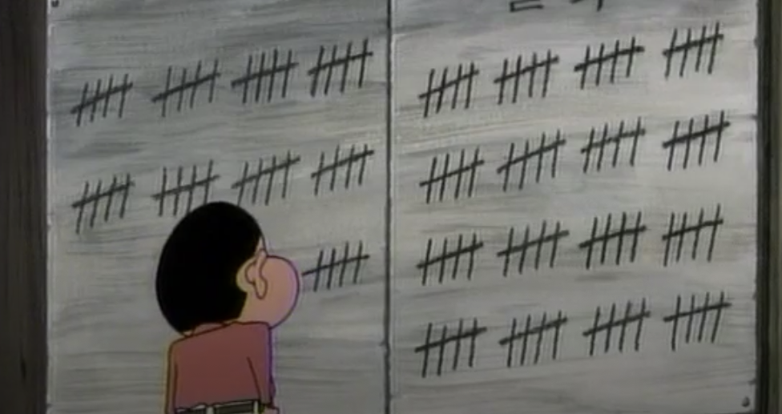

## D+100 project

어른들이 너도 나이 들어봐라 시간 금방간다라며 했던 말들이 무슨 말인지 조금씩 공감이 되어 간다 

어제가 오늘같고 오늘이 어제같다

나는 매월 1일 해를 맞이하러 가는데 가끔 시간이 이렇게 지났나하고 깜짝 놀랄 때가 있다

해를 바라보며 저번 달에 한 게 뭐가 있을까하고 돌이켜보면 생각보다... 뭐 없다

점점 빠르게 흘러가는 것처럼 느껴지는 시간의 흐름과는 다르게 나는 그자리 그대로인 거 같은 기분이 든다

기분 나빠지고 우울해하고 있으면 뭐하나. 나 혼자만 울고 있는 것 밖에 안되는데

그래서 이 프로젝트를 시작했다. 조금이라도 더 나아지고자 하기 위해. 프로젝트를 시작하는 시점의 나로부터 어떤 변화가 이뤄졌는지 관찰하기 위해. 이 시간이 얼마나 소중한지 아는 생각을 마음 한 켠에 제쳐두고 딴 짓을 하고 있는 나의 모습을 돌이켜 보기 위해

동기에 비해 프로젝트의 내용은 미미하다

한창 개발자 사이에서 많이들 작성한 today i learned처럼 100일이라는 기간을 잡고 하루 동안 했던 작업, 새롭게 배운 지식의 키워드를 나열하는 게 전부이다

다만 과장없이 진실되게 작성하는 것을 가장 중요한 원칙으로 삼는다

## 2025.03.18 ~ 2025.06.26

### 3월

03.18: aws ecs 실습, 컴퓨터구조 및 알고리즘 인덱스 파일 추가, 파이썬 생태계/버저닝 학습

03.19: 터미널 개념/단축키, 쉘 개념/서브쉘/job, nushell 설치, 파이썬 동적 타입 언어 학습

03.20: 성수동 나들이, 블로그 디자인 수정

03.21: shell 개념, neovim 설정

03.22: vscode 설정, 블로그 디자인 수정, 인터프리터 및 파이썬 GIL/문법, 연산자 학습

03.23: python 자료형, 시퀀스/컬렉션 자료구조, 컴프리헨션, 언패킹, 제너레이터, 표준 입력 학습

03.24: python 표준 출력/에러, 파일 처리, 동적 객체 모델, 클래스/메서드/속성, 접근 제어자, 상속, 추상 클래스/다형성, 매직 메서드, object, 메타 클래스/type 학습

03.25: python 프로젝트/가상환경/pip/pipx/venv/poetry 학습, git 버전관리/형상관리/델타 기반 스냅샷/git 객체/3단계 구조/파일 상태/HEAD/브랜치 전환/.git 디렉토리(파일 관련) 학습

03.26: .git 디렉토리(refs, objects, HEAD 등), .git 파일, 원격 리포지토리(origin/upstream, fork 등), 브랜치/커밋 네이밍, 브랜치 전략(git, github, gitlab, trunk-based)

03.27: git LFS/submodule/subtree 개념, init/clone, 브랜치 관련(branch, checkout, switch, show-branch), 워크스페이스 관련(add, rm, mv, restore, reset, stash) 명령어 학습

03.28: git 히스토리 관련(commit, merge, rebase, squash, revert, cherry-pick), 로그 관련(status, diff, log, show), 원격 브랜치 관련(remote, push, fetch, pull, archive), tmux 학습

03.29: 로컬 CLI 환경 수정(vim, zsh, asdf, $CONFIG), homebrew, asdf(shims, .asdf, .tool-versions) 학습, starship 개념 정리

03.30: asdf, zoxide, fzf 포스팅, fzf 설정, 로컬 ruby 의존성 교체(brew -> asdf), shell 프로세스 치환 학습, wave 설치/키 바인딩 학습

03.31: 음...글쎄

### 4월

04.01: 해맞이, 4월 계획 수립, 네트워크 인덱스 파일 구성, 인터넷 개념 학습

04.02: 4.2 회의, 네트워크 유형(ban, pan, lan, wlan, vpn 등), 웹 및 웹의 발전, 웹3 기술적 구성 요소 학습

04.03: ohmygoods ecr 작업

04.04: ohmygoods ecs 작업(임시 중단), network tcp/ip (애플리케이션 계층) 학습

04.05: .....

04.06: .....

04.07: .....

04.08: 여의도 봄꽃축제

04.09: .....

04.10: 단기적인 방향성? 및 4월 계획 수립

04.11: 네트워크 인터넷 계층(ip, packet, ip addressing/system, private/public ip, loopback address, nat, icmp, arp, unicast/broadcast, mtu, fragmentation) 학습

04.12: 네트워크 액세스 계층(frame, mac address, nic, network topology) 학습

04.13: 네트워크 액세스 계층(network topology, hub, switch, router, wap, modem, signaling, encoding, ethernet, 802.11, wifi) 학습

04.14: .....

04.15: .....

04.16: .....

04.17: .....

04.18: .....

04.19: .....

04.20: .....

04.21: .....

04.22: .....

04.23: .....

04.24: .....

04.25: .....

04.26: .....

04.27: .....

04.28: .....

04.29: .....

04.30: .....

### 5월

05.01: 해맞이(보라매공원)

05.02: .....

05.03: .....

05.04: .....

05.05: .....

05.06: .....

05.07: .....

05.08: .....

05.09: 면접, DDP 나들이

05.10: .....

05.11: .....

05.12: .....

05.13: .....

05.14: .....

05.15: 상/하반기 및 오마이굿즈 리팩토링 계획 설정