#### index
- [aws containers](#aws-containers)
- [aws ecr](#aws-ecr)
- [aws ecs](#aws-esc)
- [aws ecs configuration](#aws-ecs-configuration)
- [aws ecs/fargate, eks](#aws-ecsfargate-eks)
- [ecr/ecs in github actions](#ecrecs-in-github-actions)


## aws containers

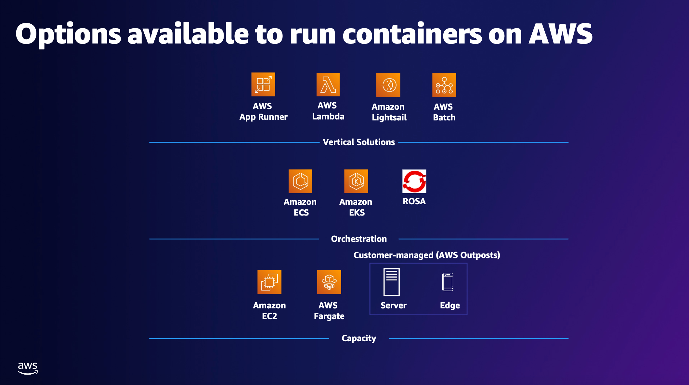

[이미지 출처](https://docs.aws.amazon.com/whitepapers/latest/aws-overview/containers.html)

## aws ecr

aws ecr(elastic container registry)은 컨테이너 이미지를 저장, 관리, 배포할 수 있는 완전 관리형 컨테이너 서비스로 도커 허브와 같은 도커 레지스트리를 aws 서비스 차원에서 제공하는 것이다

컨테이너 이미지를 안전하고 확장 가능하게 호스팅하며 ecs(elastic container service), eks(elastic kubernetes service)와 같은 서비스와 통합할 수 있다

주로 로컬/ci 환경에서 빌드한 도커 이미지를 aws에 업로드할 때 사용되며, 이후 ecs나 다른 환경에서 이미지를 가져와 실행한다

### features

리포지토리 관리: 각 컨테이너 이미지를 위한 리포지토리를 제공한다

IAM 통합: 리포지토리 접근을 IAM 정책으로 세밀하게 제어할 수 있다

이미지 스캔: 취약점 스캔 기능으로 이미지에 대한 보안 점검을 실행할 수 있다

암호화: 저장 시 기본적으로 SSE-KMS(service-side encryption with kms)로 암호화한다

라이프사이클 정책: 오래된 이미지를 자동으로 삭제하여 비용을 절감한다

### usage in aws cli

#### 1. create ecr repository

아래의 명령어는 seoul(ap-northeast-2) 리전에 my-sample-app 이라는 이름의 리포지토리를 생성한다

리전별로 리포지토리는 독립적이기 때문에 꼭 리전 정보를 입력한다

리포지토리가 생성되면 aws cli는 그에 관련된 정보를 출력한다

```shell
aws ecr create-repoistory --repository-name my-sample-app --region ap-northeast-2
```

#### 2. docker login

이미지를 업로드하기 위해 도커에 로그인하는데, 이 때 username은 AWS로 지정하고 `aws ecr get-login-password --region ap-northeast-2`를 비밀번호로 지정한다

```shell
aws ecr get-login-password --region ap-northeast-2 | docker login --username AWS --password-stdin <aws_account_id>.dkr.ecr.<region>.amazonaws.com
```

#### 3. build docker image and tag

빌드한 도커 이미지를 ecr 레지스트리 uri로 태깅한다

```shell
docker build -t my-app:latest . 
```

```shell
docker tag my-app:latest <aws_account_id>.dkr.ecr.<region>.amazonaws.com/my-sample-app
```

#### 4. push to ecr

태깅한 이미지를 ecr에 푸시한다

```shell
docker push <aws_account_id>.dkr.ecr.<region>.amazonaws.com/my-sample-app:latest
```

#### 5. pull from ecr

ecr에 업로드한 이미지를 다운받는다

```shell
docker pull <aws_account_id>.dkr.ecr.<region>.amazonaws.com/my-sample-app:latest
```


## aws ecs

aws ecs(elastic container service)는 컨테이너를 실행, 관리, 확장할 수 있는 완전 관리형 컨테이너 오케스트레이션 서비스이다

또한 오토 스케일링을 지원하여 설정한 값에 따라 동적으로 리소스를 추가하거나 제거하여 성능을 유지하면서 비용을 효율적으로 사용할 수 있다

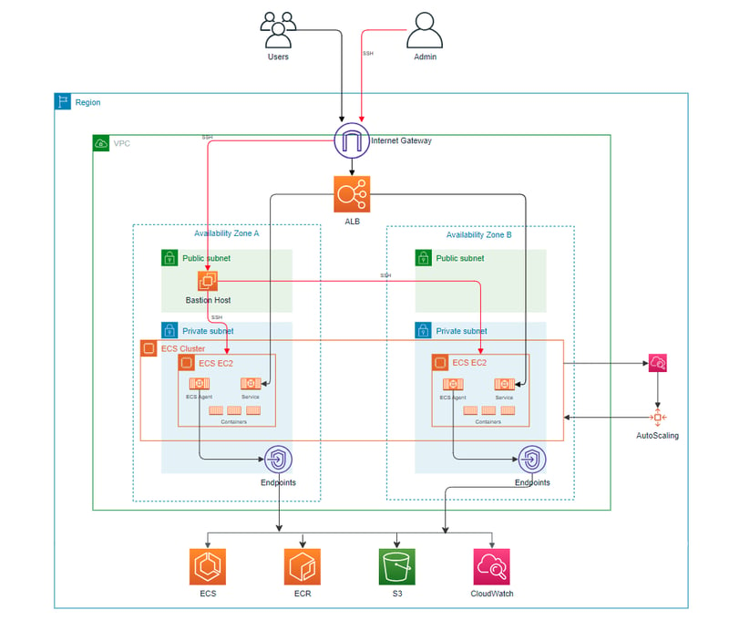

[이미지 출처](https://dev.to/chinmay13/a-comprehensive-guide-for-amazon-ecs-with-ec2-launch-type-using-terraform-2gf)

cluster: 컨테이너 공장 - 여러 작업 라인(task)을 운영하는 공간

service: 작업 관리자 - 공장에서 작업 라인(task)을 일정 수로 유지하고 관리

task definition: 작업 설계도 - 작업 라인에서 어떤 기계(container)를 어떻게 돌릴지 정의

task: 실제 작업 라인 - 설계도에 따라 실행되는 기계(container) 그룹

ec2: 공장 건물 - 작업 라인(task)이 실행되는 물리적 공간(ec2 모드 한정)

### keywords

capacity: task(container)를 실행할 수 있는 컴퓨팅 리소스(cpu, memory, storage 등)

capacity providers: 동적으로 ecs 클러스터 capacity의 스케일링을 관리하는 컴포넌트(fargate, auto-scaling group) - 오버프로비저닝(과도한 비용 발생)과 언더프로비저닝(성능 이슈 야기)을 방지한다

container instances: task(conatiner)를 실행하는 ec2 인스턴스

infrastructure: capacity providers와 container instances를 통틀어 ecs cluster에서 task를 실행하기 위한 인프라

provisioning: ecs 서비스 내의 컨테이너화된 애플리케이션을 실행하기 위한 리소스(ec2 인스턴스)를 제공하는 행동

### ecs components

ecs를 구성하는 핵심 요소는 다음과 같다

#### cluster

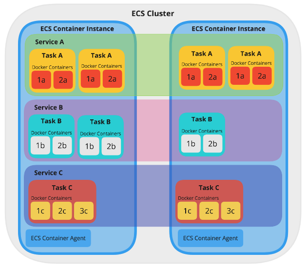

cluster는 컨테이너 워크로드를 실행하는 논리적 그룹으로써 task와 service를 실행할 수 있는 환경을 제공하며 리소스 할당 및 스케일링의 기반이 된다 

ec2 모드에서는 ec2 인스턴스가 task를 실행할 컴퓨팅 리소스를 제공하는 워커 노드 역할을 하며 클러스터는 ec2 인스턴스들의 집합으로 구성된다

fargate 모드에서는 클러스터가 추상화된 resource pool 역할을 하며 aws가 리소스 관리를 자동으로 하므로 사용자가 인스턴스를 구성할 필요가 없다

#### service

service는 cluster 내에서 task를 유지하고 관리하는 task를 관리하는 서비스로 task를 일정 수로 유지하고 관리하는 역할을 한다

하나의 service는 단일 task definition을 기반으로 동작하며 이 파일에 정의된 설정을 통해 task를 관리한다

로드 밸런싱, 자동 복구, 스케일링 같은 기능을 제공하여 애플리케이션의 확장성(task 스케일링)/안정성을 확보한다
- desired count: 실행할 task 수, service가 실행하려는 워크로드 수
- 자동 복구: task가 실패하면 바로 시작
- 로드 밸런싱: application load balancer(alb)와 통합

#### task definition

task definition은 도커 컴포즈와 비슷하게 task 내에 실행될 각 컨테이너(웹 서버 + 데이터베이스 등)에 대한 설정을 json 형식으로 정의한 파일이다

컨테이너 이미지 리포지토리 주소(ecr), cpu/메모리 할당, 포트 매핑, 환경 변수, 로그 설정 등이 포함된다

task definition은 여러 리비전으로 구성할 수 있으며 새로운 버전으로 업데이트하는 경우 service가 새 버전을 사용하게 설정할 수 있다

#### task

task는 task definition을 기반으로 실제 실행되는 컨테이너의 인스턴스 또는 작업 단위를 의미한다

하나의 task는 task definition에서 정의한 컨테이너 이미지들을 실행하므로 여러 이미지가 동일한 task 내에서 컨테이너로 실행될 수 있으며, 이들은 동일한 호스트(ec2 또는 fargate 리소스)에서 함께 실행된다

#### ec2 인스턴스와 task 관계

task는 cluster 내에 속한 ec2 인스턴스들 사이에 분배된다 - task와 ec2 인스턴스는 1대1로 매핑되지 않는다

cluster 내에 두 개의 ec2 인스턴스(t2.micro, 각 1vCPU, 1GB RAM)가 있고, task definition의 설정에 따라 각 task가 0.5vCPU와 512MB RAM을 요구한다면 ec2 인스턴스 한 대당 최대 2개의 task를 실행할 수 있다

service에 설정된 desired count의 값이 5라면 2개의 인스턴스로 모든 task를 실행할 수 없으므로 추가 ec2 인스턴스가 필요하거나 기존 인스턴스의 용량을 늘려야 한다

즉, ec2 인스턴스 수와 각 인스턴스에 할당된 용량은 클러스터의 컴퓨팅 용량을 결정하므로 사용자가 수동으로 추가하거나 auto scaling으로 조정할 필요가 있다

만약 ec2 인스턴스가 task 수를 충족할 수 없으면 일부 task가 실행되지 않고 "pending" 상태로 남는다

하나의 ec2에 여러 task(동일 task definition 기반)가 실행되는 경우 포트 충돌 문제가 발생할 수 있다 -> task definition에서 container 설정 시 네트워크 모드를 awsvpc로 설정하면 이 문제를 해결할 수 있다

#### container agent

ecs와 통신하여 task를 실행하고 상태를 관리하는 역할을 하는 컴포넌트

ec2 모드에서만 사용되며 도커를 통해 실행된다

### ecs provisioning model

ecs는 사용 목적에 따라 선택할 수 있는 두 가지 프로비저닝 모델을 제공한다

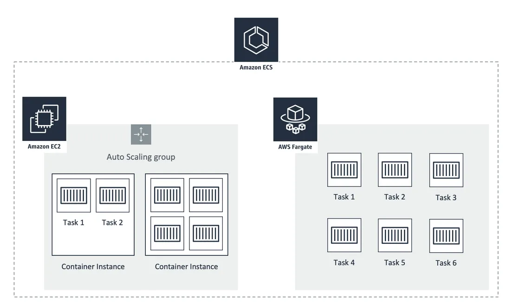

[이미지 출처](https://cloudonaut.io/ecs-vs-fargate-whats-the-difference/)

ec2 (ecs launch type)
- 사용자가 직접 ec2 인스턴스를 직접 프로비저닝하고 관리하는 모드
- 인스턴스를 ecs 클러스터에 추가하여 컨테이너를 실행하는 방식으로 동작한다
- 인스턴스 유형 선택, 비용 최적화, 스케일링에서 높은 유연성을 제공하지만 인프라 관리의 부담이 존재한다

fargate
- 서버리스 방식으로 aws에서 인프라를 관리한다
- 사용자는 인프라 관리 부담이 없고 빠르게 배포할 수 있다
- 다만 ec2 모드에 비해 비용이 더 높게 책정될 가능성이 있다

## aws ecs configuration

ec2 구성하기 전 먼저 설정해야 될 것들
- vpc (public, private subnet 1개씩)
- security group(ssh inbound 허용), key-pair
- IAM ecsInstanceRole (선택 사항)

프로세스
- ecs cluster 생성
- task definition 생성
- service 생성

### 1. create ecs cluster 

ecs cluster의 Infrastructure 옵션을 Amazon EC2 Instance로 선택하면 아래와 같이 On-demand와 Spot이라는 프로비저닝 모델 중 한가지를 선택해야 한다

ec2 프로비저닝 모델은 fargate 모드와 달리 사용자가 리소스를 직접 관리하기 때문이다


On-demand와 Spot은 사용자가 생성한 ec2 인스턴스에 task를 실행하기 위해 클러스터 내에 프로비저닝할 방식을 결정하는 정책이다 

즉, ec2 인스턴스를 생성할 때 적용하는 정책으로, aws는 사용자가 클러스터에 추가할 ec2 인스턴스를 선택할 때 비용과 안전성의 균형을 맞출 수 있도록 두 가지 모델을 지원한다

On-demand
- 사용자가 요청하는 즉시 프로비저닝되는 ec2 인스턴스로 고정된 시간당 요금을 지불한다
- 필요한 만큼 리소스를 바로 사용할 수 있으며 aws가 인스턴스 실행을 보장하므로 capacity 부족으로 인해 인스턴스가 종료될 가능성이 거의 없다
 
Spot 모델
- aws가 남는 ec2 용량을 저렴한 가격에 제공하는 모델로, 경매 방식으로 운영된다
- 사용자는 최대 입찰가를 설정하며 시장 가격이 입찰가를 초과하면 인스턴스가 종료된다
- aws의 설명에 따르면 On-demand 대비 최대 90%까지 비용을 아낄 수 있다고 한다
- 다만 aws가 capacity를 회수하면 2분 경고 후 인스턴스가 종료되며, 언제 종료되는지는 예측할 수 없다


프로비저닝 정책을 선택한 뒤 아래의 desired capacity 옵션을 통해 최소/최대 운영되어야 하는 ec2 인스턴스 개수를 설정할 수 있다

인스턴스의 최소 값을 1개 이상으로 설정하면 그 수에 맞는 ec2 인스턴스를 aws가 자동으로 적절한 ami와 user-data를 설정한 뒤 클러스터에 추가한다

fargate 모델을 선택하면 aws가 리소스를 관리하기 때문에 별도로 하위 옵션을 선택하지 않고 바로 클러스터를 생성할 수 있다

ecs 모델로 클러스터를 생성하고, 자동으로 추가된 ec2 인스턴스에 접속을 한 뒤 `docker ps` 명령을 실행하면 아래와 같이 ecs-agent 컨테이너가 실행되는 모습을 볼 수 있다

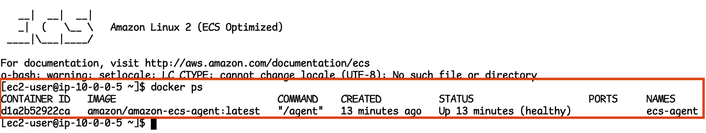

### 2. create task definition

task definition은 도커 컴포즈 파일과 유사한 개념으로 capacity(ec2 또는 fargate)에서 실행될 컨테이너를 정의하는 컴포넌트이다

aws management console의 Task definitions 메뉴 또는 json 형식의 파일을 직접 작성하는 방식으로 정의할 수 있다

설정하는 정보는 대략적으로 다음과 같다
- task에 사용할 리소스 및 네트워크 모드
- 각 컨테이너의 이미지, 리소스/환경 변수 및 기타 정책 설정
- 스토리지 설정
- 모니터링 설정
- 태그 설정

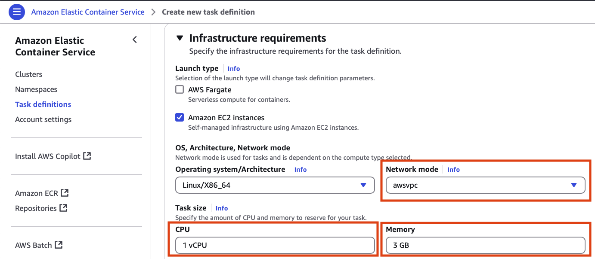

위의 이미지에서 볼 수 있듯이 task를 실행하기 위해 필요한 리소스(cpu, memory)와 task 내 컨테이너 간 네트워크 모드를 설정할 수 있다

cpu와 memory는 task의 모든 컨테이너를 실행하기 위해 필요한 리소스를 명시한다

네트워크 모드는 task의 컨테이너에 대한 통신 방식을 결정하며 5가지의 모드를 제공한다
- awsvpc(ec2, fargate): 각 task마다 독립적인 ENI(elastic network interface)를 할당하는 방식. task가 자체 ip 주소와 vpc 내에서 다른 리소스와 동일한 네트워크 규칙(방화벽, 서브넷 등)을 가진다 -> 각 task가 독립적이므로 호스트의 포트 매핑 문제를 가지지 않으며 ALB(application load balancer)와 통합 시 동적 포트 매핑을 지원한다. 다만 intance type에 따라 ec2 인스턴스당 ENI 수가 제한된다
- bridge(ec2): 도커의 bridge 네트워크를 사용하는 방식. task 내 컨테이너는 호스트의 네트워크 네임스페이스를 공유하지 않고 도커 브릿지를 통해 통신한다 -> 단일 호스트에서 여러 컨테이너를 실행하며 포트 매핑으로 관리하는 경우 사용한다. awsvpc와 달리 하나의 ENI만 사용하므로 하나의 ec2 인스턴스에서 여러 task를 실행하는 경우 포트 충돌이 발생한다 
- default(ec2): bridge 모드를 사용하는 방식
- host(ec2): task 내 컨테이너가 호스트(ec2 인스턴스)의 네트워크 네임스페이스를 직접 사용하는 방식. 컨테이너가 호스트의 네트워크 스택을 공유하므로 별도의 네트워크 격리가 없다. 네트워크 오버헤드를 감소시킬 수 있으나 호스트와 동일한 네트워크이므로 포트 충돌에 주의해야 한다
- none(ec2, fargate): 컨테이너에 네트워크 인터페이스를 제공하지 않는 방식. 컨테이너는 네트워크 연결없이 독립적으로 실행된다 

task의 전체 인프라를 설정하면 아래의 이미지처럼 각 컨테이너에 대한 정보를 설정할 수 있다

추가할 컨테이너의 이미지 uri(ecr repository)와 포트 매핑 및 리소스 할당 제한을 설정한다

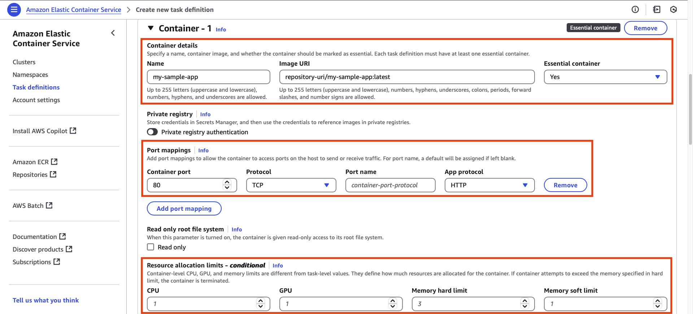

컨테이너에 필요한 환경 변수나 환경 변수 파일을 지정할 수 있다

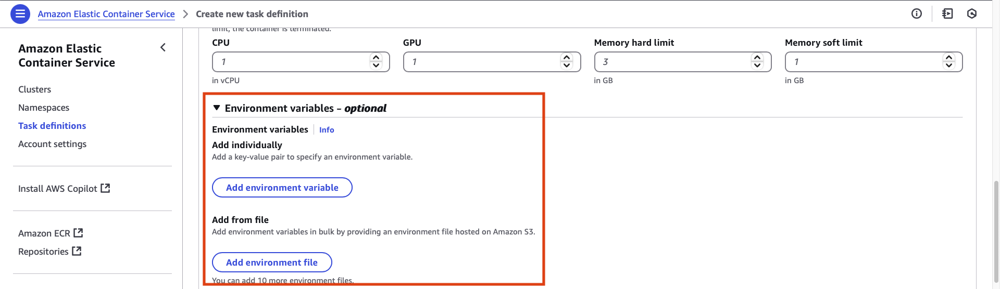

log collection 옵션은 로깅 시스템과 전송할 컨테이너의 로그를 설정한다

기본적으로 선택되는 Amazon CloudWatch 이외에도 splunk, fluentd, json 등 다양한 선택지를 지원한다

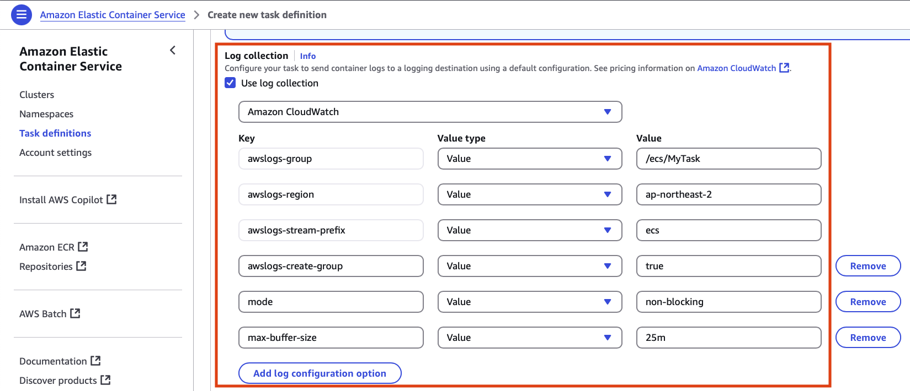

task를 구성할 컨테이너를 모두 설정하면 task에서 사용할 스토리지를 설정할 수 있으며 볼륨을 추가하거나 컨테이너 마운트 포인트를 지정할 수 있다

### 3. create service

service는 하나의 task definition을 기반으로 클러스터 내의 task를 유지/관리하는 역할을 한다

주요 설정
- Enviornment: 서비스를 실행하는 환경을 설정하는 옵션
- Deployment configuration: 배포 방식 구성
- Service Connect: 서비스 간 통신 설정
- Service discovery: Amazon Route 53을 통한 서비스 디스커버리 설정
- Networking: ecs 서비스의 vpc, security group 설정
- Load balancing: ecs 서비스 앞 단에서 트래픽을 분산하기 위해 Amazon ELB를 연결하는 기능
- VPC Lattice: 다중 계정/vpc 간 연결 설정
- Service auto scaling: task 개수 조절 설정
- Task placement: ec2 프로비저닝 모델인 경우 task를 인스턴스를 배치하는 규칙 설정
- Volume: task에서 사용할 스토리지 설정(EBS, FSx, Local ephemeral storage)

#### 3.1 Environment

Environemnt 설정은 아래와 같이 Capacity provider strategy와 Launch type이라는 두 개의 Compute 옵션을 제공한다

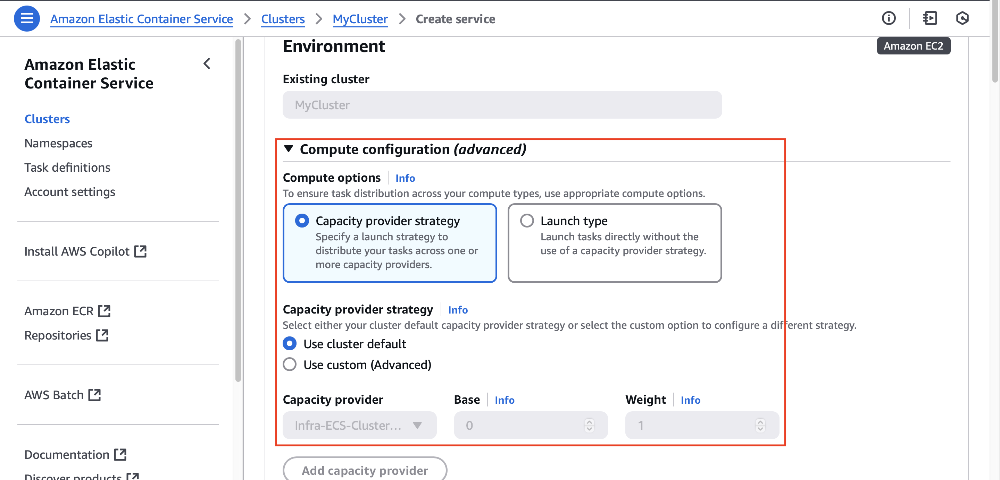

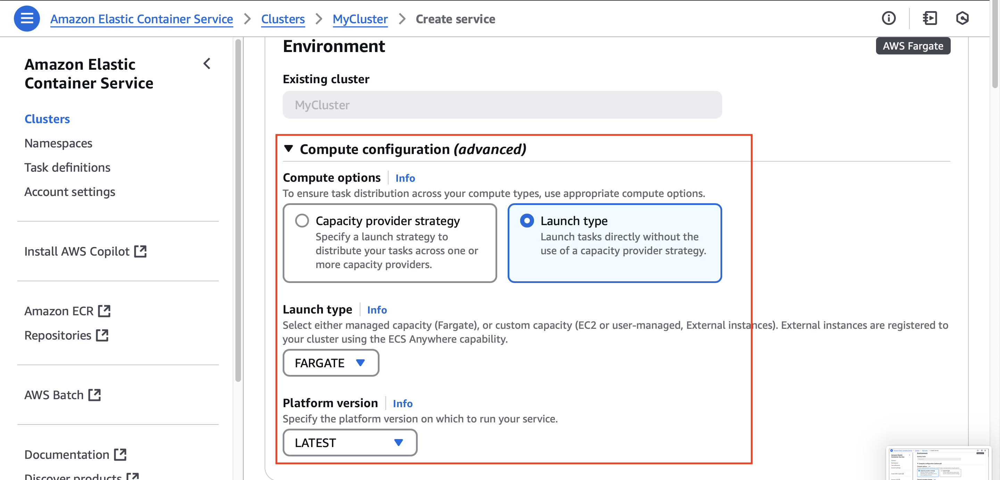

Capacity provider strategy
- 하나 이상의 capacity provider에 task를 분배하는 옵션
- 클러스터의 기본 설정을 사용하거나 서비스 차원에서 capacity provider를 추가하여 task를 분배할 수 있다
- 기본 ec2 auto scaling group을 사용하면서 fargate 또는 fargate spot 사용 가능

Launch type
- ecs가 task를 실행할 때 사용하는 실행 방식을 결정하는 옵션
- 제공되는 fargate, ec2, external 하위 옵션 중 하나를 선택해야 한다
- 여러 capaticy provider를 선택할 수 있는 위 옵션과 달리 단순한 실행 방식을 가진다

#### 3.2 Deployment configuration

배포 방식을 정의하는 설정으로 다음과 같은 옵션들로 구성된다

Application type
- task의 애플리케이션 유형
- Service: 웹 애플리케이션처럼 task들이 그룹을 지어 장기간 작업을 수행하는 유형
- Task: 배치 작업처럼 단독으로 작업을 수행하는 유형

Familiy: task definition 및 revision 설정

Desired tasks: 런치할 task 수

Health check grace period: 헬스 체크 타임아웃

Deployment options
- Rolling update와 Blue/green deployment(powered by AWS CodeDeploy) 중 하나를 선택할 수 있다
- Rolling update(default): 새로운 버전의 task(애플리케이션)를 점진적으로 배포하는 방식. 설정된 정책에 따라 기존 task를 종료하고 새로운 task를 실행한다. 모든 task가 새로운 버전으로 교체되면 배포가 완료된다. 배포 도중에도 서비스가 계속 동작하므로 무중단 배포를 할 수 있다. 하지만 새 task가 배포되기 전에 기존 task가 종료될 가능성이 있고, 배포 중 트래픽이 새 버전과 기존 버전으로 나뉘어 일관된 사용자 경험 보장이 어렵다. 또한 롤백 시 다시 Rolling update를 실행해야 한다
- Blue/green deployment: 새로운 버전(green)과 기존 버전(blue)를 완전히 분리하여 배포하는 방식. 기존 버전은 유지하면서 새로운 버전을 배포한 후 트래픽을 새 버전으로 전환한다. AWS CodeDeploy를 활용하여 green 환경에서 테스트 및 검증을 수행하고 정상적이면 ELB, Route 53 등을 활용하여 트래픽을 blue -> green으로 스위칭한다. 문제 발생 시 즉시 트래픽을 다시 blue로 전환한다. Rolling update에 비해 추가적인 리소스(blue, green 동시 운영 비용)가 필요하며 배포 과정이 복잡하다. 


## aws ecs/fargate, eks


## ecr/ecs in github actions


