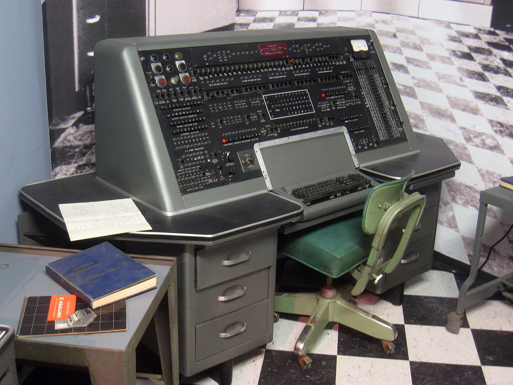
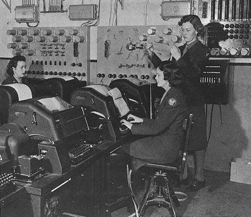
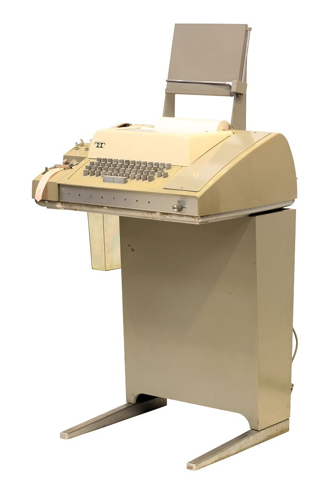
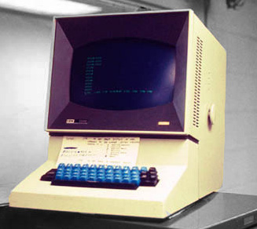
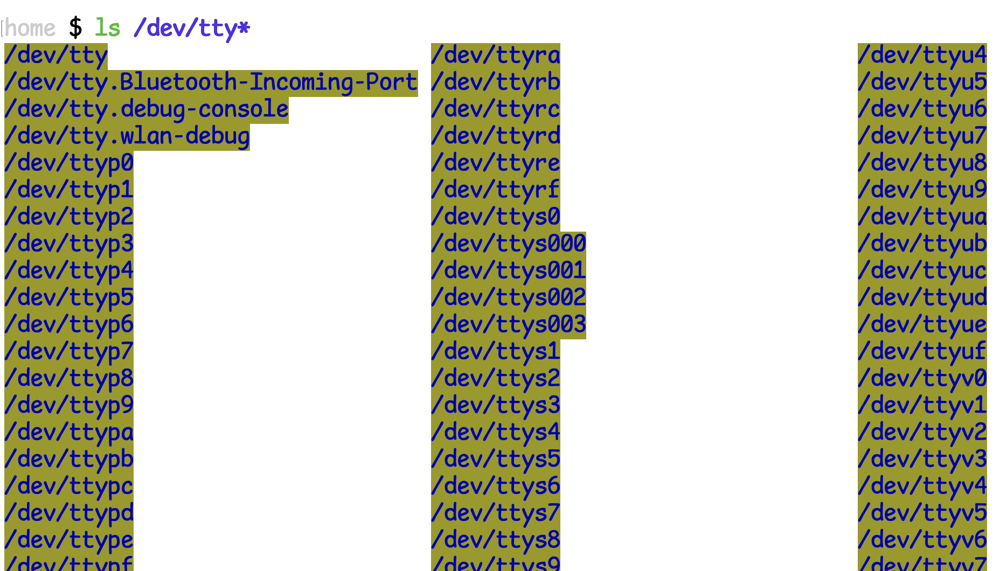

#### index
- [overview](#overview)
- [console](#console)
  - [console main features](#console-main-features)
    - [1. provide access to system input/output](#1-provide-access-to-system-inputoutput)
    - [2. system management and debugging](#2-system-management-and-debugging)
    - [3. virtual console (multitasking)](#3-virtual-console-multitasking)
    - [4. log/error msg output](#4-logerror-msg-output)
- [tty, pty](#tty-pty)
  - [tty](#tty)
  - [pty](#pty)
- [process/job control](#processjob-control)
- [shortcut](#shortcut)
- [implementations](#implementations)


## overview



1950~60년대의 컴퓨터는 콘솔이라는 물리적인 장치를 통해 조작했다

초기 컴퓨터의 프로그램을 천공 카드로 작성하고 카드 리더기에 넣어 실행한 뒤 프린터 장치를 통해 결과를 확인하는 방식이었다

이후 60년대에는 TTY(teletypewriter, teleprinter, teletype)라는 장치를 통해 입력된 데이터를 컴퓨터에게 전송하고, 프린터에 표시된 컴퓨터의 처리 결과를 확인했다

사실 teleprinter라는 장치는 컴퓨터가 등장하기 이전부터 존재했었다

19세기 후반에 모스 부호를 사람이 해독해야 했는데, 이를 자동화하기 위해 디지털 코드 문자(Baudot Code)를 개발하였고 이 코드 체계를 기반으로 teleprinter가 탄생되었다

위키피디아의 이미지를 참고하면 제 2차 세계대전 잉글랜드에서 이 장치를 사용하는 모습을 볼 수 있다

 

1950년대의 teleprinter는 키보드를 누르면 문자를 전기 신호로 변환해서 원격지로 보냈고 받은 문자는 다시 문자로 인쇄하는 방식으로 동작하는 것에 불과했으나 당시 프로그램을 실행하는 도구인 천공 카드의 비효율성을 대체할 장치가 필요했는데 그게 teleprinter였다

아래의 이미지와 같은 teleprinter를 컴퓨터에 연결해서 입/출력 장치로 통해 문자를 인식하고 컴퓨터의 모니터로 결과를 출력하는 방식으로 사용하였다 [teletype demo 영상](https://www.youtube.com/watch?v=S81GyMKH7zw)



1960년대에 들어서면서 입력된 데이터를 컴퓨터에게 전달하고 컴퓨터가 처리한 결과를 실시간으로 처리할 수 있는 CRT(cathode ray tube) 비디오 모니터가 등장함에 따라 점차 화면을 사용하는 방식으로 바뀌었다

IBM 2260 비디오 디스플레이 터미널



하지만 발전된 teleprinter라고 해도 단순히 입출력 장치일 뿐이고 실제 계산과 프로그램 실행은 메인프레임 컴퓨터에서 수행했다(터미널 자체에는 계산 능력이 없다)

컴퓨터 성능이 발전하면서 하드웨어 터미널을 직접 연결하는 방식이 비효율적이라는 문제가 생겼고 이를 해결하기 위해 운영체제에서 소프트웨어적으로 터미널을 흉내내는 방식으로 전환했다

1980~90년대에 unix에서 가상의 터미널(pty, pseudo terminal)이라는 개념을 도입하여 하드웨어 없이도 소프트웨어적으로 여러 개의 터미널을 실행할 수 있게 되었다

unix-like 운영체제들은 `/dev/tty` 라는 가상 장치를 통해 터미널을 관리하며 `ls /dev/tty*` 명령어로 현재 사용 가능한 터미널 목록을 확인할 수 있다



이후 gui 환경에서 동작하는 터미널 에뮬레이터(macos - terminal 등)가 등장하였고, 현재는 gpu 가속을 지원하는 고성능 터미널(kitty, alacritty 등)이 오픈소스를 통해 많은 관심을 받고 있다

teleprinter의 발전 과정 정리
- 전신 타자기(teleprinter): 원격 통신을 위한 문자 전송
- 컴퓨터 입/출력 장치(천공 카드 대체)
- 비디오 터미널(crt 기반) 등장 -> 화면 출력 가능
- 소프트웨어 터미널(pty, 가상 터미널)
- gui 소프트웨어 터미널: iterm2, ghostty, wezterm 


## console

콘솔은 초기 컴퓨터와 상호작용하는 입출력 환경을 의미하는 물리적 장치였지만 터미널의 발전에 따라 비디오 터미널에 의해 대체되었다

현재는 컴퓨터에 직접 연결된 인터페이스로써 사용자가 컴퓨터와 직접 소통(입출력)할 수 있도록 한다

또한 운영체제 콘솔, 브라우저 콘솔, 비디오 게임 콘솔 등과 같이 넓은 범주에서 소프트웨어 환경을 지칭하기도 한다

리눅스 및 맥os의 단일 사용자 부팅 모드를 사용하면 터미널도 아닌 콘솔만 제공된다

콘솔은 연결된 컴퓨터 시스템이랑만 통신할 수 있는데에 비해 터미널은 어느 컴퓨터와 통신할 수 있다

즉, 아래의 다이어그램처럼 콘솔은 로컬 환경에서만 동작하지만 터미널은 네트워크를 통해 원격 컴퓨터와 통신할 수 있다

```text
--------------------------                        --------------------------
| 			 |			  |                        |
|	terminal ---------------------------------------> terminal(pty)    |
|   	   |		 |			  |          |             |
|	   V             |			  |          V             |
|  	 console	 |			  |        console         |
|	   |		 |			  |          |             |
|	   V	         |			  |          V             |
|    operating system	 |			  |    operating system    |
|			 |			  |                        |
--------------------------			  --------------------------
```

### console main features

#### 1. provide access to system input/output

사용자의 입력을 운영체제에게 전달하거나 명령어 실행 결과를 출력한다

입력 전달: stdin (standard input)

명령어 결과 출력: stdout (standard output)

명령어 오류 출력: stderr (standard error)

#### 2. system management and debugging

운영체제 부팅 시 커널 메시지(dmesg)를 출력하거나 긴급 모드(recovery mode)에서 root 콘솔을 통해 시스템 유지보수를 수행할 수 있게 한다

#### 3. virtual console (multitasking)

가상 콘솔은 하나의 물리적인 콘솔(물리적인 키보드/디스플레이를 공유하면서)에서 여러 개의 독립적인 콘솔 세션을 지원하는 기능이다

다음과 같은 용도로 사용할 수 있다
- 시스템 복구 및 유지보수: gui 서버가 깨지거나 ssh가 안될 때 다른 가상 콘솔로 접근하여 cli 환경에서 시스템 복구
- 여러 사용자 및 세션 지원: 하나의 컴퓨터에 여러 사용자가 동시에 로그인(vc1 - root 로그인, vc2 - 일반 사용자 로그인 등)

가상 콘솔은 주로 리눅스에서 사용되며 맥os에서는 멀티 터미널 세션 도구(tmux, screen)을 사용하여 대체한다 

#### 4. log/error msg output

`/var/log/` 디렉토리에 시스템 로그를 저장한다

웹 개발 디버깅 시 브라우저 콘솔로 확인할 수 있다


## tty, pty

### tty

표준 입력에 연결된 터미널의 파일 이름이자 운영체제의 cli 환경에 접속할 수 있게 해주는 소프트웨어 디바이스 드라이버이다

리눅스의 경우 보통 tty0부터 tty6까지 터미널에 동시 접속할 수 있는 디바이스 드라이버이고 tty7부터 gui(x-windows)를 통한 접근을 의미한다

`/dev/tty*`를 통해 파일에 접근할 수 있으며 키보드 입력을 받고 출력 결과를 사용자 화면에 표시하는 역할을 한다

tty/pty 간 입출력을 전달할 수 있다

두 개의 터미널을 열고 각각 tty 명령을 통해 현재 터미널이 어느 tty를 사용하는지 확인한다 (맥os는 가상 터미널 인스턴스를 /dev/ttys* 파일로 나타낸다)

```shell
터미널 1
$ tty

/dev/ttys000

터미널 2
$ tty

/dev/ttys001
```

그리고 다음과 같이 연결된 tty를 통해 다른 터미널에 값을 출력할 수 있다

```shell
$ echo "Hello tty" >> /dev/ttys001
```

### pty

네트워크 기반의 원격 접속(ssh)이나 소프트웨어적으로 구현된 가상 터미널에 접속할 수 있게 해주는 디바이스 드라이버

사용자가 터미널(tmux 등)을 열거나 원격 접속하면 pty가 동적으로 생성된다

pty는 pty master와 pty slave로 구성된다

마스터: 사용자 프로그램(ssh, tmux 등)이 연결되는 가상 터미널로, 마치 사용자가 직접 tty에서 입력하는 것처럼 동작한다

슬레이브: tty와 유사하게 동작하며 실제 셸이나 애플리케이션이 실행되는 공간이다. 슬레이브에 연결된 프로세스는 실제 터미널(tty)에서 실행되는 것처럼 행동한다

```text
user input → pty master → pty slave → tty → shell (bash, zsh 등)
```

즉, pty는 tty의 프록시 역할을 한다고 이해할 수 있다


## process/job control

process
- 실행 중인 프로그램
- 각 프로세스는 연결된 tty와 고유한 pid (process id)를 가진다
- foreground 또는 background 모드에서 동작한다
- 상태: 실행 중, 일시 정지(ctrl + z), 백그라운드 실행(&), 좀비(종료되었으나 부모 프로세스가 회수하지 않은 상태)

job
- 쉘에서 실행된 특정 명령어 실행 단위
- 작업이 실행되면 쉘에서 해당 작업을 추적할 수 있는 작업 id(jid)를 부여한다

프로세스 실행 명령어
- `command &`: 백그라운드에서 실행 (sleep 60 &)
- `nohup command &`: 터미널을 닫아도 계속 실행되는 명령어. 로그는 nohup.out 파일에 담긴다
- `disown -h %job_id`: 백그라운드 작업을 쉘에서 분리하는 명령어 

실행 중인 프로세스 확인 명령어
- `ps`: 현재 실행 중인 프로세스 목록 출력
- `ps aux`: 시스템 전체 프로세스 확인
- `top/htop`: 실시간 프로세스 모니터링
- `jobs`: 현재 쉘에서 실행 중인 작업 리스트 확인
- `pgrep process_name`: 특정 프로세스 찾기 (pgrep -l java)

프로세스 제어 명령어
- `ctrl + c`: 현재 실행 중인 프로세스 강제 종료
- `ctrl + z`: 현재 실행 중인 프로세스 일시 정지
- `ctrl + d`: eof(end of file) 신호 -> 입력 종료
- `bg [%job_id]`: 일시 정지된 작업을 백그라운드로 전환
- `fg [%job_id]`: 백그라운드 또는 중지된 작업을 포그라운드로 전환

프로세스 종료 및 강제 종료 명령어
- `kill pid`: 지정한 프로세스 종료
- `kill -9 pid`: 강제 종료 (SIGKILL)
- `pkill process_name`: 프로세스 이름으로 종료 (pkill java)
- `killall process_name`: 같은 이름의 모든 프로세스 종료

시스템 리소스 확인 명령어
- `ulimit -a`: 현재 설정된 리소스 제한값 확인 


## shortcut

bash/zsh 기준

커서 이동 단축키
- `ctrl + a`: 줄의 맨 앞으로 이동 (ahead)
- `ctrl + e`: 줄의 맨 끝으로 이동 (back)
- `ctrl + b`: 왼쪽으로 한 글자 이동 (backward)
- `ctrl + f`: 오른쪽으로 한 글자 이동 (forward)
- `esc + b`: 왼쪽으로 한 단어 이동
- `esc + f`: 오른쪽으로 한 단어 이동

텍스트 편집 관련 단축키
- `ctrl + u`: 라인의 모든 텍스트 잘라내기
- `ctrl + k`: 커서 오른쪽의 모든 텍스트 잘라내기
- `ctrl + w`: 커서 왼쪽의 한 단어 삭제
- `esc + d`: 커서 오른쪽의 한 단어 삭제
- `ctrl + y`: 삭제한 내용 붙여넣기
- `ctrl + e`: 자동 완성
- `ctrl + l`: clear

제어 관련 단축키
- `ctrl + s`: 터미널 출력 일시 정지(freeze output)
- `ctrl + q`: 터미널 출력 재개(unfreeze output)

히스토리 및 검색 관련 단축키
- `ctrl + s`: 히스토리에서 명령어 검색(forward search) 
- `ctrl + r`: 히스토리에서 명령어 검색(reverse search)
- `ctrl + g`: 명령어 검색 취소
- `ctrl + p`: 이전 명령어 실행
- `ctrl + n`: 다음 명령어 실행
- `!!`: 이전 명령어 다시 실행
- `!n`: 히스토리에서 n번째 명령 실행 (!123 -> 123 번째 명령어 실행)
- `!string`: 히스토리에서 해당 string으로 시작하는 가장 최근 명령어 실행

탭 관련 단축키
- `tab`: 명령어 또는 파일명 자동 완성
- `tab + tab`: 가능한 모든 자동 완성 옵션 목록 표시

터미널 세션 관리
- `ctrl + d`: 현재 쉘 종료 (exit와 동일) 


## implementations 

[다른 터미널 구경하기](https://github.com/cdleon/awesome-terminals?tab=readme-ov-file) 

terminal

[ghostty](https://ghostty.org/)

[cool-retro-term](https://github.com/Swordfish90/cool-retro-term)

[iterm2](https://iterm2.com/)

warp

wezterm

alacritty

kitty

tabby
