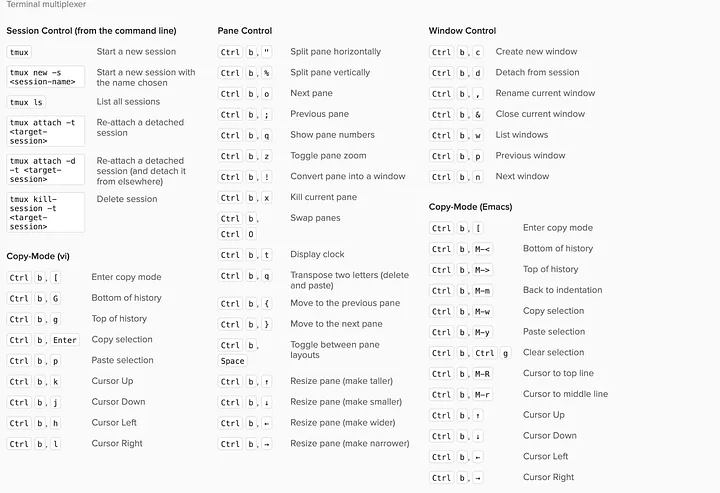
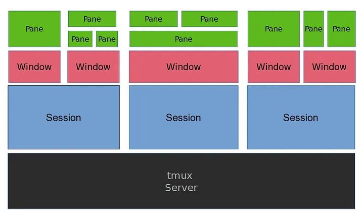

#### index
- [cheatsheet](#cheatsheet)
- [tmux: terminal multiplexer](#tmux-terminal-multiplexer)
- [session](#session)
- [window](#window)
- [pane](#pane)
- [scrollback](#scrollback)
- [configuration file](#configuration-file)


## cheatsheet




## tmux: terminal multiplexer



[이미지 출처](https://medium.com/@Sle3pyHead/tmux-cheat-sheet-and-quick-guide-44038cbe2870)

tmux는 terminalplexer의 약자로 하나의 터미널 창 안에서 여러 개의 터미널 세션을 동시에 관리할 수 있게 해주는 도구이다

즉, 터미널 하나로 여러 작업을 분리할 수 있게 해주는 "작업 공간 정리 도구"를 말한다

터미널 자체로도 여러 윈도우를 쓸 수 있게 해주는데 멀티플렉서를 쓰면 어떤 점이 좋을까?

- [pane](#pane) 기능을 사용하면 하나의 터미널 화면을 여러 화면으로 구성할 수 있어서 터미널 창을 하나만 띄워도 된다
- ssh로 원격 접속했을 때 연결이 끊겨도 tmux 세션이 살아있어서 작업을 이어갈 수 있다
- 단축키나 설정을 통해 사용자만의 워크플로우를 만들 수 있다

다만 백그라운드 프로세스를 서버가 종료되면 모든 세션이 종료된다


## session

세션은 tmux에서 독립적인 작업 환경을 말한다

기본적으로 tmux를 실행하면 하나의 세션이 시작되고, 이 세션 안에서 윈도우와 패인을 만들어 작업을 진행하게 된다

`tmux` 또는 `tmux new-session` 명령어를 입력하면 새 세션을 시작할 수 있다

각 세션은 고유한 식별자(숫자 또는 이름)를 가지며 기본적으로 숫자(0, 1, 2 ...)로 시작하고 사용자가 별도의 이름을 지정할 수도 있다

### client-server model

세션이 시작되면 tmux는 서버 프로세스를 백그라운드에서 실행하고, 사용자는 그 서버에 연결된 클라이언트가 된다

즉, tmux는 클라이언트-서버 모델로 동작한다

서버: tmux가 시작될 때 백그라운드에서 실행되는 프로세스. 이 서버에서 모든 세션, 윈도우, 패인을 관리한다

클라이언트: 사용자가 터미널에서 tmux에 접속할 때마다 생성되는 인스턴스. 클라이언트는 서버가 관리하는 세션에 접근한다

이 구조를 통해 세션이 터미널 창을 닫아도 서버가 백그라운드에서 계속 실행 중이기 때문에 살아남을 수 있다

### session lifecycle

시작: `tmux` 명령어로 세션이 생성되며 tmux 서버에 등록된다

활동: 사용자가 세션에 attach하여 작업을 진행한다

대기: detach (`Ctrl-b d`)하면 세션이 백그라운드로 가고 tmux 서버가 그 상태를 보존한다

종료: 세션 안에서 모든 윈도우가 닫히거나, 서버가 종료되면 세션도 끝난다 (`tmux kill-session -t <session-name>` 명령으로 강제 종료 가능)

### session managing command

목록 확인: `tmux list-sessions` 또는 `tmux ls`로 현재 실행 중인 세션 목록을 확인할 수 있다

tmux 생성(이름 지정): `tmux new -s <session-name>`

재접속: `tmux attach -t <session-name>`

종료: `tmux kill-session -t <session-name>`


## window

윈도우는 독립적인 터미널 화면을 말하며 브라우저의 탭처럼 tmux 하나의 세션 안에 여러 개의 윈도우를 만들 수 있다

각 윈도우는 독립적인 쉘 환경을 제공하고 그 안에서 여러 화면 분할(패인)을 추가로 만들 수 있다

세션에 종속되기 때문에 세션이 사라지면 모든 윈도우는 제거된다

### window managing shortcut

윈도우 생성: `Ctrl-b c` (새 윈도우가 만들어지면 자동으로 번호(0부터)가 붙고 상태줄에 표시됨)

윈도우 이름 지정: `Ctrl-b ,`

윈도우 닫기: `Ctrl-d`(EOF) 또는 exit 명령어로 쉘 종료

강제 종료: `Ctrl-b &`

### window navigation shortcut

다음 윈도우 이동: `Ctrl-b n`

이전 윈도우 이동: `Ctrl-b p`

특정 윈도우 이동: `Ctrl-b <숫자>`

윈도우 목록 보고 선택 이동: `Ctrl-b w`

## pane

하나의 윈도우에서 화면을 쪼갤 수 있는데, 쪼개진 각 영역을 패인이라고 한다

각 패인은 독립적인 셸을 실행하여 한 화면에서 여러 작업을 동시에 볼 수 있다

### pane managing shortcut

윈도우 좌우(수평) 분할: `Ctrl-b %` 

윈도우 위아래(수직) 분할: `Ctrl-b "`

패인 닫기: `Ctrl-d` 또는 `exit` 명령 입력

강제 종료: `Ctrl-b x`

### pane navitation shortcut

특정 방향 패인 이동: `Ctrl-b 방향키`

패인 번호 보고 선택 이동: `Ctrl-b q`

다음 패인 이동(순환): `Ctrl-b o`

마지막으로 활성화된 패인으로 이동: `Ctrl-b ;`

### pane sizing shortcut

패인 경계 수정: `Ctrl-b Alt-방향키`

현재 패인 전체화면: `Ctrl-b z`

레이아웃 변경(순환): `Ctrl-b Space`


## scrollback

스크롤백은 tmux가 각 패인에서 터미널 출력을 저장하는 버퍼를 말한다

일반 터미널과 달리 tmux는 자체적으로 출력 기록을 관리해서 화면에 보이지 않는 과거 출력까지 저장하고 필요할 때 볼 수 있게 한다

패인이 열리면 스크롤백 버퍼가 같이 생성되며, 패인에서 출력되는 모든 텍스트를 스크롤백 버퍼에 순차적으로 저장하며 기본적으로 최대 2천줄을 보관할 수 있다 (설정을 통해 조정 가능)

세션이나 패인이 살아있는 동안 스크롤백이 같이 유지된다

버퍼를 초과한 상태에서 새 출력이 추가되면 오래된 출력이 버퍼에서 밀려난다

스크롤백 탐색 모드 진입: `Ctrl-b [`

tmux는 기본적으로 스크롤백 탐색 모드를 활성화하지 않으면 마우스로 스크롤하면 화면이 스크롤되는 대신, 명령의 히스토리를 살핀다 (`set -g mouse on` 옵션을 설정 파일에 정의하면 스크롤백 자동 활성화 가능)


## configuration file

tmux 설정 파일 형식
- `#`: 주석
- `set` 또는 `set-option`: 옵션 설정
- `bind-key`: 단축키 정의

설정 파일 적용: `tmux source-file <path>`


일반 옵션

```plaintext
# 기본 접두사 변경: set -g prefix <key>
set -g prefix C-a  # Ctrl-a

# 스크롤백 크기 조정: set -g history-limit <limit-size>
set -g history-limit 10000

# 마우스 스크롤, 클릭, 패인 선택 활성화
set -g mouse on
```

키 바인딩

```plaintext
# 단축키 정의: bind-key <key> <command>
bind-key h select-pane -L   # h로 왼쪽 패인 이동

# 기존 단축키 해제
unbind C-b    # 기본 접두사 제거

# -n 플래그: 접두사 없이 바로 동작
bind-key -n M-c copy-mode   # Alt-c로 복사 모드 진입
```