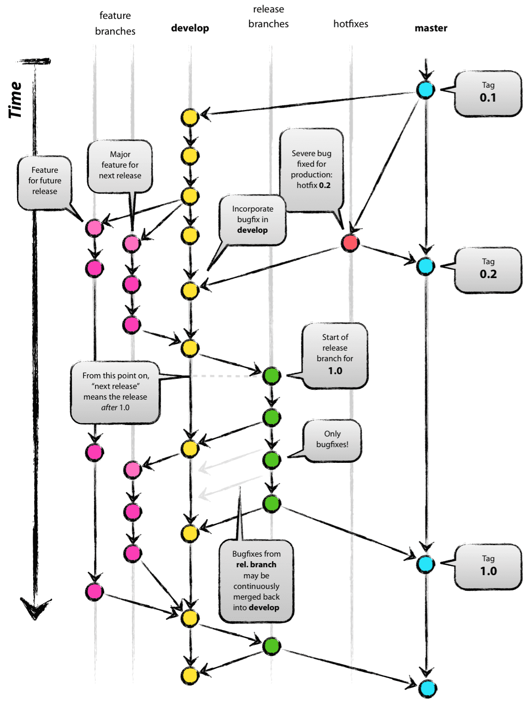
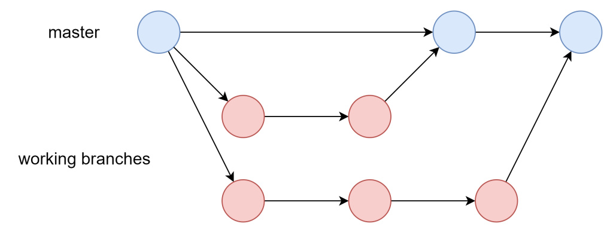
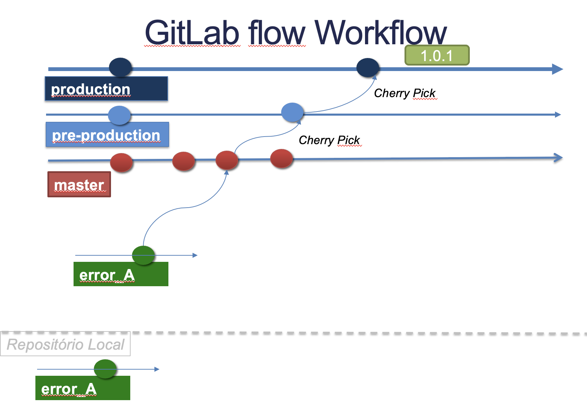
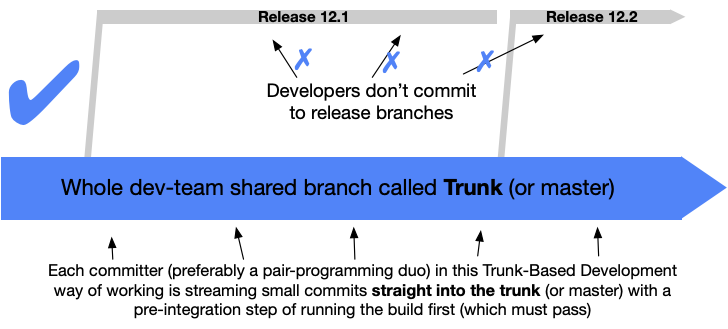

#### index
- [branch strategy](#branch-strategy)
- [branch/commit naming convention](#branchcommit-naming-convention)
- [git flow](#git-flow)
- [github flow](#github-flow)
- [gitlab flow](#gitlab-flow)
- [trunk-based development](#trunk-based-development)


## branch strategy

git에서 브랜치 전략은 협업과 코드 관리를 체계적으로 하기 위 한 방법론이다

각 브랜치는 리포지토리의 독립적인 작업 경로, 특정 커밋을 가리키는 포인터로 하나의 저장소에 여러 개의 브랜치를 만들 수 있다

단일 브랜치만 사용하는 경우 팀 프로젝트에서 충돌이 빈번하게 발생하며 모든 변경 사항이 메인 코드에 반영되어 버그에 취약해진다

브랜치 전략을 통해 브랜치를 어떻게 생성 및 관리하고 병합할지 규칙과 흐름을 정하여 코드 안정성을 높이고 병렬 작업이 가능한 유연한 구조를 만든다

### branch basic operation

`git branch <branch-name>`: 브랜치 생성

`git checkout <branch-name>` 또는 `git switch <branch-name>`: 작업 디렉토리를 해당 브랜치 상태로 변경

`git commit`: 해당 브랜치가 새 커밋을 가리킴

`git merge <branch-name>`: 대상 브랜치의 변경 사항을 현재 브랜치에 반영 (`git switch main` -> `git merge feature/login` -> main 브랜치를 feature/login 브랜치에 병합하여 변경 사항 추가)

`git branch -d <branch-name>`: 작업을 완료한 브랜치는 삭제하여 리포지토리 상태를 깔끔하게 유지한다

### branch strategy guide

팀 규모
- 소규모: github flow
- 대규모: git flow

배포 주기
- 연속 배포: github flow, trunk-based
- 정기 배포: git flow

테스트와 CI/CD
- 자동화 X: 개발/배포 분리(git flow)
- CI/CD O: 단일 브랜치 가능(trunk-based) 


## branch/commit naming convention

### branch naming

브랜치 카테고리를 정하고 전체적인 작업 내용을 요약한 이름으로 표현한다

주요 형식
- `<branch category>/<기능 설명>`: `feature/add-login`
- `<branch cateogry>/<이슈 번호>-<기능 설명>`: `feature/223-add-user-authentication`

관례
- 소문자 사용
- 하이픈(또는 언더스코어)으로 구분자 사용
- 이슈 번호 포함
- 최대 50자 내외

주요 카테고리
- `feature`: 신규 기능 개발
- `bugfix`: 버그 수정
- `hotfix`: 긴급 수정
- `release`: 배포 준비
- `docs`: 문서 작업

### commit naming

커밋 메시지는 변경 사항의 이유와 무엇을 했는지 설명하며 히스토리에서 작업 맥락을 파악하는 데 유용하다

보통 제목(한 줄 요약)과 본문(상세 설명)으로 구성 된다
- 제목: 50~72자 내외, 작업 내용 요약
- 본문: 필요 시 세부 사항 작성

```plaintext
<type>[(<scope>)]: <summary>
<empty line>
<detailed description>

# example
feat(api): implement user registration

Added POST /register endpoint with validation.
```

type
- feat: 새로운 기능 추가
- fix: 버그 수정
- docs: 문서 작업
- refactor: 코드 개선(기능 변화 없음)
- test: 테스트 코드 추가/수정
- chore: 기타 작업(빌드, 설정 등)

scope: 파일, 모듈, 기능 등

summary: 간단한 작업 내용 설명

관례
- 동사 시제: 현재형 명령문 (`added` X -> `add`)
- 이슈 번호 끝에 추가 (`feat: add login #123`)
- 소문자/대문자: 팀 규칙 설정
- 마침표 생략

브랜치 이름이 작업의 큰 그림을 설명하고, 커밋 메시지에서 세부 단계를 표현하는 방식으로 사용된다

```plaintext
브랜치: feature/123-add-login

커밋
- feat(ui): add login from UI #123
- feat(api): implement login endpoint #123
```


## git flow



[이미지 출처](https://techblog.woowahan.com/2553/)

git flow는 복잡한 프로젝트에서 코드의 안정성과 개발 흐름을 체계적으로 관리하기 위해 설계된 브랜치 전략이다

개발, 테스트, 배포 등 특정 목적에 따라 여러 브랜치로 분리하여 작업을 관리한다

주로 5개의 브랜치를 사용하며, 기능 개발과 배포를 분리하여 병렬 작업이 가능하며 각 브랜치가 맡은 역할이 뚜렷하기 때문에 혼란을 감소시킨다

CI/CD 기반 연속 배포보다는 정기적인 배포 주기를 갖는 프로젝트에 적합하다

다만 브랜치가 많고 병합 커밋이 많아져서 히스토리가 복잡해진다

### main

배포 가능한 안정적인 코드만 포함하는 브랜치로 프로덕션에 배포된 상태를 반영한다

직접 커밋하지 않고 release 또는 hotfix 브랜치에서 병합으로만 업데이트한다

각 커밋에 버전 태그(v1.0.0)를 추가한다

### develop

개발 중인 모든 기능을 포함한 브랜치(기능 도입 통합 브랜치)로 안정적이지 않지만 다음 배포의 기반이 된다

feature 브랜치에서 작업을 완료하면 변경 사항을 이 브랜치에 병합한다

다음 버전(v2.0.0)의 베타 상태라고 볼 수 있다

### feature

develop 브랜치로부터 분기되어 새로운 기능 개발을 위한 브랜치이다

일반적으로 `feature/<기능 설명>` 또는 `feature/<이슈번호>-<기능 설명>` 형식으로 이름을 짓는다

작업을 완료하면 develop 브랜치에 병합한 후 삭제한다

e.g) 로그인 기능 추가 시 `feature/add-login` 생성 -> 개발 -> develop 병합 -> 브랜치 삭제

### release

develop 브랜치로부터 분기하여 배포를 준비하는 브랜치이다

보통 `release/<버전>` 형식의 이름을 가진다 (`release/v1.0.0`)

버그 수정, 테스트, QA, 문서 작업 등 배포 전 안정성 테스트 및 문서 작업 등의 최종 조정을 수행한다

배포를 완료하면 main과 develop에 병합하며 태그를 추가하고 브랜치를 삭제한다

### hotfix

배포된 코드에서 버그가 발생한 경우 긴급 수정용으로 사용하는 브랜치이다

main 브랜치에서 분기되며 `hotfix/<문제 설명>` (`hotfix/fix-login-crash`) 형식으로 브랜치 이름을 짓는다

수정 완료 후 main과 develop에 병합하며 태그를 추가하고 브랜치를 삭제한다


## github flow



[이미지 출처](https://www.ios-net.co.jp/blog/20240411-2481/)

github flow는 git flow의 복잡함을 덜어내고 github 플랫폼의 pr 기능을 적극 활용하도록 설계되었다

단일 메인 브랜치를 중심으로 작업 브랜치를 생성하고 pull request를 통해 변경 사항을 검토하고 병합하는 구조를 가진다

빠른 개발 주기와 협업 효율성을 목표로 하며 CI/CD를 사용하는 환경에 적합하다

### main 

항상 배포 가능한 안정적인 코드를 유지하는 브랜치 (프로덕션 코드 동기화)

직접 커밋하지 않고 pr을 통해 작업 브랜치에서 병합된 변경만 업데이트한다 

### task

git flow의 경우 작업의 유형에 따라 브랜치를 나눴지만 git flow는 모두 임시적인 작업 브랜치를 사용한다

main 브랜치에서 분기하며 브랜치의 이름으로 작업의 전반적인 내용을 설명한다

`add-login` `fix-bug-123` `update-docs`

작업의 수에 따라 브랜치가 많아지며, 각 작업 브랜치는 작업을 완료하면 pr로 코드 리뷰를 거치고 main에 병합되고 난 뒤 삭제된다


## gitlab flow



[이미지 출처 및 레퍼런스](https://github.com/jadsonjs/gitlab-flow)

gitlab flow는 git flow의 복잡성을 줄이고 github flow의 단순함을 보완해 더 유연하고 실용적인 브랜치 전략을 제공한다

특히 CI/CD와 환경별 배포를 지원하며 팀 협업과 이슈 추적을 통합하는 데 초점을 맞췄다

github flow와 유사하게 작업 브랜치에서 pr/mr(merge request)을 기반으로 하되, 메인 브랜치에서 즉시 배포를 거치지 않고 별도의 브랜치에서 배포 준비를 한 후에 배포를 진행한다

즉 이슈 -> 작업 브랜치 -> 메인 브랜치 -> 배포 준비 브랜치(환경 브랜치) -> 배포 브랜치(릴리즈 브랜치) 형태의 과정을 거친다

[메인 브랜치](#main-1)와 [작업 브랜치](#task)는 github flow와 동일하다

### environment (pre-production)

위의 이미지에서 pre-production이라고 표현되어 있는 브랜치를 말하며 메인 브랜치로부터 분기되어 각 환경별로 배포되기 위한 준비를 거친다

필요에 따라 여러 개 생성할 수 있다

### release (production)

위의 이미지에서 production 브랜치에 해당하며 실제 프로덕션 환경에 안정적으로 배포된 코드가 위치한다

특정 버전(`release/v1.0 등`)을 유지하며, 버그 수정 시 개별적으로 관리한다


## trunk-based development



[이미지 출처 및 레퍼런스](https://trunkbaseddevelopment.com)

trunk-based development는 단일 브랜치(trunk)에 모든 변경 사항을 직접 통합하거나 짧은 수명의 브랜치를 사용해 빠르게 병합하는 전략을 가진다

복잡한 브랜치 관리 대신 단순함과 속도를 추구하며 코드 통합 지연을 줄여 배포 주기를 단축한다

trunk라는 이름은 전통적인 vcs, svn 등에서 메인 브랜치를 뜻하는 용어에서 유래했다 (git에서는 main, master로 대체됨)

main 브랜치가 모든 작업의 통합 지점이며, 파생 브랜치를 사용하더라도 하루 이내에 병합하는 것을 목표로 한다

코드 안정성을 위해 메인 브랜치에 통합되기전 자동화된 CI/CD 파이프라인의 테스트를 진행하며 팀원 간 충돌을 최소화한다

### main (trunk)

모든 작업이 통합되는 중심 브랜치로 항상 배포가 가능하거나 최소한 작동 가능한 상태를 유지해야 한다

팀원 모두가 브랜치 없이 직접 커밋하는 방식과 단기 브랜치를 사용하는 방식으로 작업을 진행하는 스타일이 구분되며 CI 파이프라인으로 지속적인 테스트/빌드 과정을 자동화한다

### task

특정 작업(기능 추가, 버그 수정 등)을 위해 일시적으로 생성하는 브랜치로 메인 브랜치로부터 분기된다

몇 시간에서 최대 하루 이내에 병합하는 것을 목표로 하고, 작업을 완료하면 메인 브랜치에 병합하고 삭제한다

필요에 따라 선택적으로 생성하는 브랜치

### release

배포 버전 관리가 필요한 경우 사용하는 브랜치로 배포된 버전을 유지한다 (`release/v1.0`)

메인 브랜치로부터 특정 시점에 분기하며 버그가 발생해도 해당 릴리즈 브랜치를 건들지 않고, 메인 브랜치에 버그 수정을 반영한 뒤 새 릴리즈 브랜치를 만든다
