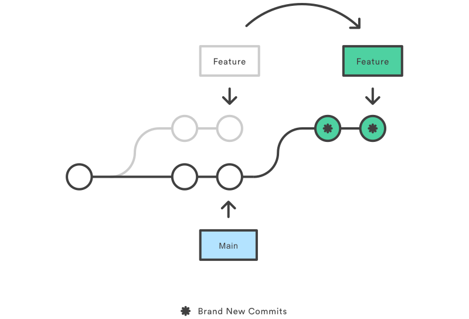
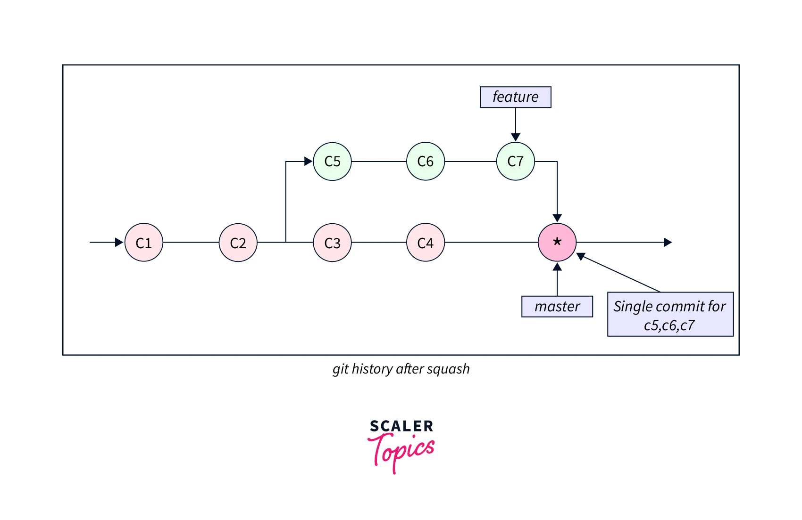

#### index
- [git commit](#git-commit)
- [git merge](#git-merge)
- [git rebase](#git-rebase)
- [git rebase -i](#git-rebase--i)
- [squash](#squash)
- [git revert](#git-revert)
- [git cherry-pick](#git-cherry-pick)


## git commit

`git commit` 명령은 스테이징 영역에 추가된 변경 사항(파일 추가, 수정, 삭제 등)을 새 커밋으로 만들고 리포지토리에 저장한다

각 커밋은 고유한 SHA-1 해시로 식별되며 스냅샷과 작성자(이메일), 날짜, 메시지 등의 메타데이터를 포함한다

git object
- Blob: 파일 내용
- Tree: 디렉토리 구조와 Blob 참조
- Commit: Tree, 부모 커밋, 메타데이터

### how git commit works

먼저 스테이징 영역에 추가된 변경 사항을 확인한다

이를 기반으로 스테이징된 각 파일의 스냅샷을 Blob으로 저장하고 파일 구조를 Tree 객체로 구성한다

그 다음 부모 커밋, Tree, 메타데이터를 포함한 Commit 객체를 생성한다

현재 브랜치의 HEAD를 새 커밋으로 이동시키고 `.git/refs/heads`에 브랜치 포인터를 갱신하면 커밋 명령이 완료된다

### git commit commands

`git commit -m <message>`: 스테이징된 변경을 메시지와 함께 커밋한다

`git commit`: 기본 편집기(vim, nano 등)로 커밋 메시지를 상세히 작성하고 커밋한다

`git commit -a`: 추적하고 있는 파일의 변경 사항을 자동 스테이징 후 커밋한다

`git commit --amend`: 직전 커밋을 새 커밋으로 덮어쓴다 (원격 리포지토리와 충돌 발생 가능성 있음)

`git commit --amend --no-edit`: 메시지 변경 없이 직전 커밋의 메시지를 그대로 사용하면서 새 커밋으로 덮어쓴다

`git commit --allow-empty`: 변경 사항없이 커밋한다 (기본적으로 빈 커밋을 허용하지 않음)

`git commit --dry-run`: 커밋 시뮬레이션


## git merge

`git merge` 명령은 하나 이상의 브랜치 또는 커밋을 현재 브랜치에 병합하여 분기된 히스토리를 통합한다

병합 시 필요하면 새로운 병합 커밋(merge commit)을 생성할 수 있다 (병합 커밋으로 인해 커밋 히스토리가 복잡해질 수 있음)

### how git merge works

구성 요소
- 현재 브랜치(HEAD): 병합 대상 브랜치(소스 브랜치의 변경 사항을 적용할 브랜치, 병합 후 HEAD 업데이트됨)
- 소스 브랜치: 변경 사항을 가져올 병합할 브랜치
- 공통 조상: 두 브랜치가 갈라진 지점 (merge base)

git은 두 브랜치의 분기점(공통 조상)을 찾은 다음, 그로부터 각 브랜치의 변경 사항을 분석한다


[이미지 출처](https://www.atlassian.com/ko/git/tutorials/using-branches/git-merge)

이 때 소스 브랜치가 현재 브랜치보다 단순히 앞서기만 하면 현재 브랜치의 포인터를 이동시키기만 한다 (fast-forward merge)


그게 아니라 각 브랜치가 공통 조상에서 분기한 뒤 각자의 커밋 히스토리를 보유하고 있으면 병합 커밋을 생성한다 f(non-fast-forward, 3-way merge)

만약 두 브랜치에서 동일한 파일을 수정한 경우 충돌(conflict)이 발생하며 개발자가 직접 수동으로 충돌을 해결해야 한다

모든 충돌을 해결하고 정상적으로 병합할 수 있으면 병합 커밋을 생성하고 현재 브랜치의 포인터를 업데이트한다

### git merge commands

`git merge <branch>`: 지정한 브랜치를 현재 브랜치에 병합한다

`git merge --no-ff <branch>`: fast-forward를 할 수 있어도 병합 커밋 생성

`git merge --ff-only <branch>`: fast-forward만 허용하며, 실패하면 병합을 중단한다

`git merge --no-commit`: 병합 후 자동 커밋을 하지 않는다

`git merge --abort`: 충돌 발생 시 병합을 취소하고 원래 상태로 돌아간다

`git merge --squash`: 병합 후 커밋을 하나로 압축한다 (병합 커밋 생성 X)


## git rebase

`git rebase` 명령은 현재 브랜치의 커밋 히스토리를 재구성한다

주요 작업
- 커밋을 다른 커밋 뒤에 재적용하여 분기된 히스토리를 깔끔하게 선형적으로 관리
- 다른 브랜치의 변경을 기반으로 작업 갱신
- `-i` 옵션으로 대화형 모드에 진입하여 현재 브랜치의 커밋 히스토리 수정

`git rebase <base-branch>`: 현재 브랜치를 기반 브랜치 뒤로 재적용한다

`git rebaes --continue`: 리베이스 충돌 해결 후 남은 작업들을 진행한다

`git rebase --skip`: 충돌 커밋을 건너뛰고 리베이스한다

`git rebase --abort`: 리베이스를 취소하고 원래 상태로 돌아간다

`git rebase --onto <newbase> <old-branch> <target-branch>`: old-branch를 조상으로 하는 target-branch를 newbase 브랜치로 리베이스한다

`git rebase --root`: 리포지토리 처음부터 리베이스한다

### how git rebase works

구성 요소
- 현재 브랜치: 리베이스할 대상 브랜치(HEAD)
- 기반 브랜치: 커밋을 재적용할 새 기준점(base)
- 공통 조상: 두 브랜치가 갈라진 지점(merge base)



git은 두 브랜치의 공통 조상을 찾고 그로부터 발생한 변경 사항들을 파악한다

현재 브랜치의 모든 커밋을 복사하고 HEAD를 기반 브랜치의 최신 커밋으로 이동하여 복사한 커밋들을 순차적으로 적용한다 

충돌이 발생한 경우 각 커밋마다 개발자가 수동으로 해결하고, 정상적으로 적용이 되면 현재 브랜치와 기반 브랜치의 포인터를 새 커밋으로 업데이트한다

### git rebase side effect

리베이스한 브랜치의 원래 커밋은 모두 삭제되고 기반 브랜치에 적용된 커밋들은 새 SHA-1 해시로 대체된다

즉, 리베이스 이후 변경 사항은 동일하지만 "현재 브랜치"의 커밋들이 기반 브랜치에 재적용되면서 이전의 커밋과 서로 다른 SHA-1 해시를 가지게 된다

이 상태에서 리베이스하고 원격 리포지토리에 강제로 푸시하면 원격 브랜치의 기존 커밋들을 리베이스한 커밋들로 덮어쓴다

git은 SHA-1 해시를 기준으로 커밋 히스토리를 비교하는데, 기존 커밋 히스토리를 가지고 있던 다른 팀원이 원격 리포지토리에서 덮어쓴 커밋들을 다운받으면 해당 팀원의 로컬 리포지토리에서 충돌을 일으킬 수 있으므로 이 부분을 유의하며 작업을 진행해야 한다


### `git rebase --root` command

`git rebase --root` 명령은 보통 `-i` 옵션과 함게 사용되며 리포지토리의 가장 처음 커밋부터 HEAD까지의 모든 커밋을 대상으로 히스토리를 재구성할 수 있게 해준다

`git rebase <base-branch>`는 특정 커밋 이후만 다루지만 `--root` 옵션은 전체 히스토리를 포함한다

구성 요소
- 루트 커밋: 리포지토리의 최초 (부모가 없는 커밋)
- 현재 브랜치: HEAD가 위치한 브랜치의 전체 히스토리
- 리베이스: 커밋을 새 기반 위로 재적용


## `git rebase -i`

`git rebase -i` 명령은 대화형 리베이스로 대화형(interactive) 모드를 이용하여 현재 브랜치(HEAD)의 커밋 히스토리를 수정하거나 재구성한다

`git rebase` 명령이 단순히 브랜치의 커밋들을 새 기반 브랜치 뒤로 복사하는 것에 비해 `-i` 옵션은 개발자가 커밋을 편집, 압축, 삭제, 순서/이름 변경 등의 세부적인 조정을 할 수 있게 해준다

### git rebase -i components

- 기반 커밋: 리베이스를 시작할 기준점 (지정한 커밋 직전)
- 대상 커밋 목록: 기반 커밋 이후부터 HEAD까지의 커밋 히스토리
- 편집 스크립트: 텍스트 에디터(vim, nano 등)


### how git rebase -i works

- `git rebaes -i <commit>`으로 편집할 커밋 범위를 설정한다
- 대상 커밋 목록들이 편집기에 표시된다
- 커밋 히스토리의 각 커밋에 원하는 작업(pick, drop 등)에 해당하는 명령을 적용한다
- git은 지정된 순서와 작업대로 커밋을 재생성한다
- 새 커밋으로 브랜치 포인터를 이동시킨다

대화형 모드로 작업된 커밋들은 새 SHA-1 해시로 대체된다

충돌이 발생하면 개발자가 수동으로 각 커밋 충돌을 해결해야 한다

#### 백업

`git rebase -i` 명령은 대상 범위의 커밋 히스토리를 전부 재생성한다

리베이스 작업을 할 브랜치에 백업 브랜치를 만들면 기존 커밋 히스토리가 삭제되지 않고 보관할 수 있다

```shell
# 작업 전 커밋 백업
$ git branch rebase-backup
```

```shell
# 백업 브랜치는 원래 커밋을 보관하고 있다 
$ git rebase -i HEAD~5
$ git log --oneline --graph --all

* a79f4cf (HEAD -> main) add foo file
* ca53fb7 add test.py
| * 49d0141 (rebase-backup) add test.py
| * 283d2f6 add foo file
|/
* c58962b empty commit
```

#### 대상 커밋 범위 지정

주로 HEAD를 기준으로 하며, 특정 브랜치 또는 커밋을 지정하기도 한다

```shell
# HEAD를 지정하면 아무 커밋도 선택되지 않는다
$ git rebase HEAD

# 가장 최근 커밋 편집 (HEAD)
$ git rebase HEAD^

# 최근 3개 커밋 편집 (HEAD 포함 이전 커밋 3개)
$ git rebase -i HEAD~3

# 특정 커밋 지정 (지정한 커밋 이후 커밋부터 HEAD까지)
$ git rebase -i b8876f1
```

#### 커밋 히스토리 조작

```shell
# 최근 5개 커밋 편집 (HEAD 포함 이전 커밋 5개)
$ git rebase -i HEAD~5

pick 283d2f6 add foo file
pick e4e8e1b add kfc txt
pick 744b9c4 add test2.py
pick f68fb53 squash merge
pick 9328479 add any file
```

시간 순대로 정렬되어 가장 오래된 커밋이 맨 위에 위치하고, HEAD가 가리키는 가장 커밋이 맨 아래에 놓인다

주요 조작 명령어
- p, pick: 커밋 유지
- r, reword: 커밋 메시지 수정
- s, squash: 이전 커밋으로 통합
- f, fixup: 이전 커밋으로 통합 (이전 커밋 메시지 사용)
- d, drop: 커밋 삭제


## squash

`--squash`는 `git merge` 또는 `git rebase -i` 명령에서 사용할 수 있는 옵션으로 여러 커밋을 하나로 압축해서 병합한다

스쿼시는 주로 불필요한 중간 커밋을 정리하거나 작업 단위를 명확히 하기 위한 커밋 히스토리 단순화 작업에서 사용된다

### how git merge --squash works



[이미지 출처](https://www.scaler.com/topics/git/git-merge-squash/)

구성 요소
- 현재 브랜치(HEAD): 병합 대상 브랜치(소스 브랜치의 변경 사항을 적용할 브랜치, 병합 후 HEAD 업데이트됨)
- 소스 브랜치: 변경 사항을 가져올 병합할 브랜치
- 공통 조상: 두 브랜치가 갈라진 지점 (merge base)

`git merge --squash` 명령의 경우 분기된 브랜치에서 다른 브랜치의 변경 사항을 반영할 때 사용한다

공통 조상으로부터 분기되어 독립적으로 커밋 히스토리를 유지하고 있는 소스 브랜치의 개별 커밋 히스토리는 무시하고, 변경 사항만 현재 브랜치의 스테이징 영역에 추가한다 (커밋을 하지 않음 `--no-commit`)

그 다음 커밋을 하면 분기된 시점으로부터 소스 브랜치의 모든 변경 사항을 포함한 새로운 커밋을 생성하고 현재 브랜치의 포인터를 업데이트한다

이 명령은 병합 커밋을 생성하지 않으며 마치 소스 브랜치의 가장 마지막 커밋의 상태를 현재 브랜치에 복사한 것과 같다

### how git rebase -i squash works

`git rebase -i` 대화형 리베이스를 시작하면 현재 브랜치의 커밋 히스토리를 정리하기 위해 스쿼시 병합을 사용할 수 있다

```shell
# 최근 3개 커밋 대상
$ git rebase -i HEAD~3

pick a1b2c3d add test.py
pick b4c5d6e fix typo
pick c7d8e9f add main.py
$

스쿼시할 커밋은 s또는 squash 명령으로 지정한다

지정된 커밋은 직전 커밋에 통합된다

```shell
$ git rebase -i HEAD~3

pick a1b2c3d add test.py
s b4c5d6e fix typo         # a1b2c3d 커밋에 통합
s c7d8e9f add main.py     # b4c5d6e 커밋에 통합
```

이후에 메시지를 편집하면 지정한 커밋들이 모두 통합되며 히스토리가 갱신된다


## git revert

`git revert` 명령은 실수로 반영된 커밋을 삭제하거나 과거로 되돌리는 대신(`git reset`) 해당 변경을 취소하는 방식으로 동작한다

과거 기록을 유지하면서 커밋을 되돌릴 수 있으며 기존 커밋 SHA-1 해시를 변경하지 않고 새 커밋을 생성하기 때문에 [git rebase의 부작용](#git-rebase-side-effect)처럼 원격 리포지토리에 영향을 주지 않는다

### git revert commands

`git revert <commit>`: 단일 커밋의 변경을 취소하는 새 커밋을 생성한다

`git revert -m "<message>" <commit>`: 메시지를 직접 지정한다

`git revert -m <parent-number> <merge-commit>`: 병합 커밋의 특정 부모 기준으로 변경을 되돌린다

`git revert -n <commit>`: 변경을 되돌리지만 새 커밋을 생성하지 않고 스테이징만 한다

### how git revert works

구성 요소
- 대상 커밋: 되돌릴 변경이 포함된 커밋
- 현재 브랜치: HEAD가 위치한 브랜치
- 새 커밋: 변경을 반대로 적용한 결과물

먼저 지정된 커밋의 변경 사항(추가/삭제 등)을 확인하고, 해당 변경을 반대로 적용한다 (추가된 줄 삭제, 삭제된 줄 복원)

기존 커밋은 그대로 유지한 채로 반전된 변경을 새 커밋으로 기록하여 커밋 히스토리에 추가하고 HEAD를 갱신한다


## git cherry-pick

`git cherry-pick` 명령은 지정한 커밋의 변경 사항을 현재 브랜치에 새 커밋으로 적용한다

원본 커밋의 내용을 복사해 현재 HEAD에 추가하고 독립적인 새 커밋을 생성한다

주로 특정 변경 사항만 가져와야 되는 경우(긴급 수정 커밋 적용, 전체 병합 없이 필요한 부분만 조정하고 싶을 때 등)에 사용한다

`git cherry-pick <commit>`: 지정한 커밋의 변경 사항을 현재 브랜치에 새 커밋으로 적용한다

`git cherry-pick <commit1> <commit2> ...`: 지정한 여러 커밋의 변경 사항을 현재 브랜치에 새 커밋으로 적용한다

`git cherry-pick <start>..<end>`: 특정 커밋 범위의 변경 사항을 현재 브랜치에 새 커밋으로 적용한다

`git cherry-pick n <commit>`: 커밋의 변경 사항을 스테이징 영역에 추가하며 자동으로 커밋하지 않는다