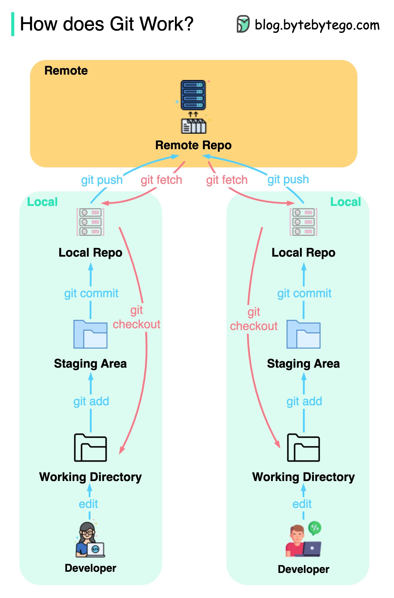

#### index
- [remote repository](#remote-repository)
- [components](#components)
- [commands](#commands)
- [workflow](#workflow)
- [fork](#fork)


## remote repository

원격 리포지토리는 git 저장소가 로컬 컴퓨터가 아닌 원격 서버에 위치한 리포지토리를 말하며 팀원 간 코드 공유와 백업을 위해 사용된다

주로 github, gitlab, bitbucket 같은 호스팅 서비스가 원격 리포지토리가 되며 필요에 따라 온프레미스 git 서버를 구축할 수도 있다

로컬 리포지토리: `.git` 디렉토리가 포함된 로컬 컴퓨터의 리포지토리 (모든 히스토리와 데이터를 로컬에 저장)

원격 리포지토리: 네트워크를 통해 접근 가능한 리포지토리 (로컬 저장소의 데이터를 동기화하거나 다른 사용자와 공유)


## components

### remote url

원격 저장소의 주소를 나타내는 URL을 말하며 로컬 리포지토리의 `.git/config`에 저장된다

HTTPS 형식: `https://github.com/user/repo.git`

SSH 형식: `git@github.com:user/repo.git`

```shell
$ cat .gits/config

[remote "origin"]
    url = git@github.com:hansanhha/hansanhha.github.io
    fetch = +refs/heads/*:refs/remotes/origin/*
```

### remote name

원격 리포지토리를 식별하는 이름으로 기본적으로 `origin`이라는 이름을 많이 사용한다

로컬 리포지토리는 여러 원격 리포지토리를 추가할 수 있기 때문에 각 리포지토리의 이름을 적절히 구분할 필요가 있다

```shell
# 기본 원격 리포지토리 추가
$ git remote add origin <url>

# 다른 원격 리포지토리 추가
$ git remote add upstream <url>
```

### tracking branch

로컬 리포지토리에서 원격 리포지토리의 브랜치를 추적하는 브랜치를 말한다

원격 리포지토리에 `main` `feature` `dev` `hotfix` 등의 브랜치가 존재하면, 이 브랜치들을 로컬 리포지토리에서 추적하여 `git pull` 또는 `git fetch` 시 자동으로 해당 원격 브랜치와 동기화하기 위해 트래킹 브랜치를 사용한다

트래킹 브랜치 형식: `remotes/<remote name>/<remote branch>`

`.git/config`에 기록된다

```shell
$ cat .git/config

[branch "asdf"]
        remote = origin
        merge = refs/heads/asdf
[remote "origin"]
        url = git@github.com:hansanhha/hansanhha.github.io
        fetch = +refs/heads/*:refs/remotes/origin/*
```


## commands

원격 리포지토리도 `.git` 디렉토리를 가진다 (일반적으로 호스팅 서비스에서 관리)

객체(objects), 참조(refs), 설정 등이 포함돼 로컬 리포지토리와 동일한 데이터 관리 방식을 사용한다

로컬 리포지토리와 원격 리포지토리는 네트워크를 통해서 상호작용을 할 수 있으며 HTTPS 또는 SSH를 사용한다

clone
- 원격 리포지토리의 전체 히스토리와 파일을 로컬에 복제한다

fetch
- 원격 리포지토리의 데이터를 로컬에 가져오지만 병합은 하지 않는다
- 가져온 데이터는 `.git/refs/remotes/origin`에 반영된다

pull
- 원격 리포지토리의 데이터를 가져오고 로컬 리포지토리와 병합까지 진행한다
- fetch + merge를 묶어놓은 명령어

push
- 로컬 리포지토리의 데이터를 원격 리포지토리에 업로드한다
- 원격 저장소의 브랜치 업데이트

내부 동작 (양방향)
- 객체 전송: Blob, Tree, Commmit 등이 네트워크로 전송된다
- 참조 업데이트: `refs/remotes/origin/main`과 `refs/heads/main`이 동기화된다
- 압축: Packfile로 데이터를 압축하여 네트워크 전송 효율성을 높인다 


## workflow

특정 원격 리포지토리에서 공동 작업을 하는 상황의 워크플로우



[이미지 출처](https://blog.bytebytego.com/p/ep-40-git-workflow)

1. 각 개발자들이 로컬에서 작업 후 커밋(working directory -> staging area -> local repository)
2. 개발자 A: 자신의 커밋을 원격 리포지토리에 푸시
3. 개발자 B: 원격 리포지토리로부터 fetch한 뒤, 내용 수정 후 커밋 -> 원격 리포지토리에 푸시

로컬 리포지토리가 손상되더라도 `git clone` 명령을 이용하여 원격 리포지토리를 통해 복구할 수 있다


## fork

원격 리포지토리를 복제할 수도 있는데 이를 fork(포크)라고 한다

주로 fork된 리포지토리를 upstream이라고 하고, 자신이 fork한 리포지토리를 origin이라고 지칭한다

upstream의 내용이 완전히 복제된 origin은 upstream과 독립적으로 작업할 수 있는 환경이 된다

따라서 origin은 upstream과 다른 커밋 이력을 가지게 되며 자신의 변경 사항(커밋)을 pull request를 통해 upstream에 반영할 수 있다

다른 개발자에 의해 업데이트된 upstream의 변경사항이 origin에 자동으로 반영되지 않으며 수동으로 동기화시켜야 하며 로컬 리포지토리에서 origin의 동기화 된 내용을 fetch하여 작업을 이어간다

```plaintext

       ┌⎯⎯⎯> [upstream] <⎯⎯⎯┐
       │ pull request           │ pull request
       │                        │
       │ sync                   │ sync
       V                        V
    [origin]                 [origin]
       ^                        ^
       │ push                   │ push
       │                        │
       │ fetch                  │ fetch
       V                        V
  [local repo]             [local repo]

```