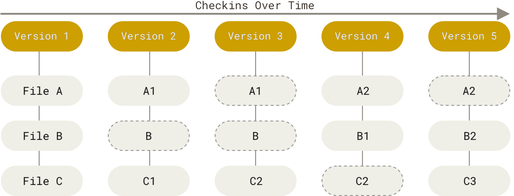
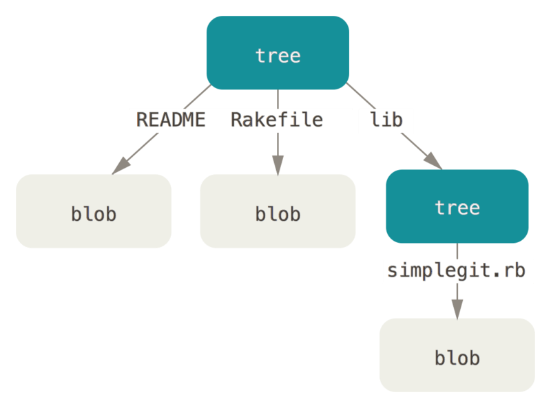
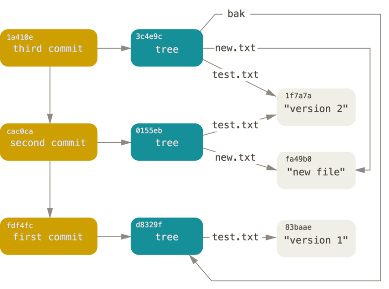
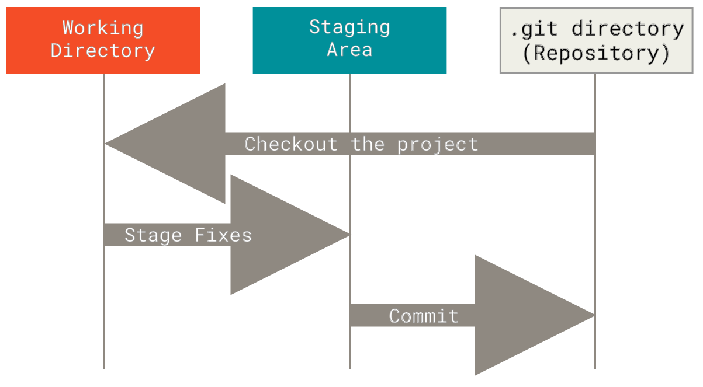
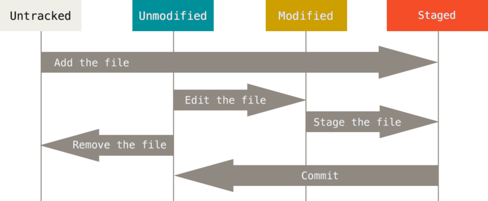

- [file management mechanism](#file-management-mechanism)
- [git object](#git-object)
- [three stage architecture](#three-stage-architecture)
- [file status](#file-status)
- [HEAD](#head)
- [tag](#tag)


## file management mechanism



git은 스냅샷 중심으로 동작하면서 델타를 활용하는 방식으로 동작한다

스냅샷: 특정 시점에서 파일과 디렉토리의 전체 상태를 기록한 데이터, 움직이는 현실 세계의 한 순간을 캡처하는 사진과 같은 개념이다. 각 커밋은 저장소의 스냅샷을 나타낸다

델타: 파일 간의 차이점(변경된 부분)만 저장하는 방식. 이전 버전과 현재 버전의 차이를 계산해서 저장한다 (git은 실시간 작업(커밋, 체크아웃 등)에서 델타를 계산하지 않으며, 스냅샷에서만 사용함)

다른 VCS와 달리 파일의 변경 사항을 저장할 때 파일 내용을 매번 복사하지 않는 특징 덕분에, 리포지토리의 크기를 줄이고 빠른 작업을 수행할 수 있다

리포지토리의 크기를 줄이기 위해 델타 압축을 적용하며 이 과정은 내부적으로 `.git/objects` 디렉토리에서 이뤄지며, 주기적으로 실행되거나 원격 저장소로 푸시/풀할 때 최적화된다

초기 저장: 처음에는 모든 Blob과 Tree가 압축되지 않은 상태로 저장된다 (각 객체는 zlib으로 개별 압축됨)

Packifile 생성: `git gc` (garbage collection)나 자동 최적화 과정에서 git은 비슷한 객체들 간의 차이점을 계산해서 Packfile로 묶는다

Packfile은 객체를 압축하고 델타를 활용하여 변경된 부분만 저장한다


## git object



커밋할 때마다 저장소의 전체 파일 상태를 스냅샷으로 기록하는데, 파일을 단순히 통째로 저장하는 게 아니라 아래와 같은 객체로써 관리한다
- Blob 객체: 파일 내용을 Blob(Binary Large Object)라는 객체로 저장한다. 각 Blob은 파일의 내용을 SHA-1 해시로 식별하며, 동일한 내용은 중복 저장되지 않는다 (`main.py` 파일이 커밋되면 그 내용의 해시 값(`a1b2c3d4...`이 생성되고 Blob으로 저장)
- Tree 객체: 디렉토리 구조와 파일을 나타내는 객체. Tree는 Blob과 다른 Tree를 참조하며 특정 시점의 전체 파일 시스템을 표현한다
- Commit 객체: 커밋 정보를 담고 있는 객체. Tree를 가리키고 부모 커밋, 작성자, 메시지 등 커밋과 관련된 메타데이터를 포함한다



#### first main.py commit

Blob: main.py 내용을 기반으로 해시(`a1b2c3d4...`)와 Blob 객체 생성 

Tree: main.py를 참조하는 디렉토리 구조를 가진 Tree 객체 생성

Commit: 커밋 정보를 담은 Commit 객체 생성, Tree를 가리킨다

#### second main.py commit

새 Blog: 수정된 내용을 기반으로 해시(`e5f6g7h8`)와 Blob 객체 생성

새 Tree: 수정된 main.py를 참조하는 Tree 객체 생성

새 Commit: 새 Tree를 가리키고, 이전 커밋을 부모로 연결된 Commit 객체 생성

만약 커밋 시 파일의 내용이 이전과 동일하다면 새 Blob을 만들지 않고 기존 Blob을 재사용한다

## three stage architecture



git은 파일을 관리할 때 세 가지 주요 영역을 사용한다

### working directory

working directory는 현재 작업 중인 파일들이 있는 실제 디렉토리를 말한다

git이 추적하지 않는 파일(untracked)과 추적 중인 파일(tracked)이 섞여 있다

파일을 수정하거나 새로 추가하면 이곳에서 변경이 시작된다

e.g) `my_project` 디렉토리에서 `main.py` 파일을 수정하면 그 변경은 워킹 디렉토리에 반영된다

워킹 디렉토리에 있는 파일들은 모두 현재 브랜치에 종속된다

만약 브랜치를 바꾸는 경우 워킹 디렉토리의 내용이 달라질 수 있다

git은 브랜치 간 독립적인 기능 개발을 할 수 있도록 지원하는데 그 원리 중 하나가 브랜치 간 워킹 디렉토리의 상태를 격리하는 것이다

### staing area (index)

커밋할 준비가 된 변경 사항을 임시로 저장하는 중간 단계로 index라고도 불린다

git에서 커밋하려면 커밋할 파일들을 먼저 스테이징 영역에 포함시켜야 한다

`git add` 명령으로 워킹 디렉토리의 변경 사항을 스테이징 영역으로 이동시킬 수 있다 (파일의 현재 상태를 스냅샷(해시 변환)으로 만들어 스테이징 영역에 저장)

e.g) `git add main.py`를 실행하면 수정된 `main.py`가 스테이징 영역에 올라간다

`git add` 명령은 파일의 현재 상태를 스냅샷으로 만들어(해시 변환) 스테이징 영역에 저장한다 

워킹 디렉토리와 마찬가지로 브랜치를 변경하면 해당 브랜치가 가리키는 커밋의 스냅샷을 기반으로 스테이징 영역을 구성한다

### repository (commit history)

repository 또는 local repository는 변경 사항이 영구적으로 저장되고 이력이 기록되는 곳으로 프로젝트의 `.git` 디렉토리를 말한다

`git commit`으로 스테이징 영역의 내용을 저장소에 기록하면 새로운 고유한 SHA-1 해시 값으로 식별되는 커밋(Blob, Tree, Commit 객체)이 생성되며, 이 정보를 리포지토리에 반영한다


## file status



file status는 git이 파일을 어떻게 인식하고 관리하는지를 나타내는 값으로 위의 [three-stage architecture](#three-stage-architecture)와 밀접하게 연결되어 있다

### Untracked

새로 생성된 파일이거나 `.gitignore`에 포함된 파일이 Untracked 상태가 되는데, 이 파일들은 워킹 디렉토리에만 존재하면 git이 관리하지 않는다

`git status` 명령을 입력하면 "Untracked files"로 표시된다

한 번 커밋을 하면 git에 포함되어, 그 이후부터 변경 사항이 추적되며 이력을 관리할 수 있다

### Tracked

git이 관리하는 파일은 기본적으로 Tracked 상태를 가지며, 각 파일은 세 가지 하위 상태로 나뉜다

#### 1. Unmodified

리포지토리에 마지막 커밋된 상태와 동일한 파일(변경 사항이 없는 파일)은 Unmodified 상태를 가진다

워킹 디렉토리와 리포지토리가 동기화된 상태이며 `git status`에서 별도로 표시되지 않는다

#### 2. Modified 

리포지토리의 마지막 커밋 이후 워킹 디렉토리에서 수정된 파일은 Modified 상태에 놓인다

워킹 디렉토리에 변경 사항이 반영되어 있으며 `git status` 명령에서 "Changes not staged for commit"으로 표시된다

`git add` 명령으로 스테이징 영역에 파일을 포함시켜 커밋을 준비할 수 있다

#### 3. Staged

수정된 파일이 `git add`로 스테이징 영역에 추가되면 Staged 상태로 표시된다

다음 커밋에 포함될 준비가 된 파일로 `git status`에서 "Changes to be committed"로 나타난다

스테이징 영역에 포함된 파일은 `git commit`으로 리포지토리에 저장할 수 있다


## HEAD

HEAD는 git에서 현재 커밋(브랜치) 위치를 가리키는 포인터이다

마치 책의 현재 읽고 있는 페이지처럼 책갈피(HEAD)를 옮기면 읽는 페이지(작업 상태)가 바뀌는 것처럼 HEAD가 이동하면 워킹 디렉토리도 그에 맞춰 바뀐다 -> HEAD를 다른 브랜치로 옮기면 워킹 디렉토리가 해당 브랜치의 내용으로 변경된다

보통 브랜치의 가장 최근 커밋(마지막 커밋)을 가리키며 새로운 커밋을 만들면 HEAD가 가리키는 위치가 업데이트된다

또한 브랜치가 아닌 특정 커밋을 가리킬 수도 있다 (Detached HEAD)

HEAD는 `.git/HEAD` 파일에 저장되며 다음과 같은 내용을 포함하고 있다

`ref: refs/heads/main`: HEAD가 main 브랜치를 가리킴

특정 커밋 해시(`a1b2c3d4...`): Detached HEAD 상태

### HEAD status

HEAD는 두 가지 주요 상태로 존재할 수 있다

#### Attached HEAD

HEAD가 특정 브랜치(main, feature 등)를 가리킬 때 Attached HEAD 상태를 가진다

이 상태에서 커밋하면 브랜치가 앞으로 이동하고 HEAD도 자동으로 따라간다

`git checkout main`: HEAD가 main 브랜치의 최신 커밋을 가리킨다

#### Detached HEAD

HEAD가 브랜치가 아닌 특정 커밋을 가리킬 때 Detached HEAD 상태가 된다

`git checkout a1b2c3d4`: 과거 커밋 해시로 HEAD 이동

Detached HEAD 상태에서 커밋하면 브랜치가 없기 때문에 새로운 변경이 고립되어 잃어버릴 수 있으므로, 먼저 새 브랜치를 만들고 작업을 이어나가는 것이 좋다

### branch switching and working directory/staging area

브랜치 전환은 HEAD를 다른 브랜치나 커밋으로 이동시키는 작업이다

`git checkout <branch>` 또는 `git switch <branch>` 명령을 통해서 HEAD가 특정 브랜치 또는 커밋을 가리키도록 업데이트할 수 있다

해당 브랜치가 가리키는 커밋의 스냅샷을 기반으로 워킹 디렉토리와 스테이징 영역을 재구성한다

다음과 같이 두 브랜치가 있다고 가정해보자
- main: file.txt에 "hello hansanhha"이라는 내용이 작성되어 있음 (커밋 A)
- feature: file.txt의 내용을 "hello git"으로 수정함 (커밋 B)

이 때 브랜치를 전환하면 워킹 디렉토리가 다음과 같이 동작한다
- 현재: main 브랜치(HEAD), 워킹 디렉토리의 file.txt 내용: "hello hansanhha"
- 브랜치 전환: `git switch feature`, HEAD가 feature 브랜치로 이동 -> `refs/heads/feature`를 가리키고 feature 브랜치의 최신 커밋(B)을 확인한다. 워킹 디렉토리의 file.txt가 해당 커밋의 스냅샷을 기반으로 "hello git"으로 업데이트됨
- 돌아오기: `git swith -`, HEAD가 다시 `refs/heads/main`을 가리키고 file.txt의 내용이 메인 브랜치의 최신 커밋 스냅샷인 "hello hansanhha"로 변경됨

git은 이동한 브랜치의 커밋에 연결된 Tree 객체를 읽고 그에 맞춰 워킹 디렉토리의 파일을 재구성한다

추가된 파일: 생성

삭제된 파일: 제거

수정된 파일: 새 내용으로 덮어씀

스테이징 영역도 새 브랜치의 상태에 맞춰 초기화된다 (단, 이전 브랜치에서 스테이징된 변경이 없어야 함)

### branch switching confliction and changes

브랜치 전환 시 워킹 디렉토리에 변경 사항 여부에 따라 git의 처리 방식이 나뉘어진다

#### clean state

워킹 디렉토리와 스테이징 영역에 변경 사항이 있는 상태를 clean이라고 하고, 즉시 브랜치 전환이 이루어진다

`git switch feature`: 즉시 전환

#### dirty state

변경 사항이 있으면 없는 상태를 dirty라고 하고, 충돌 여부에 따라 전환 여부가 갈린다

변경 사항이 새 브랜치와 겹치지 않으면 git은 그 변경을 유지한 채 브랜치를 전환한다
- `main` 브랜치에서 `file.txt`를 수정하고 `git switch feature` -> 수정된 `file.txt`가 `feature`에도 반영된다

만약 변경 사항이 전환할 브랜치의 파일과 충돌하면 전환이 막힌다
- `main`에서 `file.txt`를 수정했는데, `feature` 브랜치에서도 해당 파일을 수정한 상태라면 브랜치 전환 불가
- 특정 브랜치의 변경 사항을 커밋하거나 `git status`로 변경 사항을 임시 저장하면 브랜치 전환이 가능해진다


## tag

태그는 git 리포지토리에서 특정 커밋에 부여된 고정적인 참조를 말한다

브랜치가 커밋 히스토리와 함께 이동하는 동적인 포인터라면 태그는 커밋에 붙여진 정적인 라벨이며 변경되지 않는 특정 시점을 가리킨다

주로 배포된 소프트웨어 버전 표시(v1.0.0), 중요 시점 기록, 릴리즈 관리(배포 이력) 등을 위해 사용한다

유의사항
- 태그는 한 번 생성되면 이동하거나 수정할 수 없다 (삭제 후 재생성 필요)
- 태그는 기본적으로 로컬에만 저장되므로 원격 저장소에 따로 업로드해야 하거나 가져와야 한다 (fetch, push)
- 마찬가지로 태그를 삭제하려면 로컬에서 원격 태그를 삭제해야 한다
- 태그는 브랜치가 아니므로 체크아웃하면 태그가 가리키는 특정 커밋으로 HEAD를 이동시켜 Detached HEAD 상태로 전환된다

태그는 두 가지 유형으로 나뉜다

### lightweight tag

내부 참조용 또는 임시적으로 간단히 사용할 목적으로 사용되는 태그로 단순히 커밋 해시에 이름을 붙이며 추가적인 메타데이터 없이 최소한의 정보만 포함한다 

`git tag v1.0.0`: 현재 커밋에 v1.0.0 라고 하는 이름을 가진 커밋을 생성한다

생성된 태그는 자신의 이름으로 만들어진 파일(`.git/refs/tags/v1.0.0`)에 커밋 해시를 기록한다

### annotated tag

공식 배포, 팀 공유, 버전 관리 등의 목적으로 사용되는 태그로 커밋에 작성자, 날짜, 메시지 등의 추가 정보를 포함하며 git은 별도의 태그 객체를 생성한다

커밋 메시지처럼 상세한 설명이 가능하며 보안을 강화하기 위해 GPG 서명을 할 수 있다

`git tag -a v1.0.0 -m "release version 1.0.0"`: 현재 커밋을 기반으로 annotated tag를 생성한다

생성된 태그에 대한 객체는 `.git/objects`에 저장되며, `.git/refs/tags/v1.0.0`에 태그 객체 해시를 기록한다

```plaintext
tag v1.0.0
Tagger: hansanhha <xxxxxx@xxxxx>
Date:   Wed Mar 26 12:00:00 2025 +0900

Release version 1.0.0

commit a1b2c3d4...
```