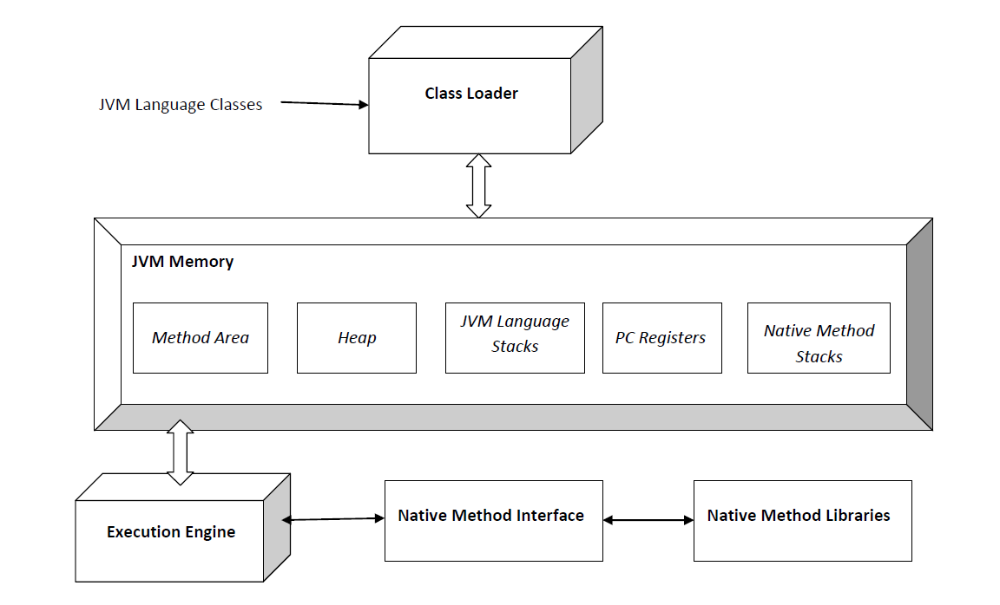

#### index
- [jvm architecture overview](#jvm-architecture-overview)
- [classloader](#classloader)
- [memory space](#memory-space)
- [object lifecycle](#object-lifecycle)
- [bytecode interpreter](#bytecode-interpreter)
- [just-in-time compiler](#just-in-time-compiler)
- [jvm workflow](#jvm-workflow)


## jvm architecture overview



classloader: jvm 시스템에 `.class` 클래스 파일을 추가하는 컴포넌트

memory: 클래스 파일을 실행하기 위한 메모리 영역 (클래스 파일의 메타데이터, 인스턴스 보관, 스레드 메모리 등)

execution engine: 클래스 파일을 기계어로 변환하고 실행하는 컴포넌트 

native method interface: c/c++ 함수를 호출하는 인터페이스

native method libraries: c/c++ 라이브러리

simple workflow: classloader -> memory -> execution engine 


## classloader

클래스 파일을 인식하고 jvm에 로드하는 컴포넌트 

### mechanism

클래스로더의 동작 과정은 크게 loading, linking, initialization 세 단계로 나뉜다

#### 1. loading

목적: 클래스(.class)의 바이트코드를 jvm 메모리에 로드

로딩 과정은 다시 두 가지 과정으로 나뉜다

##### 1.1 recognize class file and select classloader type 

클래스로더가 .class 파일을 인식하고 jvm 메모리에 로드하는데, 로드할 클래스의 종류에 따라 클래스 로더의 종류가 선택된다

bootstrap classloader: rt.jar 또는 java.base 모듈 내부의 핵심 클래스(java.lang.String, java.util.List 등)를 로드하는 경우 동작하는 클래스 로더

extension classloader: lib/etc/ 디렉토리에 있는 라이브러리를 로드하는 경우 동작하는 클래스 로더

application classloader: 애플리케이션에서 작성한 클래스(classpath 내 클래스)를 로드하는 경우 동작하는 클래스

#### 1.2 bytecode loading

클래스 로더가 .class 파일을 Class 객체로 변환하여 jvm의 method area에 저장한다

java.lang.Class는 jvm 전역에서 클래스 파일 당 하나만 생성되는 객체로 해당 클래스의 메타데이터(클래스 이름, 메서드, 필드 정보 등)를 관리한다

아래의 코드를 실행하면 example.HelloClass에 대한 Class 객체가 로드된다 

```java
Class<?> clazz = Class.forName("example.HelloClass");
```

#### 2. linking

목적: 

로딩 과정은 세부적으로 3가지 과정으로 구분된다

##### 2.1 verification

jvm이 .class 파일의 바이트코드가 유효한지 검사하는 과정으로 만약 유효하지 않다고 판단되면 java.lang.VerifyError 예외를 발생시킨다

검증 내용
- class 파일 포맷 (jvm 명세 준수 여부)
- 잘못된 바이트 코드 명령어 포함 여부
- 바이트코드 조작 여부 (보안 위협)
- 언어 규칙 준수 여부 등

#### 2.2 preparation

클래스 변수(static variables)에 대한 메모리를 할당하고 기본 값(0, null, false)으로 초기화하는 고자ㅓㅇ

실제 값이 아니라 기본 값을 설정하며 static final 변수는 컴파일 타임 상수이므로 설정 대상에서 제외한다  

```java
class HelloClass {
    static int a = 10;       // 기본값 0 할당
    static final int b = 20; // 컴파일 타임 상수 -> 이미 값 20으로 초기화된 상태
}
```

#### 2.3 resolution

클래스가 참조하는 심볼릭 링크(symbolic reference)를 method ared의 메모리 참조(direct referene)로 변경하는 과정

.class 파일이 jvm에서 실행되기 전까지 어떤 메모리 주소를 사용할지 알 수 없기 때문에 실제 메모리 주소 대신 심볼릭 링크 (클래스 이름, 필드 이름, 메서드 이름 등)가 저장된다

아래의 HelloClass는 GoodByeClass 타입의 필드를 가지고 Collections.emptyList 메서드를 static import한다

이 클래스를 컴파일하면 java/util/Collections/emptyList와 hansanhha/GoodByeClass에 대한 심볼릭 링크가 생성된다

```java
package hansanhha;

import static java.util.Collections.emptyList;

class HelloClass {
    GoodByeClass goodByeClass;

    {
        emptyList();
    }
}
```

이러한 심볼릭 링크에 대해 jvm은 method area에서 해당 참조에 대한 클래스가 로드되었는지 확인한다

있다면 심볼릭 링크가 가리키는 클래스의 메타데이터(Class 객체)를 찾아 해당 객체의 method area의 메모리 주소로 변환한다 (필드와 메서드도 같은 방식)

없다면 클래스 로더를 통해 참조하는 클래스를 로드한 뒤 이 과정을 수행한다

만약 다음과 같이 인터페이스를 참조한다면 어떻게 될까?

```java
interface Greeting {}
class HelloClass implements greeting {}
class GoodbyeClass implements greeting {}

class User {
	Greeting greeting = new HelloClass();
}
```


#### 3. initialization

실제 코드가 실행되며 클래스의 static 블록과 static 변수 초기화 코드가 실행되는 단계

초기화 순서

1. 다른 클래스를 상속하는 경우: 상속 관계에 따라 부모 클래스의 static 필드 및 static 블록이 먼저 실행된다
2. 로드된 클래스의 static 필드 및 static 블록이 실행되어 선언된 값으로 변경된다


#### reference type field


### classpath


## memory space


## object lifecycle

## bytecode interpreter

## just-in-time compiler


## jvm workflow