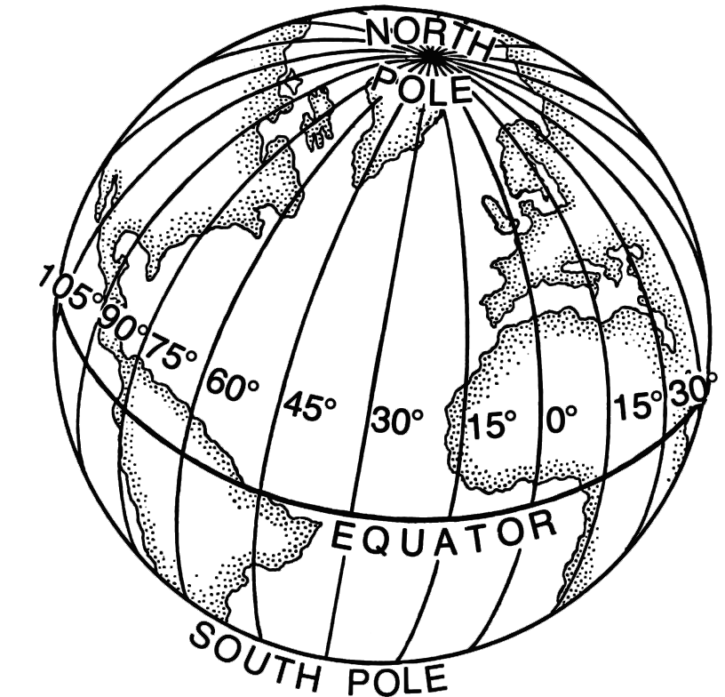
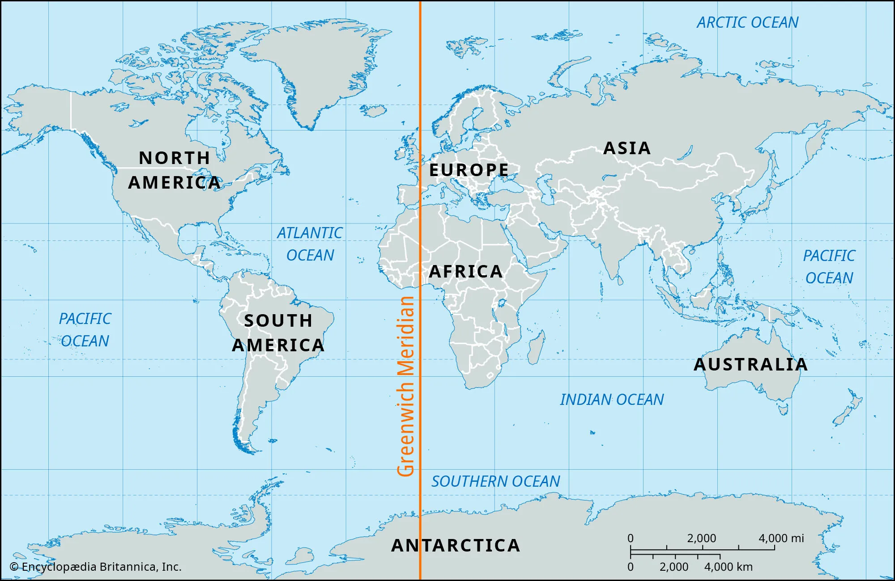
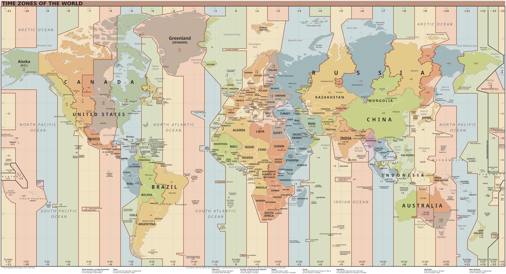

#### index

- [위도, 경도, 자오선, 그리니치 자오선](#위도-경도-자오선-그리니치-자오선)
- [UT1, GMT, TAI, UTC](#ut1-gmt-tai-utc)
- [UTC/GMT 시간대 표기 (ISO-8601, Offset, RFC 1123)](#utcgmt-시간대-표기-iso-8601-offset-rfc-1123)
- [Timezone](#time-zone)
- [DST (Daylight Saving Time, 서머타임)](#dst-daylight-saving-time-서머타임)
- [Unicode CLDR](#unicode-cldr)
- [Epoch Time](#epoch-time)
- [timestamp](#timestamp)
- [시간 단위](#시간-단위)


## 위도, 경도, 자오선, 그리니치 자오선

위도: 적도(위도 0도)를 기준으로 북극 또는 남쪽으로 얼마나 떨어져 있는지 나타내는 위치, 북극점-90° N(북위 90도) / 남극점-90° S(남위 90도)

경도/자오선
- 동-서를 나타내기 위한 지리좌표계로 북극과 남극(자전이 지나는 지표면)을 잇는 최단거리의 선분을 말한다
- 아래와 같이 북극과 남극을 잇는 선을 경선/자오선이라고 하며 경도의 기준이 임의의 자오선을 본초 자오선이라고 한다. 
- 이를 기준으로 동쪽으로 0 - 180°까지가 동경(X, E / 동반구), 서쪽으로 0 - 180°를 서경(Y, W / 서반구)라고 한다 (동서 180°의 선은 일치함) 
- 같은 경선 상의 지점은 같은 시간대에 속하며, 경도 15°로 1시간의 시차가 생긴다



[이미지 출처](https://ko.wikipedia.org/wiki/경선)

본초 자오선
- 자오선의 기준이 되는 경선으로 이 곳이 경도 0°가 된다
- 19세기 말 그리니치 천문대가 본초 자오선으로 지정됐으나 대륙판이 조금씩 움직이고 있는 것을 발견하였다
- 20세기 말에는 IERS 기관에서 정하고 있으며 현재 본초 자오선은 그리니치 천문대로부터 동쪽으로 100미터 떨어져 있다   
- 그리니치 천문대를 지나는 그리니치 자오선의 위치는 아래와 같다



[이미지 출처](https://www.britannica.com/place/Greenwich-meridian)


## UT1, GMT, TAI, UTC

#### GMT (Greenwich Mean Time)
- 그리니치 천문대를 기준으로 한 평균 태양시 (Mean이란 단어처럼 1년 동안의 평균 태양 위치를 기준으로 정의된 시간)
- 지구는 자신의 형태, 조수, 대기, 지진 등으로 인해 일정한 속도로 자전을 하지 않아 미세한 시간 차이가 발생한다
- 이를 평균 내어 만든 균일한 시간이 GMT

#### UT1 (Universal Time 1)
- 표준 평균 태양시
- 지구 자전 속도에 기반한 시간으로 태양일(지구가 자전하여 태양이 다시 같은 본초 자오선에 도달하는 시간)을 기준으로 측정한다

#### TAI (International Atomic Time, 국제 원자시)
- 원자시계 기반 절대 시간 시스템
- 지구 자전과 무관하게 세슘 원자 진동을 기준으로 정해진 "초"를 일정하게 누적한 시간
- 가장 정밀하고 안정적인 시간 체계로 일말의 오차가 없어 윤초가 필요하지 않다
- 실제 시각보다는 GPS, UTC를 계산할 때 기초 시간 기준으로 이용된다 

#### UTC (Coordinated Universal Time, 협정 세계시)
- 전 세계 시간의 표준이 되는 시간
- 1972년 1월 1일 자정을 0 밀리초로 설정하여 기준을 삼고 그 후로 시간의 흐름을 밀리초로 계산한다
- GMT를 기반으로 사용하되 TAI와 윤초를 통해 시간의 오차를 보정한다
- 일반적으로 UTC 하루는 86,400초인데 지구의 자전 주기가 일정하지 않기 때문에 UT1과 0.9초 이내의 차이가 생길 때 하루의 마지막 1분을 59초나 61초로 한다 (이렇게 수정된 초를 윤초라 하며 TAI 단위를 사용함)
- UTC는 그레고리안 연도(그레고리력)을 기준으로 하며 위도 0도, 본초 자오선에 위치한다
- 본초 자오선을 기준으로 왼쪽에 있으면 음수, 오른쪽에 있으면 양수 오프셋을 가진다

간단히 설명하자면 과거엔 지구의 자전만을 기준으로 시간을 측정했는데 자전 속도에 미세한 차이가 있어 천체의 움직임과 무관한 절대적인 시간 기준을 구한 뒤 오차를 보정한 시간이 UTC이다

-> **UTC: GMT(UT1) + 연초(TAI)**


## UTC/GMT 시간대 표기 (ISO-8601, Offset, RFC 1123)

#### ISO-8601

YYYY-MM-DDThh:mm:ssZ
- YYYY: 연도
- MM: 월
- DD: 일
- T: 날짜와 시간 구분자
- hh: 시간 (00-23)
- mm: 분
- ss: 초
- Z: Zulu time (UTC 시간대를 의미함, 나토군에서 UTC 시간대를 표시할 때 Z를 붙임)

```text
2025-05-21T12:15:45Z
```

2025년 5월 21일 12시 15분 45초 UTC 기준

필요에 따라 아래와 같이 마이크로초 또는 밀리초를 포함할 수 있다

```text
2025-05-21T12:15:45.123Z     // 밀리초
2025-05-21T12:15:45.123456Z  // 마이크로초
```

#### 시간대 오프셋 포함 형식

UTC에서 몇 시간 차이가 나는지 오프셋을 포함해서 표기하는 방식으로 지역 시간대를 표현할 때 사용된다

```text
YYYY-MM-DDThh:mm:ss±hh:mm

UTC+hh:mm    // UTC보다 빠른 시간을 가진 시간 표현 (동반구)
UTC-hh:mm    // UTC보다 느린 시간을 가진 시간 표현 (서반구)
```

2025-05-21T12:15:45+09:00 -> 한국 시간 (KST, UTC+9)

2025-05-20T03:30:40-05:00 -> 미국 동부 표준시 (EST, UTC-9)

#### RFC 1123 (축약 표기)

EEE, dd MMM yyyy hh:mm:ss GMT
- EEE: 요일
- dd: 일
- MMM: 월
- yyyy: 연도
- hh: 시간 (00-23)
- mm: 분
- ss: 초
- GMT

```text
Tue, 20 May 2025 12:30:45 GMT
``` 


## Time Zone



[이미지 출처](https://en.wikipedia.org/wiki/Time_zone#/media/File:World_Time_Zones_Map.svg)

타임존은 지구상의 지역별 표준 시간대를 정의한 체계를 말한다

지구는 15도마다(360도/24시간) 1시간씩 시차가 생기는데, 이를 기준으로 세계 각국에서 자국의 위치나 정치적 판단에 따라 시간대를 설정한다

IANA 기관에서 타임존 데이터베이스(TZDB)를 통해 전 세계의 표준 시간대 정보를 기록하고 관리하며, 운영체제나 프로그래밍 언어 등에서 시간 계산의 기준으로 사용한다

[타임존 리스트 사이트](https://nodatime.org/TimeZones)

[시간대 및 현재 시간 API 제공 사이트](https://timezonedb.com)

### 타임존 표기

타임존은 [UTC 오프셋](#시간대-오프셋-포함-형식)(UTC+09:00 등) 또는 **IANA 타임존 식별자**를 사용하여 표기한다

IANA 타임존 식별자는 운영체제와 프로그래밍 언어가 사용하는 표준 이름이다

IANA Time Zone
- Asia/Seoul: 대한민국, UTC+09:00, 서머타임 없음
- America/New_York: 미국 동부, UTC-05:00/UTC-04:00, 서머타임 있음
- Europe/Berlin: 독일, UTC+01:00/UTC+02:00, 서머타임 있음

UTC 오프셋은 항상 고정되어 있는 반면 IANA 타임존 식별자는 변경될 수 있으며 DST를 반영한다 


## DST (Daylight Saving Time, 서머타임)

일광 절약 시간제라고도 하는 서머타임은 여름철에 표준 시간보다 1시간 시계를 앞당겨 사용하는 제도이다 (미국, 캐나다 등에서 사용)

봄에 DST를 시작하여 시계를 1시간 앞으로 조정한다 (보통 3월 둘째 주 일요일 새벽 2시 -> 3시로 설정)

가을에 DST를 종료하여 시계를 1시간 뒤로 조정한다 (보통 11월 첫째 주 일요일 새벽 2시 -> 1시로 설정)

DST를 적용하기 위해 3월에는 1시간이 건너뛰어지고, 11월에는 1시간이 두 번 존재하게 된다 -> 예약 시스템, 로그, 크론 잡 등에서 오류 발생 가능성 생김

DST 대응 전략
- DB, 서버 로그 등은 UTC로 저장하고 클라이언트에서 타임존을 변환하기
- 크론 잡 시간 시간도 UTC를 기준으로 설정
- IANA 타임 존 사용: Asia/Seoul, Europe/Berlin 등 지역 기반 타임존 사용
- 서머타임을 고려한 라이브러리: ZonedDateTime (java)


## Unicode CLDR

Unicode CLDR(Common Local Data Repository)는 전 세계의 다양한 언어와 지역에 대해 소프트웨어가 제대로 동작할 수 있도록 표준화된 지역화 데이터를 모아놓은 공용 저장소이다

다국어/다지역 지원 소프트웨어의 기준 데이터를 제공하는 국제 표준

날짜/시간 이외에도 다양한 형식들로 구성된 항목들을 보관하고 있으며 JSON/XML 형태로 배포된다

프로그래밍 언어에서 제공하는 국제화(i18n) 라이브러리는 이를 기반으로 한다 


## Epoch Time

에포크 타임은 1970년 1월 1일 00:00:00 UTC를 기준으로 경과한 초(또는 밀리초, 마이크로초 등)를 나타내는 시간 표현 방식이다

유닉스 계열 시스템이 POSIX 표준에 따라 이 시간을 사용하여 Unix time, POSIX time, Unix timestamp 라고도 말한다

지역 시간, 달력, 윤년 등 다양한 시간 변수로부터 무관한 **절대 기준 시간**이 되며 숫자를 기반으로 하고 있어 시간 차 계산이 매우 단순하고 저장 효율이 높다

```text
0 = 1907-01-01 00:00:00 UTC
1747827431 = 2025-05-21 14:59:24 UTC
```

```text
2025-05-21 10:00:00 - 2025-05-20 09:00:00 = ?  // 복잡함  
1747888800 - 1747798800 = 90000초              // 단순함
```

참고로 2038년 2월 19일이 되면 에포크 타임의 값은 32비트로 표현할 수 있는 최대값(2,147,483,647)을 넘어서기 때문에 애플리케이션은 새로운 타임스탬프 컨벤션이나 64비트 기반 시스템을 사용해야 한다  


## timestamp

타임 스탬프는 시간 데이터를 표현하는 기록 값으로 주로 시스템 이벤트, 데이터 생성 시점, 정렬 기준 등에서 사용된다

지역 시간이나 타임존에 영향을 받지 않고 정확한 시점을 표현한다

표현 방식
- 가독성 있는 형태: 2025-05-21T10:25:45Z (ISO-8601, 로그, UI 출력 등)
- 숫자 형태: 1747890345 (DB 저장, 비교, 정렬, 연산에 적합)


## 시간 단위

초 단위
- **초 (second)**: 1초 = 기본 단위
- **밀리초 (ms)**: 1초 = 1,000 밀리초
- **마이크로초 (μs)**: 1초 = 1,000,000 마이크로초
- **나노초 (ns)**: 1초 = 1,000,000,000 나노초

1시간: 3,600초

1일: 86,400초

1주: 604,800초

1달(30.44일): 2,629,743초

1년(365.24일): 31,556,926초