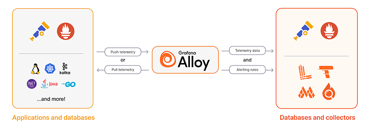

#### index
- [overview](#overview)
- [workflow](#workflow)
- [components](#components)
- [architecture](#architecture)


## overview

grafana alloy는 observability 데이터를 효율적으로 수집, 변환, 전송할 수 있는 플러그인 기반 수집 에이전트로 grafana labs에서 제공한다

벤더 중립적인 opentelemetry collector의 배포판(distribution)으로 opentelemetry나 prometheus, grafana tempo와 같은 대중적인 오픈소스 observabiltiy 도구와 완벽하게 호환된다 

### key features

#### custom components

기존 컴포넌트를 조합하여 새로운 커스텀 컴포넌트를 생성할 수 있다

재사용 가능한 파이프라인을 손쉽게 구성할 수 있으며 grafana에서 기본 커스텀 컴포넌트도 제공한다

e.g 
- 로그 필터링 + 변환 + 전송 커스텀 컴포넌트 정의
- 프로메테우스 메트릭 수집 + 데이터 변환 커스텀 컴포넌트 정의

#### reusable components

한 컴포넌트의 출력을 여러 컴포넌트의 입력으로 사용할 수 있으며, 이를 통해 중복 작업을 줄이면서 데이터를 처리할 수 있다

즉, 동일한 데이터를 여러 흐름에서 재사용하여 효율성을 극대화한다

e.g
- logs_receiver -> log_parser 및 log_exporter 두 개의 컴포넌트에서 동시에 사용
- metrics_scraper -> metrics_aggregator 및 metrics_exporter에서 동시에 사용

#### chained components

컴포넌트들을 연결하여 데이터 처리 파이프라인을 구축할 수 있다

다음과 같이 컴포넌트에서 처리한 데이터를 다음 컴포넌트로 전달하는 방식으로 체계적인 데이터 파이프라인을 만들어서 데이터 처리를 단계별로 구분할 수 있다

```text
log_receiver -> log_parser -> log_filter -> log_exporter
```

#### single task per component

각 컴포넌트는 하나의 명확한 역할만 수행하여 복잡성을 줄이고 유연성을 높인다

log_receiver: 로그 수집

log_parser: 로그 데이터 변환

log_exporter: 외부 저장소로 전송

#### gitops compatibility

git, s3, http 등의 외부 소스에서 구성 설정을 자동으로 가져올 수 있다

구성 변경을 버전 관리하여 자동화된 배포가 가능하며, 이를 통해 ci/cd 및 자동화 환경과 쉽게 통합할 수 있다

#### clustering support

여러 개의 alloy 인스턴스를 클러스터링하여 수평 확장(scaling) 및 고가용성(ha)을 지원한다

여러 alloy 노드를 실행하여 부하 분산함으로써 하나의 인스턴스에서 장애가 발생해도 다른 인스턴스가 트래픽을 처리하여 무중단 운영이 가능해진다


## workflow



alloy는 120개 이상의 컴포넌트를 사용하여 애플리케이션, 데이터베이스, opentelemetry collector로부터 원격 측정(telemetry) 데이터를 수집한다

push/pull 방식을 통해 원격 측정 데이터를 수집하며, 이 데이터들은 alloy에서 변환 과정(추가 메타데이터 삽입 또는 필터링)을 거친 뒤 opentelemetry 호환 데이터베이스/수집기 또는 grafana stack에 전달된다  

또한 수집된 데이터를 저장하는 데이터베이스에 알람 규칙을 적용할 수 있다

## components


## architecture


