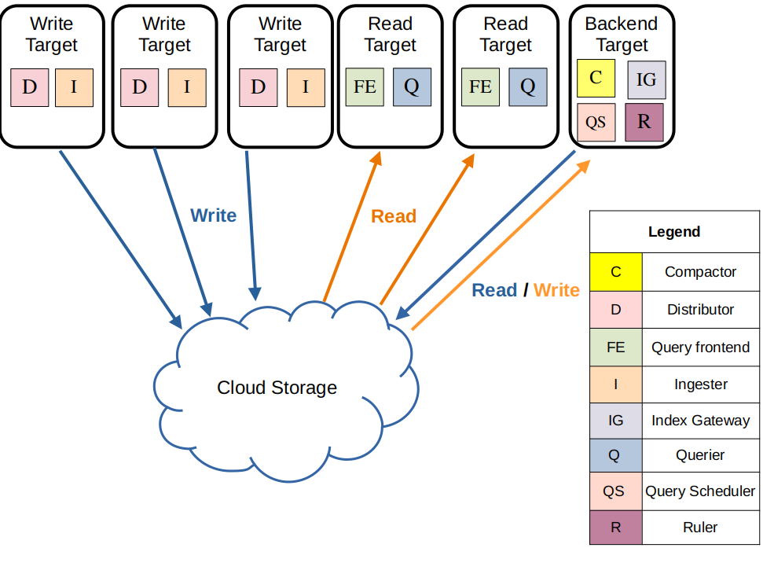

#### index
- [overview](#overview)
- [loki logging stack](#loki-logging-stack)
- [components](#components)
- [architecture](#architecture)
- [read/write paths](#readwrite-paths)
- [deployment mode](#deployment-mode)

#### references
- [loki overview docs](https://grafana.com/docs/loki/latest/get-started/overview/)
- [loki architecture docs](https://grafana.com/docs/loki/latest/get-started/architecture/)

## overview

grafana loki는 grafana labs에서 개발하여 2018년 쿠베콘에서 소개된 분산형 로그 시스템이다

prometheus의 설계 철학을 따르며 확장성이 뛰어나고 비용 효율적인 로그 관리를 목표로 한다

메트릭 기반 모니터링과 로그 관리를 쉽계 연계할 수 있도록 설계되었으며 elk stack과 같은 로그 관리 시스템과 달리 색인(indexing) 방식과 로그 파일 저장 방식에서 차별점을 가진다

### content index-free, label-based indexing 

label을 추가하여 label에 대한 색인만 하고 로그 본문은 단순히 저장만 한다

즉, 프로메테우스처럼 key-value 형태의 라벨을 통해 로그를 필터링할 수 있다

### compressed and chunks

로그 데이터를 압축하고 청크로 나눠 aws s3, gcs 또는 로컬 파일 시스템에 저장한다

로키는 소규모 인덱스와 데이터 압축 및 청크 방식을 통해 비용을 낮추면서도 성능을 향상시킨다

### logql(loki query language)

프로메테우스의 promql(prometheus query language)과 유사한 logql을 사용하여 로그 검색 및 분석을 지원한다

특정 패턴 매칭, json 구조 분석, 정규식 기반의 검색을 할 수 있다

### multi-tenancy

단일 로키 인스턴스가 다중 tenant에 의해 공유될 수 있으며 각 tenant의 데이터와 요청들은 다른 tenant로부터 격리된다

### alerting

프로테우스의 alertmanager 또는 그라파나에서 제공하는 alert manager와 통합하여 로그에 대한 알람을 발생시킬 수 있다

ruler 컴포넌트를 추가하여 로그에 대한 쿼리를 지속적으로 수행하다가 결과값이 규칙에 적용될 시 알람 프로세스가 동작한다

### grafana integration

loki는 grafana, mimir, tempo와 통합되어 완전한 observability 스택을 제공할 수 있다 

## loki logging stack

아래는 로깅 스택의 전반적인 동작 과정을 나타낸다

상세 과정은 아래와 같다

agent
- 분산 시스템의 로그를 스크랩하는 에이전트 또는 클라이언트
- 에이전트는 로그를 수집하고 라벨을 추가하여 스트림에 추가하고 http api를 통해 loki에게 스트림을 push한다
- grafana client: grafana alloy, promtail (deprecated)
- opentelemetry collector
- third-party: docker driver, fluent bit/fluentd, log stash, loki-logback-appender (java)

loki
- loki 로깅 스택의 메인 서버로 로그를 전달받은 뒤 저장하고, 쿼리를 실행하는 역할을 한다
- monolithic, simple-scalable, microservices 모드로 배포될 수 있다

grafana
- 로그 데이터를 쿼리하고 표시하는 컴포넌트
- cli, logcli, loki api를 통해 로그를 쿼리할 수 있다

## components

로키는 분산 로그 수집 및 조회 시스템으로 distributor, ingester, querier, query frontend, compactor 등의 컴포넌트가 협력하여 동작한다

### distributor

distributor는 loki의 쓰기 경로(write path)에서 첫 번째 단계에 해당하는 컴포넌트로 클라이언트로부터 로그 데이터를 받아들이는 역할을 한다

클라이언트는 http 요청으로 loki에 로그 스트림을 전송하는 promtail, fluentd 같은 로그 수집기를 의미한다

distributor는 전달받은 로그 스트림에 대한 유효성 검사 및 요청 속도 제한(rate limiting)을 수행한 후 consistent hashing을 사용하여 로그 데이터를 ingester들에게 배분한다

이 때 여러 개의 ingester에게 동일한 복제된 데이터를 (replication factor) 전송하여 예기치 않은 장애를 대비한다 

#### validation

라벨이 프로메테우스 형식, 타임스탬프가 너무 오래되거나 미래 시간이 아닌지 확인한다

로그 라인의 길이 제한을 적용한다

#### label normalization preprocessing

`{foo="bar", bazz="buzz"}` `{bazz="buzz", foo="bar"}`와 같이 동일한 라벨 집합을 가진 데이터가 동일한 해시 값을 가지도록 정렬한다

#### rate limiting

tenant 단위로 초당 최대 로그 수집 속도를 제한한다

distributor 개수에 따라 동적으로 제한 속도를 조정할 수 있다 

#### forwarding

ingester에게 로그 데이터를 전송한다 

### ingester

ingester는 로그 데이터를 수집하여 일정 시간 동안 메모리에 저장한 후 장기 저장소(aws s3, gcs 등의 object storage backend)에 영구 저장하는 역할을 한다

distributor로부터 로그를 수신하여 내부적으로 chunk 단위로 데이터를 저장하며 일정 시간 또는 특정 조건(청크 크기 초과 등)이 충족되면 장기 저장소에 저장한다

최근 수집된 로그는 메모리에 유지하여 빠른 조회를 지원하고 write ahead log(wal)를 사용하여 장애 발생에 따른 데이터 유실을 방지한다 

#### compressed chunk

로그 스트림을 여러 개의 청크로 나눠서 저장하고, 압축 후 읽기 전용으로 변환하여 저장 효율성을 높인다

#### replication & quorum

distributor로부터 받은 로그 스트림을 청크로 저장할 때 동일한 로그를 다수의 ingester에게 저장하여 장애를 대비한다

과반수가 넘게 데이터를 저장해야 성공한 것으로 판단하며 (quorum consistency) 일반적으로 3개의 ingester에 저장한다

### querier

querier는 loki에서 로그 데이터를 조회하는 역할을 하는 읽기 경로(read path)의 핵심 컴포넌트다

최근 로그는 [ingester](#ingester)의 메모리에서 바로 조회하고 오래된 로그는 장기 저장소에서 가져와서 조회한다

동일한 데이터가 여러 개의 ingester가 저장될 수 있으므로 중복 제거(deduplication)를 수행한다

### query frontend

query frontend는 로그 검색 요청을 최적화하는 컴포넌트로 대형 쿼리를 서브 쿼리로 나눈 뒤 실행 결과를 병합하여 최종 결과를 생성한다

사용자가 쿼리를 보내면 내부 큐에 저장하고, 여러 querier가 큐에서 작업을 가져가서 실행한다

각 querier의 쿼리 실행 결과를 기반으로 최종 결과를 생성한 뒤 클라이언트에게 반환한다

### compactor

compactor는 저장된 로그 데이터를 정리하고, 오래된 데이터를 더 작은 청크로 병합하는 역할을 수행하는 컴포넌트다

작은 청크들을 병합하여 저장소 사용량을 최적화하고 불필요한 인덱스를 삭제하여 로그 조회 성능을 향상시킨다
ls

## architecture

로키는 마이크로서비스 기반 아키텍처를 가지며 분산 시스템으로 실행됨으로써 수평 확장이 가능하도록 설계되었다

각 시스템은 다중 컴포넌트를 가지고 분리되어 실행될 수 있으며 병렬적으로 실행될 수도 있다

또한 요구사항에 따라 config 변경이 없거나 작은 변경을 통해 여러 모드로 클러스터에 재배포를 할 수 있다

### storage

로키의 모든 데이터는 단일 object storage backend(aws s3, gcs 등)에 청크 파일로써 저장된다

로키는 인덱스 파일(tsdb, boltdb)을 청크 파일과 같은 방법으로 저장하기 위해 index shipper 어댑터를 사용한다

### data format

로키는 모든 데이터를 index와 chunk로 저장한다

index: 특정 라벨 집합에 대한 로그를 찾을 수 있는 위치에 대한 목차(색인)

chunk: 특정 라벨 집합에 대한 로그 엔트리를 담은 컨테이너

아래의 다이어그램은 청크 및 인덱스로 저장되는 데이터에 대한 전반적인 개요를 나타낸다

## read/write paths

### write path

1. distributor가 로그 스트림과 로그 라인을 포함한 http post 요청을 수신한다
2. distributor는 요청에 포함된 각 스트림을 해시하여 어느 ingester에게 보낼지 결정한다 (consistent hash ring)
3. distributor가 적절한 ingester과 복제본에게 로그 스트림을 전송한다
4. ingester는 로그 스트림을 받아 청크로 만들거나 기존 청크에 스트림 데이터를 추가한다 (각 청크는 tanent 별, 라벨 집합 별로 고유함)
5. 각 ingster가 정상적으로 로그 데이터를 저장하면 distributor에게 acknowledge(확인 응답)를 응답한다
6. distributor는 설정된 replication factor에 따라 과반수의 ingester가 쓰기를 승인하면 성공(2xx status code)을 응답하고, 쓰기 작업이 실패한 경우 4xx 또는 5xx 실패 응답을 반환한다 

### read path

1. 클라이언트가 logql 쿼리를 요청한다 (loki의 query frontend에 logql가 포함된 http get 요청을 보냄 e.g - `http://loki/api/v1/query_range?query={app="my-app"} |= "error"`)
2. query frontend가 쿼리를 sub query로 분할하고 query scheduler에게 전달한다
3. querier가 query scheduler로부터 서브 쿼리를 가져간다
4. querier가 ingester에게 메모리 내 데이터를 요청한다 (아직 영구 저장소에 저장되지 않은 최근 데이터)
5. ingester는 메모리에 있는 로그 데이터가 있으면 반환한다
6. 만약 데이터가 부족하면 백엔드 저장소(aws s3, gcs, local filesystem 등)에서 청크 데이터를 가져온다
7. querier는 가져온 데이터 중 중복 데이터를 제거하고 logql을 실행한 뒤 쿼리 결과를 query frontend에게 반환한다
8. queryier의 모든 서브 쿼리 실행 결과가 반환되면 query frontend가 병합하여 최종 결과를 생성한 뒤 grafana와 같은 클라이언트에게 반환한다  

## deployment mode

loki는 여러 마이크로서비스로 구성된 분산 시스템으로 다양한 배포 모델을 지원한다

### monolithic mode

빠르고 간편하게 loki를 실행하거나 하루 20GB 정도의 로그 데이터를 읽고 쓰는 경우 사용할 수 있는 가장 간단한 배포 방법으로 `-target=all` 커맨드라인 인자를 통해 설정할 수 있다

모놀리식 모드는 loki의 모든 마이크로서비스 [컴포넌트](#components)들을 단일 바이너리 또는 도커 이미지로써 하나의 프로세스에서 실행한다

### simple scalable mode

loki를 스케일링 배포하기 쉬운 방법으로 loki helm chart에 의해 기본 구성으로 설정된다 

[모놀리식 모드](#monolithic-mode)와 [마이크로서비스 모드](#microservices-mode)의 사이에서 균형을 유지한다

아래와 같이 실행 패스를 read, write, backend target들로 분리하여 각 target이 독립적으로 스케일링하거나 비즈니스 요구사항에 따라 배포를 커스터마이징할 수 있게 한다

### microservices mode

[공식 문서 참고](https://grafana.com/docs/loki/latest/get-started/deployment-modes/#microservices-mode)

마이크로서비스 모드는 loki의 [컴포넌트](#components)들을 분리된 프로세스에서 실행한다

