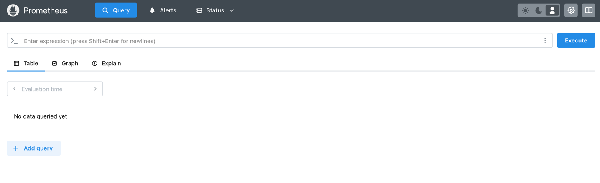
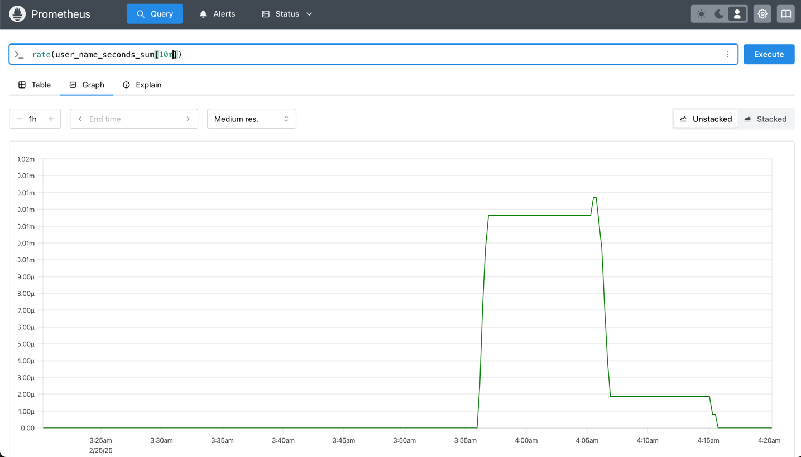

#### index
- [example project setup](#example-project-setup)
- [metrics configuration](#metrics-configuration)
- [actuator, prometheus configuration](#actuator-prometheus-configuration)
- [metrics measurement model](#metrics-measurement-model)
- [annotation-based metrics measurement](#annotation-based-metrics-measurement)
- [prometheus web ui, time series query](#prometheus-web-ui-time-series-query)

#### reference
- [metrics](../metric)
- [spring boot observability architecture](spring boot observability#important-spring-boot-observability-architecture)
- [spring boot ObservationAutoConfiguration](spring boot observability#observationautoconfiguration)


## example project setup

[example project](https://www.github.com/hansanhha/hansanhha.github.io/tree/default/code/stack/observability/examples/spring%20boot%20observability)

위 예제 프로젝트를 통해 후술할 내용들을 직접 실행하여 확인할 수 있다


## metrics configuration

스프링 부트 액추에이터는 micrometer-observation 의존성을 포함하고 있어서 사용할 모니터링 시스템(micrometer registry implementation)에 대한 의존성만 추가해주면 된다

이 예제에서는 [프로메테우스](../prometheus/overview.md)를 사용한다 [스프링 부트 metrics에서 지원하는 모니터링 시스템 목록](https://docs.spring.io/spring-boot/reference/actuator/metrics.html#actuator.metrics.export)

메트릭을 측정하는 방법은 프로그래밍 방식과 선언 방식(어노테이션 기반)으로 나뉘는데, 어노테이션 방식을 사용한다면 spring boot aop 의존성도 추가해야 한다

```kotlin
implementation("org.springframework.boot:spring-boot-starter-aop")
implementation("org.springframework.boot:spring-boot-starter-actuator")
implementation("io.micrometer:micrometer-registry-prometheus")
```

스프링 부트 액추에이터는 클래스 패스에 micrometer 구현체(micrometer-registry-prometheus)가 존재하는 경우 CompositeMeterRegistry에 해당 registry에 각 구현체를 삽입한다

또한 ObservationRegistry 타입의 빈을 스프링 빈으로 등록하여 개발자가 메트릭뿐만 아니라 추적까지 함께할 수 있도록 지원한다

[스프링 부트 metrics autoconfiguraiton](./spring%20boot%20observability.md#compositemeterregistryautoconfiguration)

[스프링 부트 observability autoconfiguration](./spring%20boot%20observability.md#observationautoconfiguration)

어노테이션 기반 방식으로 메트릭을 측정할 수 있도록 각 어노테이션에 대한 aspect 구현체를 마이크로미터에서 제공하는데, micrometer-observation의 @Observed에 해당하는 aspect(ObservedAspect)는 스프링 부트 자동 구성에 의해 빈으로 등록된다

반면, micrometer metrics의 @Timed와 @Counted 어노테이션의 aspect는 자동 구성 대상의 포함이 되지 않기 때문에 TimedAspect와 CountedAspect 클래스를 필요에 따라 빈으로 등록해야 한다

```java
@Configuration(
        proxyBeanMethods = false
)
public class ObservationConfig {

    @Bean
    TimedAspect timedAspect(MeterRegistry registry) {
        return new TimedAspect(registry);
    }
}
```


## actuator, prometheus configuration

프로메테우스는 기본적으로 pull 기반 방식으로 데이터를 수집한다 

즉, 프로메테우스 서버에서 대상(스프링 부트)에게 요청(액추에이터 엔드포인)을 보낸 후 응답 받은 데이터(애플리케이션 메트릭)를 수집(scrape)한 다음 시계열 데이터로 가공한다  

스프링 부트 액추에이터는 `/actuator` `/actuator/health`를 제외한 다른 엔드포인트를 노출하지 않기 때문에 프로메테우스가 스프링 부트의 데이터를 수집할 수 있도록 엔드포인트를 노출하도록 설정해야 한다

```yaml
management:
  endpoints:
    web:
      exposure:
        include: health, prometheus

# 프로메테우스의 스크랩 요청을 로그로 출력한다 
logging:
  level:
    org.springframework.web: DEBUG
```

그 다음 프로메테우스의 스크랩 동작을 정의할 prometheus.yml 파일을 작성한다

```yaml
global:
  external_labels:
    monitor: 'spring-boot-actuator-prometheus'

scrape_configs:

  -
    job_name: 'spring-boot-metrics'
    metrics_path: '/actuator/prometheus'
    scrape_interval: 5s

    static_configs:
      - targets: ['spring-boot:8080']
```


## metrics measurement model

스프링 부트 애플리케이션에서 메트릭 측정은 요구사항에 따라 다음과 같이 선택할 수 있다

측정 방식: 프로그래밍 vs 어노테이션

측정 도구: micrometer observation vs micrometer metrics (micrometer-core)

앞서 스프링 부트 액추에이터 스타터는 micrometer observation 의존성을 포함한다고 언급했는데, 이 모듈은 마이크로미터의 tracing api와 metrics(core) api를 통합한다

따라서 필요에 따라 observation과 metrics에서 제공하는 기능을 선택해서 애플리케이션의 메트릭을 측정할 수 있으며 두 모듈은 다음과 같은 차이점을 가진다

| 구분       | micrometer observation                                       | micrometer metrics                                  |
|----------|--------------------------------------------------------------|-----------------------------------------------------|
| 사용       | 마이크로서비스/모듈 모놀리식 (메서드 성능 모니터링, opentelemetry와의 통합, 비동기 코드 추적) | 모놀리스/전통적인 메트릭 수집 방식 (api 호출 횟수, 메서드 실행 시간, 리소스 사용률) |
| 프로그래밍 방식 | ObservationRegistry                                          | MeterRegistry                                       |
| 어노테이션 방식 | @Observed (autoconfiguration 적용)                             | @Timed, @Counted (autoconfiguration 적용 X)           |
| 측정 대상    | timer, counter, gauge + trace(span)                          | timer, counter, gauge, distributionSummary          |
| 데이터 표현   | high/low cardinality, span, event 등                          | metric-name, tags                                   |
| 추적 지원    | distributed tracing, context propagation 지원                  | X                                                   |


## annotation-based metrics measurement

### @Observed (micrometer observation)

```java
@Observed(name = "user.name", contextualName = "getting-user-name", lowCardinalityKeyValues = {"service", "user"})
String getUsername(Long userId) {
    return "spring-man";
}
```

@Observed 어노테이션은 사실 어떠한 메트릭도 측정하지 않고 생명주기에 따라 ObservationRegistry에 등록된 ObservationHandler의 콜백 메서드를 호출하는 방식으로 동작한다

따라서 사용자가 측정하고자 하는 Meter(micrometer의 metric)에 따라 ObservationHandler를 registry에 등록해줘야 한다

스프링 부트를 사용하는 경우 autoconfiguration으로 인해 micrometer에서 제공하는 DefaultMeterObservationHandler를 스프링 빈으로 등록한다

이 핸들러는 기본적으로 Timer.Sample (시작과 종료를 명시적으로 제어하는 Timer)과 Counter 타입의 메트릭을 측정하고 필요에 따라 LongTaskTimer 타입의 메트릭을 측정한다 

- Timer: 메서드 실행 시간 (평균 시간, 최대 시간, 호출 횟수)
- Counter: 메서드 호출 성공 및 실패 횟수
- LongTaskTimer (비동기 작업 시): 비동기 메서드 작업 시간


@Observed 어노테이션은 프로그래밍 방식과 달리 메트릭 타입의 base unit을 직접적으로 지정할 수 없으며, 대신 각 meter 타입 별로(Timer 등) 기본 단위가 적용된다(Timer와 LongTaskTimer의 기본 단위: seconds)

#### getUsername 메서드의 메트릭 조회

위의 @Observed가 적용된 메서드를 api(localhost:8080/users/1)로 호출하여 몇 번 실행시킨 뒤 `/actuator/metrics` 엔드포인트를 통해 조회하면 자동 측정(생성)된 메트릭들을 확인할 수 있다

```shell
# api 호출
curl localhost:8080/users/1

# 생성된 메트릭 조회
curl localhost:8080/actuator/metrics | jq | grep user
```

```text
{
    "names": [
        "user.name",
        "user.name.active"
    ]
}
```

user.name 메트릭은 Timer 메트릭을 나타내며 count(호출 횟수), totalTime(메서드 실행 시간 총합), max(최대 실행 시간) 지표를 가진다

user.name.active 메트릭은 LongTaskTimer 메트릭을 나타내며 현재 실행 중인 메서드의 수를 측정하는 active tasks(활성 작업 수)와 duration(최대 실행 시간) 지표를 가진다 

#### 메트릭 상세 조회

`/actuator/metrics/<metric name>` 엔드포인트를 통해 특정 메트릭의 상세 정보를 확인할 수 있다

```shell
curl localhost:8080/actuator/metrics/user.name | jq
```

위의 user.name 메트릭에 대한 상세 정보를 조회하면 아래와 같은 정보를 출력한다

```text
{
  "name": "user.name",
  "baseUnit": "seconds",
  "measurements": [
    {
      "statistic": "COUNT",
      "value": 3.0
    },
    {
      "statistic": "TOTAL_TIME",
      "value": 0.001210168
    },
    {
      "statistic": "MAX",
      "value": 0.0
    }
  ],
  "availableTags": [
    {
      "tag": "method",
      "values": [
        "getUsername"
      ]
    },
    {
      "tag": "service",
      "values": [
        "user"
      ]
    },
    {
      "tag": "error",
      "values": [
        "none"
      ]
    },
    {
      "tag": "class",
      "values": [
        "hansanhha.UserService"
      ]
    }
  ]
}
```

```shell
curl localhost:8080/actuator/metrics/user.name.active | jq
```

user.name.active에 대한 상세 내용은 아래와 같다

```text
{
  "name": "user.name.active",
  "baseUnit": "seconds",
  "measurements": [
    {
      "statistic": "ACTIVE_TASKS",
      "value": 0.0
    },
    {
      "statistic": "DURATION",
      "value": 0.0
    }
  ],
  "availableTags": [
    {
      "tag": "method",
      "values": [
        "getUsername"
      ]
    },
    {
      "tag": "service",
      "values": [
        "user"
      ]
    },
    {
      "tag": "class",
      "values": [
        "hansanhha.UserService"
      ]
    }
  ]
}
```

#### micrometer observation metrics -> prometheus time series

micrometer에서 측정된 메트릭(Timer, LongTaskTimer 등)들은 PrometheusMeterRegistry를 통해 프로메테우스 텍스트 포맷으로 변환되고 스프링 부트 액추에이터의 `/actuator/prometheus` 엔드포인트를 통해 메트릭을 노출된다

이후에 프로메테우스는 pull 방식으로 해당 엔드포인트에서 주기적으로 데이터를 수집(scrape)한다 

프로메테우스 포맷은 HELP, TYPE, 메트릭 데이터 세 가지 섹션으로 구성되며 메트릭을 시계열(time series)로 저장한다

- HELP: 메트릭 의미
- TYPE: 메트릭 유형
- 메트릭 데이터: 라벨과 측정 값(타임스탬프 포함)으로 데이터를 표현하며, 라벨 조합을 시계열 데이터의 식별자로 사용한다

또한 프로메테우스 포맷으로 데이터가 변환되면서 micrometer의 메트릭 이름에 메트릭의 시간 단위(base unit)를 추가한 이름으로 변경된다

아래의 user.name 메트릭의 base unit은 seconds이므로 user.name.active.seconds가 되고 프로메테우스의 표기법인 언더스코어를 사용한다 (user.name.active도 마찬가지)

참고로 @Observed를 사용하면 직접적으로 base unit을 지정할 수 없으며, 대신 각 meter 타입 별로(Timer 등) 기본 단위가 적용된다(Timer와 LongTaskTimer의 기본 단위: seconds) 

micrometer의 Timer, Counter, LongTaskTimer 메트릭이 프로메테우스의 summary, gauge 메트릭 타입으로 변환되는 것을 볼 수 있다

```text
# HELP user_name_active_seconds  
# TYPE user_name_active_seconds summary
user_name_active_seconds_count{class="hansanhha.UserService",method="getUsername",service="user"} 0
user_name_active_seconds_sum{class="hansanhha.UserService",method="getUsername",service="user"} 0.0

# HELP user_name_active_seconds_max  
# TYPE user_name_active_seconds_max gauge
user_name_active_seconds_max{class="hansanhha.UserService",method="getUsername",service="user"} 0.0

# HELP user_name_seconds  
# TYPE user_name_seconds summary
user_name_seconds_count{class="hansanhha.UserService",error="none",method="getUsername",service="user"} 3
user_name_seconds_sum{class="hansanhha.UserService",error="none",method="getUsername",service="user"} 0.001210168

# HELP user_name_seconds_max  
# TYPE user_name_seconds_max gauge
user_name_seconds_max{class="hansanhha.UserService",error="none",method="getUsername",service="user"} 4.61959E-4
```

### @Timed, @Counted (micrometer metrics)

이 어노테이션을 사용하기 위해 각각 TimedAspect와 CountedAspect 클래스를 스프링 빈으로 등록해줘야 한다

aspect 클래스는 observation과 달리 직접 Meter(Timer, Counter)를 사용하여 메트릭을 측정하는 방식으로 동작하며 @Timed 어노테이션(TimedAspect)은 Timer 또는 LongTaskTimer 타입의 메트릭을, @Counted(CountedAspect)는 Counter 타입의 메트릭을 측정한다

@Observed와 마찬가지로 @Timed 어노테이션도 base unit을 지정할 수 없으며 Timer 메트릭의 기본 단위인 seconds가 사용된다

```java
@Timed(value = "user.creation.timer", percentiles = {0.3, 0.5, 0.95}, description = "user creation process timer")
public void createUser() {
    Random processTime = new Random();
    try {
        Thread.sleep(processTime.nextLong(100, 1000));
    } catch (InterruptedException e) {
        throw new RuntimeException(e);
    }
}
```

위의 @Timed가 적용된 메서드를 api로 호출하여 몇 번 실행시킨 뒤 `/actuator/metrics` 엔드포인트를 통해 조회하면 자동 측정(생성)된 메트릭들을 확인할 수 있다

```shell
# api 호출
curl -X POST localhost:8080/users

# 생성된 메트릭 조회
curl localhost:8080/actuator/metrics | jq | grep user
```

```text
{
    "names": [
        "user.creation.timer"
    ]
}
```

@Timed 어노테이션은 @Observed 어노테이션과 달리 기본적으로 Timer 타입의 메트릭만 측정하기 때문에 아래와 같이 하나의 메트릭만 생성된다

#### 메트릭 상세 조회

```shell
curl localhost:8080/actuator/metrics/user.creation.timer | jp
```

```text
{
  "name": "user.creation.timer",
  "description": "user creation process timer",
  "baseUnit": "seconds",
  "measurements": [
    {
      "statistic": "COUNT",
      "value": 5.0
    },
    {
      "statistic": "TOTAL_TIME",
      "value": 2.728203626
    },
    {
      "statistic": "MAX",
      "value": 0.0
    }
  ],
  "availableTags": [
    {
      "tag": "exception",
      "values": [
        "none"
      ]
    },
    {
      "tag": "method",
      "values": [
        "createUser"
      ]
    },
    {
      "tag": "class",
      "values": [
        "hansanhha.UserService"
      ]
    }
  ]
}
```

#### micrometer core metrics -> prometheus time series

[@Observed](#micrometer-observation-metrics---prometheus-time-series)와 마찬가지로 micrometer 메트릭이 프로메테우스 텍스트 포맷으로 변환된다

micrometer의 Timer 메트릭이 프로메테우스의 summary, gauge 메트릭 타입으로 변환되는 것을 볼 수 있다

또한 @Timed 어노테이션의 percentile 속성에 지정한 값이 프로메테우스의 quantile 라벨로 변환되어 있다

```shell
curl localhost:8080/actuator/prometheus | grep user
```

```text
# HELP user_creation_timer_seconds user creation process timer
# TYPE user_creation_timer_seconds summary
user_creation_timer_seconds{class="hansanhha.UserService",exception="none",method="createUser",quantile="0.3"} 0.0
user_creation_timer_seconds{class="hansanhha.UserService",exception="none",method="createUser",quantile="0.5"} 0.0
user_creation_timer_seconds{class="hansanhha.UserService",exception="none",method="createUser",quantile="0.95"} 0.0
user_creation_timer_seconds_count{class="hansanhha.UserService",exception="none",method="createUser"} 5
user_creation_timer_seconds_sum{class="hansanhha.UserService",exception="none",method="createUser"} 2.728203626

# HELP user_creation_timer_seconds_max user creation process timer
# TYPE user_creation_timer_seconds_max gauge
user_creation_timer_seconds_max{class="hansanhha.UserService",exception="none",method="createUser"} 0.0
```


## prometheus web ui, time series query

### prometheus web ui components

프로메테우스가 액추에이터 엔드포인트(`/actuator/prometheus`)를 통해 수집한 시계열 데이터를 프로메테우스의 웹 ui [localhost:9090](http://localhost:9090)에 접속하여 확인할 수 있다

프로메테우스 웹 ui의 초기 화면은 아래의 이미좌 같으며 헤더 영역이 Query, Alerts, Status으로 구성되어 있다  



#### Query

promql을 이용하여 메트릭 데이터를 조회하고 분석하는 페이지

세부적으로 시각화 기능을 제공하는 Table, Graph, Explain 탭으로 나뉜다

Table: 메트릭 데이터를 표 형태로 확인

Graph: 메트릭 데이터를 시간의 흐름에 따른 그래프 형태로 시각화

Explain: promql 쿼리의 각 요소를 설명

#### Alerts

프로메테우스의 알람 상태를 관리하는 페이지

설정된 알람 규칙(alerting rules)의 상태와 발생한 경고를 확인할 수 있다

알람 상태는 두 가지로 구분된다

Firing: 경고 조건을 충족하여 알람이 발생한 상태

Pending: 경고 조건을 충족했으나 지속 시간(for)을 아직 충족하지 않은 상태

#### Status

프로메테우스 서버의 현재 상태 및 설정을 확인할 수 있는 페이지

프로메테우스의 내부 상태와 메트릭 수집 상태를 모니터링할 때 사용한다

수집 대상(target) health, rule health, service discovery, runtime & build information, configuration 등을 확인할 수 있다


### promql

먼저 아래의 명령어를 이용하여 몇 번의 api 요청을 보낸다

```shell
curl localhost:8080/users/1
```

Query 페이지의 Graph 탭을 선택한 뒤 promql을 입력하여 `/users/1` api 요청의 합계를 그래프 형태로 확인한다

[] 괄호 안의 시간 단위를 변경하여 다양하게 확인할 수 있다

```text
rate(user_name_seconds_sum[10m])
```


