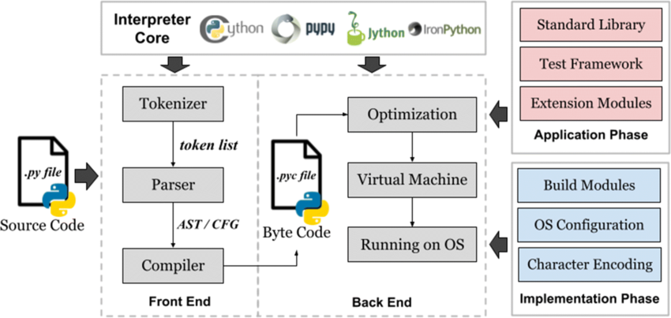

#### index
- [python](#python)
- [ecosystem](#ecosystem)
- [version](#version)
- [implementations](#implementations)
  - [cpython](#cpython)
  - [pypy](#pypy)
- [dynamically typed](#dynamically-typed)
  - [type hint](#type-hint)
  - [dynamic object model](#dynamic-object-model)
  - [dynamic binding](#dynamic-binding)
  - [first-citizen](#first-citizen)
  - [metaprogramming](#metaprogramming)
- [interpreted](#interpreted)
  - [REPL: Read-Eval-Print Loop](#repl-read-eval-print-loop)
- [GIL: global interpreter lock](#gil-global-interpreter-lock)


## python

파이썬은 1991년 귀도 반 로섬이라는 사람에 의해 만들어졌다

비슷한 시기에 발표된 자바와 달리 동적 인터프리터 언어이며 범용성이 상당히 높은 특징을 가진다

웹, 인공지능, 데이터 분석, 빅데이터, 게임, 스크래핑, 자동화 등 다양한 분야에서 사용된다

파이썬의 신규 기능, 개선 사항, 프로세스 변경은 귀도 반 로섬이 주도하다가 3.8 버전 이후 PEP(python enhancement proposal) 프로세스를 기반으로 커뮤니티 핵심 멤버(Python Steering Council)들이 논의한 뒤 최종적으로 파이썬에 적용한다

적용된 PEP에는 특정 번호가 붙으며 [PEP 0](https://peps.python.org/) 문서에서 모든 PEP의 인덱스를 확인할 수 있다

python 발전 프로세스
- PEP 제안(새 기능 제안 등)
- 커뮤니티 논의
- PEP 승인(Python Steering Council 검토)
- CPython 코드베이스 반영

파이썬이 느리다고 하지만 파이썬의 본체(cpython)는 c 언어로 구현되어 있으며 규모있는 대부분의 라이브러리들이 모두 파이썬이 아닌 c 언어와 같은 높은 퍼포먼스를 낼 수 있는 언어로 구축되어 있다

마치 언어 자체가 c/c++과 같은 빠른 컴파일 언어가 구축된 라이브러리에 대한 api 인터페이스처럼 사용될 수 있기 때문에 마냥 메모리를 많이 차지하고 성능이 약한 언어가 아니다

## ecosystem

[더 많은 생태계 알아보기](https://wikidocs.net/book/14021)

데이터 과학: numpy, pandas, matplotlib

웹 개발: django, flask, fastapi

머신러닝, ai: tensorflow, pytorch, transformers

자동화, 스크립트: selenium, requests, pyautogui, shutil

게임: pygame

데이터베이스: sqlalchemy, django orm


## version

파이썬의 정식 버전(stable release)은 x.y.z 넘버링 형식으로 관리된다

x(major): 호환성이 깨질 수 있을 정도의 큰 변경 사항을 담은 버전

y(minor): 호환성이 유지되는 기능 추가 및 성능 개선 버전

z(patch): 기능 추가가 없는 버그 수정 및 보안 패치 버전

개발 중인 실험적 버전에는 상태(알파, 베타, rc)를 xyz 넘버링 뒤에 추가한다

x.y.zrc1: x.y.z 버전의 릴리즈 후보(release candidate) 버전

버전은 크게 python 1.x(1991~2000), python 2.x(2000~2020), python3(2008~) 버전으로 나뉘어 있다

python2와 python3는 서로 호환이 되지 않아 완전히 다른 생태계를 가지고 있으나 2020년에 공식적으로 python2 지원을 종료하여 레거시가 아닌 이상 python3을 기본적으로 사용한다

릴리즈는 보통 1년 반마다 마이너 버전(y)이 출시되고, 각 마이너 버전은 5년동안 지원된다

모든 버전은 세 가지 중 하나의 상태를 가진다
- active: 기능 추가 + 버그 수정 + 보안 패치
- security-fix: 기능 추가 없이 보안 패치만 지원
- end-of-life(eol): 더 이상 지원되지 않음

2025.03.18 기준 최신 버전: python 3.13.2


## implementations

### cpython

파이썬의 공식 구현체로 c언어로 작성된다

일반적으로 python3 명령어로 실행되는 파이썬이며, 대부분의 패키지 및 확장 라이브러리(numpy, pandas)가 이 구현체를 기준으로 개발된다

파이썬의 기본 동작 방식인 인터프리터 방식과 바이트코드(.pyc) 실행을 사용한다

GIL 때문에 멀티스레딩 성능이 제한적이긴 하나 차후 버전에서 GIL이 제거될 수 있다

### pypy

JIT(just-in-time compile)를 사용하여 cpython보다 실행 속도가 빠른 구현체

cpython은 python 코드를 바이트코드로 변환 후 실행하지만, pypy는 jit 컴파일러를 사용하여 네이티브 코드로 변환 후 실행하기 때문에 상대적으로 더 빠른 속도를 지닐뿐만 아니라 메모리 사용량이 적고 더 효율적인 GC가 가능하다

다만 jit 컴파일로 인해 cpython보다 첫 실행이 느릴 수 있으며 c 확장 모듈(numpy 등)과 호환성이 떨어지는 단점이 있다


## dynamically typed

파이썬의 특징 중 하나인 동적 타입은 타입의 자료형이 컴파일 시점이 아닌 런타임에 결정되는 것을 의미한다

파이썬에서는 다음과 같이 변수를 선언할 때 자료형을 명시하지 않아도 된다

변수의 자료형은 실행 중에 결정되며 필요한 경우 자동으로 변경될 수 있다

```python
x = 10
x = "hello"

print(x)  # hello 출력
```

동적 타입 언어는 자료형 선언없이 하나의 변수에 다양한 자료형을 사용할 수 있지만 런타임에 타입 오류가 발생하거나 정적 언어에 비해 실행 속도가 느릴 수 있다

### type hint

3.5 버전부터는 타입 힌트를 지원하여 코드의 가독성과 유지보수성을 높이고 정적 분석 도구가 타입을 검증할 수 있게 했다 

타입 힌트는 권장 사항이며 실제 실행에 영향을 미치지 않는다

```python
# 변수 타입 힌트
name: str = "hansanhha"
developer: bool = True


# 파라미터, 반환 값 타입 힌트
def add(x: int, y: int) -> int:
    return x + y


# 컬렉션 타입 힌트
numbers: list[int] = [1, 2, 3]
coordinates: tuple[float, float] = (37.5, 127.0)
user_info: dict[str, int] = {"age": 30, "score": 90}


# None 일 수도 타입 힌트
def get_name(user_id: int) -> str | None:


# 어떤 타입이든 허용
def process_data(data: Any):


# union 타입(여러 타입)
def process(value: int | str) -> None:


# 제네릭 타입
from typing import TypeVar, Generic

T = TypeVar("T")  # 임의의 타입을 나타내는 제너릭 타입

def repeat(value: T, times: int) -> list[T]:
    return [value] * times

print(repeat(10, 3))  # [10, 10, 10]
print(repeat("Hi", 2))  # ['Hi', 'Hi']


# 함수 타입 힌트
from typing import Callable

def apply_func(f: Callable[[int, int], int], a: int, b: int) -> int:
    return f(a, b)

def add(x: int, y: int) -> int:
    return x + y

print(apply_func(add, 3, 5))  # 8


# 타입 alias
from typing import Dict

UserInfo = Dict[str, int]  # 타입 alias 정의

user: UserInfo = {"age": 25, "score": 90} 
```

### dynamic object model

클래스, 메서드, 객체의 속성을 런타임에 추가하거나 기존 속성을 변경할 수 있는데, 이를 동적 객체 모델이라고 한다

기존 코드 변경 없이 실행 중 동적으로 메서드를 변경하는 기법(monkey patching)도 지원한다

```python
class Person:
    pass

p = Person()
p.name = "hansanhha"
print(p.name)  # hansanhha

setattr(p, "foo", "bar")
print(getattr(p, "foo")) # bar
```

### dynamic binding

동적 바인딩이 변수/파라미터에도 적용되기 때문에 다음과 같이 하나의 함수가 여러 타입에 대해 동작할 수 있다

```python
def add(x, y):
    return x + y

print(add(3,4)) # 7
print(add("hello", "python")) #hellopython
```

### first-citizen

자바스크립트처럼 함수를 일급 객체(first-citizen)으로 취급하여 변수에 함수를 할당하거나 인자로 함수를 전달, 함수에서 함수를 반환할 수 있다

```python
def greet(name):
    return f"hello, {name}"

say_hello = greet
print(say_hello("hansanhha"))
```

### metaprogramming

런타임에 클래스를 생성하거나 수정할 수 있다

```python
MyClass = type("MyClass", (,), {"attr": 100}) # 동적 클래스 생성
obj = MyClass()

print(obj.attr) # 100
```

## interpreted

컴파일러는 전체 코드를 한 번에 기계어로 번역하며, 이 과정에서 컴파일 오류를 잡아낸다

반면 인터프리터는 코드를 한 줄씩 읽고 기계여로 번역하여 실행하는 방식으로 동작하며 코드 실행 중간에 오류가 발생할 가능성이 있다

일련의 과정이나 파일(컴파일된 결과)없이 즉시 애플리케이션을 실행할 수 있는 장점이 있지만 실행 속도가 느린 단점이 있다



[이미지 출처](https://www.researchgate.net/figure/The-General-Architecture-of-Python_fig1_366233366)

cpython은 cpython의 인터프리터가.py 파일을 읽고 바이트코드(.pvc)로 변환하면 파이썬 가상머신(python virtual machine, pvm)이 실행하는 구조로 동작한다

다양한 os에서 실행을 보장해야 하므로 가상 머신을 필요로 하며, jit 컴파일러를 포함하지 않아 속도가 느린 편이다

pypy의 경우 cpython 인터프리터의 낮은 성능을 대체하기 위해 상대적으로 빠르게 실행할 수 있는 인터프리터를 제공한다

jit 컴파일러를 내장하여 자주 실행되는 코드 블록(hot spot)을 기계어로 변환한 후 캐싱하며 이후 재실행하여 성능을 최적화한다

다만 numpy 같은 c 라이브러리와 완벽하게 호환되지 않을 수 있는 단점이 존재한다

### REPL: Read-Eval-Print Loop

인터프리터 언어가 제공하는 대화형 실행 환경으로 코드를 한 줄 입력하면 즉시 실행하고 결과를 출력하며 이 과정을 계속 반복하기 때문에 REPL(Read-Eval-Print Loop)이라고 한다

컴파일 과정을 거치지 않고 한 줄씩 입력하며 바로 실행 결과를 알 수 있어서 복잡한 프로그램을 실행하기 전 소규모로 코드를 테스트하기 좋다

파이썬을 설치하면 기본적으로 python REPL을 제공하므로 터미널 환경에서 python 또는 python3를 입력하면 REPL 모드로 진입할 수 있다 (`exit()`로 종료)

파이썬이 기본적으로 제공하는 도구이외에도 향상된 REPL 환경인 ipython이나 jupyter notebook이라고 하는 웹 기반 대화형 파이썬 실행 환경이 있다

주피터 노트북의 특징은 다음과 같다
- 코드 실행 및 문서 작업(마크다운 지원)
- 그래픽 및 시각화 라이브러리 연동
- 블록 단위(cell) 코드 실행


## GIL: global interpreter lock

GIL은 cpython에서 하나의 스레드만 동시에 실행하도록 제한하는 메커니즘으로 멀티 스레드 환경에서도 한 번에 하나의 스레드만 파이썬 바이트코드를 실행할 수 있도록 락을 건다

파이썬은 동적 타입 언어이고 모든 객체의 메모리 관리를 가비지 컬렉터가 담당한다

참조 카운팅 기반의 GC 시스템에서 여러 스레드가 동시에 접근하면 충돌할 위험이 있어서 메모리 관리 충돌(파이썬 객체의 일관성 유지)을 방지하기 위해 이러한 제약을 걸게 되었다

GIL 동작 방식
- 파이썬 프로그램이 실행되면 GIL을 획득한 하나의 스레드만 실행된다
- 일정 시간이 지나면 GIL을 해제하고 다른 스레드가 실행될 기회를 가진다
- 다른 스레드가 GIL을 획득하면 해당 스레드가 실행되며, 이러한 과정이 반복된다

특히 cpu 바운드 연산 부분에서 cpu 병렬 처리를 해도 실제로 하나의 코어만 사용되므로 성능 저하가 발생한다

파이썬 초기에 비해 cpu의 성능이 비약적으로 향상했지만 그에 비해 GIL로 인해 멀티코어 cpu를 제대로 활용하지 못하는 문제가 발생한다

이를 우회하기 위해 멀티프로세싱이나 jit 컴파일러(pypy)를 활용하여 성능을 향상시킨다